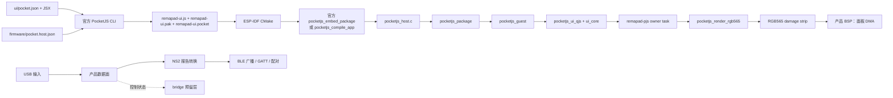

# Remapad ESP32-S3 手柄网关

Remapad 是面向微雪 ESP32-S3-Touch-LCD-1.69（ESP32-S3R8）的嵌入式控制器工程。最终产品接收 USB 输入，将其转换为 NS2 手柄报告，再通过 BLE 对外提供手柄服务；
屏幕 UI 使用 PocketJS Vue Vapor，设备端使用 PocketJS 官方 ESP-IDF host 组件和 ESP-IDF 固件。
板卡规格、引脚和接线注意事项见 [hardware.md](docs/hardware.md)。

PSP 只作为 PocketJS 官方示例的架构参考，不是本项目的目标平台。ESP32-S3 的构建目标由 `firmware/pocket.host.json` 描述；
不要使用 `pocket build --target psp` 生成本项目固件。USB→NS2→BLE 的协议、广播、GATT 和配对细节见 [controller.md](docs/controller.md)。

## 硬件规格

| 硬件项 | 参数 |
| :--- | :--- |
| 主控 | ESP32-S3R8，Xtensa LX7 双核，240 MHz |
| Flash | 16 MB（W25Q128JVSIQ） |
| PSRAM | 8 MB Octal PSRAM，叠封在 SoC 内 |
| 屏幕 | ST7789V2，240 × 280，RGB565，4-wire SPI |
| 触摸 | CST816T 电容触摸（I2C `0x15`） |

## 架构



职责边界如下：

- `ui/` 只描述应用、样式和资源，由官方 PocketJS 编译器生成包。
- `firmware/pocket.host.json` 是目标设备的事实源，描述视口、tick、presentation 和实际能力。
- `firmware/main/` 同时承载 PocketJS UI host 和未来产品数据面；UI runtime 负责渲染，USB/NS2/BLE 数据面负责高频报告转换，二者通过明确的设备状态边界协作。
- 板卡引脚信息记录在 [docs/hardware.md](docs/hardware.md)，但固件尚未实现 ST7789V2 面板传输和 CST816T 触摸采样，因此目前只完成无面板的 RGB565 frame bring-up；
  `sample_input` 也暂时返回空输入。

最终控制器数据面不应复用 PocketJS UI turn 作为高频报告通道。USB 接收、规范化、NS2 报告编码、BLE 广播/GATT 和配对状态机应在 ESP-IDF 原生任务与队列中实现；
UI bridge 只承载设置、状态和诊断等低频控制消息。

## 目录结构

```text
remapad/
├── scripts/
│   ├── create_adr.py            # ADR 生成脚本
│   ├── pocketjs.mjs             # 工具链与触摸预览入口
│   ├── preview-server.mjs       # 触摸预览的静态服务器
│   └── vendor-pocketjs.mjs      # 从上游 checkout 重新生成编译器快照
├── patches/                     # 上游 PocketJS 对账记录与发布说明
├── ui/
│   ├── pocket.json              # PocketJS 应用清单
│   ├── vendor/pocketjs/         # 固定的 PocketJS 编译器与框架快照
│   ├── preview/                 # 触摸屏预览页（浏览器触摸事件 → PocketJS 触摸帧）
│   └── src/                     # Vue Vapor JSX UI
│       └── bridge/              # USB/NS2/BLE 控制面协议预留
├── firmware/
│   ├── pocket.host.json         # ESP32-S3 host profile
│   ├── CMakeLists.txt           # ESP-IDF 工程入口
│   ├── sdkconfig.defaults       # Flash/PSRAM、CPU 频率与 FreeRTOS 预设
│   ├── partitions.csv          # Flash 分区
│   ├── components/              # 固定在本仓库的官方 ESP-IDF 组件与 S3 原生归档
│   └── main/
│       ├── idf_component.yml    # IDF 版本约束
│       ├── CMakeLists.txt       # embed/compile 接入
│       ├── main.c               # 固件入口
│       ├── pocketjs_host.c       # 官方运行时生命周期与渲染回调
│       ├── bridge/               # 产品控制面预留
│       └── drivers/              # 背光、电池等 BSP 预留
└── docs/                        # 愿景、架构、抽象和上手文档
```

## 环境要求

- Node.js 18 或更高版本。
- pnpm，用于工作区依赖和脚本调度。
- Bun，用于执行 PocketJS 官方脚本与 Web 开发主机。
- 可选的 PocketJS 官方源码 checkout：默认构建不需要它（编译器来自仓库内的 `ui/vendor/pocketjs` 快照），只有在重建原生归档、登记上游更新或重新生成快照时才用 `POCKETJS_ROOT` 指向它。
- ESP-IDF `>=6.0,<6.2`，由官方 PocketJS ESP-IDF 组件要求；本仓库已在 6.1 上验证。
- Xtensa Rust 工具链（仅升级组件、重建原生归档时需要）：固定为 `esp-rs/rust-build` 的 `v1.97.0.0`。
- 微雪 ESP32-S3-Touch-LCD-1.69 开发板；面板传输、触摸采样和 USB host 仍需要产品 BSP。

PocketJS 的 ESP-IDF 组件没有发布到 ESP Component Registry，因此六个官方组件与 ESP32-S3 原生 Rust 归档固定在 `firmware/components/` 内；
npm 上的框架包没有 ESP-IDF host profile 编译器，因此编译器固定在 `ui/vendor/pocketjs/` 内。本项目不维护 Rust 工程，日常构建不下载组件、不需要 Rust，也不依赖外部 checkout。

## 开发与构建

在仓库根目录执行：

```powershell
pnpm install
```

`ui/vendor/pocketjs` 是固定的官方编译器与框架快照，`pnpm install` 之后即可直接构建；`POCKETJS_ROOT` 是可选的对照路径，只有重新生成快照或重建原生归档时才需要。

然后在仓库根目录执行：

```powershell
pnpm run lint
pnpm run check
pnpm run compile
pnpm run build
pnpm run dev
```

这些命令都由 `scripts/pocketjs.mjs` 调用仓库内的官方实现：
`check`、`compile`、`build` 执行 `ui/vendor/pocketjs/tools/pocket.ts` 并自动传入 `firmware/pocket.host.json`；
`dev` 编译后启动项目内的触摸屏预览页（`ui/preview/`，240 × 280，触摸输入，无实体按键）；`native` 用上游 `tools/esp-idf-native.ts` 重建 ESP32-S3 原生归档。
`build` 的等价官方命令为：

```powershell
$repo = (Get-Location).Path
cd ui\vendor\pocketjs
bun tools/pocket.ts build --manifest "$repo\ui\pocket.json" `
  --host-profile "$repo\firmware\pocket.host.json" `
  --project-root "$repo\ui" --outdir "$repo\ui\dist" `
  --output "$repo\ui\dist\remapad-ui.pocket"
cd $repo
```

若已安装包含 host profile 支持的 `pocket` CLI，也可使用官方 CLI 形式：

```powershell
pocket build --manifest ui/pocket.json `
  --host-profile firmware/pocket.host.json `
  --project-root ui --outdir ui/dist `
  --output ui/dist/remapad-ui.pocket
```

输出位于 `ui/dist/`，包括 `remapad-ui.js`、`remapad-ui.pak` 和 `remapad-ui.pocket`。这些文件都是生成产物，不应手动编辑或提交。

`pocketjs_guest` 在编译前会校验 QuickJS 源码哈希，而上游记录的校验值与 ESP Component Registry 当前提供的 `espressif/quickjs-ng` 0.14.0 不一致；
仓库内的组件副本已按 Registry 实际内容修正，因此日常构建不需要任何补丁。核对过程与升级步骤见 [patches/README.md](patches/README.md)。
ESP32-S3 的两个原生归档同样随组件提交在 `firmware/components/*/lib/esp32s3/`。

载入 ESP-IDF 环境后构建固件：

```powershell
cd firmware
idf.py set-target esp32s3
idf.py build
idf.py -p COM3 flash monitor
```

`firmware/components/` 中的官方组件由 ESP-IDF 默认发现，`idf.py build` 不需要 PocketJS checkout，也不需要 Rust。
当 `ui/dist/remapad-ui.pocket` 存在时，CMake 使用官方 `pocketjs_embed_package`，此时不需要 Bun；
没有预构建包时走官方 `pocketjs_compile_app`，需要构建环境中可用的 `pocket` CLI 和 Bun，因此建议先执行 `pnpm run build` 再运行 `idf.py build`。

## 分区与内存

当前 `firmware/partitions.csv` 采用官方示例同类的内置包方案，为 OTA 与用户数据预留了终局布局。
布局见 [ADR 0009](docs/adr/0009-ota-storage-flash-layout.md)：
NVS、PHY 初始化、4 MB `ota_0`/`ota_1` 双应用分区、`otadata` 和约 7.9 MB `storage` 通用存储区。`.pocket` 会嵌入应用镜像，不再需要独立的 SPIFFS 资源分区；
`ota_0` 继承原 `factory` 的 `0x10000` 偏移，`storage` 将来挂 littlefs，首个用途是用户上传的 amiibo（NTAG215）。

两个应用分区已用于 OTA 升级：
`cd pc ; uv run python ota.py -p COM3` 把 `firmware/build/remapad_firmware.bin` 经 USB-Serial/JTAG 写进非运行分区，校验通过后切启动分区并重启；
回滚保护下新镜像要过「UI 首帧成功 + 开机 30 秒」的健康门槛才被确认。
否则下次重启回退旧镜像。
原因见 [ADR 0022](docs/adr/0022-ota-over-bridge-frames-with-rollback.md)。
操作步骤见 [GETTING-STARTED.md](docs/GETTING-STARTED.md)。

8 MB Octal PSRAM 用于 PocketJS guest 和渲染暂存区；真正的面板 DMA 缓冲区应由后续 BSP 按显示控制器和 ESP-IDF DMA 约束分配。

未来 BLE 配对凭证、主机绑定信息和控制器状态应使用 ESP-IDF NVS 等明确的持久化层管理，不能写入 PocketJS 包或依赖渲染任务的生命周期。
协议字段和配对流程以 [controller.md](docs/controller.md) 为实现参考，并需通过真实设备抓包验证。

## 进一步阅读

- [产品愿景](docs/VISION.md)
- [系统架构](docs/ARCHITECTURE.md)
- [核心抽象](docs/ABSTRACTIONS.md)
- [上手指南](docs/GETTING-STARTED.md)
- [目标硬件](docs/hardware.md)
- [架构决策记录](docs/adr/README.md)
- [PocketJS ESP-IDF 官方指南](https://pocketjs.dev/docs/esp-idf/)
- [PocketJS 官方 ESP-IDF README](https://github.com/pocket-stack/pocketjs/blob/main/hosts/esp-idf/README.md)
