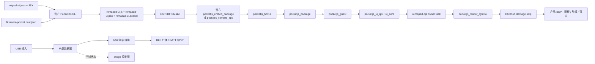

# Remapad ESP32-S3 手柄网关

Remapad 是面向微雪 ESP32-S3-Touch-LCD-1.69（ESP32-S3R8）的嵌入式控制器工程：接收 USB 输入，转换为 NS2 手柄报告，再通过 BLE 对外提供手柄服务。
屏幕 UI 使用 PocketJS（Vue Vapor 语法），设备端使用 PocketJS 官方 ESP-IDF host 组件与 ESP-IDF 固件，构建目标由 `firmware/pocket.host.json` 描述。
板卡规格、引脚和接线注意事项见 [hardware.md](docs/hardware.md)；USB→NS2→BLE 的协议、广播、GATT 与配对细节见 [controller.md](docs/controller.md)。

## 硬件规格

| 硬件项 | 参数 |
| :--- | :--- |
| 主控 | ESP32-S3R8，Xtensa LX7 双核，240 MHz |
| Flash | 16 MB（W25Q128JVSIQ） |
| PSRAM | 8 MB Octal PSRAM，叠封在 SoC 内 |
| 屏幕 | ST7789V2，240 × 280，RGB565，4-wire SPI |
| 触摸 | CST816T 电容触摸（I2C `0x15`） |

## 架构



职责边界：

- `ui/` 只描述应用、样式和资源，由官方 PocketJS 编译器生成包。
- `firmware/pocket.host.json` 是目标设备的事实源，描述视口、tick、presentation 和实际能力。
- `firmware/main/` 承载 PocketJS UI host 与产品数据面：UI runtime 负责渲染；
  USB 接收、规范化、NS2 编码、BLE 广播/GATT 与配对状态机在 ESP-IDF 原生任务与队列里实现，UI bridge 只承载低频控制消息。
- 板卡引脚与外设见 [docs/hardware.md](docs/hardware.md)。

## 目录结构

```text
remapad/
├── scripts/                     # PocketJS 工具链入口、触摸预览服务、快照与原生归档、固件测试
├── patches/                     # 上游 PocketJS 组件对账记录
├── ui/
│   ├── pocket.json              # PocketJS 应用清单
│   ├── vendor/pocketjs/         # 固定的 PocketJS 编译器与框架快照
│   ├── preview/                 # 触摸屏预览页（浏览器触摸事件 → PocketJS 触摸帧）
│   └── src/                     # Vue Vapor JSX UI（pages / components / hooks / bridge）
├── firmware/
│   ├── pocket.host.json         # ESP32-S3 host profile
│   ├── sdkconfig.defaults       # Flash/PSRAM、CPU 频率与 FreeRTOS 预设
│   ├── partitions.csv           # Flash 分区
│   ├── components/              # 固定在本仓库的官方 ESP-IDF 组件与 S3 原生归档
│   └── main/                    # 固件入口、PocketJS UI host（pocketjs_host.c）与产品模块
├── pc/                          # PC 侧单工具 remapadctl.py：桥接转发 / 串口命令行 / 实机截图 / OTA
└── docs/                        # 愿景、架构、抽象和上手文档
```

## 环境要求

- Node.js 18 或更高版本；pnpm 管理工作区依赖，Bun 执行 PocketJS 官方脚本与 Web 开发主机。
- ESP-IDF `>=6.0,<6.2`（官方 PocketJS ESP-IDF 组件要求，已在 6.1 验证）。
- Xtensa Rust 工具链：`esp-rs/rust-build` 的 `v1.97.0.0`，仅升级组件、重建原生归档时需要。
- [uv](https://docs.astral.sh/uv/) 与 Python ≥ 3.10：PC 侧工具（`pc/`）需要。
- 微雪 ESP32-S3-Touch-LCD-1.69 开发板。

官方 ESP-IDF 组件与 ESP32-S3 原生归档固定在 `firmware/components/`，编译器与框架固定在 `ui/vendor/pocketjs/` 快照内；
日常构建不下载组件、不需要 Rust、不依赖外部 checkout（`POCKETJS_ROOT` 仅在重建快照或原生归档时作对照路径）。

## 开发与构建

在仓库根目录执行：

```powershell
pnpm install
pnpm run lint
pnpm run check
pnpm run compile
pnpm run build
pnpm run dev
```

`check`、`compile`、`build` 调用快照内的官方 `tools/pocket.ts` 并自动传入 `firmware/pocket.host.json`；
`dev` 编译后启动触摸预览页（`ui/preview/`，240 × 280，触摸输入）。
输出位于 `ui/dist/`（`remapad-ui.js`、`remapad-ui.pak`、`remapad-ui.pocket`），都是生成产物，不手动编辑或提交。

载入 ESP-IDF 环境后构建固件：

```powershell
cd firmware
idf.py set-target esp32s3
idf.py build
idf.py -p COM3 flash monitor
```

先执行 `pnpm run build` 再 `idf.py build`：有 `remapad-ui.pocket` 时 CMake 走官方 `pocketjs_embed_package`，不需要 Bun。
升级 `firmware/components/` 中的组件后，按 [patches/README.md](patches/README.md) 核对 QuickJS 校验值并重建原生归档。

## 分区与内存

`firmware/partitions.csv` 为 OTA 预留终局布局（[ADR 0009](docs/adr/0009-ota-storage-flash-layout.md)）：
NVS、PHY 初始化、4 MB `ota_0`/`ota_1` 双应用分区、`otadata` 和约 7.9 MB `storage` 通用存储区；
`.pocket` 嵌入应用镜像，不需要独立资源分区。

OTA 升级经 USB-Serial/JTAG 把 `firmware/build/remapad_firmware.bin` 写进非运行分区，校验通过后切启动分区并重启；
新镜像要过「UI 首帧成功 + 开机 30 秒」的健康门槛才被确认，否则下次重启回退旧镜像（[ADR 0022](docs/adr/0022-ota-over-bridge-frames-with-rollback.md)）。
操作步骤见 [GETTING-STARTED.md](docs/GETTING-STARTED.md)。

8 MB Octal PSRAM 用于 PocketJS guest 与渲染暂存。

## 进一步阅读

- [产品愿景](docs/VISION.md)
- [系统架构](docs/ARCHITECTURE.md)
- [核心抽象](docs/ABSTRACTIONS.md)
- [上手指南](docs/GETTING-STARTED.md)
- [目标硬件](docs/hardware.md)
- [架构决策记录](docs/adr/README.md)
- [PocketJS ESP-IDF 官方指南](https://pocketjs.dev/docs/esp-idf/)
- [PocketJS 官方 ESP-IDF README](https://github.com/pocket-stack/pocketjs/blob/main/hosts/esp-idf/README.md)
