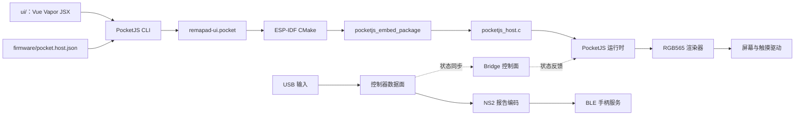

# Remapad

Remapad 是面向微雪 ESP32-S3-Touch-LCD-1.69（ESP32-S3R8）的嵌入式控制器系统：
接收 USB 手柄输入，转换为 NS2 控制器报告，并通过 BLE 对外提供手柄服务，同时在板载屏幕上呈现运行状态与交互 UI。

屏幕 UI 基于 PocketJS 框架与 Vue 3 Vapor 语法；
固件运行于 ESP-IDF，通过官方 ESP-IDF host 组件驱动屏幕显示，并在原生任务与队列中承载控制器数据面。

本项目仅为娱乐用途，实现类似功能不需要 ESP32 带有屏幕。

## 功能清单

- [x] PC 手柄桥接
- [x] BLE 手柄身份：广播、配对与回连
- [x] HOME 唤醒休眠主机
- [x] 输入上报：按键、摇杆、电量与耳机状态
- [x] 主机反馈回写：震动、玩家灯与触觉采样
- [x] 手柄固件更新伪装
- [x] 屏幕 UI 触摸操作
- [x] 手柄操控屏幕（L1+R1+L3+R3）
- [x] 启动画面与 OTA 进度上屏
- [x] amiibo 镜像上传
- [x] 固件 OTA 升级
- [x] PC 控制台（命令行与图形界面）
- [x] HD 震动同步
- [ ] 麦克风与扬声器传输（公开资料有限，暂无法落实）
- [ ] 刷 amiibo（读卡收尾公开资料有限，暂无法落实）

## 硬件规格

| 硬件项 | 规格参数 |
| :--- | :--- |
| 主控芯片 | ESP32-S3R8（Xtensa LX7 双核，最高 240 MHz） |
| 存储配置 | 16 MB Flash（W25Q128JVSIQ）+ 8 MB Octal PSRAM（片内叠封） |
| 显示屏幕 | 1.69 英寸 ST7789V2 液晶屏（240 × 280，RGB565，4-wire SPI） |
| 触摸面板 | CST816T 电容式触摸芯片（I2C `0x15`） |
| 板载外设 | PWR 按键、蜂鸣器、锂电池充放电管理、RTC 时钟与陀螺仪 |

完整引脚分配、外设地址及供电细节参见 [目标硬件参考 (docs/hardware.md)](docs/hardware.md)。

## 系统架构



系统核心分工与边界：

- 前端工作区（`ui/`）负责视图层、交互样式与静态资源，由 PocketJS 编译器在构建期光栅化为资源包。
- 固件工作区（`firmware/`）承载 PocketJS 宿主运行时与原生数据面：
  高频控制器接收、规范化、协议编码及 BLE 广播/GATT 状态机均在 ESP-IDF 原生任务中运行；
  Bridge 控制面仅用于传递低频设备状态和交互指令。
- 主机协议细节见 [Switch 2 手柄协议规范 (docs/controller-switch2.md)](docs/controller-switch2.md)；
  输入设备数据见 [PS 家族手柄数据规范 (docs/controller-ps.md)](docs/controller-ps.md)。

## 目录结构

```text
remapad/
├── ui/                          # 前端工作区：Vue Vapor JSX 界面、样式与预览
│   ├── src/                     # UI 源码（页面、组件、状态与 Bridge 契约）
│   ├── preview/                 # 触摸预览服务页面（浏览器触控模拟）
│   └── pocket.json              # PocketJS 应用清单
├── firmware/                    # 固件工作区：ESP-IDF 嵌入式工程
│   ├── main/                    # 固件业务源码（PocketJS 宿主、控制器数据面、驱动等）
│   ├── components/              # 随仓库固定的官方 ESP-IDF 组件与 S3 原生归档
│   ├── pocket.host.json         # 宿主设备契约（视口、时钟与硬件能力配置）
│   ├── sdkconfig.defaults       # 芯片架构、CPU 频率、Flash/PSRAM 预设
│   └── partitions.csv           # 双应用 OTA 与存储分区表
├── pc/                          # PC 侧辅助工具（USB 桥接、命令行控制台、实机截图、OTA）
├── scripts/                     # 构建调度、触摸预览与测试辅助脚本
├── patches/                     # 上游 PocketJS 组件对账与补丁记录
└── docs/                        # 项目设计、技术抽象与开发文档
```

## 开发快速上手

环境要求：Node.js 18+、pnpm、Bun、ESP-IDF（>=6.0,<6.2）、Python 3.10+ 与 uv。

### 1. 前端 UI 开发与预览

```powershell
# 安装依赖
pnpm install

# 契约检查与编译
pnpm run check
pnpm run compile

# 启动本地触摸预览（访问 http://127.0.0.1:8130）
pnpm run dev
```

### 2. 固件编译与烧录

```powershell
# 打包前端应用为 .pocket 镜像
pnpm run build

# 进入固件目录并构建
cd firmware
idf.py set-target esp32s3
idf.py build

# 烧录并打开串口监视器
idf.py -p COMx flash monitor
```

### 3. PC 侧辅助工具

```powershell
cd pc
# 运行命令行桥接控制台
uv run python remapadctl.py -p COMx
# 运行图形化操作界面
uv run python remapadgui.py
```

更多环境搭建、调试排错与详细开发流程参见 [新手上手指南 (docs/GETTING-STARTED.md)](docs/GETTING-STARTED.md)。

## 文档索引

- [产品愿景与系统边界 (docs/VISION.md)](docs/VISION.md)：项目定位与设计目标
- [系统架构与技术实现 (docs/ARCHITECTURE.md)](docs/ARCHITECTURE.md)：双工作区数据流与设计方案
- [核心概念与领域抽象 (docs/ABSTRACTIONS.md)](docs/ABSTRACTIONS.md)：渲染模型与软硬件契约
- [新手开发与上手指南 (docs/GETTING-STARTED.md)](docs/GETTING-STARTED.md)：开发环境与常见问题排查
- [Switch 2 手柄协议规范 (docs/controller-switch2.md)](docs/controller-switch2.md)：广播、GATT、HID 报告、配对、指令集与 NFC
- [PS 家族手柄数据规范 (docs/controller-ps.md)](docs/controller-ps.md)：DS3 / DS4 / DualSense 的输入输出报告、触觉通路与行为设置
- [目标硬件技术参考 (docs/hardware.md)](docs/hardware.md)：芯片引脚、外设与电气特性
- [测试策略与回归规则 (docs/TESTING.md)](docs/TESTING.md)：自动化测试与用例规范
- [架构决策记录索引 (docs/adr/README.md)](docs/adr/README.md)：历史架构决策与选型取舍，不得修改历史记录文件
