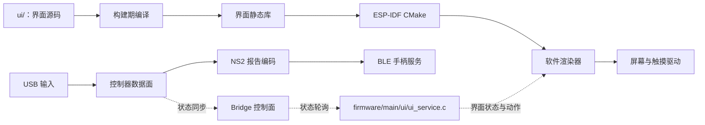

# Remapad

Remapad 是面向微雪 ESP32-S3-Touch-LCD-1.69（ESP32-S3R8）的嵌入式控制器系统：
接收 USB 手柄输入，转换为 NS2 控制器报告，并通过 BLE 对外提供手柄服务，同时在板载屏幕上呈现运行状态与交互 UI。

屏幕 UI 用 Rust 承载：界面在构建期编译进固件，运行期用软件渲染器画到面板；
固件核心运行于 ESP-IDF，在原生任务与队列中承载控制器数据面，对界面只认 `ui_service.h` 一份 C 契约
（界面组件按 `REMAPAD_UI` 开关可选编入，关闭时纯 C 也能出固件）。

本项目仅为娱乐用途，实现类似功能不需要 ESP32 带有屏幕。

## 功能清单

- [x] PC 手柄桥接
- [x] BLE 手柄身份：广播、配对与回连
- [x] HOME 唤醒休眠主机
- [x] 输入上报：按键、摇杆、电量与耳机状态
- [x] 主机反馈回写：震动、玩家灯与触觉采样
- [x] 手柄固件更新伪装
- [x] 屏幕 UI 触摸操作
- [x] 手柄操控屏幕（L1+R1+L3+R3）
- [x] 启动画面与 OTA 进度上屏
- [x] amiibo 镜像上传
- [x] 固件 OTA 升级
- [x] PC 控制台（命令行与图形界面）
- [x] HD 震动同步
- [ ] 麦克风与扬声器传输（公开资料有限，暂无法落实）
- [ ] 刷 amiibo（读卡收尾公开资料有限，暂无法落实）

## 硬件规格

| 硬件项 | 规格参数 |
| :--- | :--- |
| 主控芯片 | ESP32-S3R8（Xtensa LX7 双核，最高 240 MHz） |
| 存储配置 | 16 MB Flash（W25Q128JVSIQ）+ 8 MB Octal PSRAM（片内叠封） |
| 显示屏幕 | 1.69 英寸 ST7789V2 液晶屏（240 × 280，RGB565，4-wire SPI） |
| 触摸面板 | CST816T 电容式触摸芯片（I2C `0x15`） |
| 板载外设 | PWR 按键、蜂鸣器、锂电池充放电管理、RTC 时钟与陀螺仪 |

完整引脚分配、外设地址及供电细节参见 [目标硬件参考 (docs/hardware.md)](docs/hardware.md)。

## 系统架构



系统核心分工与边界：

- 屏幕 UI 工作区（`ui/`）是界面源码、固件界面组件与宿主用例：界面在构建期编成 Rust 静态库链进固件，界面行为由宿主用例断言。
- 固件工作区（`firmware/`）承载原生数据面：
  高频控制器接收、规范化、协议编码及 BLE 广播/GATT 状态机均在 ESP-IDF 原生任务中运行；
  Bridge 控制面仅用于传递低频设备状态和交互指令，屏幕状态由固件核心的 `ui_service` 装配进界面、动作交回同处分发。
- 主机协议细节见 [Switch 2 手柄协议规范 (docs/controller-switch2.md)](docs/controller-switch2.md)；
  输入设备数据见 [PS 家族手柄数据规范 (docs/controller-ps.md)](docs/controller-ps.md)。

## 目录结构

```text
remapad/
├── ui/                          # 屏幕 UI 工作区：界面源码、底图、固件界面组件与宿主用例
│   ├── src/                     # 界面源码（根组件、页面、复用控件与主题）
│   ├── assets/                  # 字体与底图（卡片、底栏）
│   ├── host/                    # 宿主用例包：注入状态后按元素几何与像素断言
│   ├── slint_ui/                # 固件界面组件（Rust 静态库与平台层，ESP-IDF 组件）
│   └── build-support/           # 两份 build.rs 共用的编译口径
├── firmware/                    # 固件工作区：ESP-IDF 嵌入式工程
│   ├── main/                    # 固件核心业务源码（UI 契约、控制器数据面、驱动等）
│   ├── sdkconfig.defaults       # 芯片架构、CPU 频率、Flash/PSRAM 预设
│   └── partitions.csv           # 双应用 OTA 与存储分区表
├── pc/                          # PC 侧辅助工具（USB 桥接、命令行控制台、实机截图、OTA）
├── scripts/                     # 环境准备、界面预览与测试脚本（Python）
└── docs/                        # 项目设计、技术抽象与开发文档
```

## 开发快速上手

环境要求：ESP-IDF（>=6.0,<6.2）、Python 3.10+ 与 uv、Rust（宿主 stable + Xtensa 工具链，见 [ui/README.md](ui/README.md)）。

### 1. 屏幕 UI

```powershell
# PC 交互预览：设备画面 240 × 280 + 控制条，动作在预览里结算，存盘即刷新（脚本经 uv 跑）
uv run python scripts/ui-preview.py

# 界面行为的宿主用例：在开发机上跑真实界面产物
cargo test --locked --manifest-path ui/Cargo.toml

# 改完 ui/src 下的界面源码，编固件时一起编译进应用（首次构建需要 xtensa Rust 工具链）
cd firmware ; idf.py build
```

界面改完要在真机上验收时用 OTA 推送（见下面的固件编译与烧录、以及 [pc/README.md](pc/README.md)）。
工具链安装与换机步骤见 [ui/README.md](ui/README.md)。

### 2. 固件编译与烧录

```powershell
# 进入固件目录并构建
cd firmware
idf.py set-target esp32s3
idf.py build

# 烧录并打开串口监视器
idf.py -p COMx flash monitor
```

### 3. PC 侧辅助工具

```powershell
# 运行命令行桥接控制台（PC 侧工具与 scripts/ 共用仓库根的 uv 工程）
uv run python pc/remapadctl.py -p COMx
# 运行图形化操作界面
uv run python pc/remapadgui.py
```

更多环境搭建、调试排错与详细开发流程参见 [新手上手指南 (docs/GETTING-STARTED.md)](docs/GETTING-STARTED.md)。

## 文档索引

- [产品愿景与系统边界 (docs/VISION.md)](docs/VISION.md)：项目定位与设计目标
- [系统架构与技术实现 (docs/ARCHITECTURE.md)](docs/ARCHITECTURE.md)：双工作区数据流与设计方案
- [核心概念与领域抽象 (docs/ABSTRACTIONS.md)](docs/ABSTRACTIONS.md)：渲染模型与软硬件契约
- [新手开发与上手指南 (docs/GETTING-STARTED.md)](docs/GETTING-STARTED.md)：开发环境与常见问题排查
- [Switch 2 手柄协议规范 (docs/controller-switch2.md)](docs/controller-switch2.md)：广播、GATT、HID 报告、配对、指令集与 NFC
- [PS 家族手柄数据规范 (docs/controller-ps.md)](docs/controller-ps.md)：DS3 / DS4 / DualSense 的输入输出报告、触觉通路与行为设置
- [目标硬件技术参考 (docs/hardware.md)](docs/hardware.md)：芯片引脚、外设与电气特性
- [测试策略与回归规则 (docs/TESTING.md)](docs/TESTING.md)：自动化测试与用例规范

## 开源许可

许可按模块分开，各模块目录内的许可文件为准：

| 模块 | 许可 | 许可文件 |
| :--- | :--- | :--- |
| 屏幕 UI（`ui/`） | GPL-3.0 | [ui/LICENSE-GPL-3.0](ui/LICENSE-GPL-3.0) |
| 设备固件（`firmware/`） | MIT | [firmware/LICENSE-MIT](firmware/LICENSE-MIT) |
| PC 侧工具（`pc/`） | MIT | [pc/LICENSE-MIT](pc/LICENSE-MIT) |
| 仓库脚本（`scripts/`） | MIT | [scripts/LICENSE-MIT](scripts/LICENSE-MIT) |
| 文档与仓库根文件 | MIT | [LICENSE-MIT](LICENSE-MIT) |

`ui/` 取 GPL-3.0 是因为界面链接的 Slint 运行库以 GPL-3.0 授权；Slint 另有 Royalty-free 与商业授权两条路，条款见 [slint.dev](https://slint.dev/)。
默认构建（`REMAPAD_UI=ON`）把 `ui/slint_ui` 编出的静态库链进应用，因此带界面的固件镜像整体按 GPL-3.0 分发，对外提供镜像时同时给出对应源码即可满足要求。
`REMAPAD_UI=OFF` 的无 UI 构建只含 MIT 部分。
第三方组件与许可声明见 [NOTICE](NOTICE)。
