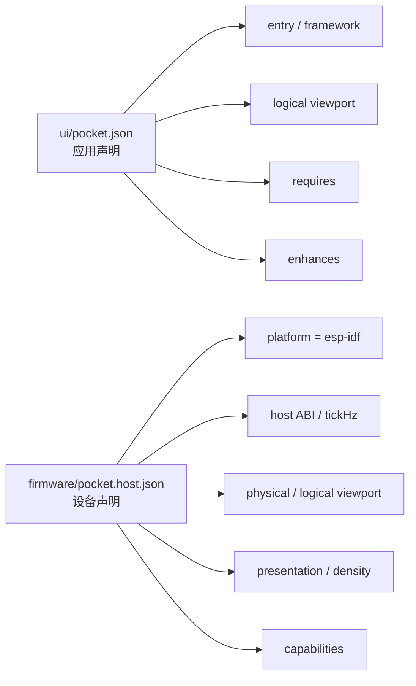
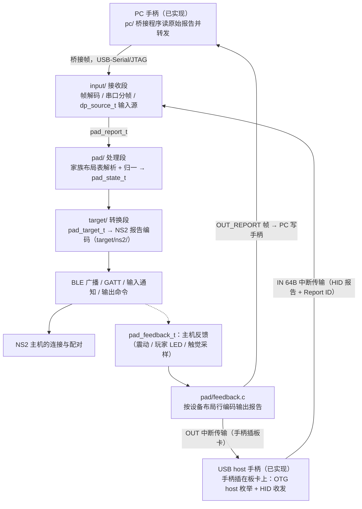
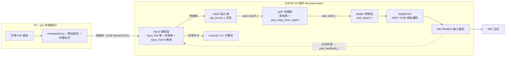
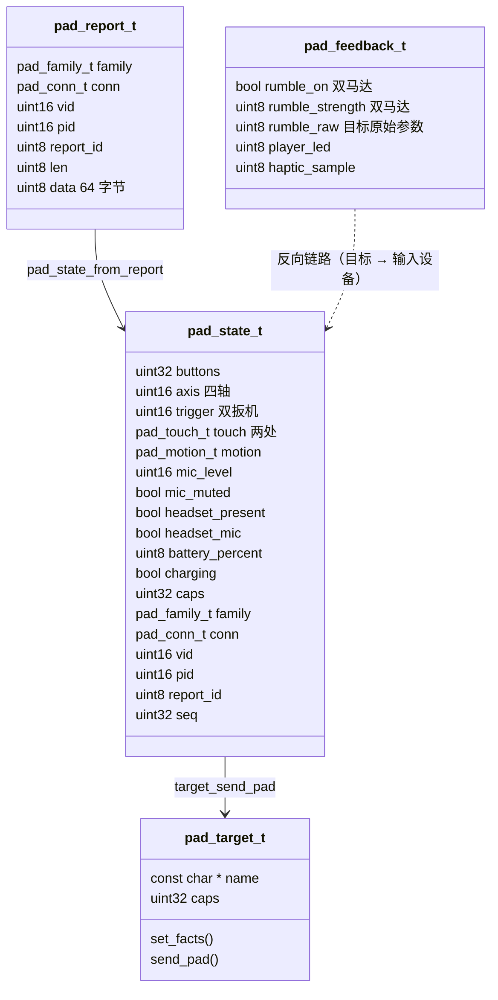
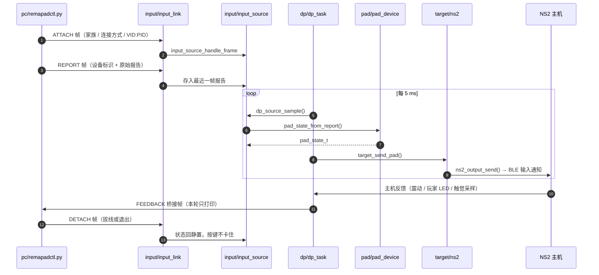
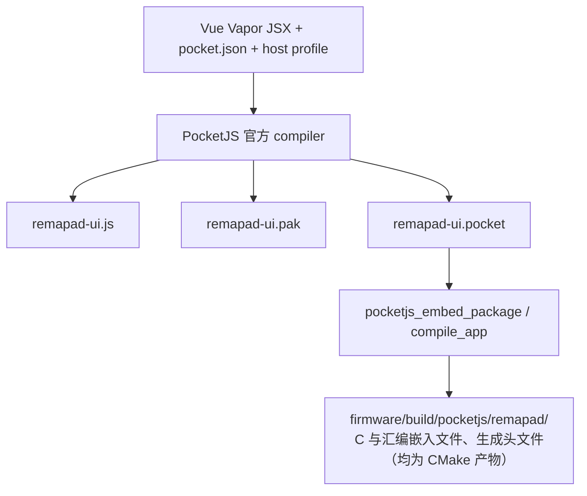
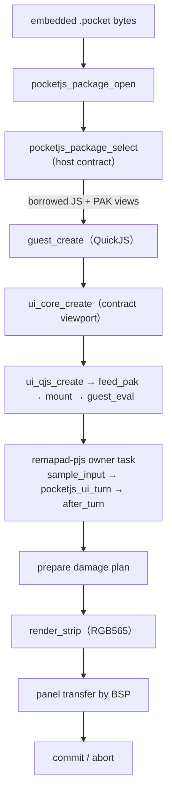

# Remapad 核心概念与领域抽象

本文档记录 Remapad 的两条数据路径：PocketJS 显示 UI 路径，以及 USB→NS2→BLE 控制器路径。PocketJS 包格式、C ABI、UI 输入编码和渲染指令不在项目内复制；
需要调整时应以 PocketJS 官方 schema、组件头文件和 ESP-IDF 示例为准。NS2 协议、广播、GATT、HID 报告和配对内容见 [controller.md](controller.md)。

## 领域术语表

| 术语 | 含义 |
| :--- | :--- |
| **Pocket manifest** | `ui/pocket.json`，描述应用入口、框架、视口和 capability 要求。 |
| **Host profile** | `firmware/pocket.host.json`，描述设备实际提供的 ESP32-S3 host 能力和显示事实。 |
| **Pocket package** | `.pocket` 单文件包，包含 manifest 对应的构建计划、JavaScript、PAK 和目标 variant。由官方 CLI 生成，由 `pocketjs_package` 读取。 |
| **PAK** | PocketJS 资源包，承载样式、baked font atlas、图片等运行时资源。由 `pocketjs_ui_qjs_feed_pak` 提供给 binding。 |
| **Guest** | `pocketjs_guest` 创建的 QuickJS 执行环境，负责运行编译后的 JavaScript。 |
| **UI core** | `pocketjs_ui_core` 维护的 retained UI 节点、资源句柄、动画和 frame view。 |
| **UI binding** | `pocketjs_ui_qjs` 将 `globalThis.ui`、`globalThis.__pak` 和 UI turn 连接到 guest/core。 |
| **Damage region** | 一帧中需要重新光栅化的逻辑矩形；renderer 将其输出为 full-width RGB565 strip。 |
| **Host BSP** | 项目自己的 ESP-IDF 硬件层，负责面板、DMA、触控、按键、电源和其他外设。 |
| **USB input** | 由 ESP32 USB host 接收的外部输入报告，先进入产品数据面，不直接进入 PocketJS。 |
| **接收段（input/、usb/）** | 输入通路的第一段：桥接帧的编解码与串口分帧、USB-Serial/JTAG 的唯一读取者、USB host 枚举与 HID 收发，以及实现 `dp_source_t` 的桥接源与 USB 源。 |
| **处理段（pad/）** | 输入通路的第二段：家族布局表把各家手柄报告解析成私有格式 `pad_state_t`（按键按位置语义、摇杆归一、能力位）。 |
| **转换段（target/）** | 输入通路的第三段：目标编码器 `pad_target_t` 把私有格式编码成具体目标家族的报文，现役实现为 `target/ns2/`。 |
| **桥接帧** | PC 与设备之间的分帧载荷：帧头 `A5 5A` 加版本、类型、槽位、序号、长度字段，再跟载荷与 CRC16，与 CLI 文本共用一根 USB-Serial/JTAG；承载输入帧（ATTACH/REPORT…）、输出报告帧（`0x11`，设备 → PC 的反馈写回）、截图帧（`0x21`-`0x23`，设备 → PC 的像素分块）、OTA 升级帧（`0x30`-`0x33`）与 PING 探测帧。 |
| **同代透传** | 设备自带的报告语言与目标语言一致时，把设备报文体原样交给目标发送（NS2 手柄 → NS2 主机），只重写由本机会话决定的状态字节；判定与取舍见 [ADR 0026](adr/0026-same-generation-input-passthrough.md)。 |
| **输出报告（反馈）** | 主机下发的震动 / 玩家灯 / 触觉采样经 `pad/feedback.c` 按设备布局行编码成该手柄的输出报告，USB host 直插写 OUT 端点，桥接路径把原始报告交给 PC 写回。 |
| **OTA 会话（ota/）** | 升级通道的固件侧：`ota_session` 负责帧队列、非阻塞分派、flash 写入与重启，`ota_proto` 是纯逻辑的序号判定、窗口应答、4 KB 聚合与超时；镜像写进非运行分区，校验通过后切启动分区（见 [ADR 0022](adr/0022-ota-over-bridge-frames-with-rollback.md)）。 |
| **NS2 report encoder** | 将私有手柄状态（`pad_state_t`）编码为目标 NS2 手柄的 USB/BLE 报告，位于 `firmware/main/target/ns2/`。 |
| **BLE controller peripheral** | 对 NS2 主机执行广播、GATT 服务、输入通知、输出命令和配对状态管理的 ESP32 外设角色。 |
| **Product control plane** | UI bridge 与固件控制面，用于低频状态、配置、配对操作和诊断；不承载高频输入报告。 |

## 应用清单与 host profile

应用和设备各自声明事实，官方 resolver 在构建时验证兼容性：



- `requires` 是应用运行所必需的能力，host 不提供时构建应失败。
- `enhances` 是应用可以利用但不应作为最低运行条件的能力。
- `capabilities` 只能填写固件确实会提供的能力。当前 Remapad profile 声明 `text.glyphs.baked`、`input.touch` 与 `input.buttons`；
  触摸能力随触摸 BSP（CST816T 采样，见 [ADR 0007](adr/0007-esp-lcd-panel-touch-bsp.md)）接入一并加入。
  按键能力自手柄组合键捕获（见 [ADR 0028](adr/0028-pad-combo-captures-screen.md)）起声明——组合键把十字键与圆圈键映射成官方按键位，模拟量仍不在 profile 中。
- profile 的 canonical hash 会进入构建计划和 package variant。
  运行时 `pocketjs_package_select` 会校验目标、ABI、tick、视口、density、presentation 和 profile hash。
- 当前设备的逻辑和物理视口均为 `240×280`。生成的 JavaScript bundle 可能仍包含官方 framework 的 `SCREEN_W = 480`、`SCREEN_H = 272` fallback 常量；
  它们不是设备 profile 的显示事实，也不应手动修改生成产物。
  ESP-IDF host 按 package contract 创建 `pocketjs_ui_core`，并通过 `globalThis.ui.__viewport` 发布 `240×280`；
  构建计划和运行时 frame 才是设备尺寸的校验依据。

触摸预览页可以在浏览器中提供真实触点，浏览器 host 与设备 host 各自把输入交给同一套框架语义：预览页把指针事件转换为触摸帧，设备端由 `drivers/touch.c` 把 CST816T 采样填入 `sample_input`。

## 最终产品控制器数据面

USB 到 NS2 BLE 的目标链路如下：



两条输入路径都已落地（PC 桥接走 USB-Serial/JTAG 的桥接帧，USB host 直插走 OTG host 的 HID 中断传输）。
在 `input/` 汇合之后共用 `pad/` 与 `target/` 两段，解析与映射只有一份；反馈方向同样收敛在 `pad/feedback.c` 一处（按设备布局行编码输出报告，USB 写 OUT 端点，桥接把原始报告交给 PC）。
推进结论与实机待办（USB mux 实验、VBUS 供电确认）见 [usb-input-plan.md](usb-input-plan.md) 与 [ROADMAP.md](ROADMAP.md) M5；
同代透传的判定见 [ADR 0026](adr/0026-same-generation-input-passthrough.md)。
角色切换见 [ADR 0027](adr/0027-runtime-usb-role-switch.md)。

这条链路需要保持低延迟和确定性：

- USB 接收、解析、状态快照和 BLE 发送应使用 ESP-IDF 原生驱动、任务和队列。
- NS2 报告编码应按 [controller.md](controller.md) 的型号、Report ID、摇杆打包、震动输出和字节序实现，并用实机抓包验证。
- BLE manager 负责厂商广播字段、GATT service/characteristic、通知订阅、回连、唤醒和配对状态机；配对凭证通过 NVS 等持久化层保存。
  凭证（每条 6B 主机 MAC + 16B LTK）是百字节级小 blob、低频写（仅配对成功时一次），与 PHY 校准同住 NVS：
  NVS 的掉电一致性与磨损均衡正是为这类数据设计，不需要也不应迁往 storage 分区（其定位是大块通用数据）。
  凭证按身份分槽、每个身份保留最近 2 条（对齐 controller.md §7.4 的两条存储模型：主机公网地址与私有第二接口地址），按 MAC 覆盖、超出丢弃最旧，配对新主机是追加而非覆盖，因此不常驻「解除配对」入口。
- 广播状态位（厂商数据偏移 0x0B）是主机唯一的唤醒判据，三种形态由 `ns2_adv_payload()` 统一成型（`firmware/main/target/ns2/ns2_adv.c`，主机端用例钉住黄金字节）：
  发现广播不带主机地址、状态 0x00；回连与唤醒广播携带同一份主机地址——最近一次 NS2 会话记录到的对端地址，
  没有记录时回退到最近一条非全零凭证，两者都没有就退化为发现广播；
  挑选规则是 `ns2_adv_choose_host_mac()` 纯函数，见 [ADR 0030](adr/0030-ns2-wake-adv-host-address.md)；
  两种形态的状态位分别是 0x00 与 0x81。
  **设备只在被请求后广播**：上电静默、主机睡下（断连）后静默，只有连接键（屏幕「连接」或 PWR 长按 3 秒）打开 30 秒连接窗口、
  未连接时按 HOME 打开 10 秒唤醒窗口；窗口内主机连上或窗口到期即收窗，随后回到静默。
  连接窗口内已配对身份发回连形态（醒着的主机自己连回来，休眠中的主机不被打扰），未配对身份进配对流程发发现广播；
  唤醒窗口内已配对身份发唤醒形态 0x81 把休眠主机叫起来，未配对身份没有主机可唤醒、退化为发现广播；配对流程期间恒发发现广播（要配的是新主机）。
  形态决策是 `ns2_adv_choose_mode(paired, pairing_requested, window, now)` 纯函数，窗口由 `ns2_adv_window_*` 维护（连接键与唤醒键各有时长）。
  取舍、诊断开关（`adv auto|wake|reconnect` 钉窗口内形态）与「为什么不再常驻广播」见 [ADR 0038](adr/0038-user-initiated-connection-window.md)。
- 连接间隔由主机下发（常为 4 单位即 5 ms，低于 BLE 规范的 7.5 ms 下限）：
  ESP32-S3 控制器由 `CONFIG_BT_CTRL_BLE_MIN_CONN_INTERVAL_ENABLE` 允许亚规范间隔（最低 3.75 ms）。
  固件只观测不主动请求（GAP 连接更新事件记日志，`link` 打印 `itvl`）——NimBLE 主机侧按规范拒绝 itvl < 6 的请求。输入被主机采纳的门槛有两个：
  一是 **0x0C/0x04（启用特性）**，未启用的链路（握把/顺序页的快捷回连形态，跳过完整握手、反复重发 0x0C/0x02）即使 itvl=4 也不采纳输入。
  输入通知从启用后才发送，已订阅却迟迟不启用的会话由休眠看门狗断开重连（15 秒未启用，每次上电至多 3 次，`ns2_adv_dormant_link()` 判定）；
  二是**稳定不跳号的上报流**：dp 每 5 ms 采样、每 15 ms 发一份报告（`DP_SEND_DIV=3`，节奏写在 `dp_plane.c` 里、没有运行时档位，见 [ADR 0034](adr/0034-ns2-report-interval-fixed-15ms.md)）；
  主机在初始化末尾用报告率描述符（0x0010 写 `85 00`）点的就是这一量级，以 5 ms 从任务侧灌 63B 通知会打爆发送队列（2026-09-15 实测四成以上因 mbuf 耗尽被丢、有效投递掉到 20 次/秒上下），实测记录见 [controller.md](controller.md)。
  `0x0E` 运动数据长度必须非零，按 40 字节零值占位（板卡无 IMU）。
   耳机状态（3.5 mm）由输入设备派生：`pad_state_t` 的 `headset_present` / `headset_mic` 经 NS2 目标的单一来源映射成 `0x09` 偏移 `0x0D`（未插入 0x00、插入 0x05）与 `0x05` 的耳机插入位，编码路径与同代透传路径共用；串口 `headset auto|0xNN` 可钉住覆盖值做主机侧 A/B。
   带麦位不上行：主机接受 0x05 / 0x0D，换上 0x07 / 0x0F 后约 150 ms 就取消 0x000E 的订阅（2026-09-15 实测），认那一档要先有 0x002C 的音频 / 麦克风通路。
   PC 手柄报告里耳机状态字节的偏移与位序：DualSense 蓝牙行已按实机插拔差分核对（第 55 字节），其余行未核对（未登记的行一律按未插入上报），见 [ADR 0035](adr/0035-ns2-headset-state-passthrough.md) 与 [pc/README.md](../pc/README.md)。
- flash 写入期间 cache 被禁用，而 PocketJS owner task 的栈在 PSRAM——从该任务直接执行任何 flash 写都会在禁缓存窗口访问 PSRAM 并触发 cache 异常重启（「停止配对即重启」的根因）。
  凭证等持久化写一律收敛到 `ble_creds` 的内部 RAM 栈写任务：各任务只更新内存表并投递快照，新增持久化需求必须沿用同一模式。
- `ui/src/bridge/` 与 `firmware/main/bridge/` 只承载低频的模式切换、配对开关、连接状态、电池与诊断：
  guest 侧 `HardwareDriver` 经 `globalThis.__nativeBridge.postMessage(json)` 发命令。
  owner task 每帧用 `js_bridge_service()` 处理队列，再用 `pocketjs_guest_eval` 调 `__onNativeBridgeMessage(json)` 回发应答与事件。
  入队出队都在 owner task 上，无锁；
  PWR 按键与串口 CLI 等非 owner task 上下文经 `js_bridge_submit_command` / `js_bridge_post_event` 的外部队列转移。
  命令与事件清单以 `ui/src/bridge/protocol.ts` 为准。
- **屏幕文案一律取自 ui/src 的字面量**，桥接只回状态与错误码、不回可上屏的文本：
  构建期字体字符集按源码字面量扫描烘焙，固件回传的文本直接渲染就是豆腐块（联合类型 `PairingNotice` / `RoleNotice` 把这条规则钉在类型上）。
- 玩家序号灯（主机 Command 0x09 下发的 4 位掩码）由 `ns2_session_player_leds()` 按活跃会话汇总。
  随 `systemStatus.playerLed` 与变化时的 `playerLedChanged` 事件供首页四格指示灯使用（bit0-3 从左到右对应四格，无主机时为 0，断连自动回落）。
  用户设置（背光亮度、手柄身份类型与配色、上报固件版本）由 `firmware/main/config/app_config.c` 持久化到 NVS（内部 RAM 栈提交任务，与 ble_creds 同一模式），开机恢复。
- USB 角色（`usbRole`: device=插电脑 COM 口，host=插手柄）会真实切换：
  切到 host 时先把日志与 CLI 出口换到 UART0（GPIO43/44），再放掉 USB-Serial/JTAG、装 USB host 栈（复用开关随之切到 OTG host），PC 上的 COM 口消失直到复位；
  切回串口按相反顺序还原。角色只在本次运行有效（不写 NVS），复位后复用开关回默认的 USB-Serial/JTAG（COM 设备模式），"重启回 COM 模式"因此天然成立。
  恢复路径与取舍见 [ADR 0027](adr/0027-runtime-usb-role-switch.md)。
- 配对与连接状态接的是真实 BLE 会话（NimBLE 手柄外设，进度见 [ROADMAP.md](ROADMAP.md)）：
  配对页主按钮是连接键——`connect` 在已配对身份上开连接窗口（回连形态），未配对身份上进配对流程；广播中它发 `disconnect`（收窗口与流程、断开链路、静默）；
  副按钮配新主机走 `startPairing`：先断开当前主机再进发现广播等新主机搜索，凭证拿齐且会话注册完成才由 tick 退出流程——只看凭证会让已配对设备一按配对键就被判成完成。
  开机不自动进入配对流程，解除配对走显式 `unpair`（清 NVS 凭证并静默），UI 不暴露入口。
  已连接却停在握手等待态的主机（手机/PC 自动回连）由 3 秒无协议活动的空闲超时断开，主机连接地址是随机地址，不能按 OUI 识别。
  配对成功以协议证据判定（初始化 / 0x15 握手完成，或凭证匹配回连），NVS 凭证只是重启后仍成立的持久化证据，两者独立；配对六态由此实时推导并经 `pairingStateChanged` 推送。
  Command 0x15 与 NVS 凭证见 [controller.md](controller.md) 与 [ADR 0010](adr/0010-nimble-ble-controller-stack.md)。
  电池由 `battery.c` 真实采样（BAT_ADC=GPIO1 / ADC1_CH0，分压 3:1 还原 VBAT，静置电压—容量表折算百分比），充电状态没有可测量的引脚。
  是按电压趋势推断的值，限制见 [ADR 0020](adr/0020-battery-adc-sampling-and-charge-inference.md)。
- 手柄身份与配对凭证按 `ns2_identity_t`（Pro / JoyCon L / JoyCon R）分槽（`ble_creds`，NVS v2 格式，旧单表记录迁移进 Pro 槽）：
  切换手柄类型后主机眼中是另一台设备，配对信息不共用。Pro 为单连接双 PDU 广播；JoyCon 组合为左右双连接（`CONFIG_BT_NIMBLE_MAX_CONNECTIONS=2`）。
  各占一个广播实例与静态随机 AdvA——地址由 `ns2_identity_adv_addr()` 按身份的固定盐从公共伪装地址扩散。
  再置成静态随机形态（最高字节 bit7/bit6 置一，最低位右置一、左清零），三种形态的地址互不共用字节序列，避免主机把不同形态认成同一台或把两只认成一只，同一芯片上结果稳定；
  NimBLE 每实例地址仅支持 RANDOM，与真机 public 形态不同，兼容性待实机验证。
  序列号 / PID / 出厂块（0x7E40 与 0x13000）按连接身份提供，输入报告按身份切分左右半边（左：L/ZL/减号/截屏/十字键/左摇杆，右：A/B/X/Y/C/R/ZR/Home/右摇杆，NFC 状态只在右手柄保留）。
  身份由会话层显式传给传输层，不从广播地址反推——芯片地址最低位奇偶不定，反推会把左只认成右只。切换身份（或配色）等价于旧手柄断电、新手柄上电：断开现有连接、按新身份重算配对状态与出厂块，新身份同样不自动广播（用户按连接键才发信号）。
  未配对的新身份按连接键进配对流程，已配对身份按连接键发回连形态。配对页「按下 LR」（`pressLr`）是手动兜底，未配对期间固件自动注入 L+R 120ms 并每 3 秒重试。
  会话层面向连接分槽（最多 2 个），桥接命令 / 应答 / 通知都带连接上下文，并维护每槽的报告计数与链路快照（`ns2_session_status()`，串口 `link` 与日志取用）；
  `controllerConfig` 应答带 `addresses`（pro / left / right，显示序大写十六进制，host 未同步时为空串），手柄设置页的身份信息行取用它。
- 配对对外的心智模型是「设备不主动发信号，连接要按连接键」：开机与断开后都静默，按连接键才广播（已配对身份发回连形态等主机连回来、未配对身份进配对流程），主机睡下时按 HOME 把它叫醒并自动回连；
  主机侧配对记录在首次连接握手时完成，用户不需要在屏幕上做任何确认动作。屏幕配对页用于观察状态、按连接键、配新主机或断开，主机 Grip / 手柄顺序界面只用于调整手柄顺序与确认 JoyCon 已配对。
  JoyCon 组合保持左右两条独立连接与两条独立凭证（各占一个广播实例），未配对期间固件自动注入 L+R 120ms 并每 3 秒重试——主机靠同时按下的 L 与 R 把两只认成一对，屏幕 UI 不做合并成单个设备的展示。
- 主机推送的手柄固件更新按「接住数据、逐帧应答、不重启」处理（2026-09-15 实机对账，协议见 controller.md §12）：
  `0x0018` 上的记录流按帧装配（`main/target/ns2/ns2_upgrade.c`，字节级用例在 `firmware/test/test_ns2_upgrade.c`），帧凑齐即按指令通道格式回一条空体应答，
  主机因此把整包推完（实测 114 帧、4751 条记录、483,692 字节）；收尾的 `0x0d/0x07` 之后默认**不重启**——
  实测重启会被主机当成更新没生效而重推整包，形成「推包 → 重启 → 再推包」的循环（串口 `fwapply on` 才一次性武装收尾重启，留着做对照实验）。
  上报给主机的固件版本固化在 `main/config/app_config.h` 的 CONFIG_DEFAULT_FW_VERSION_*（主机据此决定是否提示手柄更新），串口 `fwver a.b.c` 可临时覆盖并就地重建出厂块；
  帧应答体 `fwack` 与「更新完成后上报的版本」`fwpost` 是留给后续对齐协议的现场旋钮。
  版本抬到 9.9.9 后实机不再弹更新提示，但**是否根治未确认**：主机认的版本号未知、收尾那次通信中断仍在，详见 controller.md §12 与 ADR 0032。
- 调试注入是控制面进入数据面的唯一低频通道，采样与编码仍由数据面任务独立完成（`firmware/main/dp/dp_source.c`）：
  按键注入经 `dp_source_inject()` 叠加一次按下并按时长自动释放（默认 250 ms，上限 60 s，`dp_source_inject_release()` 可提前释放）；
  摇杆注入经 `dp_source_inject_stick()` 给出持续电平（0-4095，两侧独立，未设定的一侧沿用输入源，`dp_source_inject_stick_reset()` 回中并解除注入）。注入是合成的最后一步：
  按键叠加在合成按键上，设定过的摇杆覆盖合成摇杆。按键名表由 `dp_source_key_lookup()` 提供，串口 CLI 与主机端用例共用；
  UI 调试页「按键指令」区走 bridge 的 `debugKey`，提供 a / home / ui 三个键。
  HOME 按实体手柄语义分流（`ns2_adv_home_action()`）：主机在线时就是主页键，只进报文；
  不在线时按键到不了主机，改成唤醒请求打开唤醒窗口（10 秒内发 0x81 把它叫起来；设备平时静默，这是唯一的叫醒路径）。
  这条语义长在数据面上（按下沿判定见 `ns2_adv_home_key_step()`），所以实体手柄（USB 直插或 PC 桥接）按 HOME 与调试页注入 HOME 是同一个动作；按钮文案跟着主机状态走。
  串口 `link` 按身份打印链路快照（`ns2_session_status()`）：对外广播地址、连接句柄、连接间隔（`itvl`，4 = 5 ms）、会话状态、报告格式、已开启的通知通道、特性启用位（`feat`）、已发送报告数、
  凭证条数与广播形态（`adv`，取 wake / reconnect / discovery / off）；按键变化另有数据面限频日志（`buttons 0x… -> 0x…`，最小间隔 200 ms）。
- 输入与输出已解耦成三段稳定接口（见 [ADR 0021](adr/0021-input-path-three-stage-layering.md)）：
  `dp/dp_source.h`、`pad/pad_state.h` 与 `target/target.h`。
  新增输入设备（桥接 PC、USB 手柄、调试注入）只需实现 `dp_source_t` 并注册，首个注册源拥有摇杆/扳机/触摸/运动/耳机状态/透传原始报文与设备标识字段，后续源叠加按键，调试注入最后叠加；
  合成只拷这些主源字段（`copy_primary_fields`），新增字段忘了加进去会静默停在默认值上（耳机状态漏拷就是「插着耳机主机也看不到」），`firmware/test/test_dp_source.c` 逐个钉住；
  私有格式 `pad_state_t` 是上下段之间的唯一接缝。
  目标侧 `target_send_pad()` 按注册的 `pad_target_t` 编码（现役 `target/ns2/`，内部仍调 `ns2_output_send()`，可只填需要输出的按键）。
  主机下发的震动 / 玩家 LED / 触觉采样被 ble_session 解析为结构化事件（`ns2_rumble_event_t` 等），在反馈监听者里叠加进 `pad_feedback_t` 持续帧并回发桥接帧
  （事件带哪些字段就覆盖哪些字段：震动与玩家灯是主机的持续状态，回落到默认值会把刚点亮的玩家灯写灭；触觉采样是一次性事件）；
  写回插入手柄的动作见下一条。电池经 `battery.c` 唯一入口 + `ns2_output_set_battery` 随报告上发；
  amiibo 镜像经 `ns2_output_amiibo_stage` 预置（传输方式待定），Report 0x09 的 NFC 状态字节随预置汇报。
  USB host 直插的推进方案见 [usb-input-plan.md](usb-input-plan.md)。
- USB host 直插的数据面：`usb/usb_transport.c` 装 host 栈、枚举、按报告描述符挑手柄用途的 HID 接口（跳过厂商与音频接口）。
  `usb/usb_input.c` 把 IN 报告组成 `pad_report_t` 交给同一份家族表并把反馈写回 OUT 端点。
  `usb/usb_role.c` 负责运行时切换角色（先迁日志到 UART0，再让出 USB-Serial/JTAG）。实机步骤与 VBUS 门禁见 [usb-input-plan.md](usb-input-plan.md)。
- 反馈方向已投递到实体手柄：主机下发的震动 / 玩家 LED / 触觉采样经 ble_session 解析成结构化事件，在反馈监听者里归一到 `pad_feedback_t`。
  由 `pad/feedback.c` 按设备布局行编码成该手柄的输出报告（DS4 / DualSense / Xbox / DS3 / NS1 各有一行描述，NS2 手柄原样吃主机的 LRA 参数包）。
  USB 直插写 OUT 端点，桥接路径发 `0x11` OUT_REPORT 帧给 PC 写回。
- 运动数据（陀螺仪与加速度）：布局行描述取样位置、样本数与轴映射（NS1 一次三份取最新一份），解析进 `pad_motion_t`；
  0x05 报文的 IMU 字段按 controller.md §5.1 的偏移填真值，0x09 的 40 字节运动块结构未公开。
  因此只提供 CLI `motion 3` 的实验填充档（默认关），真 NS2 手柄走同代透传时运动块原样到达主机。
- USB 高频输入不应经过 JSON bridge，也不应等待屏幕刷新或 JavaScript guest 执行。

## 输入通路：接收 / 处理 / 转换

输入通路按三段划分（取舍见 [ADR 0021](adr/0021-input-path-three-stage-layering.md)）：
`input/` 只把字节变成「原始报告 + 设备标识」，`pad/` 只把原始报告变成私有格式并收敛家族差异，`target/` 只把私有格式编码成目标报文。三段之间是单向数据流：
新增一种手柄只在 `pad/layouts/` 里加一行（新系列则加一个文件并登记），新增一个目标（例如将来的 NS1）只加一个 `pad_target_t` 实现。



私有格式是这条通路的接缝：上游只要能填出 `pad_state_t`（桥接 PC、将来的 USB host 直插、调试注入都一样），下游目标就不需要知道手柄从哪来。



- 按键位按位置固定、键名沿用 PS（`PAD_BTN_TRIANGLE` 上、`PAD_BTN_CIRCLE` 右、`PAD_BTN_CROSS` 下、`PAD_BTN_SQUARE` 左）：
  Xbox 与 Nintendo 的 A/B/X/Y 标签位置不同，用 PS 名可以避免「A 到底指哪个键」的混淆，家族表把各家的物理键填进对应位置；背键与静音键（目标侧作 C 键）用扩展位占位。
- 四轴与双扳机统一为 0-4095 整数、摇杆中位 2048，Y 轴统一成「上为正」，8% 死区在解析段套用并把剩余行程重新铺满；扳机保持模拟量，是否数字化由目标决定。
- `caps` 标注这一帧里哪些字段真的来自设备（运动、触摸板、模拟扳机、背键、麦克风、电池、震动）；型号未识别时回落 Xbox 布局并置 `PAD_CAP_FALLBACK_LAYOUT`，结果仍可用但字段可能错位。
- 目标只消费自己 `caps` 范围内的字段：不在集合里的部分（IMU、触摸板、麦克风）不映射，能力集合变化时提示一次，不逐帧刷日志。
- 桥接帧与 CLI 文本共用一根 USB-Serial/JTAG：接收侧校验 CRC、失步时只丢一个字节继续扫描，非帧字节原样交回命令行解析，因此桥接跑着的时候串口 CLI 照常可用。
- 布局行现在分三组描述：输入字段（既有）、运动字段（`motion`）与输出（反馈）报告（`out`），外加设备自带的报告语言与期望身份（`native_lang` / `native_identity`）；
  同代透传的判定与状态字节重写见 [ADR 0026](adr/0026-same-generation-input-passthrough.md)。
  `out` 里的 `frame` 标出报告的收尾方式：PS 系的蓝牙形态要在末 4 字节补 CRC32（种子字节 0xA2 参与计算，见 `pad/feedback.c`），缺它的报告手柄整份都不接受（实机表现：写回成功、毫无反应）；
  `led_mask_map` 把主机玩家灯掩码落到设备自己的灯位模式（DualSense 的五颗灯是固定模式，1P 只有中灯、2P 中灯加外灯，不能直写主机掩码），
  DualSense 在蓝牙上还要把灯条设置与颜色写进同一帧——主机自己的连接动画会一直盖着灯，单独发一次设置报告压不住。
- 未登记的 VID/PID 仍回落 Xbox 有线布局并置 `PAD_CAP_FALLBACK_LAYOUT`；
  Nintendo 家族（VID `0x057E`）按系列文件 `pad/layouts/ns.c` 登记，NS2 的 0x05 / 0x09 报文体与 NS1 的 0x30 / 0x3F 各占一行，偏移同样先取自公开资料、待实机回填。

帧类型（固件侧定义在 `firmware/main/input/input_frame.h`，PC 端在 `pc/link.py` 镜像一份）：

| 类型 | 方向 | 载荷 |
| :--- | :--- | :--- |
| `0x01` ATTACH / `0x02` DETACH | PC → 设备 | 8 字节设备标识（家族 / 连接方式 / VID:PID / Report ID / 报告长度） |
| `0x10` REPORT | PC → 设备 | 设备标识 + 原始报告（最多 64 字节） |
| `0x11` OUT_REPORT | 设备 → PC | 要写回手柄的输出报告原始字节（首字节是 Report ID，最多 78 字节） |
| `0x20` FEEDBACK | 设备 → PC | 左右震动使能与强度、玩家灯、触觉采样 |
| `0x30` OTA_BEGIN | PC → 设备 | `ROM1` + 镜像字节数（u32 小端） |
| `0x31` OTA_DATA | PC → 设备 | 块序号（u16 小端）+ 最多 200 字节镜像数据；帧内 `slot=1` 标记该窗口的末帧 |
| `0x32` OTA_END | PC → 设备 | 空 |
| `0x33` OTA_ACK | 设备 → PC | 状态 + 错误码 + 期望序号（u16 小端）+ 已收字节（u32 小端）；对 BEGIN 的应答末尾再附 16 字节运行版本 |
| `0x7F` PING | 双向 | 协议版本号（1 字节） |

解码器按线格式上限 255 字节收帧，报文帧仍按 72 字节语义校验（8 字节设备标识 + 最多 64 字节报告），
输出报告帧按 78 字节校验（DualSense / DualShock 4 的蓝牙输出报告长度）。
OTA 帧由 `input_link` 交给 `ota/ota_session`，PING 由 `input_link` 直接应答，其余交给 `input_source`；
升级协议、流控与回滚门槛见 [ARCHITECTURE.md](ARCHITECTURE.md) 的「OTA 升级通路」。

PC 手柄到 NS2 主机的完整时序（映射表把家族差异收敛在 `pad/`，所以桥接路径与将来的 USB host 直插路径共用后面两段）：



家族与目标的按键对应关系（按位置对齐，因此 Xbox 的物理 A 与 PS 的 Cross 都落在 `PAD_BTN_CROSS`、再到 `NS2_BTN_B`）：

| 私有格式（位置语义） | Xbox 物理键 | PS 物理键 | NS2 目标 |
| :--- | :--- | :--- | :--- |
| `PAD_BTN_CIRCLE`（○ 右） | B | Circle | `NS2_BTN_A` |
| `PAD_BTN_CROSS`（✕ 下） | A | Cross | `NS2_BTN_B` |
| `PAD_BTN_TRIANGLE`（△ 上） | Y | Triangle | `NS2_BTN_X` |
| `PAD_BTN_SQUARE`（□ 左） | X | Square | `NS2_BTN_Y` |
| `PAD_BTN_L1` / `PAD_BTN_R1` | LB / RB | L1 / R1 | `NS2_BTN_L` / `NS2_BTN_R` |
| `PAD_BTN_L3` / `PAD_BTN_R3` | 左右摇杆按下 | L3 / R3 | `NS2_BTN_LSTICK` / `NS2_BTN_RSTICK` |
| `PAD_BTN_TOUCHPAD`（触摸板按下） | View（select） | 触摸板按下 | `NS2_BTN_MINUS`（减号） |
| `PAD_BTN_OPT`（选项） | Menu | Options | `NS2_BTN_PLUS`（加号） |
| `PAD_BTN_HOME`（主页） | 西瓜键 | PS 键 | `NS2_BTN_HOME` |
| `PAD_BTN_SHARE`（分享） | 分享键（Series 手柄） | Create / 分享 | `NS2_BTN_CAPTURE`（截图） |
| `PAD_BTN_MUTE`（静音） | 无 | DualSense 静音键 | `NS2_BTN_C`（C 键） |
| `PAD_BTN_DPAD_*` | 十字键 | 十字键（帽子开关展开） | `NS2_BTN_DPAD_*` |
| `PAD_BTN_L4` / `PAD_BTN_L5` / `PAD_BTN_R4` / `PAD_BTN_R5` | 侧键 / 背键 | DualSense Edge 背键（L4 / R4） | `NS2_BTN_GL` / `NS2_BTN_GR`（同侧合并） |
| `PAD_TRIGGER_L2` / `PAD_TRIGGER_R2` 模拟量 ≥ 2048（50%） | LT / RT | L2 / R2 | `NS2_BTN_ZL` / `NS2_BTN_ZR` |
| `PAD_AXIS_LX` / `LY` / `RX` / `RY`（0-4095，中位 2048） | 左右摇杆（有符号 16 位） | 左右摇杆（单字节） | 12 位打包的摇杆字段 |

家族表按系列拆在 `firmware/main/pad/layouts/` 下，契约与注册表是 `pad/layout.h` / `pad/layout.c`。
取舍见 [ADR 0025](adr/0025-pad-layout-modules-per-series.md)。表按（家族、Report ID、连接方式、PID）定位偏移，同一个 Report ID 下的不同型号按 PID 分行：
PS 系的 DS3、DS4 与 DualSense 有线都报 0x01，DS3 有线与蓝牙字段一致、共用一行。
各行的偏移初值取自公开资料，落地时用 `pc/remapadctl.py --dump` 抓原始报告核对后再固化（只有 DualSense 蓝牙的 0x31 行按 Edge 实测核对过）；
DS3 的按键极性、蓝牙前缀长度，以及 DualSense 的电量与触摸板坐标仍未核对，见 [ROADMAP.md](ROADMAP.md) 的家族表回填。Steam 原生布局未抓包，整族走 Xbox 兜底并在能力位里标记。

手柄组合键 L1+R1+L3+R3 按住 300 ms 会捕获输入、转为屏幕操控（[ADR 0028](adr/0028-pad-combo-captures-screen.md)）：
判定在私有格式层完成（`firmware/main/dp/dp_ui.c`），家族表只需要把 L1/R1/L3/R3 映射到 `PAD_BTN_L1/R1/L3/R3`，既有与将来的布局都自动可用。
dp_task 在捕获的那一刻先向主机补发一帧全松开（清掉 `raw_len` 与 `native_lang`，避免同代透传把旧按键带过去）。
其后按原来的上报节奏续发同一份中性帧，主机按稳定不跳号的上报流判断链路健康，整段停发会被它判成手柄离线。
玩家输入从捕获起一点不上行，同时十字键与圆圈键映射成 PocketJS 按键位，经 owner task 的 `sample_input` 交给 UI；再按一次同样的组合退出并恢复转发。
UI 侧把各页与底栏的 `focusable` 绑在「自己是当前页、且没有弹窗盖住」上：`interactive` 由 `ui/src/App.tsx` 往下传，
`hooks/usePadControl.ts` 只管操控窗口与非操控状态下的焦点清理。
框架的遍历因此只含画面上的控件，圆圈键与触摸点按汇入同一个 onPress 入口；可滚动页把可聚焦行的位置表交给 `usePageScroll`，焦点走到下方时内容跟着滚。
模式状态经 `systemStatus.padUiMode` 与 `padUiModeChanged` 事件同步到 bridge，调试页、串口 `ui [on|off]` 与 `key ui` 都能在不插手柄时进出。

## UI 图元与资源

`ui/src/App.tsx` 使用 PocketJS Vue Vapor 的 `<View>`、`<Text>` 和 `<Image>` 等图元：

- `<View>` 提供嵌入式布局、背景、边框、间距和 focusable 交互。
- `<Text>` 使用构建期收集的字符集和 baked font atlas；字号应使用 PocketJS 支持的 Tailwind 插槽。
  Inter 未映射的码点（中文等）经应用目录 `fonts.json` 声明的回退字体面（当前为 Noto Sans SC）烘焙进同一图集。
- `<Image>` 通过资源名称引用 PAK 中的图像；图片在构建期处理，不在 ESP32 上解析 SVG。
- `createSpriteAnimation` 只描述资源帧选择，实际资源仍由官方编译器和 PAK 管理。
- 长文案放不进可视区时用 `ui/src/components/MarqueeText.tsx`（自定义横向滚动文本）：
  框架的单行 `Text` 不自动换行，组件按「静止 2 秒 → 匀速左移到底 → 到底停留 1 秒 → 跳回起点」循环，放得下则全程静止；
  可视宽度由调用方以逻辑像素传入（框架不回读布局），滚动相位取 `virtualNow()`，文本宽度经 `getOps().measureText(text, slot)` 量取，宿主不提供该操作时退回静态文本。
- 页面组织：`ui/src/App.tsx` 在首次渲染里一次挂完七个页面，首屏（第一次 commit）只在全部建树完成后提交。
  等待期由固件启动画面覆盖（原生建树约每节点 50 ms，选型见 [ADR 0016](adr/0016-mount-all-pages-before-first-frame.md)）。
  App 没有页面容器层也没有待挂队列，切页由每个页面根节点翻转 `hidden`（`props.active()`）完成，新增页面直接写在 JSX 里并自行负责 `hidden`。
同页会来回切换的状态用 `hidden` 收起而不是条件渲染：
手柄设置页的身份信息行与状态提示行都常驻。每行就是一个文本节点，标签与值同节点、省掉行容器：
Pro 两行「序列号 / MAC」，JoyCon 四行「左序列号 / 左 MAC / 右序列号 / 右 MAC」，右只两行翻 `hidden` 收起。
运行期增删节点在实机上很贵（建树约 50 ms/节点），除条件渲染外，JSX 里的 `.map(...)` 只要在构造列表时读了响应式状态。
该状态一变就会卸载整段旧节点、重建等价的新节点（手柄设置页的序列号行原先正是这种写法：一次形态切换要重建 13 个原生节点、15 次插入、5 次移除，按每节点约 50 ms 计实机要阻塞半秒以上，固件应答回写同一状态还会再走一遍）；
列表应取自模块级常量，可变字段留给子组件按属性绑定（模式页 `RoleCard`、手柄设置页的身份信息行都是这个写法）。切换类样式也不要带 `transition-*`：
过渡期间该区域每帧都要重画（选项卡两张卡约 2.2 万像素、实机每帧 11–14 ms，共 9 帧），观感是慢半拍。
滚动页在滚动列末尾放 `components/BottomPlaceholder.tsx` 垫高（`BOTTOM_PAD_H = 80`）；
页面内容高度由各页静态估算后传给 `usePageScroll`（框架不回读布局），估算误差由这段垫高的兜底余量吸收。
页面能否滚动由调用方一次声明（`usePageScroll(active, scrollable, contentH)`），不再从内容高度推导；
滚动边界硬夹住（`overscroll: 0`），拖拽不会拉出边界，抛掷落点越界的会被改写成到边界的补间，没有橡皮筋，滚到底就停。全应用只注册一个纵向手势，识别区域由当前接管滚动的页面给出：
非当前页或不可滚动的页让 region 返回 null，本帧不接管新触点（官方优先级即注册顺序，逐页注册会互相抢 claim，dispose 重注册又会取消进行中的触点）。

入口保持官方 Vue Vapor 形式：

```jsx
import { mount } from '@pocketjs/framework/vue-vapor';
import Hero from './App';

mount(() => <Hero />);
```

固件 `pocketjs_ui_qjs_mount` 会在应用 eval 前安装 `globalThis.ui` 和 `globalThis.__pak`；应用入口不再手动传入 PAK，也不依赖私有 prelude。

## 构建产物映射



`firmware/build/pocketjs/remapad/` 中的 C/汇编嵌入文件和生成头文件都是 CMake 产物。项目不应再出现手写的 PCKT 解析、字节数组或 `app_pocket.h` 同步脚本。

## ESP-IDF 运行时生命周期

`firmware/main/pocketjs_host.c` 使用官方 C API，顺序与官方 ESP-IDF smoke 示例保持一致，但创建、mount、eval 和逐帧 turn 都在同一个产品 task 上完成：



包中的 JavaScript 和 PAK 都是借用视图，必须在 guest、binding 和 package 销毁前保持可读。
生成的 package header/assembly 由 CMake 管理，因此不会发生 UI 与固件手动复制不一致的问题。

## 输入抽象

官方 `pocketjs_ui_input_t` 是一次 UI turn 的输入快照，包含：

- `buttons`：设备按键位图。
- `analog_x`、`analog_y`：左模拟量。
- `touches`、`touch_count`：当前触点数组。

输入采样属于 host/BSP，不属于 PocketJS 应用包。当前实现由 owner task 的 `sample_input` 回调填三样：
按键取自数据面的手柄操控映射（`dp_ui_buttons()`，只在组合键捕获期间非零，含十字键、圆圈键与肩键等价出的左 / 右，见 [ADR 0028](adr/0028-pad-combo-captures-screen.md)）。
模拟量恒为零。
触点由 CST816T 采样转换为官方 `pocketjs_ui_touch_t` 触点数组。
CST816T 是单点触摸，触点 `id` 在同一按压期间恒为 0，坐标使用逻辑像素，板卡引脚见 [hardware.md](hardware.md)。
USB→NS2 的高频状态应留在产品数据面，不应为了驱动 UI 而重新设计 PocketJS runtime 的输入协议。

## 渲染抽象

官方 RGB565 renderer 的职责是从 UI frame view 生成像素，不负责面板控制：

1. `pocketjs_rgb565_prepare` 生成 damage plan 并开始目标事务。
2. 对每个逻辑 damage region，分配或复用一个 full-width、region-height 的 RGB565 strip。
3. `pocketjs_rgb565_render_strip` 将 strip 写入调用方提供的缓冲区；容量必须精确匹配物理宽度乘以 region 高度。
4. BSP 将 strip 传给面板 DMA，所有传输成功后调用 `pocketjs_rgb565_commit`。
5. 任一渲染或传输失败时调用 `pocketjs_rgb565_abort`，不要提交不完整帧。

ESP32-S3 没有本项目使用的 P4 PPA 加速器，因此 renderer 使用官方软件 RGB565 路径。当前仓库只验证 strip 生成和事务，不宣称已经完成 ST7789 传输。

## 调度抽象

当前由产品自己的 `remapad-pjs` owner task 承担调度：它按 host profile 的 `tickHz` 驱动 UI turn，同时承载 guest 的创建、mount 和 eval。
它只负责调度、输入采样回调与帧消费，不拥有输入驱动或显示设备。

不使用官方 `pocketjs_runner` 的原因是任务栈的宿主：
`pocketjs_runner_config_t` 只能指定栈大小，FreeRTOS 任务栈始终由 IDF 从内部 RAM 分配，而 mount 需要的连续 C 栈空间超出内部 RAM 的可用容量。
owner task 通过 `xTaskCreatePinnedToCoreWithCaps` 把栈放在 PSRAM。

**创建 guest 的任务和执行 UI turn 的任务必须是同一个。
** QuickJS 的栈守卫以下限 `stack_top - stack_size` 判断溢出，而 `stack_top` 取自创建 runtime 时的栈指针，`JS_UpdateStackTop` 在官方组件中没有被调用。
若 turn 换到别的任务执行，守卫量的是别人的栈，溢出不会被拦截。改动调度时这一点不能破坏；同时任务栈容量必须大于 guest 的 `stack_limit`。

## 硬件扩展边界

产品 BSP 以后可以包含：

- ST7789 初始化、方向/偏移配置和 SPI/并口 DMA；
- 触控控制器、GPIO 按键和模拟量采样；
- USB host、输入报告解析和 NS2 报告编码；
- BLE 广播、GATT、配对/回连、震动命令和电源管理；
- 背光、电池和其他设备状态；
- 将上述事实映射到 `pocket.host.json` capabilities。

这些功能应直接使用 ESP-IDF 或对应官方驱动，并在对应的 BSP/data-plane 边界接入。没有真实硬件事实时，不在 UI manifest 或 host profile 中提前声明能力。
协议字段和配对流程以 [controller.md](controller.md) 为参考，不应把文档中的实验性结论当作已完成的互操作保证。
