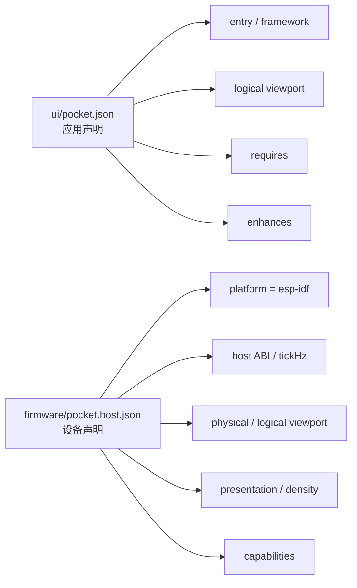
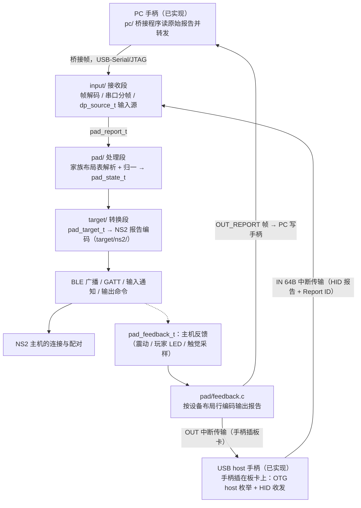
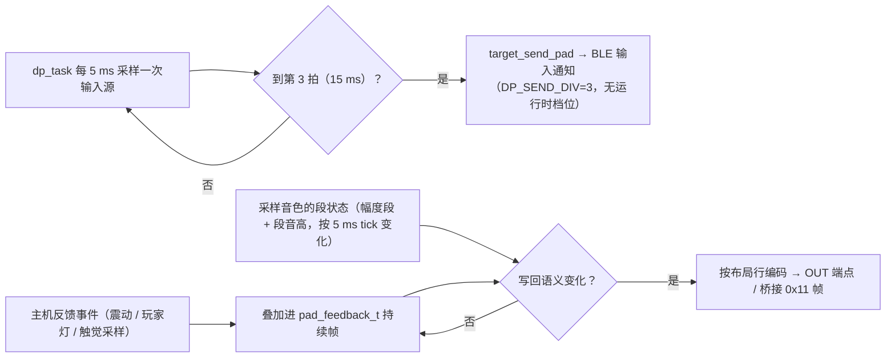
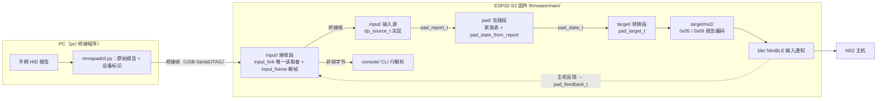
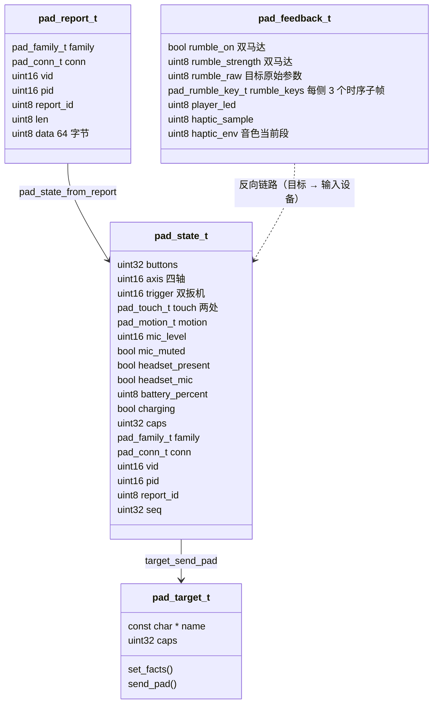
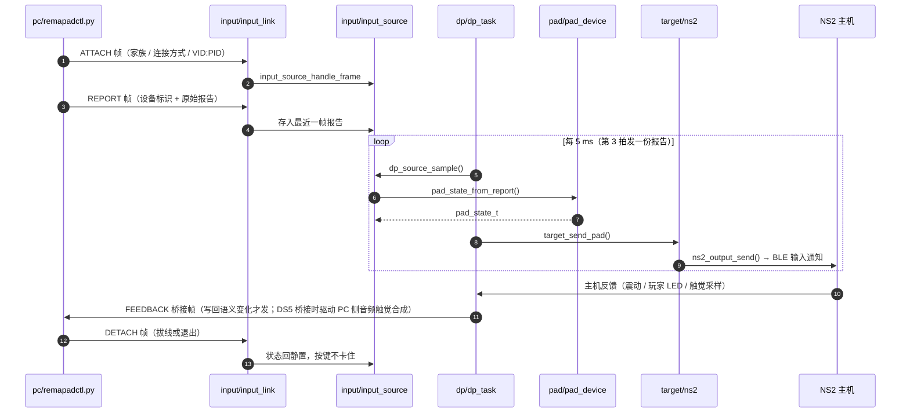
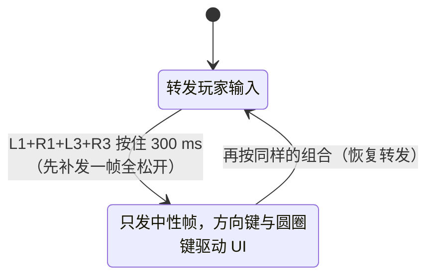
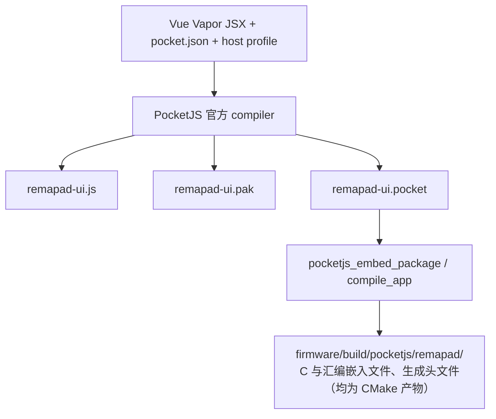
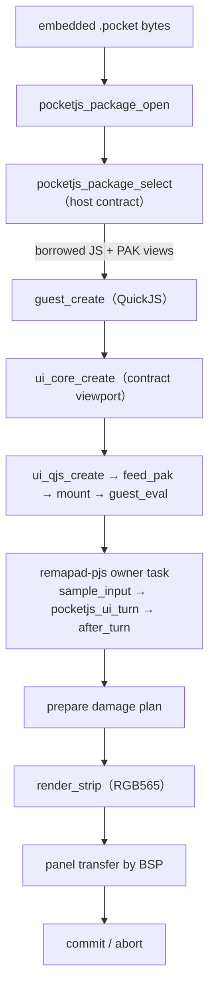

# Remapad 核心概念与领域抽象

本文档记录 Remapad 的两条数据路径：PocketJS 显示 UI 路径，以及 USB→NS2→BLE 控制器路径。PocketJS 包格式、C ABI、UI 输入编码和渲染指令不在项目内复制；
需要调整时应以 PocketJS 官方 schema、组件头文件和 ESP-IDF 示例为准。
NS2 协议内容见 [controller-switch2.md](controller-switch2.md)，PS 家族手柄数据见 [controller-ps.md](controller-ps.md)。

## 领域术语表

| 术语 | 含义 |
| :--- | :--- |
| **Pocket manifest** | `ui/pocket.json`，描述应用入口、框架、视口和 capability 要求。 |
| **Host profile** | `firmware/pocket.host.json`，描述设备实际提供的 ESP32-S3 host 能力和显示事实。 |
| **Pocket package** | `.pocket` 单文件包，包含 manifest 对应的构建计划、JavaScript、PAK 和目标 variant。由官方 CLI 生成，由 `pocketjs_package` 读取。 |
| **PAK** | PocketJS 资源包，承载样式、baked font atlas、图片等运行时资源。由 `pocketjs_ui_qjs_feed_pak` 提供给 binding。 |
| **Guest** | `pocketjs_guest` 创建的 QuickJS 执行环境，负责运行编译后的 JavaScript。 |
| **UI core** | `pocketjs_ui_core` 维护的 retained UI 节点、资源句柄、动画和 frame view。 |
| **UI binding** | `pocketjs_ui_qjs` 将 `globalThis.ui`、`globalThis.__pak` 和 UI turn 连接到 guest/core。 |
| **Damage region** | 一帧中需要重新光栅化的逻辑矩形；renderer 将其输出为 full-width RGB565 strip。 |
| **Host BSP** | 项目自己的 ESP-IDF 硬件层，负责面板、DMA、触控、按键、电源和其他外设。 |
| **USB input** | 由 ESP32 USB host 接收的外部输入报告，先进入产品数据面，不直接进入 PocketJS。 |
| **接收段（input/、usb/）** | 输入通路的第一段：桥接帧的编解码与串口分帧、USB-Serial/JTAG 的唯一读取者、USB host 枚举与 HID 收发，以及实现 `dp_source_t` 的桥接源与 USB 源。 |
| **处理段（pad/）** | 输入通路的第二段：家族布局表把各家手柄报告解析成私有格式 `pad_state_t`（按键按位置语义、摇杆归一、能力位）。 |
| **转换段（target/）** | 输入通路的第三段：目标编码器 `pad_target_t` 把私有格式编码成具体目标家族的报文，现役实现为 `target/ns2/`。 |
| **桥接帧** | PC 与设备之间的分帧载荷：帧头（`A5 5A` + 版本/类型/槽位/序号/长度）+ 载荷 + CRC16，与 CLI 文本共用一根 USB-Serial/JTAG；帧类型表见下文「输入通路」。 |
| **同代透传** | 设备自带的报告语言与目标语言一致时，把设备报文体原样交给目标发送（NS2 手柄 → NS2 主机），只重写由本机会话决定的状态字节；判定与取舍见 [ADR 0026](adr/0026-same-generation-input-passthrough.md)。 |
| **输出报告（反馈）** | 主机下发的震动 / 玩家灯 / 触觉采样经 `pad/feedback.c` 按设备布局行编码成该手柄的输出报告：USB host 直插写 OUT 端点，桥接路径把原始报告交给 PC 写回。布局与 HD 触觉的承载见 [controller-ps.md](controller-ps.md)，取舍见 [ADR 0042](adr/0042-ds5-audio-haptics-onboard-synthesis.md) 与 [ADR 0046](adr/0046-ns-waveform-to-ds5-pcm-hd-haptics.md)。 |
| **主机输出原始采集（capture）** | 诊断通道：主机写进输出特征值的原始字节在解析与编码之前经桥接帧 `0x12` 回传 PC 落盘；默认关闭，串口 `capture on|off` 开关，PC 侧 `--capture` / `:capture` 接住（[ADR 0045](adr/0045-host-output-raw-capture.md)）。 |
| **OTA 会话（ota/）** | 升级通道的固件侧：`ota_session` 负责帧队列、flash 写入与重启，`ota_proto` 是纯逻辑的序号判定与窗口应答；镜像写进非运行分区、校验通过后切启动分区（见 [ADR 0022](adr/0022-ota-over-bridge-frames-with-rollback.md) 与 [ARCHITECTURE.md](ARCHITECTURE.md) 的「OTA 升级通路」）。 |
| **NS2 report encoder** | 将私有手柄状态（`pad_state_t`）编码为目标 NS2 手柄的 USB/BLE 报告，位于 `firmware/main/target/ns2/`。 |
| **BLE controller peripheral** | 对 NS2 主机执行广播、GATT 服务、输入通知、输出命令和配对状态管理的 ESP32 外设角色。 |
| **Product control plane** | UI bridge 与固件控制面，用于低频状态、配置、配对操作和诊断；不承载高频输入报告。 |

## 应用清单与 host profile

应用和设备各自声明事实，官方 resolver 在构建时验证兼容性：



- `requires` 是应用运行所必需的能力，host 不提供时构建应失败。
- `enhances` 是应用可以利用但不应作为最低运行条件的能力。
- `capabilities` 只能填写固件确实会提供的能力。当前 Remapad profile 声明 `text.glyphs.baked`、`input.touch` 与 `input.buttons`；
  触摸能力随触摸 BSP（CST816T 采样，见 [ADR 0007](adr/0007-esp-lcd-panel-touch-bsp.md)）接入一并加入。
  按键能力自手柄组合键捕获（见 [ADR 0028](adr/0028-pad-combo-captures-screen.md)）起声明——组合键把十字键与圆圈键映射成官方按键位，模拟量仍不在 profile 中。
- profile 的 canonical hash 会进入构建计划和 package variant。
  运行时 `pocketjs_package_select` 会校验目标、ABI、tick、视口、density、presentation 和 profile hash。
- 当前设备的逻辑和物理视口均为 `240×280`。生成的 JavaScript bundle 可能仍包含官方 framework 的 `SCREEN_W = 480`、`SCREEN_H = 272` fallback 常量；
  它们不是设备 profile 的显示事实，也不应手动修改生成产物。
  ESP-IDF host 按 package contract 创建 `pocketjs_ui_core`，并通过 `globalThis.ui.__viewport` 发布 `240×280`；
  构建计划和运行时 frame 才是设备尺寸的校验依据。

触摸预览页可以在浏览器中提供真实触点，浏览器 host 与设备 host 各自把输入交给同一套框架语义：预览页把指针事件转换为触摸帧，设备端由 `drivers/touch.c` 把 CST816T 采样填入 `sample_input`。

## 控制器数据面

USB 到 NS2 BLE 的目标链路如下：



两条输入路径都已落地（PC 桥接走 USB-Serial/JTAG 的桥接帧，USB host 直插走 OTG host 的 HID 中断传输）。
在 `input/` 汇合之后共用 `pad/` 与 `target/` 两段，解析与映射只有一份；反馈方向同样收敛在 `pad/feedback.c` 一处（按设备布局行编码输出报告，USB 写 OUT 端点，桥接把原始报告交给 PC）。
同代透传的判定见 [ADR 0026](adr/0026-same-generation-input-passthrough.md)。
角色切换见 [ADR 0027](adr/0027-runtime-usb-role-switch.md)。

这条链路需要保持低延迟和确定性：

- USB 接收、解析、状态快照与 BLE 发送都用 ESP-IDF 原生驱动、任务和队列；NS2 报告编码按
  [controller-switch2.md](controller-switch2.md) 的型号、Report ID、摇杆打包与字节序实现。
- BLE manager 负责厂商广播字段、GATT service/characteristic、通知订阅、回连、唤醒与配对状态机。
  配对凭证（每条 6B 主机 MAC + 16B LTK，百字节级小 blob、仅配对成功时写一次）与 PHY 校准同住 NVS，
  按身份分槽、每身份保留最近 2 条，按 MAC 覆盖、配新主机是追加而非覆盖，因此不常驻「解除配对」入口；
  存储模型见 [controller-switch2.md](controller-switch2.md) 的「蓝牙配对信息区结构」。
- 广播状态位（厂商数据偏移 0x0B）是主机唯一的唤醒判据：`ns2_adv_payload()` 按信号组装参数成型三种形态，
  发现广播不带主机地址、状态 0x00，回连与唤醒广播携带最近一次会话记录到的对端地址（无记录时回退到最近一条非全零凭证）、状态 0x00 与 0x81；
  窗口经 `ns2_adv_window_open` 按「窗口时长 + 前置唤醒突发」打开，形态决策是
  `ns2_adv_choose_mode(paired, pairing_requested, window, now)` 纯函数，窗口到期未连接就彻底停发广播并关闭 BLE，
  等用户再按连接键（时长、诊断开关与取舍见 [ADR 0038](adr/0038-user-initiated-connection-window.md)）。
- 连接间隔由主机下发（常为 4 单位即 5 ms），固件只观测不主动请求：ESP32-S3 由
  `CONFIG_BT_CTRL_BLE_MIN_CONN_INTERVAL_ENABLE` 放行亚规范间隔，NimBLE 主机侧按规范拒绝 itvl < 6 的请求。
- 输入被主机采纳的门槛是 **0x0C/0x04（启用特性）**：未启用的链路即使 itvl=4 也不采纳输入，输入通知只在启用后发送，
  已订阅却迟迟不启用的会话由休眠看门狗断开重连（`ns2_adv_dormant_link()` 判定）。
- `0x0E` 运动数据长度必须非零，按 40 字节零值占位（板卡无 IMU）。
- 耳机状态（3.5 mm）由输入设备派生：`pad_state_t` 的 `headset_present` / `headset_mic` 经 NS2 目标的单一来源映射成
  `0x09` 偏移 `0x0D` 与 `0x05` 的耳机插入位，编码路径与同代透传路径共用；主机接受的档位与输入设备的字节偏移见
  [controller-switch2.md](controller-switch2.md) 与 [controller-ps.md](controller-ps.md)，
  取舍见 [ADR 0035](adr/0035-ns2-headset-state-passthrough.md)。

- flash 写入期间 cache 被禁用，而 PocketJS owner task 的栈在 PSRAM——从该任务直接执行任何 flash 写都会在禁缓存窗口访问 PSRAM 并触发 cache 异常重启。
  凭证等持久化写一律收敛到 `ble_creds` 的内部 RAM 栈写任务：各任务只更新内存表并投递快照，新增持久化需求沿用同一模式。
- `ui/src/bridge/` 与 `firmware/main/bridge/` 只承载低频的模式切换、配对开关、连接状态、电池与诊断：
  guest 侧经 `globalThis.__nativeBridge.postMessage(json)` 发命令，owner task 每帧用 `js_bridge_service()` 处理队列并回发应答与事件；
  入队出队都在 owner task 上（无锁），PWR 按键与串口 CLI 等非 owner task 上下文经 `js_bridge_submit_command` / `js_bridge_post_event` 的外部队列转移。
  命令与事件清单以 `ui/src/bridge/protocol.ts` 为准。
- **屏幕文案一律取自 ui/src 的字面量**，桥接只回状态与错误码、不回可上屏的文本：
  字体字符集按源码字面量扫描烘焙，固件回传的文本直接渲染就是豆腐块（联合类型 `PairingNotice` 把这条规则钉在类型上）。
- 玩家序号灯（主机 Command 0x09 下发的 4 位掩码）由 `ns2_session_player_leds()` 按活跃会话汇总，
  随 `systemStatus.playerLed` 与 `playerLedChanged` 事件供首页四格指示灯使用。
  用户设置（背光亮度、手柄四段配色、上报固件版本）由 `firmware/main/config/app_config.c` 持久化到 NVS（内部 RAM 栈提交任务，与 ble_creds 同一模式），开机恢复。
- USB 角色（`usbRole`：device = 插电脑 COM 口，host = 插手柄）在运行时真实切换，顺序与约束见
  [ARCHITECTURE.md](ARCHITECTURE.md) 的「USB 角色切换」；角色只在本次运行有效、不写 NVS。
- 底栏左区是 USB 模式指示：串口档电脑图标、手柄档手柄图标，图标与「USB 模式」页两张卡一一对应；
  对接对象没接上时换成同族的禁用字形、颜色降一档、标签写「未连接」——直插手柄接没接由 `usb_input_attached()`
  经 `padAttachedChanged` 推送（name 是家族机读短名，屏幕标签取自 ui/src 的字面量），
  PC 接没接由 USB-Serial/JTAG 的 SOF 监视经 `pcLinkChanged` 推送。
- 配对与连接状态接的是真实 BLE 会话（NimBLE 手柄外设）：配对页主按钮是连接键，广播中它发 `disconnect`（收窗口与流程、断开链路、静默）；
  副按钮配新主机走 `startPairing`（先断开当前主机再进发现广播等新主机搜索，凭证拿齐且会话注册完成才退出流程）；
  解除配对走显式 `unpair`（清 NVS 凭证并静默），UI 不暴露入口。
  已连接却停在握手等待态的主机（手机/PC 自动回连）由 3 秒无协议活动的空闲超时断开，主机连接地址是随机地址，不能按 OUI 识别。
  配对成功以协议证据判定（初始化握手完成、凭证匹配回连，或主机在链路上启用特性 0x0C/0x04），NVS 凭证只是重启后仍成立的持久化证据，两者独立；
  第三条证据覆盖主机换随机地址与主机已有凭证而不再重跑 0x15 两个现场，判据与用例见 `ns2_adv_host_registered()`；配对六态由此实时推导并经 `pairingStateChanged` 推送。
  协议与凭证的展开见 [controller-switch2.md](controller-switch2.md)，取舍见 [ADR 0010](adr/0010-nimble-ble-controller-stack.md)。
- 电池由 `battery.c` 真实采样（BAT_ADC=GPIO1 / ADC1_CH0，分压 3:1 还原 VBAT，静置电压—容量表折算百分比）；
  充电状态没有可测量的引脚，按电压趋势推断，限制见 [ADR 0020](adr/0020-battery-adc-sampling-and-charge-inference.md)。
- **设备对外只模拟一台 Pro Controller 2**（[ADR 0039](adr/0039-pro-controller-only.md)）：
  身份枚举 `ns2_identity_t` 只有 `NS2_ID_PRO`，单身份、单连接、单广播实例，
  报告格式固定 `0x09`（USB 模式 `0x05`），专用输入通道只注册 Pro 那一条（主机按自家型号查特征值 UUID 才决定订阅），会话往主机订阅的句柄发通知。
  主机只接受 public 地址的广播（本机派生的静态随机地址只留作串口 `advaddr` 对账），一台控制器只有一个 public 地址，左右分槽的 JoyCon 形态因此被移除；
  协议事实留在 [controller-switch2.md](controller-switch2.md) 的 GATT 属性表与广播过滤各节备查。
  配对凭证按 `ns2_identity_t` 分槽持久化（`ble_creds`，NVS v2 格式，旧单表记录迁移进 Pro 槽），分槽结构保留以备将来再加型号。
  序列号 / PID / 出厂块（0x13000）按连接身份提供；配色按「机身 / 按键 / 高光 / 握把」四段（`0xRRGGBB`）配置，对应出厂块 `0x13019` 起的布局，
  手柄设置页给四款预设、串口 `ctrl` 手工指定；改色等价于旧手柄断电、新手柄上电：断开现有连接、重算出厂块并直接打开连接窗口，
  主机照回连形态自己连回来读到新颜色（未配对时没有主机可回连，保持静默）。
  会话层面向连接分槽（最多 2 个），桥接命令 / 应答 / 通知都带连接上下文，并维护每槽的报告计数与链路快照（`ns2_session_status()`，串口 `link` 与日志取用）；
  `controllerConfig` 应答带 `addresses.pro`（显示序大写十六进制，host 未同步时为空串），手柄设置页的身份信息行取用它。
- 配对对外的心智模型是「设备不主动发信号，连接要按连接键」：开机与断开后都静默，按连接键才广播（已配对身份发回连形态等主机连回来、未配对身份进配对流程）；
  主机睡下时按 HOME 把它叫醒并自动回连。主机侧配对记录在首次连接握手时完成，用户不需要在屏幕上做任何确认动作；屏幕配对页用于观察状态、按连接键、配新主机或断开。
- 主机推送的手柄固件更新按「接住数据、逐帧应答、不重启」处理：`0x0018` 上的记录流按帧装配
  （`main/target/ns2/ns2_upgrade.c`，字节级用例在 `firmware/test/test_ns2_upgrade.c`），
  帧凑齐即按指令通道格式回一条空体应答，主机因此把整包推完；收尾的 `0x0d/0x07` 之后默认不重启——重启会被主机当成更新没生效而重推整包，
  串口 `fwapply on` 才一次性武装收尾重启。上报给主机的固件版本固化在 `main/config/app_config.h` 的 CONFIG_DEFAULT_FW_VERSION_*，
  串口 `fwver a.b.c` 可临时覆盖并就地重建出厂块。
  协议见 [controller-switch2.md](controller-switch2.md) 的「Command 0x0D - 手柄固件更新推送」，
  取舍见 [ADR 0032](adr/0032-ns2-fw-update-masquerade.md)。
- 调试注入是控制面进入数据面的唯一低频通道，采样与编码仍由数据面任务独立完成（`firmware/main/dp/dp_source.c`）：
  按键注入经 `dp_source_inject()` 叠加一次按下并按时长自动释放，摇杆注入经 `dp_source_inject_stick()` 给出持续电平（0-4095，两侧独立，未设定的一侧沿用输入源）；
  注入是合成的最后一步：按键叠加在合成按键上，设定过的摇杆覆盖合成摇杆。按键名表由 `dp_source_key_lookup()` 提供，串口 CLI 与主机端用例共用。
  HOME 按实体手柄语义分流（`ns2_adv_home_action()`）：主机在线时就是主页键，不在线时改成唤醒请求打开唤醒窗口——设备平时静默，这是唯一的叫醒路径；
  这条语义长在数据面上，因此实体手柄按 HOME 与调试页注入 HOME 是同一个动作，按钮文案跟着主机状态走。
  串口 `link` 按身份打印链路快照（`ns2_session_status()`）：对外广播地址、连接句柄、连接间隔（`itvl`，4 = 5 ms）、会话状态、报告格式、
  已开启的通知通道、特性启用位（`feat`）、已发送报告数、凭证条数与广播形态（`adv`）。
- 输入与输出已解耦成三段稳定接口（见 [ADR 0021](adr/0021-input-path-three-stage-layering.md)）：
  `dp/dp_source.h`、`pad/pad_state.h` 与 `target/target.h`。
  新增输入设备（桥接 PC、USB 手柄、调试注入）只需实现 `dp_source_t` 并注册：首个注册源拥有摇杆/扳机/触摸/运动/耳机状态/透传原始报文与设备标识字段，
  后续源叠加按键，调试注入最后叠加；合成只拷这些主源字段（`copy_primary_fields`），新增字段要一并加进去。
  目标侧 `target_send_pad()` 按注册的 `pad_target_t` 编码（现役 `target/ns2/`）。
- 反馈方向的完整链路：主机事件 → `pad_feedback_t` 持续帧 → `pad/feedback.c` 按设备布局行编码成输出报告
  （DS4 / DualSense / Xbox / DS3 / NS1 各一行，NS2 手柄原样吃主机的 LRA 参数包）。
  震动流是音频式连续包络（低频给冲击、高频给纹理），每颗马达按布局行的 `rumble_band` 跟带、振幅按 `rumble_max` 缩放；
  「在震」判据是 LRA 状态字使能位且归一强度高过载波电平，零幅度保活包与查找手柄页的载波包都不算在震。
  主机振幅是 NS2 LRA 的线性档位，送给 ERM 马达时经 `pad_rumble_perceived` 感知重映射（音色表、CLI 注入与 HD 的 PCM 波形不过表——音圈没有 ERM 死区）。
  采样是主机点播的声音（主机只发采样 ID，节奏与音色由 `pad/feedback.c` 的采样音色表给出）：输入设备有线接入时驱动板载蜂鸣器，
  声明 HD 触觉的设备按布局行 `hd` 规则把 NS 波形重整成振荡器声部，其余设备丢弃。
  写回按编码后的报告字节变化才发，同代透传的参数包原样在编码字节里；
  映射与承载见 [controller-ps.md](controller-ps.md)，取舍见 [ADR 0046](adr/0046-ns-waveform-to-ds5-pcm-hd-haptics.md)。
  DualSense 直插时反馈优先走音频触觉通道（板上合成或 PC 侧合成），音频接手期间 HID 报告的震动字段清零、玩家灯照常；
  玩家灯只落四颗白灯、灯条不驱动（写条会连帧重写玩家色并带淡出设置）。
  上报主机的电量跟输入设备走：家族表置 `PAD_CAP_BATTERY` 且本帧解出电量的设备经 `target_apply_pad_battery` 覆盖事实表后随报告上发，
  板载电池只在设备没报电量时兜底，0x05 报文专用的端电压字段按电压—容量表反演成名义值。
- amiibo 由软件模拟一张 NTAG215 标签：镜像经桥接帧上传落 storage 分区 SPIFFS 槽位（`amiibo/`，572 字节记录 = 镜像 + 厂商签名，200 槽，选中持久化、重启恢复），
  主机的 NFC 命令（Command 0x01）由 `target/ns2/ns2_nfc.c` 按协议布局应答；
  布局与命令细节见 [controller-switch2.md](controller-switch2.md) 的 NFC 章节。
- USB host 直插的数据面：`usb/usb_transport.c` 装 host 栈、枚举并按报告描述符挑手柄用途的 HID 接口，
  `usb/usb_input.c` 把 IN 报告组成 `pad_report_t` 交给同一份家族表并把反馈写回 OUT 端点；
  声明音频触觉能力的设备（DualSense）另由 `usb/usb_audio.c` 认领 UAC1 音频流 OUT 接口，持续向等时端点送板上合成的 4ch PCM（频道 3/4 音圈、1/2 小喇叭）；
  纯逻辑的描述符解析与 PCM 合成在 `usb_audio_parse.c` / `haptic_synth.c`（主机端可测）。
- 运动数据：布局行描述取样位置、样本数与轴映射（NS1 一次三份取最新一份），解析进 `pad_motion_t`；
  0x05 报文的 IMU 字段按 [controller-switch2.md](controller-switch2.md) 的偏移填真值，0x09 的 40 字节运动块结构未公开，
  因此只提供 CLI `motion 3` 的实验填充档。
- USB 高频输入不应经过 JSON bridge，也不应等待屏幕刷新或 JavaScript guest 执行。

数据面每拍的节奏收口在这一处：



投递条件：主机事件带哪些字段就覆盖哪些字段（震动与玩家灯是持续状态，回落到默认值会把刚点亮的玩家灯写灭）；
触觉采样只在带它的事件里更新、0x00 是停止，段边界不能只跟主机事件走——那会把采样音色的段量化到 64ms 的栅格，数据面再以 300ms 超时自灭兜底。
上报节奏定在 15 ms 的理由见 [ADR 0034](adr/0034-ns2-report-interval-fixed-15ms.md)。

## 输入通路：接收 / 处理 / 转换

输入通路按三段划分（取舍见 [ADR 0021](adr/0021-input-path-three-stage-layering.md)）：
`input/` 只把字节变成「原始报告 + 设备标识」，`pad/` 只把原始报告变成私有格式并收敛家族差异，`target/` 只把私有格式编码成目标报文。三段之间是单向数据流：
新增一种手柄只在 `pad/layouts/` 里加一行（新系列则加一个文件并登记），新增一个目标（例如将来的 NS1）只加一个 `pad_target_t` 实现。



私有格式是这条通路的接缝：上游只要能填出 `pad_state_t`（桥接 PC、将来的 USB host 直插、调试注入都一样），下游目标就不需要知道手柄从哪来。



- 按键位按位置固定、键名沿用 PS（`PAD_BTN_TRIANGLE` 上、`PAD_BTN_CIRCLE` 右、`PAD_BTN_CROSS` 下、`PAD_BTN_SQUARE` 左）：
  Xbox 与 Nintendo 的 A/B/X/Y 标签位置不同，用 PS 名可以避免「A 到底指哪个键」的混淆，家族表把各家的物理键填进对应位置；背键与静音键（目标侧作 C 键）用扩展位占位。
- 四轴与双扳机统一为 0-4095 整数、摇杆中位 2048，Y 轴统一成「上为正」，8% 死区在解析段套用并把剩余行程重新铺满；扳机保持模拟量，是否数字化由目标决定。
- `caps` 标注这一帧里哪些字段真的来自设备（运动、触摸板、模拟扳机、背键、麦克风、电池、震动）；型号未识别时回落 Xbox 布局并置 `PAD_CAP_FALLBACK_LAYOUT`，结果仍可用但字段可能错位。
- 触摸板按左右半区建模：一帧最多两个触点（DS4 与 DualSense 都是每点 4 字节——触点字节 bit7 为 0 表示有触点，其余三字节是 12 位 X 与 12 位 Y），
  按归一后的 X 分到 `touch[PAD_TOUCH_LEFT]` / `touch[PAD_TOUCH_RIGHT]`，同一半区保留先出现的那一路，归一值夹进 0-4095。
- 目标只消费自己 `caps` 范围内的字段：不在集合里的部分（IMU、触摸板、麦克风）不映射，能力集合变化时提示一次，不逐帧刷日志。
- 桥接帧与 CLI 文本共用一根 USB-Serial/JTAG：接收侧校验 CRC、失步时只丢一个字节继续扫描，非帧字节原样交回命令行解析，因此桥接跑着的时候串口 CLI 照常可用。
- 布局行现在分三组描述：输入字段（既有）、运动字段（`motion`）与输出（反馈）报告（`out`），外加设备自带的报告语言与期望身份（`native_lang` / `native_identity`）；
  同代透传的判定与状态字节重写见 [ADR 0026](adr/0026-same-generation-input-passthrough.md)。
  `out` 里的 `frame` 标出报告的收尾方式：PS 系的蓝牙形态要在末 4 字节补 CRC32（种子字节 0xA2 参与计算，见 `pad/feedback.c`），缺它的报告手柄整份都不接受（实机表现：写回成功、毫无反应）；
  `led_mask_map` 把主机玩家灯掩码落到设备自己的灯位模式（DualSense 的五颗灯是固定模式，1P 只有中灯、2P 中灯加外灯，不能直写主机掩码）；
  `audio_haptic` 声明设备带可驱动的音频触觉通道（DualSense 两种连接方式都有）：USB 直插时是 UAC 通道、由 `usb/usb_audio.c` 接管震动渲染，
  蓝牙接入时是 0x32/0x36 私有触觉流、由 PC 侧接管（默认启用）；
  `presets` 还承担手柄喇叭的路由：音频控制的输出路径位段要显式置成手柄喇叭（0x30）、前级 +6dB，
  并带上对应的更新使能位与音量档——不路由时内置喇叭处在未路由状态，发声段送进去全被丢掉（实机：0x36 触觉可达而喇叭无声）；
  `hd` 是 HD 触觉波形映射规则（承载采样率/峰值、两带频率落地范围与缺省、采样强震与发声频率、
  振幅增益 `gain_num/gain_den`——主机游戏内档位很小，DS5 两行按实机 A/B 取 4 倍，增益在写 FEEDBACK 帧之前落地；
  `ops = 0` 表示无 HD 通路）——
  NS 的震动是波形描述，映射在布局内完成（[ADR 0046](adr/0046-ns-waveform-to-ds5-pcm-hd-haptics.md)）。
  DualSense 的灯条不参与反馈：玩家号只上四颗白灯，灯条颜色留给 PC 侧管理——写条会连帧重写玩家色并带「淡出」设置，一震就变色、平时淡回默认白（实机撤出）；
  若真要在蓝牙上写灯条，设置与颜色必须同一帧（主机的连接动画会一直盖着灯），这条实机结论留档备用。
- 未登记的 VID/PID 仍回落 Xbox 有线布局并置 `PAD_CAP_FALLBACK_LAYOUT`；
  Nintendo 家族（VID `0x057E`）按系列文件 `pad/layouts/ns.c` 登记，NS2 的 0x05 / 0x09 报文体与 NS1 的 0x30 / 0x3F 各占一行，偏移同样先取自公开资料、待实机回填。

帧类型（固件侧定义在 `firmware/main/input/input_frame.h`，PC 端在 `pc/link.py` 镜像一份）：

| 类型 | 方向 | 载荷 |
| :--- | :--- | :--- |
| `0x01` ATTACH / `0x02` DETACH | PC → 设备 | 8 字节设备标识（家族 / 连接方式 / VID:PID / Report ID / 报告长度） |
| `0x10` REPORT | PC → 设备 | 设备标识 + 原始报告（最多 64 字节） |
| `0x11` OUT_REPORT | 设备 → PC | 要写回手柄的输出报告原始字节（首字节是 Report ID，最多 78 字节） |
| `0x12` HOST_RAW | 设备 → PC | 主机输出原始采集：通道字节（GATT 句柄低字节）+ 标志/长度（bit7 截断、低 7 位数据长度）+ 原始字节（最多 253）；帧头 slot 是设备侧记录号，跳号即队列满丢包。默认关闭，串口 `capture on` 打开 |
| `0x20` FEEDBACK | 设备 → PC | 左右震动使能与两带强度、玩家灯、触觉采样（原始采样 ID，仅日志展示）；16 字节版再带两带驱动频率落地值（u16 小端 ×4）；57 字节 HD 版再带固件按布局行重整出的时序子帧表（每侧有效子帧数 + 3×（低频频率 u16 LE + 低频增益 + 高频频率 u16 LE + 高频增益）+ 扬声器频率 u16 LE + 增益），PC 侧音频触觉与蓝牙私有流按它哑渲染；投递时机除主机事件外还看采样音色的段状态（幅度段 + 段音高）按 5ms tick 的变化——段由固件合成、主机只给采样 ID 与起停（查找手柄页约 15Hz），只跟主机事件投递会把段边界量化到 64ms 的栅格（震动/蜂鸣起止错位、短段丢失） |
| `0x30` OTA_BEGIN | PC → 设备 | `ROM1` + 镜像字节数（u32 小端） |
| `0x31` OTA_DATA | PC → 设备 | 块序号（u16 小端）+ 最多 200 字节镜像数据；帧内 `slot=1` 标记该窗口的末帧 |
| `0x32` OTA_END | PC → 设备 | 空 |
| `0x33` OTA_ACK | 设备 → PC | 状态 + 错误码 + 期望序号（u16 小端）+ 已收字节（u32 小端）；对 BEGIN 的应答末尾再附 16 字节运行版本 |
| `0x40` AMIIBO_BEGIN | PC → 设备 | 名称长度（u8）+ 名称（UTF-8，1-31 字节）+ 镜像字节数（u32 小端，必须是 540 或 572） |
| `0x41` AMIIBO_DATA | PC → 设备 | 偏移（u16 小端）+ 最多 200 字节镜像数据；偏移越过已收字节数报错，重复帧幂等 |
| `0x42` AMIIBO_END | PC → 设备 | 空 |
| `0x43` AMIIBO_ACK | 设备 → PC | 状态 + 错误码 + 已收字节（u32 小端）+ 槽位号（仅 DONE 有意义，0xFF 表示无） |
| `0x7F` PING | 双向 | 协议版本号（1 字节） |

解码器按线格式上限 255 字节收帧，报文帧仍按 72 字节语义校验（8 字节设备标识 + 最多 64 字节报告），
输出报告帧按 78 字节校验（DualSense / DualShock 4 的蓝牙输出报告长度）。
OTA 帧由 `input_link` 交给 `ota/ota_session`，amiibo 上传帧交给 `amiibo/amiibo_session`（逐帧回 ACK，
收齐后经 `amiibo_store` 落 storage 分区 SPIFFS 槽位），PING 由 `input_link` 直接应答，其余交给 `input_source`；
升级协议、流控与回滚门槛见 [ARCHITECTURE.md](ARCHITECTURE.md) 的「OTA 升级通路」。

PC 手柄到 NS2 主机的完整时序（映射表把家族差异收敛在 `pad/`，所以桥接路径与 USB host 直插路径共用后面两段）：



家族与目标的按键对应关系（按位置对齐，因此 Xbox 的物理 A 与 PS 的 Cross 都落在 `PAD_BTN_CROSS`、再到 `NS2_BTN_B`）：

| 私有格式（位置语义） | Xbox 物理键 | PS 物理键 | NS2 目标 |
| :--- | :--- | :--- | :--- |
| `PAD_BTN_CIRCLE`（○ 右） | B | Circle | `NS2_BTN_A` |
| `PAD_BTN_CROSS`（✕ 下） | A | Cross | `NS2_BTN_B` |
| `PAD_BTN_TRIANGLE`（△ 上） | Y | Triangle | `NS2_BTN_X` |
| `PAD_BTN_SQUARE`（□ 左） | X | Square | `NS2_BTN_Y` |
| `PAD_BTN_L1` / `PAD_BTN_R1` | LB / RB | L1 / R1 | `NS2_BTN_L` / `NS2_BTN_R` |
| `PAD_BTN_L3` / `PAD_BTN_R3` | 左右摇杆按下 | L3 / R3 | `NS2_BTN_LSTICK` / `NS2_BTN_RSTICK` |
| `PAD_BTN_TOUCHPAD`（左侧小键） | View（select） | SHARE / Create | `NS2_BTN_MINUS`（减号） |
| `PAD_BTN_OPT`（选项） | Menu | Options | `NS2_BTN_PLUS`（加号） |
| `PAD_BTN_HOME`（主页） | 西瓜键 | PS 键 | `NS2_BTN_HOME` |
| `PAD_BTN_SHARE`（分享类） | 分享键（Series 手柄） | 触摸板按下 | `NS2_BTN_CAPTURE`（截图） |
| `PAD_BTN_MUTE`（静音） | 无 | DualSense 静音键 | `NS2_BTN_C`（C 键） |
| `PAD_BTN_DPAD_*` | 十字键 | 十字键（帽子开关展开） | `NS2_BTN_DPAD_*` |
| `PAD_BTN_L4` / `PAD_BTN_L5` / `PAD_BTN_R4` / `PAD_BTN_R5` | 侧键 / 背键 | DualSense Edge 背键（L4 / R4） | `NS2_BTN_GL` / `NS2_BTN_GR`（同侧合并） |
| `PAD_TRIGGER_L2` / `PAD_TRIGGER_R2` 模拟量 ≥ 2048（50%） | LT / RT | L2 / R2 | `NS2_BTN_ZL` / `NS2_BTN_ZR` |
| `PAD_AXIS_LX` / `LY` / `RX` / `RY`（0-4095，中位 2048） | 左右摇杆（有符号 16 位） | 左右摇杆（单字节） | 12 位打包的摇杆字段 |

左侧小键与分享类两颗位同帧双置时只出减号（`ns2_from_pad` 折掉截图位）：串流虚拟手柄
（Sunshine/Moonlight）把一颗 View 键双写成 SHARE+触摸板按下以兼容 PC 游戏，直译会让
一次按键在主机侧同时点亮减号与截图。

DS4 / DS5 的触摸板按下可以改成加减键（「DS4、DS5 设置」页与串口 `ds` 命令，两项都持久化在 NVS，
见 [ADR 0047](adr/0047-ds-behavior-settings.md)）：「触摸板映射加减键」开着时按先触发的半区发
`PAD_BTN_TOUCHPAD`（减号）或 `PAD_BTN_OPT`（加号），「截图键」关掉时这一路改发减号、默认发截图。
两项都只在 PS 家族的触摸板按下位上生效，位置取不到时退回截图键那一档；
键位在按下那一刻定一次、按住期间不变，改写由 `pad/ds_behavior.c` 在数据面每拍完成。

家族表按系列拆在 `firmware/main/pad/layouts/` 下，契约与注册表是 `pad/layout.h` / `pad/layout.c`
（取舍见 [ADR 0025](adr/0025-pad-layout-modules-per-series.md)）。表按（家族、Report ID、连接方式、PID）定位偏移：
PS 系的 DS3、DS4 与 DualSense 有线都报 0x01，同一个 Report ID 下按 PID 分行；
各行偏移的取值与核对状态列在 [controller-ps.md](controller-ps.md) 的「核对状态」，Steam 原生布局整族走 Xbox 兜底并在能力位里标记。

手柄组合键 L1+R1+L3+R3 按住 300 ms 会捕获输入、转为屏幕操控（[ADR 0028](adr/0028-pad-combo-captures-screen.md)）：
判定在私有格式层完成（`firmware/main/dp/dp_ui.c`），家族表只需要把 L1/R1/L3/R3 映射到 `PAD_BTN_L1/R1/L3/R3`，既有与将来的布局都自动可用。
dp_task 在捕获的那一刻先向主机补发一帧全松开（清掉 `raw_len` 与 `native_lang`，避免同代透传把旧按键带过去），
其后按原来的上报节奏续发同一份中性帧——主机按稳定不跳号的上报流判断链路健康，整段停发会被它判成手柄离线。
玩家输入从捕获起一点不上行，同时十字键与圆圈键映射成 PocketJS 按键位，经 owner task 的 `sample_input` 交给 UI。



UI 侧把各页与底栏的 `focusable` 绑在「自己是当前页、且没有弹窗盖住」上（`interactive` 由 `ui/src/App.tsx` 往下传），
`hooks/usePadControl.ts` 只管操控窗口与非操控状态下的焦点清理；框架的遍历因此只含画面上的控件，圆圈键与触摸点按汇入同一个 onPress 入口。
模式状态经 `systemStatus.padUiMode` 与 `padUiModeChanged` 事件同步到 bridge，调试页、串口 `ui [on|off]` 与 `key ui` 都能在不插手柄时进出。

## UI 图元与资源

`ui/src/App.tsx` 使用 PocketJS Vue Vapor 的 `<View>`、`<Text>` 和 `<Image>` 等图元：

- `<View>` 提供嵌入式布局、背景、边框、间距和 focusable 交互。
- `<Text>` 使用构建期收集的字符集和 baked font atlas；字号应使用 PocketJS 支持的 Tailwind 插槽。
  Inter 未映射的码点（中文等）经应用目录 `fonts.json` 声明的回退字体面（当前为 Noto Sans SC）烘焙进同一图集。
- `<Image>` 通过资源名称引用 PAK 中的图像；图片在构建期处理，不在 ESP32 上解析 SVG。
  应用目录 `images.json` 可按资源名声明 `psm`（`0` 是 PSM_5650，缺省 `3` 是 8888）：
  不透明的底图声明成 565 才能在设备上走本机直拷回调，带透明通道的位图只能逐像素混合（见 [ADR 0051](adr/0051-opaque-565-card-artwork.md)）。
- `createSpriteAnimation` 只描述资源帧选择，实际资源仍由官方编译器和 PAK 管理。
- 长文案放不进可视区时用 `ui/src/components/MarqueeText.tsx`（自定义横向滚动文本）：
  框架的单行 `Text` 不自动换行，组件按「静止 2 秒 → 匀速左移到底 → 到底停留 1 秒 → 跳回起点」循环，放得下则全程静止；
  可视宽度由调用方以逻辑像素传入（框架不回读布局），滚动相位取 `virtualNow()`，文本宽度经 `getOps().measureText(text, slot)` 量取，宿主不提供该操作时退回静态文本。
- 页面组织：`ui/src/App.tsx` 在首次渲染里一次挂完八个页面，首屏（第一次 commit）只在全部建树完成后提交，
  等待期由固件启动画面覆盖（选型见 [ADR 0016](adr/0016-mount-all-pages-before-first-frame.md)）。
  App 没有页面容器层也没有待挂队列，切页由每个页面根节点翻转 `hidden`（`props.active()`）完成；
  轮播顺序来自 App 顶部的页表（`PAGE_KEYS`，槽位由数组位置推出，各页按页名 `slot('…')` 取），新增页面在页表里加一项并写好 JSX。
- 同页会来回切换的状态用 `hidden` 收起而不是条件渲染：每行就是一个文本节点，标签与值同节点、省掉行容器。
  运行期增删节点很贵，因此 JSX 里的 `.map(...)` 不能读响应式状态——列表取自模块级常量，可变字段留给子组件按属性绑定
  （模式页 `ModeCard`、手柄设置页的身份信息行都是这个写法）。切换类样式也不要带 `transition-*`：过渡期间该区域每帧都要重画，观感是慢半拍。
- 滚动页在滚动列末尾放 `components/BottomPlaceholder.tsx` 垫高（`BOTTOM_PAD_H`）；页面内容高度由各页静态估算后传给 `usePageScroll`
  （框架不回读布局），估算误差由垫高的余量吸收。页面能否滚动由调用方一次声明（`usePageScroll(active, scrollable, contentH)`）；
  滚动边界硬夹住（`overscroll: 0`），抛掷落点越界的会被改写成到边界的补间。全应用只注册一个纵向手势，识别区域由当前接管滚动的页面给出：
  非当前页或不可滚动的页让 region 返回 null，本帧不接管新触点（官方优先级即注册顺序，逐页注册会互相抢 claim，dispose 重注册又会取消进行中的触点）。

入口保持官方 Vue Vapor 形式：

```jsx
import { mount } from '@pocketjs/framework/vue-vapor';
import Hero from './App';

mount(() => <Hero />);
```

固件 `pocketjs_ui_qjs_mount` 会在应用 eval 前安装 `globalThis.ui` 和 `globalThis.__pak`；应用入口不再手动传入 PAK，也不依赖私有 prelude。

## 构建产物映射



`firmware/build/pocketjs/remapad/` 中的 C/汇编嵌入文件和生成头文件都是 CMake 产物。项目不应再出现手写的 PCKT 解析、字节数组或 `app_pocket.h` 同步脚本。

## ESP-IDF 运行时生命周期

`firmware/main/pocketjs_host.c` 使用官方 C API，顺序与官方 ESP-IDF smoke 示例保持一致，但创建、mount、eval 和逐帧 turn 都在同一个产品 task 上完成：



包中的 JavaScript 和 PAK 都是借用视图，必须在 guest、binding 和 package 销毁前保持可读。
生成的 package header/assembly 由 CMake 管理，因此不会发生 UI 与固件手动复制不一致的问题。

## 输入抽象

官方 `pocketjs_ui_input_t` 是一次 UI turn 的输入快照，包含：

- `buttons`：设备按键位图。
- `analog_x`、`analog_y`：左模拟量。
- `touches`、`touch_count`：当前触点数组。

输入采样属于 host/BSP，不属于 PocketJS 应用包。当前实现由 owner task 的 `sample_input` 回调填三样：
按键取自数据面的手柄操控映射（`dp_ui_buttons()`，只在组合键捕获期间非零，含十字键、圆圈键与肩键等价出的左 / 右，见 [ADR 0028](adr/0028-pad-combo-captures-screen.md)）。
模拟量恒为零。
触点由 CST816T 采样转换为官方 `pocketjs_ui_touch_t` 触点数组。
息屏（背光关闭）期间 `sample_input` 整段跳过触摸采样：画面不可见，触点只剩误触，
亮屏由 PWR 键或命令承担、触摸不参与唤醒。
CST816T 是单点触摸，触点 `id` 在同一按压期间恒为 0，坐标使用逻辑像素且受官方绑定的 9 位量程约束（每轴 511 以内），板卡引脚见 [hardware.md](hardware.md)。
USB→NS2 的高频状态应留在产品数据面，不应为了驱动 UI 而重新设计 PocketJS runtime 的输入协议。

## 渲染抽象

官方 RGB565 renderer 的职责是从 UI frame view 生成像素，不负责面板控制：

1. `pocketjs_rgb565_prepare` 生成 damage plan 并开始目标事务。
2. 对每个逻辑 damage region，分配或复用一个 full-width、region-height 的 RGB565 strip。
3. `pocketjs_rgb565_render_strip` 将 strip 写入调用方提供的缓冲区；容量必须精确匹配物理宽度乘以 region 高度。
4. BSP 将 strip 传给面板 DMA，所有传输成功后调用 `pocketjs_rgb565_commit`。
5. 任一渲染或传输失败时调用 `pocketjs_rgb565_abort`，不要提交不完整帧。

ESP32-S3 没有本项目使用的 P4 PPA 加速器，因此 renderer 使用官方软件 RGB565 路径。当前仓库只验证 strip 生成和事务，不宣称已经完成 ST7789 传输。

## 调度抽象

当前由产品自己的 `remapad-pjs` owner task 承担调度：它按 host profile 的 `tickHz` 驱动 UI turn，同时承载 guest 的创建、mount 和 eval，
只负责调度、输入采样回调与帧消费，不拥有输入驱动或显示设备。**创建 guest 的任务与执行 UI turn 的任务必须是同一个**，
且任务栈容量必须大于 guest 的 `stack_limit`；栈预算的推导与不接入官方 `pocketjs_runner` 的原因见
[ARCHITECTURE.md](ARCHITECTURE.md) 的「为什么由产品 task 承载 guest 生命周期」。
QuickJS 的栈守卫以下限 `stack_top - stack_size` 判断溢出，而 `stack_top` 取自创建 runtime 时的栈指针（`JS_UpdateStackTop` 未被调用），
turn 换到别的任务执行时守卫量的是别人的栈、溢出不会被拦截。

## 硬件扩展边界

新增外设（面板、触控、按键与模拟量、USB host、BLE、背光、电池）直接用 ESP-IDF 或对应官方驱动，在对应的 BSP / 数据面边界接入：
面板与触控归 `drivers/`，USB 与音频触觉归 `usb/`，BLE 归 `ble/`，各自的约束写在对应目录的文件头。
BSP 提供的事实经 [hardware.md](hardware.md) 记录，需要暴露给 UI 的能力再映射到 host profile 的 capabilities——
没有真实硬件事实时，不在 UI manifest 或 host profile 中提前声明。
协议字段与配对流程见 [controller-switch2.md](controller-switch2.md)，文档里的实验性结论不等于已完成的互操作保证。
