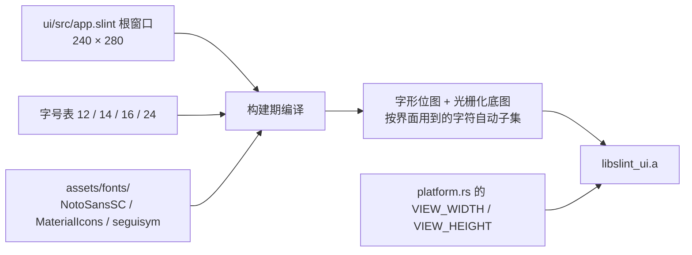
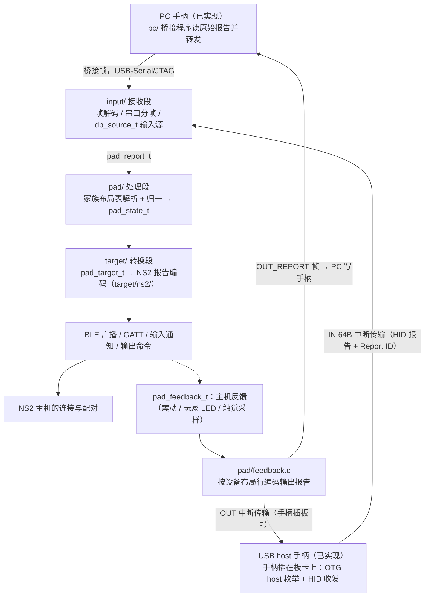
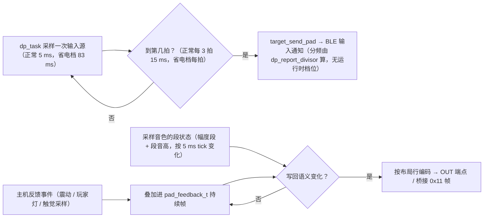
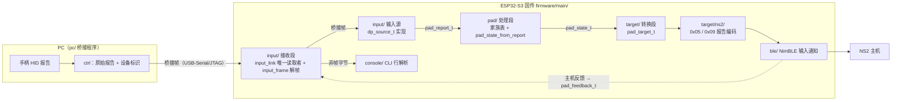
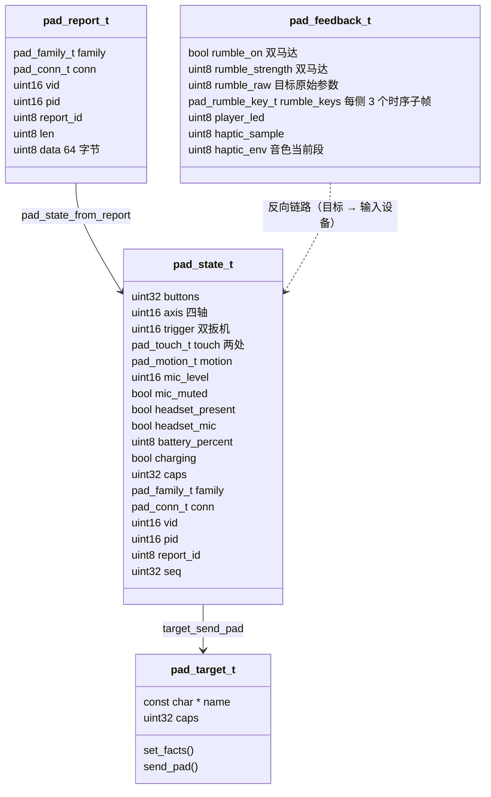
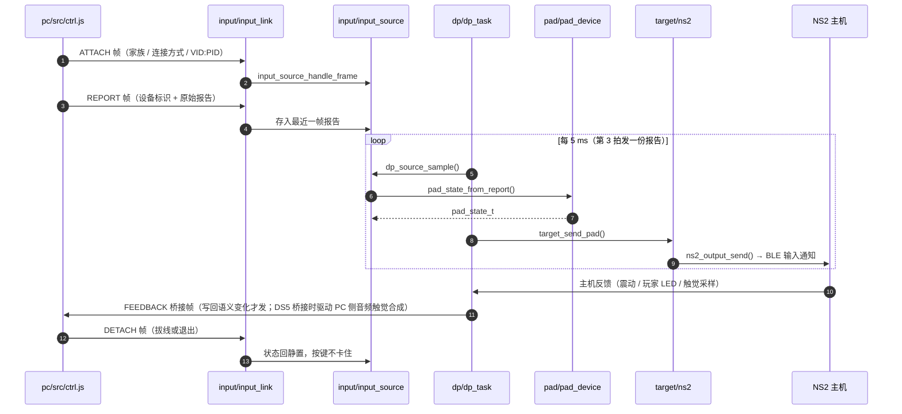
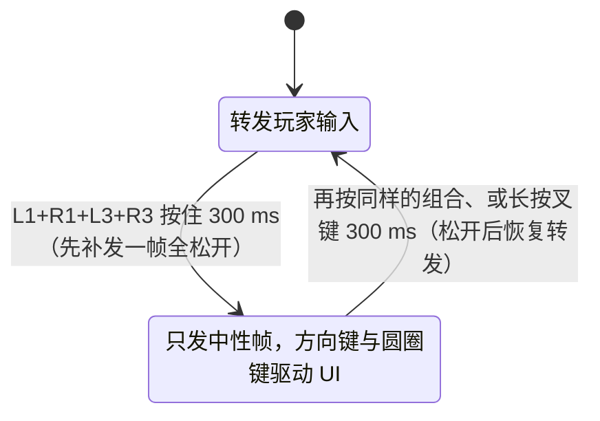

# Remapad 核心概念与领域抽象

本文档记录 Remapad 的屏幕 UI 与控制器数据面核心抽象与契约。

## 领域术语表

| 术语 | 含义 |
| :--- | :--- |
| **界面组件** | 界面基本视图单元，`App` 为根组件。 |
| **字形烘焙** | 构建期按字号表（12/14/16/24）将界面字符生成位图，运行时不解析矢量字体。 |
| **字符集锚点** | `app.slint` 中的静态文本，用于将运行时拼装文本的码点预置到烘焙字符集。 |
| **Damage 区域** | 单帧内失效元素的外包围矩形，由平台切分为 48 行行带分次提交。 |
| **状态快照 / 动作回调** | 固件核心与 UI 之间的契约：固件周期性写入快照，UI 通过动作回调分发控制。 |
| **接收段（input/、usb/）** | 输入通路入口，负责分帧解码、USB Host 枚举与报告接收。 |
| **处理段（pad/）** | 输入通路中间层，解析原始报告并归一化为统一格式 `pad_state_t`。 |
| **转换段（target/）** | 输入通路出口，将统一格式编码为目标手柄协议（NS2 报文）。 |
| **桥接帧** | PC 与设备之间通信的数据帧：包含帧头、类型、载荷与 CRC16。 |
| **输出反馈** | 主机下发给手柄的震动、玩家指示灯及触觉数据，编码为手柄输出报告后发回。 |
| **OTA 会话** | 固件升级会话，包含协议解析、数据流控、写入与回滚校验。 |

## 界面契约：视口、字号与字体

界面的编译口径收在 `ui/build-support` 一处（宿主用例包与固件组件的 `build.rs` 共用）：

```mermaid
flowchart LR
    View["ui/src/app.slint 根窗口<br/>240 × 280"] --> Compile["构建期编译"]
    Sizes["字号表 12 / 14 / 16 / 24"] --> Compile
    Fonts["assets/fonts/<br/>NotoSansSC / MaterialIcons / seguisym"] --> Compile
    Compile --> Glyphs["字形位图 + 光栅化底图<br/>按界面用到的字符自动子集"]
    Glyphs --> Lib["libslint_ui.a"]
    Platform["platform.rs 的 VIEW_WIDTH / VIEW_HEIGHT"] --> Lib
```

- **视口规格**：分辨率固定 240 × 280。
- **字号规格**：提供 12 / 14 / 16 / 24 像素四档字号。
- **字体与子集**：正文采用 NotoSansSC，图标采用 MaterialIcons；构建期自动提取使用到的字符子集烘焙为位图。

## 控制器数据面

USB 到 NS2 BLE 的目标链路如下：

```mermaid
flowchart TB
    Bridge["PC 手柄（已实现）<br/>pc/ 桥接程序读原始报告并转发"]
    Host["USB host 手柄（已实现）<br/>手柄插在板卡上：OTG host 枚举 + HID 收发"]
    Recv["input/ 接收段<br/>帧解码 / 串口分帧 / dp_source_t 输入源"]
    Parse["pad/ 处理段<br/>家族布局表解析 + 归一 → pad_state_t"]
    Encode["target/ 转换段<br/>pad_target_t → NS2 报告编码（target/ns2/）"]
    Ble["BLE 广播 / GATT / 输入通知 / 输出命令"]
    Session["NS2 主机的连接与配对"]
    Feedback["pad_feedback_t：主机反馈（震动 / 玩家 LED / 触觉采样）"]
    FbEnc["pad/feedback.c<br/>按设备布局行编码输出报告"]

    Bridge -->|"桥接帧，USB-Serial/JTAG"| Recv
    Host -->|"IN 64B 中断传输（HID 报告 + Report ID）"| Recv
    Recv -->|pad_report_t| Parse
    Parse --> Encode
    Encode --> Ble
    Ble --> Session
    Ble -.-> Feedback
    Feedback --> FbEnc
    FbEnc -->|"OUT 中断传输（手柄插板卡）"| Host
    FbEnc -->|"OUT_REPORT 帧 → PC 写手柄"| Bridge
```

- **手柄身份与报告**：对外模拟 Pro Controller 2（`NS2_ID_PRO`），报告格式固定为 `0x09`。
- **广播与连接**：未连接常态静默；连接窗口下广播 0x00 回连帧，支持 0x81 唤醒突发。长时间空闲关闭 BLE 栈。
- **输入生效门槛**：主机在 GATT 通道启用特性（0x0C/0x04）后方发送输入通知。
- **凭证存储**：配对凭证按身份槽位保存至 NVS，每身份保留最近 2 条记录。
- **主机反馈回写**：主机下发的马达震动、玩家指示灯与触觉采样按布局表编码为对应手柄的输出报告。
- **音频触觉**：DualSense 支持通过板载合成或 PC 侧合成经等时音频通道驱动触觉音圈。
- **amiibo 仿真**：模拟 NTAG215 标签（572B 记录格式），支持 200 槽位 SPIFFS 存储。
- **调试与按键分流**：支持按键与摇杆低频注入；HOME 键在未连接状态下转换为唤醒广播请求。

数据面每拍的节奏收口在这一处：

```mermaid
flowchart LR
    Sample["dp_task 采样一次输入源（正常 5 ms，省电档 83 ms）"] --> Send{"到第几拍？（正常每 3 拍 15 ms，省电档每拍）"}
    Send -->|"是"| Report["target_send_pad → BLE 输入通知（分频由 dp_report_divisor 算，无运行时档位）"]
    Send -->|"否"| Sample
    Host["主机反馈事件（震动 / 玩家灯 / 触觉采样）"] --> Merge["叠加进 pad_feedback_t 持续帧"]
    Tone["采样音色的段状态（幅度段 + 段音高，按 5 ms tick 变化）"] --> Deliver
    Merge --> Deliver{"写回语义变化？"}
    Deliver -->|"是"| Out["按布局行编码 → OUT 端点 / 桥接 0x11 帧"]
    Deliver -->|"否"| Merge
```

投递条件：主机事件带哪些字段就覆盖哪些字段（震动与玩家灯是持续状态，回落到默认值会把刚点亮的玩家灯写灭）；
触觉采样只在带它的事件里更新、0x00 是停止，段边界不能只跟主机事件走——那会把采样音色的段量化到 64ms 的栅格，数据面再以 300ms 超时自灭兜底。

节拍与分频收在 `dp/dp_power.c` 一处（纯逻辑，主机端用例在 `firmware/test/test_dp_power.c`）：
BLE 栈关闭即省电档，数据面采样与上报、界面状态轮询与动画推进一起降到 12 fps 等效（83 ms）；
此时没有可上报的链路，慢下来的只是调试注入与手柄驱动的屏幕操控。

## 输入通路：接收 / 处理 / 转换

输入通路按三段划分：
`input/` 只把字节变成「原始报告 + 设备标识」，`pad/` 只把原始报告变成私有格式并收敛家族差异，`target/` 只把私有格式编码成目标报文。三段之间是单向数据流：
新增一种手柄只在 `pad/layouts/` 里加一行（新系列则加一个文件并登记），新增一个目标（例如将来的 NS1）只加一个 `pad_target_t` 实现。

```mermaid
flowchart LR
    subgraph PC["PC（pc/ 桥接程序）"]
        HID["手柄 HID 报告"] --> BR["ctrl：原始报告 + 设备标识"]
    end

    BR -- "桥接帧（USB-Serial/JTAG）" --> LINK

    subgraph FW["ESP32-S3 固件 firmware/main/"]
        LINK["input/ 接收段<br/>input_link 唯一读取者 + input_frame 解帧"]
        SRC["input/ 输入源<br/>dp_source_t 实现"]
        CLI["console/ CLI 行解析"]

        LINK -- "非帧字节" --> CLI
        LINK -- "桥接帧" --> SRC
        SRC -- "pad_report_t" --> DEV["pad/ 处理段<br/>家族表 + pad_state_from_report"]
        DEV -- "pad_state_t" --> TGT["target/ 转换段<br/>pad_target_t"]
        TGT --> NS2["target/ns2/<br/>0x05 / 0x09 报告编码"]
        NS2 --> BLE["ble/ NimBLE 输入通知"]
        BLE -. "主机反馈 → pad_feedback_t" .-> LINK
    end

    BLE --> HOST["NS2 主机"]
```

私有格式是这条通路的接缝：上游只要能填出 `pad_state_t`（桥接 PC、将来的 USB host 直插、调试注入都一样），下游目标就不需要知道手柄从哪来。

```mermaid
classDiagram
    class pad_report_t {
        pad_family_t family
        pad_conn_t conn
        uint16 vid
        uint16 pid
        uint8 report_id
        uint8 len
        uint8 data 64 字节
    }

    class pad_state_t {
        uint32 buttons
        uint16 axis 四轴
        uint16 trigger 双扳机
        pad_touch_t touch 两处
        pad_motion_t motion
        uint16 mic_level
        bool mic_muted
        bool headset_present
        bool headset_mic
        uint8 battery_percent
        bool charging
        uint32 caps
        pad_family_t family
        pad_conn_t conn
        uint16 vid
        uint16 pid
        uint8 report_id
        uint32 seq
    }

    class pad_target_t {
        const char * name
        uint32 caps
        set_facts()
        send_pad()
    }

    class pad_feedback_t {
        bool rumble_on 双马达
        uint8 rumble_strength 双马达
        uint8 rumble_raw 目标原始参数
        pad_rumble_key_t rumble_keys 每侧 3 个时序子帧
        uint8 player_led
        uint8 haptic_sample
        uint8 haptic_env 音色当前段
    }

    pad_report_t --> pad_state_t : pad_state_from_report
    pad_state_t --> pad_target_t : target_send_pad
    pad_feedback_t ..> pad_state_t : 反向链路（目标 → 输入设备）
```

- **位置语义按键**：按键统一映射至几何位置（上/下/左/右），避免不同厂商手柄字母标签混淆。
- **摇杆与扳机归一化**：摇杆轴与模拟扳机归一化为 0-4095 整数（中位 2048），预置 8% 死区。
- **能力集标识 (`caps`)**：标识当前帧包含的有效硬件特性（运动、触摸、模拟扳机、背键等）。

帧类型（固件侧定义在 `firmware/main/input/input_frame.h`，PC 端在 `pc/src/link/frame.js` 镜像一份）：

| 类型 | 方向 | 载荷 |
| :--- | :--- | :--- |
| `0x01` ATTACH / `0x02` DETACH | PC → 设备 | 8 字节设备标识（家族 / 连接方式 / VID:PID / Report ID / 报告长度） |
| `0x10` REPORT | PC → 设备 | 设备标识 + 原始报告（最多 78 字节） |
| `0x11` OUT_REPORT | 设备 → PC | 要写回手柄的输出报告原始字节（首字节是 Report ID，最多 78 字节） |
| `0x12` HOST_RAW | 设备 → PC | 主机输出原始采集：通道字节（GATT 句柄低字节）+ 标志/长度（bit7 截断、低 7 位数据长度）+ 原始字节（最多 253）；帧头 slot 是设备侧记录号，跳号即队列满丢包。默认关闭，串口 `capture on` 打开 |
| `0x20` FEEDBACK | 设备 → PC | 左右震动使能与两带强度、玩家灯、触觉采样（原始采样 ID，仅日志展示）；16 字节版再带两带驱动频率落地值（u16 小端 ×4）；57 字节 HD 版再带固件按布局行重整出的时序子帧表（每侧有效子帧数 + 3×（低频频率 u16 LE + 低频增益 + 高频频率 u16 LE + 高频增益）+ 扬声器频率 u16 LE + 增益），PC 侧音频触觉与蓝牙私有流按它哑渲染；投递时机除主机事件外还看采样音色的段状态（幅度段 + 段音高）按 5ms tick 的变化——段由固件合成、主机只给采样 ID 与起停（查找手柄页约 15Hz），只跟主机事件投递会把段边界量化到 64ms 的栅格（震动/蜂鸣起止错位、短段丢失） |
| `0x30` OTA_BEGIN | PC → 设备 | `ROM1` + 镜像字节数（u32 小端） |
| `0x31` OTA_DATA | PC → 设备 | 块序号（u16 小端）+ 最多 200 字节镜像数据；帧内 `slot=1` 标记该窗口的末帧 |
| `0x32` OTA_END | PC → 设备 | 空 |
| `0x33` OTA_ACK | 设备 → PC | 状态 + 错误码 + 期望序号（u16 小端）+ 已收字节（u32 小端）；对 BEGIN 的应答末尾再附 16 字节运行版本 |
| `0x40` AMIIBO_BEGIN | PC → 设备 | 名称长度（u8）+ 名称（UTF-8，1-31 字节）+ 镜像字节数（u32 小端，必须是 540 或 572） |
| `0x41` AMIIBO_DATA | PC → 设备 | 偏移（u16 小端）+ 最多 200 字节镜像数据；偏移越过已收字节数报错，重复帧幂等 |
| `0x42` AMIIBO_END | PC → 设备 | 空 |
| `0x43` AMIIBO_ACK | 设备 → PC | 状态 + 错误码 + 已收字节（u32 小端）+ 槽位号（仅 DONE 有意义，0xFF 表示无） |
| `0x7F` PING | 双向 | 协议版本号（1 字节） |

解码器按线格式上限 255 字节收帧；PC → 设备报文帧按 86 字节语义校验（8 字节设备标识
+ 最多 78 字节报告，上限取 DS5 蓝牙 0x31 报告），设备 → PC 的输出报告帧按 78 字节校验
（DualSense / DualShock 4 的蓝牙输出报告长度）。
OTA 帧由 `input_link`（串口）与 `netlog`（WiFi UDP）经 `ota/ota_link` 同一个适配交给 `ota/ota_session` 核心，
ACK 跟进帧通道单路回发；amiibo 上传帧只走串口、交给 `amiibo/amiibo_session`（逐帧回 ACK，
收齐后经 `amiibo_store` 落 storage 分区 SPIFFS 槽位），PING 由 `input_link` 直接应答，其余交给 `input_source`；
升级协议、流控与回滚门槛见 [ARCHITECTURE.md](ARCHITECTURE.md) 的「OTA 升级通路」。

PC 手柄到 NS2 主机的完整时序（映射表把家族差异收敛在 `pad/`，所以桥接路径与 USB host 直插路径共用后面两段）：

```mermaid
sequenceDiagram
    autonumber
    participant PC as pc/src/ctrl.js
    participant RECV as input/input_link
    participant SRC as input/input_source
    participant DP as dp/dp_task
    participant DEV as pad/pad_device
    participant TGT as target/ns2
    participant HOST as NS2 主机

    PC->>RECV: ATTACH 帧（家族 / 连接方式 / VID:PID）
    RECV->>SRC: input_source_handle_frame
    PC->>RECV: REPORT 帧（设备标识 + 原始报告）
    RECV->>SRC: 存入最近一帧报告
    loop 每 5 ms（第 3 拍发一份报告）
        DP->>SRC: dp_source_sample()
        SRC->>DEV: pad_state_from_report()
        DEV-->>SRC: pad_state_t
        DP->>TGT: target_send_pad()
        TGT->>HOST: ns2_output_send() → BLE 输入通知
    end
    HOST->>DP: 主机反馈（震动 / 玩家 LED / 触觉采样）
    DP->>PC: FEEDBACK 桥接帧（写回语义变化才发；DS5 桥接时驱动 PC 侧音频触觉合成）
    PC->>RECV: DETACH 帧（拔线或退出）
    RECV->>SRC: 状态回静置，按键不卡住
```

家族与目标的按键对应关系（按位置对齐，因此 Xbox 的物理 A 与 PS 的 Cross 都落在 `PAD_BTN_CROSS`、再到 `NS2_BTN_B`）：

| 私有格式（位置语义） | Xbox 物理键 | PS 物理键 | NS2 目标 |
| :--- | :--- | :--- | :--- |
| `PAD_BTN_CIRCLE`（○ 右） | B | Circle | `NS2_BTN_A` |
| `PAD_BTN_CROSS`（✕ 下） | A | Cross | `NS2_BTN_B` |
| `PAD_BTN_TRIANGLE`（△ 上） | Y | Triangle | `NS2_BTN_X` |
| `PAD_BTN_SQUARE`（□ 左） | X | Square | `NS2_BTN_Y` |
| `PAD_BTN_L1` / `PAD_BTN_R1` | LB / RB | L1 / R1 | `NS2_BTN_L` / `NS2_BTN_R` |
| `PAD_BTN_L3` / `PAD_BTN_R3` | 左右摇杆按下 | L3 / R3 | `NS2_BTN_LSTICK` / `NS2_BTN_RSTICK` |
| `PAD_BTN_TOUCHPAD`（左侧小键） | View（select） | SHARE / Create | `NS2_BTN_MINUS`（减号） |
| `PAD_BTN_OPT`（选项） | Menu | Options | `NS2_BTN_PLUS`（加号） |
| `PAD_BTN_HOME`（主页） | 西瓜键 | PS 键 | `NS2_BTN_HOME` |
| `PAD_BTN_SHARE`（分享类） | 分享键（Series 手柄） | 触摸板按下 | `NS2_BTN_CAPTURE`（截图） |
| `PAD_BTN_MUTE`（静音） | 无 | DualSense 静音键 | `NS2_BTN_C`（C 键） |
| `PAD_BTN_DPAD_*` | 十字键 | 十字键（帽子开关展开） | `NS2_BTN_DPAD_*` |
| `PAD_BTN_L4` / `PAD_BTN_L5` / `PAD_BTN_R4` / `PAD_BTN_R5` | 侧键、精英手柄 2 的背键 P1-P4 | DualSense Edge 背键（L4 / R4） | `NS2_BTN_GL` / `NS2_BTN_GR`（同侧合并） |
| `PAD_TRIGGER_L2` / `PAD_TRIGGER_R2` 模拟量 ≥ 2048（50%） | LT / RT | L2 / R2 | `NS2_BTN_ZL` / `NS2_BTN_ZR` |
| `PAD_AXIS_LX` / `LY` / `RX` / `RY`（0-4095，中位 2048） | 左右摇杆（有符号 16 位） | 左右摇杆（单字节） | 12 位打包的摇杆字段 |

- **虚拟双写折叠**：串流虚拟手柄同时上报 View 与 Share 时折叠为减号键。
- **DS4/DS5 触摸板映射**：支持按左/右半区映射为减号/加号，或映射为截图键。

手柄组合键 L1+R1+L3+R3 按住 300 ms 会捕获输入、转为屏幕操控：
长按组合键 300 ms 捕获屏幕操控后，数据面持续向上发送中性帧保活，十字键与确认键重定向至 UI 焦点控制。

```mermaid
stateDiagram-v2
    [*] --> Forward
    Forward: 转发玩家输入
    Captured: 只发中性帧，方向键与圆圈键驱动 UI
    Forward --> Captured: L1+R1+L3+R3 按住 300 ms（先补发一帧全松开）
    Captured --> Forward: 再按同样的组合、或长按叉键 300 ms（松开后恢复转发）
```

## 界面图元与控件

- **控件复用**：通用控件定义于 `ui/src/components.slint`。
- **字形与图标**：文本限制在 12/14/16/24 字号；单色图标采用矢量字体码点。
- **静态常驻结构**：页面均常驻，切页仅改变可见性属性，不动态增删 DOM 节点。

## 输入抽象

- **触摸输入**：单点电容触摸，提供逻辑像素坐标并转换为指针事件；息屏期间停止采样。
- **手柄屏幕导航**：组合键捕获后，方向键与确认键映射至 UI 焦点移动与交互。

## 硬件扩展边界

新增硬件驱动在 `drivers/`、`usb/` 或 `ble/` 接入；对外暴露的读数统一收敛于 `remapad_ui_state_t` 状态快照供界面读取。
