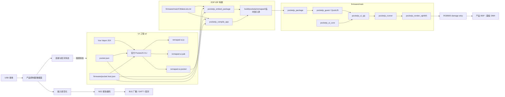

# Remapad 系统架构与技术实现

Remapad 的目标平台是 ESP32-S3 N16R8。最终产品是 USB 到 NS2 BLE 的手柄网关，同时提供本机状态 UI：架构由 PocketJS UI 工程、PocketJS 官方 ESP-IDF host 和产品控制器数据面组成。PocketJS 的包格式、host profile 校验、QuickJS guest、UI binding 和 RGB565 renderer 均使用官方实现。

PSP 仅用于理解 PocketJS 的官方 host 示例；本项目不使用 PSP target、PSP 工具链或 PSP 后端。

## 架构原则与不变量

1. **host profile 是设备事实源**：`firmware/pocket.host.json` 统一描述 ESP32-S3 的 host ABI、tick、物理/逻辑视口、presentation、raster density 和实际提供的 capability。
2. **不维护私有包格式**：`.pocket`、PAK、plan、profile hash 和 variant admission 全部交给 PocketJS 官方 CLI 与 `pocketjs_package`。
3. **构建期完成资源处理**：Tailwind 子集、字体 atlas、图片和 JavaScript bundle 由官方编译器在主机侧生成，固件不解析 CSS 或矢量字体。
4. **固件拥有硬件边界**：PocketJS 运行时不假设某个屏幕控制器、GPIO 或输入总线。固件负责采样输入、创建显示 DMA 缓冲区、提交 RGB565 strip 和调度设备任务。
5. **渲染采用事务模型**：`prepare` 后逐个渲染 damage region；面板传输全部成功后 `commit`，出现错误时 `abort`。
6. **控制器数据面与 UI 解耦**：USB 接收、输入规范化、NS2 报告编码、BLE 广播/GATT 和配对状态机运行在 ESP-IDF 原生任务/队列中，不通过 PocketJS 每帧 UI 接口传输高频报告。协议范围见 [controller.md](controller.md)。

## 系统组成



### 技术选型与职责

| 层次 | 官方或项目组件 | 职责 |
| :--- | :--- | :--- |
| UI | PocketJS Vue Vapor | 声明式组件、响应式状态和嵌入式 UI 图元 |
| 资源编译 | PocketJS 官方 CLI | 解析 manifest、编译 JSX、生成 PAK 和 `.pocket` |
| 设备契约 | `pocket.host.json` | 设备视口、刷新节拍、presentation 和 capability |
| 包接入 | `pocketjs_package` | 借用包字节、选择并校验目标 variant |
| JavaScript | `pocketjs_guest` | 在 ESP-IDF 上创建 QuickJS guest 和执行应用代码 |
| UI binding | `pocketjs_ui_core`、`pocketjs_ui_qjs` | 保留 UI 节点、加载资源并暴露 `globalThis.ui` |
| 调度 | `pocketjs_runner` | 官方可选的固定 tick owner task；当前工程采用此组件 |
| 渲染 | `pocketjs_render_rgb565` | 软件 RGB565 renderer、damage plan 和事务提交 |
| 控制器数据面 | ESP-IDF USB/BLE/GATT/FreeRTOS（规划） | USB 输入接收、输入规范化、NS2 报告编码、BLE 广播/GATT/配对和状态持久化；协议见 [controller.md](controller.md) |
| 硬件 | 产品 BSP + ESP-IDF | 输入采样、面板初始化、DMA 传输、电源和其他外设 |

## 双工作区结构

```text
remapad/
├── AGENTS.md
├── package.json
├── pnpm-workspace.yaml
├── scripts/
│   └── create_adr.py
├── docs/
│   ├── VISION.md
│   ├── ARCHITECTURE.md
│   ├── ABSTRACTIONS.md
│   ├── GETTING-STARTED.md
│   ├── controller.md
│   └── adr/
├── ui/
│   ├── package.json
│   ├── pocket.json
│   ├── jsconfig.json
│   ├── scripts/
│   │   ├── pocket.mjs       # 官方 CLI 的 cwd/path 适配器
│   │   └── dev.mjs          # WebAssembly 模拟器与热重载
│   └── src/
│       ├── index.tsx
│       ├── App.tsx
│       └── bridge/           # 产品控制面协议预留
└── firmware/
    ├── CMakeLists.txt
    ├── pocket.host.json
    ├── partitions.csv
    ├── sdkconfig.defaults
    └── main/
        ├── CMakeLists.txt
        ├── idf_component.yml
        ├── main.c
        ├── pocketjs_host.c
        ├── pocketjs_host.h
        ├── bridge/            # 产品控制面预留
        └── drivers/           # 背光、电池等 BSP 预留
```

`ui/scripts/pocket.mjs` 优先使用 `POCKETJS_ROOT` 指向的官方 checkout，解决应用仓库与 PocketJS checkout 分离时的路径问题；实际检查、编译和打包仍由官方 `tools/pocket.ts` 执行。仓库不再包含手写 PCKT 打包器或 `app_pocket.h`。`ui/src/bridge/`、`firmware/main/bridge/` 和 `drivers/` 是最终 USB→NS2→BLE 产品控制面的预留接口，当前不在 PocketJS UI runtime 或 ESP-IDF target 的编译源中，不能视为已完成的硬件实现。

## 构建链路

### UI 包

```text
ui/src + ui/pocket.json + firmware/pocket.host.json
    │
    └── 官方 pocket build --host-profile
            ├── remapad-ui.js
            ├── remapad-ui.pak
            └── remapad-ui.pocket
```

应用清单声明应用自身需要的 capability 和视口；host profile 声明设备真实提供的能力。官方 resolver 会检查二者是否兼容，并将 profile hash、host ABI、tick、视口、density 和 presentation 写入构建计划及包 variant。

### ESP-IDF 包接入

`firmware/main/CMakeLists.txt` 保留官方示例的两种模式：

1. `ui/dist/remapad-ui.pocket` 存在时，调用 `pocketjs_embed_package`。包通过生成的 `.c`/`.S` 文件嵌入固件，生成文件只位于 `firmware/build/`。
2. 没有预构建包时，调用 `pocketjs_compile_app`。它让官方 CMake helper 调用 `pocket build --host-profile`，并把依赖文件、plan 和包写入 ESP-IDF build 目录。

团队的可复现构建入口是先运行 `pnpm run build` 再运行 `idf.py build`。这样 ESP-IDF 构建阶段只消费已生成的包，不需要在 CMake 中重复实现编译器逻辑。

## 固件运行时生命周期

`firmware/main/pocketjs_host.c` 按官方 smoke 示例组织资源生命周期：

1. 使用生成的包字节调用 `pocketjs_package_open`。
2. 使用生成的 host contract 调用 `pocketjs_package_select`，完成目标和 ABI 校验。
3. 用官方默认值创建 guest，并设置 4 MB JavaScript heap、优先使用 PSRAM。
4. 从 package contract 创建 `pocketjs_ui_core`。
5. 创建 `pocketjs_ui_qjs`，feed PAK，mount `globalThis.ui`/`globalThis.__pak`，再 eval JavaScript bundle。
6. 创建 RGB565 renderer 和 render target。
7. 使用一个可复用的 PSRAM strip scratch buffer 启动 `pocketjs_runner`。
8. 每个 tick 由 `sample_input` 提供输入，runner 执行一次 `pocketjs_ui_turn`，再在 `after_turn` 中完成 prepare、render strip、commit/abort。

当前 `sample_input` 返回空输入，渲染结果也尚未传入真实面板。这是为了先验证官方 package admission、guest、UI binding 和 renderer 链路；接入硬件时应将 BSP 的触控/按键采样接入 `sample_input`，并在每个成功渲染的 strip 后完成面板 DMA 传输。

`pocketjs_runner` 是官方可选组件。如果未来设备需要把 UI turn 集成进已有的 FreeRTOS task，可移除 runner，直接由产品 task 调用 `pocketjs_ui_turn`，保留相同的渲染事务边界。

## 产品控制器数据面

最终功能链路独立于 PocketJS UI runtime：

```text
USB host 接收
    │
    ▼
输入报告解析与规范化
    │  统一按键、摇杆、扳机、IMU 和连接状态
    ▼
NS2 手柄报告编码
    │
    ▼
BLE 外设广播 → GATT 服务 → 输入通知 / 震动与命令响应
    │
    └─ 配对、回连、唤醒和凭证持久化
```

该数据面应由 ESP-IDF 原生任务、队列和 BLE/USB 驱动实现，不能让高频 USB 报告经过 UI bridge 或每帧 `pocketjs_ui_turn`。PocketJS UI 只需要读取低频连接/电量/配对状态，并发出开始配对、停止配对、背光等控制命令。

现有 `ui/src/bridge/` 和 `firmware/main/bridge/` 保留为这一控制面的接口预留；它们目前没有加入 PocketJS host 的 `REQUIRES` 或 `SRCS`，也没有连接实际 USB/BLE 传输。NS2 的广播字段、GATT、HID 报告、配对和震动命令见 [controller.md](controller.md)，实现前必须用真实设备抓包和互操作测试确认。

## 内存与显示策略

- JavaScript guest 和资源优先使用 8 MB Octal PSRAM。
- 当前无面板 bring-up 使用一个按最大视口分配的 PSRAM RGB565 scratch buffer；`render_strip` 每次接收精确的 full-width、region-height 容量。
- 真实面板 DMA 缓冲区应由 BSP 根据 ESP-IDF 的 DMA 能力、对齐和缓存约束分配。官方 smoke 示例使用内部 DMA strip，产品可按实际屏幕刷新策略选择整帧或分区传输。
- ESP32-S3 没有本项目所需的 P4 PPA；使用 `pocketjs_render_rgb565` 的软件路径即可。

## Flash 分区

当前分区表只有 NVS、PHY 初始化和 4 MB `factory` 应用分区：

| 分区 | 类型 | 偏移 | 大小 | 用途 |
| :--- | :--- | :--- | :--- | :--- |
| `nvs` | data/nvs | `0x9000` | 24 KB | 系统配置、未来配对凭证索引 |
| `phy_init` | data/phy | `0xf000` | 4 KB | 射频校准 |
| `factory` | app/factory | `0x10000` | 4 MB | 固件及内置 `.pocket` |

包是固件的一部分，不再通过 SPIFFS 运行时加载。若后续包或固件超过 4 MB，应先重新评估分区布局，再修改 `partitions.csv`。

## 相关决策与官方资料

- [ADR 0001：采用 PocketJS 与 Vue Vapor 驱动 ESP32-S3 屏幕 UI](adr/0001-use-pocketjs-vue-vapor-for-esp32s3-ui.md)
- [ADR 0002：旧 bridge/自定义打包方案（已被取代）](adr/0002-adopt-hardware-bridge-and-packaging-architecture.md)
- [ADR 0003：采用官方 PocketJS ESP-IDF host 构建链路](adr/0003-use-official-esp-idf-host.md)
- [Switch 2 / NS2 手柄通信协议与数据交互技术规范](controller.md)
- [PocketJS ESP-IDF 官方指南](https://pocketjs.dev/docs/esp-idf/)
- [PocketJS ESP-IDF 官方 README](https://github.com/pocket-stack/pocketjs/blob/main/hosts/esp-idf/README.md)
