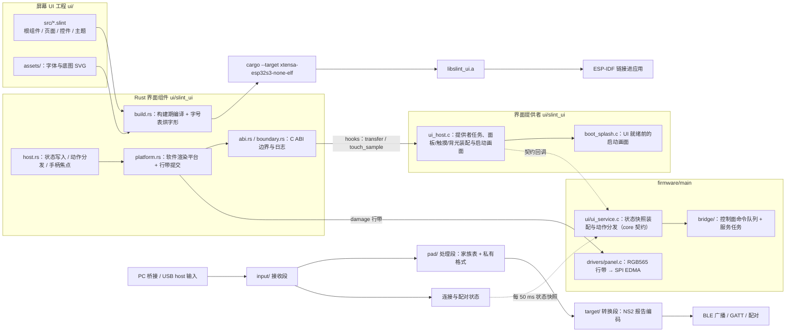
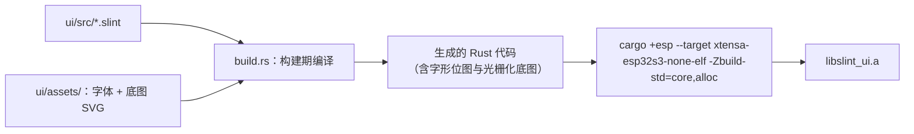
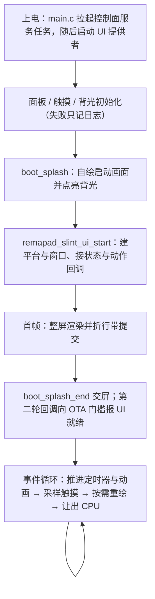
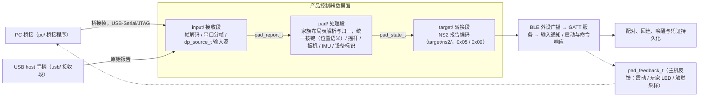
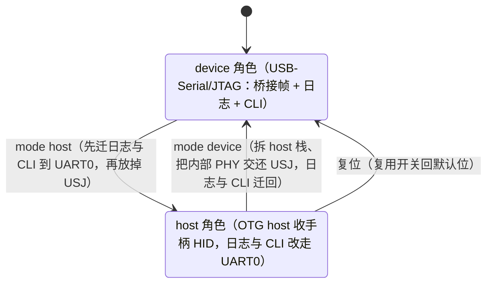
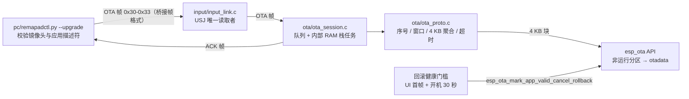
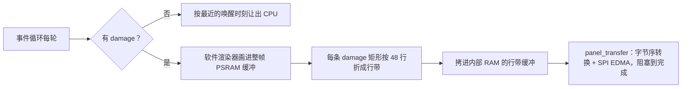

# Remapad 系统架构与技术实现

Remapad 的目标平台是微雪 ESP32-S3-Touch-LCD-1.69（ESP32-S3R8，16 MB Flash + 8 MB Octal PSRAM，板载 240 × 280 ST7789V2 触摸屏）；
板卡事实见 [hardware.md](hardware.md)。本设备是 USB 到 NS2 BLE 的手柄网关，同时提供本机状态 UI：
架构由屏幕 UI 工程（Rust，`ui/` 工作区）与产品固件核心（ESP-IDF 原生 C，`firmware/`）组成。
固件核心对界面知道的全部内容是 `firmware/main/ui/ui_service.h` 契约（状态快照装配、动作分发、生命周期）；
界面在构建期编译成 Rust 代码、按用到的字符烘成字形位图，再交叉编译成静态库链进固件，
运行期用软件渲染器画到面板（选型见 [ADR 0054](adr/0054-screen-ui-slint-rust.md)，core/ui 分离与可选装配见 [ADR 0055](adr/0055-core-ui-split-optional-ui-build.md)）。
设备上没有 JavaScript 运行时，仓库里也没有 Node.js / Bun：脚本一律是 Python。

## 架构原则与不变量

1. **视口在两处对齐**：240 × 280 既写在 `ui/src/app.slint` 的根窗口上，也写在平台层的 `VIEW_WIDTH` / `VIEW_HEIGHT` 上，
   两处必须一致，否则画面会被裁掉或留白。动画推进按 16 ms 一档（与 60 Hz 对齐）。
2. **界面事实源是界面源码**：视口、页表、焦点环与全部文案都写在 `ui/src/` 里，固件侧只提供状态快照与动作分发。
3. **构建期完成资源处理**：界面编译、字形位图烘焙（按界面里出现过的字符自动子集）与 SVG 光栅化都在 PC 侧完成，固件不解析字体文件与矢量图。
4. **固件拥有硬件边界**：平台层不假设屏幕控制器、GPIO 或触摸器件，面板提交与触点采样由固件经 `remapad_slint_hooks_t` 传入。
5. **渲染只画变化区域**：界面框架给出本帧的 damage 矩形，平台把每条矩形折成 48 行行带逐条提交；行带交给面板驱动做字节序转换与 DMA。
6. **控制器数据面与 UI 解耦**：USB 接收、输入规范化、NS2 报告编码、BLE 广播/GATT 和配对状态机运行在 ESP-IDF 原生任务/队列中，界面只经状态快照与动作回调交互，快照里不含高频报告。
   协议范围见 [controller-switch2.md](controller-switch2.md)。
7. **core 零界面依赖**：`firmware/` 不 include 任何界面框架头文件；`ui_service.h` 契约由链接进来的 UI 提供者实现
   （`ui/slint_ui` 组件或无 UI 构建的空实现），控制面命令队列由独立服务任务泵、不依赖界面存在。

## 系统组成

### 技术选型与职责

| 层次 | 官方或项目组件 | 职责 |
| :--- | :--- | :--- |
| UI | 声明式界面框架（`ui/src`） | 声明式组件、属性绑定与回调；颜色与字号收在 `theme.slint` 的语义 token 里 |
| 界面编译 | 构建脚本（口径收在 `ui/build-support`，host 与组件的 `build.rs` 共用） | 把界面源码编成 Rust 代码，按字号表烘字形位图、光栅化 SVG |
| 平台层 | `ui/slint_ui/src/platform.rs` | 软件渲染器、整帧 PSRAM 缓冲、damage 折行带并提交；单线程前提（`unsafe-single-threaded`） |
| 宿主层 | `ui/slint_ui/src/host.rs` | 把状态快照写进界面属性，把界面动作与手柄按键翻译成回调 |
| C ABI | `ui/slint_ui/include/slint_ui.h` | 状态快照、动作回调、面板与触摸 hooks、统计与截图入口 |
| UI 契约 | `firmware/main/ui/ui_service.h` | core 侧状态快照装配、动作分发与提供者生命周期；实现按构建形态链接（组件或空实现） |
| 调度 | 界面提供者任务 + 控制面服务任务 | `remapad-ui`（64 KB 内部 RAM 栈）承载面板/触摸/背光初始化与界面事件循环；`remapad-bridge` 每 50 ms 泵命令队列与配对状态机 |
| 控制器数据面 | ESP-IDF USB/BLE/GATT/FreeRTOS | USB 输入接收、输入规范化、NS2 报告编码、BLE 广播/GATT/配对和状态持久化；协议见 [controller-switch2.md](controller-switch2.md) |
| 升级 | `pc/remapadctl.py --upgrade` + `main/ota/` | 经桥接帧推送整包应用镜像，写非运行分区、`esp_ota_end` 校验后切启动分区并重启；回滚健康门槛见 [ADR 0022](adr/0022-ota-over-bridge-frames-with-rollback.md) |
| 硬件 | 产品 BSP + ESP-IDF | 输入采样、面板初始化、DMA 传输、电源和其他外设 |

## 双工作区结构

```mermaid
flowchart TB
    Root["remapad/"]
    Root --> RootFiles["AGENTS.md / .editorconfig / .gitignore"]
    Root --> Scripts["scripts/：create_adr.py / firmware-test.py / setup-rust-toolchain.py / ui-preview.py"]
    Root --> PC["pc/：PC 侧工具 remapadctl（hidapi 读手柄 → 桥接帧，另含命令行、截图与 OTA）与图形入口 remapadgui"]
    Root --> Docs["docs/：VISION / ARCHITECTURE / ABSTRACTIONS / GETTING-STARTED / controller-switch2 / controller-ps / hardware / adr/"]
    Root --> UI["ui/：屏幕 UI 工作区（界面源码、固件界面组件与宿主用例）"]
    Root --> Firmware["firmware/：ESP-IDF 固件核心工作区"]

    UI --> UiSrc["src/：app.slint / pages.slint / components.slint / theme.slint"]
    UI --> UiAssets["assets/：字体（正文 / 图标 / 转圈）与底图 SVG"]
    UI --> UiHost["host/：宿主用例包（测试后端 + 软件渲染器）"]
    UI --> UiFw["slint_ui/：固件界面组件（Rust 静态库、平台层、C ABI 与装配层 ui_host.c）"]
    UI --> UiSupport["build-support/：两份 build.rs 共用的编译口径"]
    UI --> UiPreview["preview.slint：PC 交互预览（设备画面 + 控制条）"]
    UI --> UiBuild["Cargo.toml：workspace 清单与唯一的 Cargo.lock"]

    Firmware --> FwRoot["CMakeLists.txt（REMAPAD_UI 开关 + EXTRA_COMPONENT_DIRS）/ partitions.csv / sdkconfig.defaults"]
    Firmware --> FwMain["main/"]
    FwMain --> MainEntry["main.c（启动装配）/ ui/（UI 契约与快照装配，无 UI 构建另有空实现）"]
    FwMain --> MainBridge["bridge/：控制面命令与事件"]
    FwMain --> MainConfig["config/：NVS 用户设置持久化"]
    FwMain --> MainConsole["console/：串口 CLI"]
    FwMain --> MainDrivers["drivers/：panel / touch / backlight / pwr_key / buzzer / battery"]
    FwMain --> MainInput["input/：接收段（桥接帧与串口接收）"]
    FwMain --> MainPad["pad/：处理段（私有格式与家族表）"]
    FwMain --> MainTarget["target/：转换段（目标编码，含 target/ns2/）"]
    FwMain --> MainBle["ble/：NimBLE 手柄外设、会话与凭证"]
    FwMain --> MainDp["dp/：数据面任务与输入源抽象"]
    FwMain --> MainOta["ota/：升级会话（分区回写与回滚门槛）"]
```

仓库是自包含的：界面源码、字体与 Rust 工作区都在 `ui/`（宿主用例包 `host/`、固件组件 `slint_ui/`、
编译口径 `build-support/`），界面依赖取自 crates.io 并由工作区唯一的 `Cargo.lock` 锁定，构建不需要任何上游 checkout。
开发机上预览界面用 `uv run python scripts/ui-preview.py`：`ui/preview.slint` 把设备画面（同一棵 `AppContent`，240 × 280）
与控制条放进一个窗口，动作在预览里按固件语义结算，改完存盘即刷新；界面行为的断言在 `ui/host/tests/` 的宿主用例里（见 [TESTING.md](TESTING.md)）。
`firmware/main/bridge/` 是控制面（UI 命令/事件）接口，屏幕动作经它连到真实 BLE 会话与屏幕驱动；
`firmware/main/ui/` 是 UI 契约的 core 侧（状态快照装配与动作分发），界面框架相关代码全部在 `ui/slint_ui`。
数据面按 `input/`、`pad/`、`target/` 三段划分（见 [ADR 0021](adr/0021-input-path-three-stage-layering.md)）。
USB host 直插由 `usb/` 提供接收传输与运行时角色切换，取舍见 [ADR 0027](adr/0027-runtime-usb-role-switch.md)；
切回串口时显式交还内部 PHY、失败时由界面询问重启，见 [ADR 0053](adr/0053-usb-serial-phy-handback-on-role-switch.md)。
反馈方向由 `pad/feedback.c` 按布局行编码成设备输出报告，经 OUT 端点或桥接帧投递。

界面的首帧是整屏重画：界面框架建好窗口后的第一帧要把整棵控件树画满 240 × 280，提交完才把屏幕交给界面。
等待期由启动画面覆盖（`boot_splash`，随装配层住在 `ui/slint_ui`），首帧提交后 `boot_splash_end` 释放画面缓冲。
八个页面在 `ui/src/app.slint` 里全部常驻，切页只改 `page` 属性、各页按属性翻自己的 `visible`，
因此切页没有建树成本，也没有待挂队列，新增页面直接写在界面源码的页表里（见 [ADR 0016](adr/0016-mount-all-pages-before-first-frame.md)）。

## 构建链路

### 界面编译

字号表（12 / 14 / 16 / 24）、风格与字体路径收在 `ui/build-support` 一处，宿主用例与固件组件的 `build.rs` 共用，
PC 预览脚本按同名环境变量对齐；新增字号只改这一处，否则界面只会退回最近的一档位图。
字形按界面里出现过的字符自动子集烘焙，字体文件本身不进固件；
运行期才拼出来的字符串（如固件格式化的电量文本）靠 `ui/src/app.slint` 里的字符集锚点串钉住码点。

### ESP-IDF 组件接入

`REMAPAD_UI` CMake 开关（默认 ON）决定界面是否编入：ON 时固件 CMake 经 `EXTRA_COMPONENT_DIRS`
引入 `ui/slint_ui` 组件并在组件集里点名它；OFF 时不引入，`main/ui/ui_stub.c` 顶上生命周期入口，
纯 C 即可出固件（不需要 Rust 工具链，面板/触摸/背光不初始化，设置经 PC 串口 CLI 控制）。
`ui/slint_ui/CMakeLists.txt` 用一条 custom command 跑 cargo，把界面与平台层编成静态库：

- 命令在 `firmware/build/esp-idf/slint_ui/cargo/` 下产出 `libslint_ui.a`，构建参数只从 CMake 传：`REMAPAD_FREERTOS_HZ`（平台等待换算）、
  `REMAPAD_RELEASE`（是否带调试页）、`REMAPAD_SLINT_FONT` 与 `REMAPAD_SLINT_RUST_TOOLCHAIN`（工具链名，默认 `esp`）。
- `file(GLOB_RECURSE ... CONFIGURE_DEPENDS)` 跟踪 `ui/src/*.slint`、`ui/assets/*.svg` 与 `ui/build-support/src/*.rs`，
  改界面直接重编即可；组件的 C 源码是 `src/rust_heap.c`（alloc 的内存出口）、`ui_host.c`（装配层）与 `boot_splash.c`（启动画面）。
- 静态库作为 imported target 链给组件，并用 `-Wl,--undefined` 保住 `remapad_slint_ui_start`、`remapad_slint_ui_loop`、`remapad_slint_heap_alloc` 三个入口。
- 组件经 `PRIV_REQUIRES main` 只用固件核心的公开接口（驱动头、控制面与 UI 契约），依赖方向单向：ui → core。

`idf.py build` 是唯一构建入口：界面编译、静态库与链接都在它里面完成。
xtensa 工具链缺失或名字不对时配置阶段就停下并打印修复命令，报错里同时给出 `-DREMAPAD_UI=OFF` 的出路
（换机步骤见 [ui/README.md](../ui/README.md)）。

## 固件运行时生命周期

`main.c` 先拉起控制面（`js_bridge_init` + `js_bridge_service_start` 的服务任务，无 UI 构建也活着），
再按构建形态启动 UI 提供者；带 UI 构建里界面装配在 `ui/slint_ui/ui_host.c`：

`ui_host.c` 里只有一条 `remapad-ui` 提供者任务（64 KB 栈，内部 RAM，钉在 CPU1），
面板、触摸、背光、启动画面与界面事件循环都在它上面跑：

1. 初始化面板、触摸与背光：任一项失败只记日志，不阻断启动（面板失败时画面仍渲染进 PSRAM）。
2. 用 `boot_splash_begin` 自绘一帧启动画面并点亮背光，之后每个启动阶段推进一次进度
   （选型与代价见 [ADR 0012](adr/0012-firmware-boot-splash-before-ui.md)）。
3. 调 `remapad_slint_ui_start`：平台分配整帧缓冲（240 × 280 × 2 字节，进 PSRAM）与行带缓冲
   （240 × 48 × 2 字节，内部 RAM 且 DMA 可达），建立 240 × 280 窗口，接好状态快照与动作回调。
4. 建 `App`、写首轮状态、渲染首帧并整屏提交（首帧是全屏重画），随后 `boot_splash_end` 交屏。
5. 进入事件循环：推进定时器与动画 → 采样触点 → `draw_if_needed` 渲染并按 damage 提交 → 让出 CPU
   （有动画时按 16 ms 一档推进，最长等 100 ms，避免动画状态把循环拉成自旋而饿死空闲任务）。

状态快照由一条 50 ms 的界面 `Timer` 驱动：它先把 `ui_service_fill_state` 装配的快照写进界面属性，
再从快照里取手柄按键位做焦点移动与确认。快照装配与动作分发（`ui_service_handle_action`）都在固件核心的
`main/ui/ui_service.c` 里，控制面命令队列由 `remapad-bridge` 服务任务每 50 ms 服务一轮
（桥接命令与串口 CLI 的请求都由它落地，界面动作只是它的提交方之一）。
触摸采样由 `drivers/touch.c` 完成（CST816T 连续点模式，单点）；息屏期间平台整段跳过采样，避免误触看不见的控件。

### 为什么界面只有一条任务

界面框架在这里按单线程前提编译（`unsafe-single-threaded`）：窗口、平台与界面状态都不是线程安全的，只在 UI 任务上访问。
跨任务的东西因此只有三类，且都不经过界面：

- **状态**：每 50 ms 一轮快照，取值要么是原子量、要么是单调量（背光、电量、配对、USB 角色、OTA 进度、内存余量）。
- **动作**：界面把动作名与参数交给回调，core 侧转成桥接命令排进队列，由控制面服务任务在下一轮执行。
- **请求与统计**：帧缓冲地址、trace 剩余帧数与截图请求都是原子量，命令行任务置位、UI 任务读取。

帧缓冲地址用 `Acquire/Release` 原子量交接（截图通路在 UI 任务之外读它），平台未就绪时读到空指针。

## 产品控制器数据面

最终功能链路独立于屏幕 UI：

该数据面由 ESP-IDF 原生任务、队列和 BLE/USB 驱动实现，高频报告既不进控制面命令队列，也不进每 50 ms 的状态快照；
屏幕只读低频的连接/电量/配对状态，并通过 `firmware/main/bridge/` 的控制面发出配对、背光与 USB 角色等命令。
三段划分、私有格式字段与反馈编码的展开见 [ABSTRACTIONS.md](ABSTRACTIONS.md) 的「输入通路：接收 / 处理 / 转换」。

### USB 角色切换

USB 角色（`device` = 插电脑 COM 口，`host` = 插手柄）在运行时真实切换，角色只在本次运行有效、不写 NVS：

切到 host 后 PC 上的 COM 口消失；切回 device 由固件显式交还内部 PHY，交还失败时界面询问是否立刻重启；
取舍见 [ADR 0027](adr/0027-runtime-usb-role-switch.md) 与 [ADR 0053](adr/0053-usb-serial-phy-handback-on-role-switch.md)。
device 角色下「PC 接没接」直接取 USB-Serial/JTAG 的 SOF 接入状态（`input_link_pc_connected()`，插充电宝不算），经底栏左区显示。

## OTA 升级通路

现场升级整包应用镜像（界面已编在应用里）走唯一 Type-C 的 USB-Serial/JTAG，通道与固件日志、串口 CLI、桥接输入帧同一条字节流，**不切 USB mux**。
因此升级期间设备照常作为手柄工作，NVS 设置与 BLE 配对凭证不受影响（选型与取舍见 [ADR 0022](adr/0022-ota-over-bridge-frames-with-rollback.md)）。

- **协议**：沿用桥接帧（`A5 5A` + ver/type/slot/seq/len + 载荷 + CRC16）。
  新增 `0x30` BEGIN（`ROM1` + 镜像字节数）、`0x31` DATA（块序号 + 最多 200 字节）、
  `0x32` END 与设备回发的 `0x33` ACK（状态 + 错误码 + 期望序号 + 已收字节；BEGIN 的应答在末尾附 16 字节运行版本）。解码器按线格式上限 255 字节收帧，报文帧仍按 72 字节语义校验。
- **流控**：PC 每 16 帧（约 3.2 KB）为一个窗口，收到 ACK 才发下一窗。窗口末帧在帧头 `slot` 字段带上标记（末尾不足一窗同样标记），设备收到即应答，不必等固定帧数或超时。ACK 的「期望序号」就是重发起点：
  设备丢弃重复序号、不重复写 flash，同一期望序号的重复应答按最小间隔（50 ms）限流，既不淹掉后续应答，也不会把被日志挤掉的那次永久压制。失败一律整包重发，不做断点续传。
- **应答可靠性**：发送环与日志共用，NimBLE 的 INFO 日志会把它填满，因此 ACK 与 PING 应答走「分片重试写 + 等发送完成」的路径（上限 200 ms，超时放弃）；数据面反馈仍是非阻塞写、可丢。
- **写入**：
  `esp_ota_get_next_update_partition()` 选非运行分区，`esp_ota_begin(镜像大小)` 预擦，4 KB 对齐的 `esp_ota_write` 写数据。
  BEGIN 的应答在预擦之后才发（3.6 MB 的预擦可达数秒），设备侧的 5 秒空闲超时从应答时刻起算，不把预擦算进接收窗口。
  随后 `esp_ota_end()` 整体校验应用描述符、芯片标识与尾部 SHA-256。
  通过后 `esp_ota_set_boot_partition()` 切启动分区，回 ACK 后延时 500 ms 重启。
  任一步失败即 `esp_ota_abort()`，`otadata` 在成功前不动，所以断电与拔线只会让设备继续从旧镜像启动。
- **内存约束**：升级任务由 `xTaskCreate` 创建（栈在内部 RAM），帧队列与 4 KB 聚合缓冲同样固定在内部 RAM——flash 写入的禁缓存窗口内不能访问 PSRAM。
  另外，非 DRAM 缓冲会让 IDF 退化成 32 字节一次的栈拷贝。
- **回滚保护**：开启 `CONFIG_BOOTLOADER_APP_ROLLBACK_ENABLE` 后新镜像以「待验证」启动。
  界面就绪（状态轮询的第二轮，意味着首帧已经上屏）且开机满 30 秒才调用 `esp_ota_mark_app_valid_cancel_rollback()`；未过门槛就重启会回退到升级前的镜像。
  待验证窗口内 `esp_ota_begin` 返回 `ESP_ERR_OTA_ROLLBACK_INVALID_STATE`，设备据此回 BUSY。
- **观测**：
  串口 CLI 的 `version`（版本 / 分区 / 待验证状态）与 `status`（`fw=` 与 `ota=` 字段）、UI 系统页的固件信息行共用同一个版本字符串——它来自构建时的 `git describe`。
  写进镜像应用描述符的 `PROJECT_VER`。

## 内存与显示策略

- **两级缓冲**：整帧缓冲 240 × 280 × 2 字节（约 134 KB）放 PSRAM；行带缓冲 240 × 48 × 2 字节（约 23 KB）放内部 RAM，
  因为面板传输要连续且 DMA 可达的内存。行带取 48 行是拿一次 SPI 事务的固定开销（约 1 ms）换来的：行带越高，一次刷新的总耗时越低。
- **栈与核**：UI owner task 的 64 KB 栈放内部 RAM（渲染路径要在它上面跑），任务钉在 CPU1，渲染不与射频抢核；
  CPU 跑满额定 240 MHz（`CONFIG_ESP_DEFAULT_CPU_FREQ_MHZ_240`）。
- **节拍不是固定 tick**：事件循环按最近的定时器与动画唤醒，有动画时按 16 ms 一档推进（对应 60 Hz 观感）；
  界面动画由界面框架按时间自己推进，固件侧的 50 ms 轮询只管状态快照与手柄按键。
- **提交逐条同步**：每条 damage 矩形按 48 行切分、逐条拷进行带缓冲，经 `panel_transfer` 同步提交到 ST7789V2，
  字节序转换与 DMA 等待都在面板驱动里；传输失败只记一行警告，帧继续画。
- 真实面板方向与时序配置（`mirror(true,true)` + `invert_color` + `set_gap(0,20)`、背光 GPIO15）逐条对照微雪官方 ESP-IDF 示例，SPI2 取上限 80 MHz；
  选型见 [ADR 0007](adr/0007-esp-lcd-panel-touch-bsp.md)。
- 面板初始化在 IDF 内置序列（SLPOUT/MADCTL/COLMOD/RAMCTRL）之外补发厂商的电源、VCOM 与 gamma 表，
  取值来自微雪为同一块板自带的 Arduino 库（`firmware/main/drivers/panel.c` 的 `s_panel_vendor_tuning`）。
- ESP32-S3 没有 P4 那类 PPA，界面在这台设备上走纯软件渲染（整数运算）；底图在构建期光栅化成位图，
  运行期只做拷贝与混合，卡片区域的每像素成本因此与纯色填充接近。

### 重画范围与代价

- damage 由界面框架自己算：属性一变，相关元素失效，本帧只重画这些元素的包围盒，没碰到的像素保留在缓冲里
  （窗口按 `RepaintBufferType::ReusedBuffer` 复用上一帧）。切页这类结构变化不会退化成整屏重画，也不需要固件侧差分。
- 一帧的重绘价格 ≈ damage 像素数 × 每像素成本：纯色填充最便宜，带抗锯齿边缘的底图与文字更贵。
  想量就用串口 `trace [frames]`，它逐帧打印渲染耗时、提交耗时、damage 像素数与矩形条数；
  平台还把 5 秒窗口的累计值交给周期日志（`remapad_slint_ui_take_stats`）。
- 代价规则是改界面的硬约束，见 [ADR 0050](adr/0050-repaint-friendly-screen-rules.md)：
  圆角加边框的元素要同时给底色、翻页只在行进侧滑入 16px（90 ms，每帧重画内容框，时长别再拉长）并让同侧箭头弹一下。

## Flash 分区

分区表为终局布局（见 [ADR 0009](adr/0009-ota-storage-flash-layout.md)），一次性划分 OTA 双应用分区与通用存储区，16 MB Flash 不留未分配尾部：

| 分区 | 类型 | 偏移 | 大小 | 用途 |
| :--- | :--- | :--- | :--- | :--- |
| `nvs` | data/nvs | `0x9000` | 24 KB | 设置项、BLE 配对密钥 |
| `phy_init` | data/phy | `0xf000` | 4 KB | 射频校准 |
| `ota_0` | app/ota_0 | `0x10000` | 4 MB | 主应用分区：固件与界面（继承原 factory 偏移） |
| `ota_1` | app/ota_1 | `0x410000` | 4 MB | OTA 目标分区：`pc/remapadctl.py --upgrade` 推送的镜像先写这里，校验通过后切为启动分区 |
| `otadata` | data/ota | `0x810000` | 8 KB | OTA 启动选择数据 |
| `storage` | data/spiffs | `0x812000` | 约 7.9 MB | 通用数据存储区，将来挂 littlefs |

界面与固件同在一个镜像里，不从 SPIFFS 运行时加载。若固件接近 4 MB，应先重新评估分区布局，再修改 `partitions.csv`。布局受 ADR 0009 约束：
新增分区只允许在尾部追加，禁止移动 `nvs`/`phy_init` 偏移，以免升级固件时擦除用户 NVS 数据与配对凭证。

两个应用分区在 OTA 升级里互为备份：升级写的是当前未运行的那个，校验通过才写 `otadata` 切过去（见上文「OTA 升级通路」）。
升级命令、PC 端工具与恢复路径见 [GETTING-STARTED.md](GETTING-STARTED.md) 与 [pc/README.md](../pc/README.md)；
从 `ota_1` 启动之后，开发期固定写 `0x10000` 的 `app-flash` 会写错分区，继续开发前先执行 `idf.py erase-otadata`。

## 相关决策与官方资料

- [ADR 0054：屏幕 UI 改用 Slint + Rust，固件不再挂 JS 运行时](adr/0054-screen-ui-slint-rust.md)
- [ADR 0007：面板与触摸 BSP 取值](adr/0007-esp-lcd-panel-touch-bsp.md)
- [ADR 0012：UI 就绪前的启动画面](adr/0012-firmware-boot-splash-before-ui.md)
- [ADR 0018：面板 SPI2 时钟取 80 MHz](adr/0018-panel-spi2-clock-80mhz.md)
- [ADR 0022：OTA 升级复用桥接帧（USB-Serial/JTAG 双分区回写）与回滚健康门槛](adr/0022-ota-over-bridge-frames-with-rollback.md)
- [Switch 2 手柄通信协议与数据交互技术规范](controller-switch2.md)
- [PS 家族手柄数据规范（DualShock 3 / DualShock 4 / DualSense）](controller-ps.md)
- 界面框架的官方文档与工具链细节见 [ui/README.md](../ui/README.md)。
