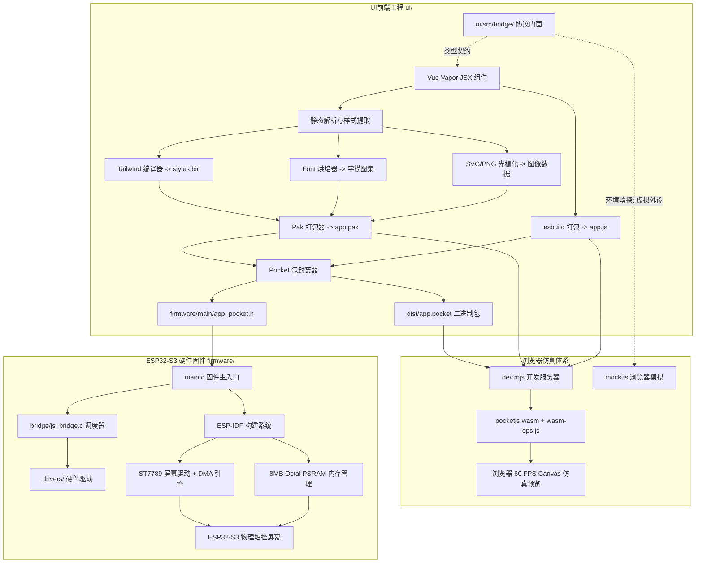
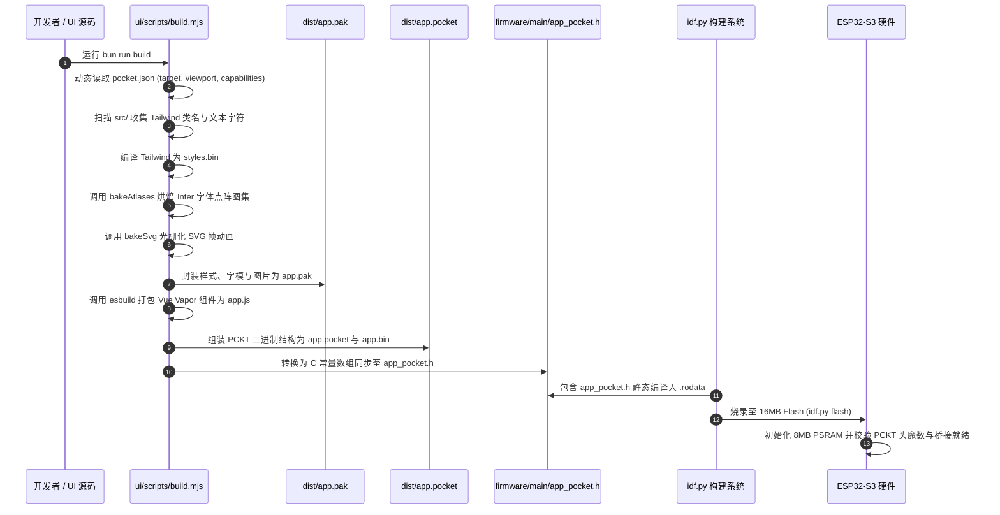

# Remapad 系统架构与技术实现

## 架构原则与不变量

Remapad 采用**前后端分离的双工作区架构**。系统遵循以下不可变原则：

1. **零运行时 CSS 解析**：所有 Tailwind 工具类必须在构建期被编译为定长二进制记录表（`styles.bin`），运行时仅根据 `styleId` 整数索引寻址。
2. **零运行时矢量栅格化**：微控制器端不携带 TrueType/OpenType 矢量解释引擎，所有文字字符均在构建期被烘焙为字模图集（Font Atlas）。
3. **硬件内存绝对充裕**：固件工程针对 **ESP32-S3 N16R8** 硬件进行了严格绑定，必须强制启用 8MB Octal PSRAM 用于放置双缓冲 Framebuffer 与 JavaScript 虚拟机堆栈。
4. **硬件调用契约化与解耦**：前端业务组件禁止直接侵入底层寄存器或特定通信总线，必须通过强类型协议（`protocol.ts`）和环境适配驱动门面（`driver.ts`）间接与硬件交互，保证在 PC 浏览器仿真与真机固件中的完全同构。

---

## 系统组成与技术栈职责



### 技术选型与职责划分

| 层次 | 核心技术 | 职责说明 |
| :--- | :--- | :--- |
| **视图层** | Vue 3 Vapor | 提供响应式状态绑定（`ref`、`watchEffect`、`computed`）与 JSX 语法树 |
| **样式体系** | Tailwind CSS 子集 | 声明式布局与颜色体系，经构建期转化为 `styles.bin` |
| **硬件桥接** | 双向契约协议通道 | `ui/src/bridge/` 提供强类型调用，隔离真机原生通道与浏览器模拟外设 |
| **资产封装** | `.pak` / `.pocket` | 官方二进制容器，聚合清单、样式表、字模图集与 JavaScript IIFE 字节码 |
| **开发仿真** | WebAssembly + Canvas | 在 PC 浏览器中运行 WebAssembly 渲染核心，实现 60 FPS 零刷机热重载 |
| **构建驱动** | Bun + pnpm | 执行构建脚本与工作区任务，完成资源编译、打包与产物度量 |
| **底层系统** | ESP-IDF (v5.3+) | 乐鑫官方嵌入式开发框架，提供 FreeRTOS 调度、外设总线与 DMA 通信 |
| **物理硬件** | ESP32-S3-WROOM-1 N16R8 | 双核 Xtensa LX7 (240MHz)，16MB SPI Flash，8MB Octal PSRAM，ST7789 (240×280) |

---

## 双工作区结构

项目采用清晰的分层双工作区布局：

```text
remapad/
├── AGENTS.md                # Agent 工作准则与操作入口
├── package.json             # 根目录工作区脚本定义
├── pnpm-workspace.yaml      # pnpm monorepo 工作区配置
├── README.md                # 项目全局概述与指南
├── scripts/
│   └── create_adr.py        # 架构决策记录自动化创建工具
├── docs/                    # 完整项目文档体系
│   ├── VISION.md            # 产品愿景与范围定义
│   ├── ARCHITECTURE.md      # 系统架构说明（本文档）
│   ├── ABSTRACTIONS.md      # 核心概念与数据模型
│   ├── GETTING-STARTED.md   # 环境搭建与上手开发指南
│   ├── controller.md        # Switch 2 手柄通信协议与交互技术规范
│   └── adr/                 # 架构决策记录目录
│       ├── README.md        # ADR 体系说明与模板
│       ├── 0001-use-pocketjs-vue-vapor-for-esp32s3-ui.md
│       └── 0002-adopt-hardware-bridge-and-packaging-architecture.md
├── ui/                      # 【工作区 1】PocketJS 前端模块
│   ├── package.json         # 前端依赖清单与脚本
│   ├── pocket.json          # PocketJS 应用清单与硬件契约
│   ├── eslint.config.mjs    # ESLint 代码风格配置
│   ├── scripts/
│   │   ├── build.mjs        # 样式提取、字体烘焙与资产打包主构建脚本
│   │   └── dev.mjs          # 浏览器 WebAssembly 模拟器与热重载服务器
│   ├── src/
│   │   ├── index.jsx        # 前端挂载主入口 (mount)
│   │   ├── App.jsx          # 界面根组件 (Vue Vapor JSX)
│   │   ├── bridge/          # 硬件调用契约与驱动门面 (借鉴 pocket-youtube)
│   │   │   ├── protocol.ts  # DeviceCmd 与 DeviceMsg 强类型契约
│   │   │   ├── driver.ts    # HardwareDriver 统一调用门面
│   │   │   └── mock.ts      # 浏览器仿真虚拟外设响应分发
│   │   └── assets/images/   # 官方 Logo 与动画 Spinner 矢量图源
│   └── dist/                # 构建输出目录 (app.js, app.pak, app.pocket, app_pocket.h)
└── firmware/                # 【工作区 2】ESP-IDF 固件工程
    ├── CMakeLists.txt       # CMake 顶层项目构建配置
    ├── partitions.csv       # 16MB Flash 分区规划表
    ├── sdkconfig.defaults   # N16R8 硬件预设 (Flash 16MB + PSRAM 8MB OPI)
    └── main/
        ├── CMakeLists.txt   # 固件主组件编译配置
        ├── idf_component.yml# 乐鑫组件注册表依赖清单
        ├── app_pocket.h     # 由前端全自动生成并同步覆盖的 C 常量头文件
        ├── main.c           # 固件入口、PSRAM 自检与硬件桥接初始化
        ├── bridge/          # C 语言硬件桥接调度层
        │   ├── js_bridge.h  # 桥接接口声明
        │   └── js_bridge.c  # 指令分发与事件推送实现
        └── drivers/         # 硬件驱动抽象
            ├── backlight.h / .c # 屏幕背光 PWM 驱动
            └── battery.h / .c   # 电池电量采样驱动
```

---

## 硬件调用桥接与双向通信架构

借鉴官方 PocketJS 项目（`pocket-youtube`）的跨界通信架构，Remapad 将硬件调用划分为两个阶段模型：

1. **请求-应答模式（Request-Response）**：
   - 前端调用 `hardware.send(cmd, callback)` 时，驱动自动为其分配单调递增的序号 `id`。
   - 固件处理完毕后，在回执中原样回显该 `id`。
   - 前端根据 `id` 精准命中最初的发起函数，支持乱序异步回复。
2. **发布-订阅模式（Publish-Subscribe）**：
   - 当微控制器产生物理中断（如物理按键按下、电量低电告警、Switch 2 配对状态变更），固件主动发送无 `id` 的事件消息。
   - 前端通过 `hardware.onEvent(callback)` 进行统一监听与界面局部刷新。

---

## 关键数据流与构建流水线

### 前端构建与固件链接链路



---

## 存储与分区规划

针对 ESP32-S3 N16R8 搭载的 **16MB Quad SPI Flash**，在 [firmware/partitions.csv](../firmware/partitions.csv) 中规划了兼顾当前一体化固件和未来动态资源升级的分区策略：

| 分区名称 | 类型 (Type) | 子类型 (SubType) | 偏移地址 (Offset) | 分区大小 (Size) | 用途说明 |
| :--- | :--- | :--- | :--- | :--- | :--- |
| **nvs** | data | nvs | `0x9000` | 24 KB | 存储系统非易失性键值参数、Wi-Fi 凭证与屏幕校准信息 |
| **phy_init** | data | phy | `0xf000` | 4 KB | 射频物理层校准数据 |
| **factory** | app | factory | `0x10000` | 4 MB | 主应用程序固件（已内置编译嵌入的 `app_pocket.h`） |
| **storage** | data | spiffs | `0x410000` | 约 11.8 MB | SPIFFS 文件系统分区，预留供未来独立热烧录 `app.bin` 资源包 |

---

## 相关决策与源码索引

- 技术路线决策记录：[ADR 0001: 采用 PocketJS 与 Vue Vapor 驱动 ESP32-S3 屏幕 UI](adr/0001-use-pocketjs-vue-vapor-for-esp32s3-ui.md)
- 硬件桥接与打包决策：[ADR 0002: 引入统一硬件桥接协议与双工作区打包分层架构](adr/0002-adopt-hardware-bridge-and-packaging-architecture.md)
- Switch 2 协议技术规范：[docs/controller.md](controller.md)
- 前端硬件桥接层：[ui/src/bridge/driver.ts](../ui/src/bridge/driver.ts)
- 固件桥接调度器：[firmware/main/bridge/js_bridge.c](../firmware/main/bridge/js_bridge.c)
