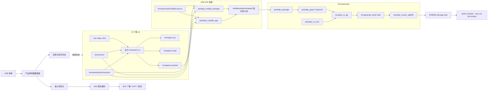

# Remapad 系统架构与技术实现

Remapad 的目标平台是微雪 ESP32-S3-Touch-LCD-1.69（ESP32-S3R8，16 MB Flash + 8 MB Octal PSRAM，板载 240 × 280 ST7789V2 触摸屏）；板卡事实见 [hardware.md](hardware.md)。最终产品是 USB 到 NS2 BLE 的手柄网关，同时提供本机状态 UI：架构由 PocketJS UI 工程、PocketJS 官方 ESP-IDF host 和产品控制器数据面组成。PocketJS 的包格式、host profile 校验、QuickJS guest、UI binding 和 RGB565 renderer 均使用官方实现。

PSP 仅用于理解 PocketJS 的官方 host 示例；本项目不使用 PSP target、PSP 工具链或 PSP 后端。

## 架构原则与不变量

1. **host profile 是设备事实源**：`firmware/pocket.host.json` 统一描述 ESP32-S3 的 host ABI、tick、物理/逻辑视口、presentation、raster density 和实际提供的 capability。
2. **不维护私有包格式**：`.pocket`、PAK、plan、profile hash 和 variant admission 全部交给 PocketJS 官方 CLI 与 `pocketjs_package`。
3. **构建期完成资源处理**：Tailwind 子集、字体 atlas、图片和 JavaScript bundle 由官方编译器在主机侧生成，固件不解析 CSS 或矢量字体。
4. **固件拥有硬件边界**：PocketJS 运行时不假设某个屏幕控制器、GPIO 或输入总线。固件负责采样输入、创建显示 DMA 缓冲区、提交 RGB565 strip 和调度设备任务。
5. **渲染采用事务模型**：`prepare` 后逐个渲染 damage region；面板传输全部成功后 `commit`，出现错误时 `abort`。
6. **控制器数据面与 UI 解耦**：USB 接收、输入规范化、NS2 报告编码、BLE 广播/GATT 和配对状态机运行在 ESP-IDF 原生任务/队列中，不通过 PocketJS 每帧 UI 接口传输高频报告。协议范围见 [controller.md](controller.md)。

## 系统组成



### 技术选型与职责

| 层次 | 官方或项目组件 | 职责 |
| :--- | :--- | :--- |
| UI | PocketJS Vue Vapor | 声明式组件、响应式状态和嵌入式 UI 图元 |
| 资源编译 | PocketJS 官方 CLI | 解析 manifest、编译 JSX、生成 PAK 和 `.pocket` |
| 设备契约 | `pocket.host.json` | 设备视口、刷新节拍、presentation 和 capability |
| 包接入 | `pocketjs_package` | 借用包字节、选择并校验目标 variant |
| JavaScript | `pocketjs_guest` | 在 ESP-IDF 上创建 QuickJS guest 和执行应用代码 |
| UI binding | `pocketjs_ui_core`、`pocketjs_ui_qjs` | 保留 UI 节点、加载资源并暴露 `globalThis.ui` |
| 调度 | 产品 owner task | `remapad-pjs` 固定 tick 任务，承载 guest 生命周期与每帧 UI turn；官方 `pocketjs_runner` 保留在 `firmware/components/` 但当前未接入 |
| 渲染 | `pocketjs_render_rgb565` | 软件 RGB565 renderer、damage plan 和事务提交 |
| 控制器数据面 | ESP-IDF USB/BLE/GATT/FreeRTOS（规划） | USB 输入接收、输入规范化、NS2 报告编码、BLE 广播/GATT/配对和状态持久化；协议见 [controller.md](controller.md) |
| 硬件 | 产品 BSP + ESP-IDF | 输入采样、面板初始化、DMA 传输、电源和其他外设 |

## 双工作区结构

```text
remapad/
├── AGENTS.md
├── package.json
├── pnpm-workspace.yaml
├── scripts/
│   ├── create_adr.py
│   ├── pocketjs.mjs         # 官方工具链与触摸预览入口
│   └── preview-server.mjs   # 触摸预览的静态服务器
├── patches/                 # 上游 PocketJS 对账记录与发布说明
├── docs/
│   ├── VISION.md
│   ├── ARCHITECTURE.md
│   ├── ABSTRACTIONS.md
│   ├── GETTING-STARTED.md
│   ├── controller.md
│   └── adr/
├── ui/
│   ├── package.json
│   ├── pocket.json
│   ├── jsconfig.json
│   ├── vendor/pocketjs/     # 固定的官方编译器与框架快照
│   └── src/
│       ├── index.tsx
│       ├── App.tsx
│       ├── logo.png 与 spinner-*.svg   # 入口同级的图片资源
│       └── bridge/           # 产品控制面协议预留
│   └── preview/              # 触摸屏预览页
└── firmware/
    ├── CMakeLists.txt        # ESP-IDF 工程入口
    ├── pocket.host.json      # ESP32-S3 host profile
    ├── partitions.csv
    ├── sdkconfig.defaults
    ├── components/           # 固定在本仓库的官方 PocketJS ESP-IDF 组件与 S3 原生归档
    │   ├── pocketjs_package/
    │   ├── pocketjs_guest/
    │   ├── pocketjs_ui_core/
    │   ├── pocketjs_ui_qjs/
    │   ├── pocketjs_render_rgb565/
    │   └── pocketjs_runner/   # 官方可选调度组件，当前未接入
    └── main/
        ├── CMakeLists.txt
        ├── idf_component.yml
        ├── main.c
        ├── pocketjs_host.c
        ├── pocketjs_host.h
        ├── bridge/            # 产品控制面（UI 命令/事件 + 外部队列入口）
        ├── config/            # 用户设置持久化（NVS：亮度/角色/手柄身份）
        ├── console/           # 串口 CLI（USB-Serial/JTAG 行命令）
        ├── drivers/           # panel/backlight/touch BSP 与 battery/pwr_key
        ├── ns2/               # NS2 报告编码、帧构造与输出封装
        ├── ble/               # NimBLE 手柄外设、会话与凭证
        └── dp/                # 数据面任务与输入源抽象
```

仓库是自包含的：`firmware/components/` 固定了六个官方 ESP-IDF 组件及 ESP32-S3 原生归档，`ui/vendor/pocketjs` 固定了编译器、框架源码与浏览器运行时；上游 PocketJS checkout 只作为升级对照参考，不是构建依赖。设备屏幕是触摸屏，因此预览使用项目自己的触摸页 `ui/preview/`，而不使用官方 playground 的 PSP 按键界面。`scripts/pocketjs.mjs` 负责定位 compiler 与 Web 主机、转发参数并回收产物，实际检查、编译、打包、预览和原生归档生成都由官方脚本执行。仓库不再包含手写 PCKT 打包器或 `app_pocket.h`。`ui/src/bridge/`、`firmware/main/bridge/` 和 `drivers/` 是最终 USB→NS2→BLE 产品控制面的预留接口，当前不在 PocketJS UI runtime 或 ESP-IDF target 的编译源中，不能视为已完成的硬件实现。

## 构建链路

### UI 包

```text
ui/src + ui/pocket.json + firmware/pocket.host.json
    │
    └── 官方 pocket build --host-profile
            ├── remapad-ui.js
            ├── remapad-ui.pak
            └── remapad-ui.pocket
```

应用清单声明应用自身需要的 capability 和视口；host profile 声明设备真实提供的能力。官方 resolver 会检查二者是否兼容，并将 profile hash、host ABI、tick、视口、density 和 presentation 写入构建计划及包 variant。

### ESP-IDF 包接入

`firmware/main/CMakeLists.txt` 保留官方示例的两种模式：

1. `ui/dist/remapad-ui.pocket` 存在时，调用 `pocketjs_embed_package`。包通过生成的 `.c`/`.S` 文件嵌入固件，生成文件只位于 `firmware/build/`。
2. 没有预构建包时，调用 `pocketjs_compile_app`。它让官方 CMake helper 调用 `pocket build --host-profile`，并把依赖文件、plan 和包写入 ESP-IDF build 目录。

组件与 S3 原生归档随仓库一起固定，ESP-IDF 从 `firmware/components/` 直接发现它们；升级时对照上游 PocketJS 更新该目录，并用 `pnpm run native` 重新生成归档。团队的可复现构建入口是先运行 `pnpm run build` 再运行 `idf.py build`。这样 ESP-IDF 构建阶段只消费已生成的包，不需要在 CMake 中重复实现编译器逻辑。

## 固件运行时生命周期

`firmware/main/pocketjs_host.c` 按官方 smoke 示例组织资源生命周期，但把整套流程放在产品自己的 `remapad-pjs` owner task 上运行：

1. 使用生成的包字节调用 `pocketjs_package_open`。
2. 使用生成的 host contract 调用 `pocketjs_package_select`，完成目标和 ABI 校验。
3. 用官方默认值创建 guest，设置 4 MB JavaScript heap、256 KB 栈预算，并优先使用 PSRAM。
4. 从 package contract 创建 `pocketjs_ui_core`。
5. 创建 `pocketjs_ui_qjs`，feed PAK，mount `globalThis.ui`/`globalThis.__pak`，再 eval JavaScript bundle。
6. 创建 RGB565 renderer 和 render target，并分配一个可复用的 PSRAM strip scratch buffer。
7. 进入固定 tick 循环：`sample_input` 提供输入，`pocketjs_ui_turn` 执行一次 UI turn，再完成 prepare、render strip、commit/abort。

当前 `sample_input` 由 `drivers/touch.c` 采样 CST816T 填入官方 `pocketjs_ui_touch_t` 触点（单点，id 恒为 0），每个成功渲染的 strip 在事务内经 `drivers/panel.c` 的 `panel_transfer` 提交到 ST7789V2，全部 region 传输成功后才 `commit`。面板或触摸初始化失败时不阻断启动：面板失败退回纯渲染 bring-up（帧仍渲染进 PSRAM 后丢弃），触摸失败则每帧零触点。触摸事实已声明进 `firmware/pocket.host.json` 的 `input.touch`。

### 为什么由产品 task 承载 guest 生命周期

QuickJS 的栈守卫判据是 `rt->stack_limit = rt->stack_top - rt->stack_size`，其中 `stack_top` 取自**创建 runtime 的那个任务**；`JS_UpdateStackTop` 在官方组件和本仓库中都没有被调用。这意味着栈量的是「创建 guest 的任务」的栈，而不是「执行 turn 的任务」的栈。

官方 `pocketjs_guest` 默认把 `stack_limit` 设为 256 KB。Vue Vapor 应用的 mount 是深层递归：每嵌套一层 UI 大约走 15 个 JS 帧，依实测每帧约消耗 1 KB 的 C 栈，示例界面 mount 需要 60 KB 以上。如果承载任务栈小于这个预算，守卫永远不会触发，递归会写穿任务栈并破坏相邻的堆元数据，表现为位置漂移的崩溃（堆锁卡死、链表指针损坏、`LoadProhibited`）。

因此本工程让 `remapad-pjs` owner task 用 PSRAM 栈（288 KB）承载创建、mount、eval 和逐帧 turn，并把 `stack_limit` 收敛到 256 KB 的官方默认值。两条约束必须同时成立：任务栈要大于 `stack_limit`，且不能把 turn 挪到另一个任务上执行。

官方 `pocketjs_runner` 是可选组件，保留在 `firmware/components/` 内但当前未接入。它的 `pocketjs_runner_config_t` 只能指定栈的**大小**，任务栈始终由 IDF 从内部 RAM 分配，而内部 RAM 拿不出 mount 所需的连续空间；这也是改用产品 task 的原因。若将来要把 UI turn 集成进已有任务，必须同时保证该任务的栈来自 PSRAM 且满足上述预算，并保留相同的渲染事务边界。

## 产品控制器数据面

最终功能链路独立于 PocketJS UI runtime：

```text
USB host 接收
    │
    ▼
输入报告解析与规范化
    │  统一按键、摇杆、扳机、IMU 和连接状态
    ▼
NS2 手柄报告编码
    │
    ▼
BLE 外设广播 → GATT 服务 → 输入通知 / 震动与命令响应
    │
    └─ 配对、回连、唤醒和凭证持久化
```

该数据面应由 ESP-IDF 原生任务、队列和 BLE/USB 驱动实现，不能让高频 USB 报告经过 UI bridge 或每帧 `pocketjs_ui_turn`。PocketJS UI 只需要读取低频连接/电量/配对状态，并发出开始配对、停止配对、背光等控制命令。

现有 `ui/src/bridge/` 和 `firmware/main/bridge/` 保留为这一控制面的接口预留；它们目前没有加入 PocketJS host 的 `REQUIRES` 或 `SRCS`，也没有连接实际 USB/BLE 传输。NS2 的广播字段、GATT、HID 报告、配对和震动命令见 [controller.md](controller.md)，实现前必须用真实设备抓包和互操作测试确认。

## 内存与显示策略

- JavaScript guest 和资源优先使用 8 MB Octal PSRAM。
- `remapad-pjs` owner task 的栈（288 KB）同样分配在 PSRAM，因为 mount 需要的连续 C 栈空间超出内部 RAM 的可用容量。主任务栈保持 32 KB，只负责启动 owner task。内部 RAM 因此留给 DMA 缓冲和协议栈，启动后可用量约 360 KB。
- CPU 运行在 240 MHz。UI 每帧把解释执行的 Vue Vapor bundle 加软件 RGB565 渲染跑在一个核上，默认的 160 MHz 会把整个周期吃满并饿死空闲任务。
- 当前实现使用一个按最大视口分配的 PSRAM RGB565 scratch buffer；`render_strip` 每次接收精确的 full-width、region-height 容量。渲染完成后 strip 经 esp_lcd 的 `psram_dma_direct` 路径被 SPI EDMA 直读提交面板（S3 的 AHB GDMA v1 对外部内存无对齐约束，PSRAM 缓存写回由 spi_master 的 PSRAM DMA 路径自动处理），传输前由 `panel_transfer` 原地完成 RGB565 大小端交换；`draw_bitmap` 返回只代表事务入队，`panel_transfer` 以 trans_done 回调等待最后一笔分块传输完成，之后调用方才能复用 strip 缓冲，避免下一块区域的改写与仍在飞行的 DMA 竞争。
- 真实面板方向与时序配置（`mirror(true,true)` + `invert_color` + `set_gap(0,20)`、SPI2 40 MHz、背光 GPIO15）逐条对照微雪官方 ESP-IDF 示例，选型见 [ADR 0007](adr/0007-esp-lcd-panel-touch-bsp.md)。
- ESP32-S3 没有本项目所需的 P4 PPA；使用 `pocketjs_render_rgb565` 的软件路径即可。

## Flash 分区

分区表为终局布局（见 [ADR 0009](adr/0009-ota-storage-flash-layout.md)），一次性划分 OTA 双应用分区与通用存储区，16 MB Flash 不留未分配尾部：

| 分区 | 类型 | 偏移 | 大小 | 用途 |
| :--- | :--- | :--- | :--- | :--- |
| `nvs` | data/nvs | `0x9000` | 24 KB | 设置项（亮度、连发/改建、手柄颜色）、BLE 配对密钥 |
| `phy_init` | data/phy | `0xf000` | 4 KB | 射频校准 |
| `ota_0` | app/ota_0 | `0x10000` | 4 MB | 主应用分区，固件及内置 `.pocket`（继承原 factory 偏移） |
| `ota_1` | app/ota_1 | `0x410000` | 4 MB | OTA 备份分区，供将来 `esp_ota` 升级回写 |
| `otadata` | data/ota | `0x810000` | 8 KB | OTA 启动选择数据 |
| `storage` | data/spiffs | `0x812000` | 约 7.9 MB | 通用数据存储区（首个用途：用户上传的 amiibo/NTAG215），将来挂 littlefs |

包是固件的一部分，不再通过 SPIFFS 运行时加载。若后续包或固件超过 4 MB，应先重新评估分区布局，再修改 `partitions.csv`。布局受 ADR 0009 约束：新增分区只允许在尾部追加，禁止移动 `nvs`/`phy_init` 偏移，以免升级固件时擦除用户 NVS 数据与配对凭证。

## 相关决策与官方资料

- [ADR 0001：采用 PocketJS 与 Vue Vapor 驱动 ESP32-S3 屏幕 UI](adr/0001-use-pocketjs-vue-vapor-for-esp32s3-ui.md)
- [ADR 0002：旧 bridge/自定义打包方案（已被取代）](adr/0002-adopt-hardware-bridge-and-packaging-architecture.md)
- [ADR 0003：采用官方 PocketJS ESP-IDF host 构建链路](adr/0003-use-official-esp-idf-host.md)
- [Switch 2 / NS2 手柄通信协议与数据交互技术规范](controller.md)
- [PocketJS ESP-IDF 官方指南](https://pocketjs.dev/docs/esp-idf/)
- [PocketJS ESP-IDF 官方 README](https://github.com/pocket-stack/pocketjs/blob/main/hosts/esp-idf/README.md)
