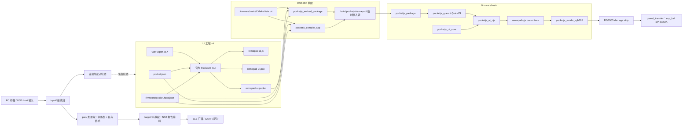
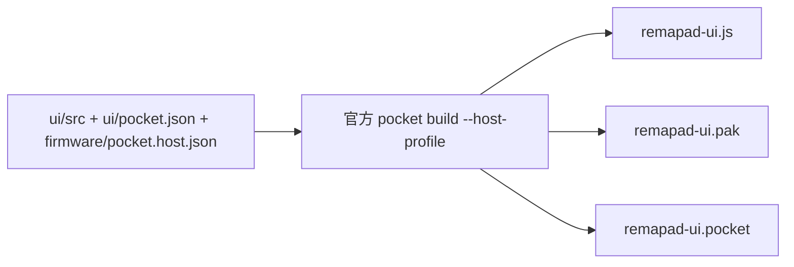
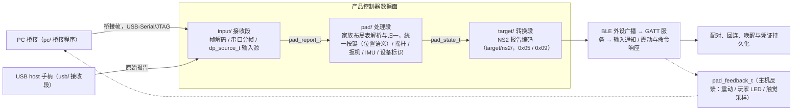
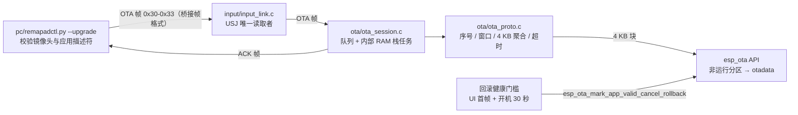

# Remapad 系统架构与技术实现

Remapad 的目标平台是微雪 ESP32-S3-Touch-LCD-1.69（ESP32-S3R8，16 MB Flash + 8 MB Octal PSRAM，板载 240 × 280 ST7789V2 触摸屏）；
板卡事实见 [hardware.md](hardware.md)。最终产品是 USB 到 NS2 BLE 的手柄网关，同时提供本机状态 UI：
架构由 PocketJS UI 工程、PocketJS 官方 ESP-IDF host 和产品控制器数据面组成。
PocketJS 的包格式、host profile 校验、QuickJS guest、UI binding 和 RGB565 renderer 均使用官方实现。

PSP 仅用于理解 PocketJS 的官方 host 示例；本项目不使用 PSP target、PSP 工具链或 PSP 后端。

## 架构原则与不变量

1. **host profile 是设备事实源**：
   `firmware/pocket.host.json` 统一描述 ESP32-S3 的 host ABI、tick、物理/逻辑视口、presentation、raster density 和实际提供的 capability。
2. **不维护私有包格式**：`.pocket`、PAK、plan、profile hash 和 variant admission 全部交给 PocketJS 官方 CLI 与 `pocketjs_package`。
3. **构建期完成资源处理**：Tailwind 子集、字体 atlas、图片和 JavaScript bundle 由官方编译器在主机侧生成，固件不解析 CSS 或矢量字体。
4. **固件拥有硬件边界**：PocketJS 运行时不假设某个屏幕控制器、GPIO 或输入总线。固件负责采样输入、创建显示 DMA 缓冲区、提交 RGB565 strip 和调度设备任务。
5. **渲染采用事务模型**：`prepare` 后逐个渲染 damage region；面板传输全部成功后 `commit`，出现错误时 `abort`。
6. **控制器数据面与 UI 解耦**：USB 接收、输入规范化、NS2 报告编码、BLE 广播/GATT 和配对状态机运行在 ESP-IDF 原生任务/队列中，不通过 PocketJS 每帧 UI 接口传输高频报告。
   协议范围见 [controller.md](controller.md)。

## 系统组成

### 技术选型与职责

| 层次 | 官方或项目组件 | 职责 |
| :--- | :--- | :--- |
| UI | PocketJS Vue Vapor | 声明式组件、响应式状态和嵌入式 UI 图元 |
| 资源编译 | PocketJS 官方 CLI | 解析 manifest、编译 JSX、生成 PAK 和 `.pocket` |
| 设备契约 | `pocket.host.json` | 设备视口、刷新节拍、presentation 和 capability |
| 包接入 | `pocketjs_package` | 借用包字节、选择并校验目标 variant |
| JavaScript | `pocketjs_guest` | 在 ESP-IDF 上创建 QuickJS guest 和执行应用代码 |
| UI binding | `pocketjs_ui_core`、`pocketjs_ui_qjs` | 保留 UI 节点、加载资源并暴露 `globalThis.ui` |
| 调度 | 产品 owner task | `remapad-pjs` 固定 tick 任务，承载 guest 生命周期与每帧 UI turn；官方 `pocketjs_runner` 保留在 `firmware/components/` 但当前未接入 |
| 渲染 | `pocketjs_render_rgb565` | 软件 RGB565 renderer、damage plan 和事务提交 |
| 控制器数据面 | ESP-IDF USB/BLE/GATT/FreeRTOS（规划） | USB 输入接收、输入规范化、NS2 报告编码、BLE 广播/GATT/配对和状态持久化；协议见 [controller.md](controller.md) |
| 升级 | `pc/remapadctl.py --upgrade` + `main/ota/` | 经桥接帧推送整包应用镜像，写非运行分区、`esp_ota_end` 校验后切启动分区并重启；回滚健康门槛见 [ADR 0022](adr/0022-ota-over-bridge-frames-with-rollback.md) |
| 硬件 | 产品 BSP + ESP-IDF | 输入采样、面板初始化、DMA 传输、电源和其他外设 |

## 双工作区结构

```mermaid
flowchart TB
    Root["remapad/"]
    Root --> RootFiles["AGENTS.md / package.json / pnpm-workspace.yaml"]
    Root --> Scripts["scripts/：create_adr.py / pocketjs.mjs（官方工具链与触摸预览入口）/ preview-server.mjs"]
    Root --> Patches["patches/：上游 PocketJS 对账记录与发布说明"]
    Root --> PC["pc/：PC 侧工具 remapadctl（hidapi 读手柄 → 桥接帧，另含命令行、截图与 OTA）与图形入口 remapadgui"]
    Root --> Docs["docs/：VISION / ARCHITECTURE / ABSTRACTIONS / GETTING-STARTED / controller / hardware / adr/"]
    Root --> UI["ui/：PocketJS 前端工作区"]
    Root --> Firmware["firmware/：ESP-IDF 固件工作区"]

    UI --> UiFiles["package.json / pocket.json / jsconfig.json"]
    UI --> UiSrc["src/：index.tsx / App.tsx / 入口同级图片资源 / bridge/（控制面协议）"]
    UI --> UiPreview["preview/：触摸屏预览页"]

    Firmware --> FwRoot["CMakeLists.txt / pocket.host.json / partitions.csv / sdkconfig.defaults"]
    Firmware --> FwComponents["components/：固定在本仓库的官方 PocketJS ESP-IDF 组件与 S3 原生归档"]
    Firmware --> FwMain["main/"]
    FwMain --> MainEntry["main.c / pocketjs_host.c / boot_splash.c / render_accel.c"]
    FwMain --> MainBridge["bridge/：控制面命令与事件"]
    FwMain --> MainConfig["config/：NVS 用户设置持久化"]
    FwMain --> MainConsole["console/：串口 CLI"]
    FwMain --> MainDrivers["drivers/：panel / touch / backlight / pwr_key / buzzer / battery"]
    FwMain --> MainInput["input/：接收段（桥接帧与串口接收）"]
    FwMain --> MainPad["pad/：处理段（私有格式与家族表）"]
    FwMain --> MainTarget["target/：转换段（目标编码，含 target/ns2/）"]
    FwMain --> MainBle["ble/：NimBLE 手柄外设、会话与凭证"]
    FwMain --> MainDp["dp/：数据面任务与输入源抽象"]
    FwMain --> MainOta["ota/：升级会话（分区回写与回滚门槛）"]
```

仓库是自包含的：`firmware/components/` 固定了六个官方 ESP-IDF 组件及 ESP32-S3 原生归档，前端通过官方 `@pocketjs/framework` 与 `@pocketjs/cli` npm 依赖获得编译器与浏览器运行时；
上游 PocketJS checkout 只作为升级对照参考，不是构建依赖。设备屏幕是触摸屏，因此预览使用项目自己的触摸页 `ui/preview/`，而不使用官方 playground 的 PSP 按键界面。
`scripts/pocketjs.mjs` 负责定位 compiler 与 Web 主机、转发参数并回收产物，实际检查、编译、打包、预览和原生归档生成都由官方脚本执行。仓库不再包含手写 PCKT 打包器或 `app_pocket.h`。
`ui/src/bridge/` 与 `firmware/main/bridge/` 是控制面（UI 命令/事件）接口，已接入编译并连到真实 BLE 会话与屏幕 BSP；
数据面按 `input/`、`pad/`、`target/` 三段划分（见 [ADR 0021](adr/0021-input-path-three-stage-layering.md)）。
USB host 直插由 `usb/` 提供接收传输与运行时角色切换，取舍见 [ADR 0027](adr/0027-runtime-usb-role-switch.md)。
反馈方向由 `pad/feedback.c` 按布局行编码成设备输出报告，经 OUT 端点或桥接帧投递。

UI 的首帧预算由设备端建树成本决定：实测每个原生节点约 50 ms（240×280，成本在 Vue Vapor 的逐节点挂载，不在宿主 op 或样式解析）。
`ui/src/App.tsx` 因此在首次渲染里一次挂完七个页面，首屏只在全部建树完成后提交，等待期由固件启动画面覆盖；把建树摊到首帧之后会让首帧后仍有数秒的阻塞帧（切页与滚动都在这段时间里卡住）。
切页只翻转各页根节点的 `hidden`，App 没有页面容器层也没有待挂队列，新增页面直接写在 JSX 里（见 [ADR 0016](adr/0016-mount-all-pages-before-first-frame.md)）。

## 构建链路

### UI 包

应用清单声明应用自身需要的 capability 和视口；host profile 声明设备真实提供的能力。
官方 resolver 会检查二者是否兼容，并将 profile hash、host ABI、tick、视口、density 和 presentation 写入构建计划及包 variant。

### ESP-IDF 包接入

`firmware/main/CMakeLists.txt` 保留官方示例的两种模式：

1. `ui/dist/remapad-ui.pocket` 存在时，调用 `pocketjs_embed_package`。包通过生成的 `.c`/`.S` 文件嵌入固件，生成文件只位于 `firmware/build/`。
2. 没有预构建包时，调用 `pocketjs_compile_app`。
   它让官方 CMake helper 调用 `pocket build --host-profile`，并把依赖文件、plan 和包写入 ESP-IDF build 目录。

组件与 S3 原生归档随仓库一起固定，ESP-IDF 从 `firmware/components/` 直接发现它们；升级时对照上游 PocketJS 更新该目录，并用 `pnpm run native` 重新生成归档。
团队的可复现构建入口是先运行 `pnpm run build` 再运行 `idf.py build`。这样 ESP-IDF 构建阶段只消费已生成的包，不需要在 CMake 中重复实现编译器逻辑。

## 固件运行时生命周期

`firmware/main/pocketjs_host.c` 按官方 smoke 示例组织资源生命周期，但把整套流程放在产品自己的 `remapad-pjs` owner task 上运行：

面板、触摸与背光初始化成功后，owner task 先用 `boot_splash_begin` 自绘一帧启动画面（几何标记 + 阶段进度条）并点亮背光，再按下面的顺序加载 UI；
每个启动阶段经 `boot_splash_progress` 推进一次进度，首帧提交成功后 `boot_splash_end` 释放画面缓冲。
显示与背光从此归 PocketJS 渲染路径所有（选型与代价见 [ADR 0012](adr/0012-firmware-boot-splash-before-ui.md)）。

1. 使用生成的包字节调用 `pocketjs_package_open`。
2. 使用生成的 host contract 调用 `pocketjs_package_select`，完成目标和 ABI 校验。
3. 用官方默认值创建 guest，设置 4 MB JavaScript heap、256 KB 栈预算，并优先使用 PSRAM。
4. 从 package contract 创建 `pocketjs_ui_core`。
5. 创建 `pocketjs_ui_qjs`，feed PAK，mount `globalThis.ui`/`globalThis.__pak`，再 eval JavaScript bundle。
6. 创建 RGB565 renderer 和 render target，并分配一个可复用的 PSRAM strip scratch buffer。
7. 进入固定 tick 循环：`sample_input` 提供输入，`pocketjs_ui_turn` 执行一次 UI turn，再完成 prepare、render strip、commit/abort。

当前 `sample_input` 由 `drivers/touch.c` 采样 CST816T 填入官方 `pocketjs_ui_touch_t` 触点（单点，id 恒为 0）。
每个成功渲染的 strip 在事务内经 `drivers/panel.c` 的 `panel_transfer` 提交到 ST7789V2，全部 region 传输成功后才 `commit`。面板或触摸初始化失败时不阻断启动：
面板失败退回纯渲染 bring-up（帧仍渲染进 PSRAM 后丢弃）并跳过启动画面，触摸失败则每帧零触点。触摸事实已声明进 `firmware/pocket.host.json` 的 `input.touch`。

### 为什么由产品 task 承载 guest 生命周期

QuickJS 的栈守卫判据是 `rt->stack_limit = rt->stack_top - rt->stack_size`，其中 `stack_top` 取自**创建 runtime 的那个任务**；
`JS_UpdateStackTop` 在官方组件和本仓库中都没有被调用。这意味着栈量的是「创建 guest 的任务」的栈，而不是「执行 turn 的任务」的栈。

官方 `pocketjs_guest` 默认把 `stack_limit` 设为 256 KB。Vue Vapor 应用的 mount 是深层递归：
每嵌套一层 UI 大约走 15 个 JS 帧，依实测每帧约消耗 1 KB 的 C 栈，示例界面 mount 需要 60 KB 以上。
如果承载任务栈小于这个预算，守卫永远不会触发，递归会写穿任务栈并破坏相邻的堆元数据，表现为位置漂移的崩溃（堆锁卡死、链表指针损坏、`LoadProhibited`）。

因此本工程让 `remapad-pjs` owner task 用 PSRAM 栈（288 KB）承载创建、mount、eval 和逐帧 turn，并把 `stack_limit` 收敛到 256 KB 的官方默认值。两条约束必须同时成立：
任务栈要大于 `stack_limit`，且不能把 turn 挪到另一个任务上执行。

官方 `pocketjs_runner` 是可选组件，保留在 `firmware/components/` 内但当前未接入。
它的 `pocketjs_runner_config_t` 只能指定栈的**大小**，任务栈始终由 IDF 从内部 RAM 分配，而内部 RAM 拿不出 mount 所需的连续空间；这也是改用产品 task 的原因。
若将来要把 UI turn 集成进已有任务，必须同时保证该任务的栈来自 PSRAM 且满足上述预算，并保留相同的渲染事务边界。

## 产品控制器数据面

最终功能链路独立于 PocketJS UI runtime：

该数据面由 ESP-IDF 原生任务、队列和 BLE/USB 驱动实现，高频报告不经过 UI bridge，也不经过每帧 `pocketjs_ui_turn`。
PocketJS UI 只读取低频连接/电量/配对状态，并发出开始配对、停止配对、背光等控制命令。

三段之间只有两种数据：`pad_report_t`（原始报告 + 设备标识）与 `pad_state_t`（私有格式）。
新增一种手柄时，在 `pad/layouts/` 下对应系列的文件里加一行；新系列则加一个文件并在 `pad/layout.c` 登记。
取舍见 [ADR 0025](adr/0025-pad-layout-modules-per-series.md)。新增一个目标（例如 NS1）在 `target/` 下加一个 `pad_target_t` 实现；
桥接 PC 与 USB host 直插共用 `pad/` 与 `target/` 两段，按键位置映射与轴归一只有一份；
设备自带报告语言与目标一致时由目标原样转发报文体（同代透传，见 [ADR 0026](adr/0026-same-generation-input-passthrough.md)）。
展开见 [ABSTRACTIONS.md](ABSTRACTIONS.md) 的「输入通路：接收 / 处理 / 转换」。

现有 `ui/src/bridge/` 和 `firmware/main/bridge/` 是这一控制面已接入的实现（UI 命令/事件 + 供 PWR 按键与串口 CLI 使用的外部队列入口）。
NS2 的广播字段、GATT、HID 报告、配对和震动命令见 [controller.md](controller.md)，实现前必须用真实设备抓包和互操作测试确认。

## OTA 升级通路

现场升级整包应用镜像（固件 + 内嵌 `.pocket`）走唯一 Type-C 的 USB-Serial/JTAG，通道与固件日志、串口 CLI、桥接输入帧同一条字节流，**不切 USB mux**。
因此升级期间设备照常作为手柄工作，NVS 设置与 BLE 配对凭证不受影响（选型与取舍见 [ADR 0022](adr/0022-ota-over-bridge-frames-with-rollback.md)）。

- **协议**：沿用桥接帧（`A5 5A` + ver/type/slot/seq/len + 载荷 + CRC16）。
  新增 `0x30` BEGIN（`ROM1` + 镜像字节数）、`0x31` DATA（块序号 + 最多 200 字节）、
  `0x32` END 与设备回发的 `0x33` ACK（状态 + 错误码 + 期望序号 + 已收字节；BEGIN 的应答在末尾附 16 字节运行版本）。解码器按线格式上限 255 字节收帧，报文帧仍按 72 字节语义校验。
- **流控**：PC 每 16 帧（约 3.2 KB）为一个窗口，收到 ACK 才发下一窗。窗口末帧在帧头 `slot` 字段带上标记（末尾不足一窗同样标记），设备收到即应答，不必等固定帧数或超时。ACK 的「期望序号」就是重发起点：
  设备丢弃重复序号、不重复写 flash，同一期望序号的重复应答按最小间隔（50 ms）限流，既不淹掉后续应答，也不会把被日志挤掉的那次永久压制。失败一律整包重发，不做断点续传。
- **应答可靠性**：发送环与日志共用，NimBLE 的 INFO 日志会把它填满，因此 ACK 与 PING 应答走「分片重试写 + 等发送完成」的路径（上限 200 ms，超时放弃）；数据面反馈仍是非阻塞写、可丢。
- **写入**：
  `esp_ota_get_next_update_partition()` 选非运行分区，`esp_ota_begin(镜像大小)` 预擦，4 KB 对齐的 `esp_ota_write` 写数据。
  随后 `esp_ota_end()` 整体校验应用描述符、芯片标识与尾部 SHA-256。
  通过后 `esp_ota_set_boot_partition()` 切启动分区，回 ACK 后延时 500 ms 重启。
  任一步失败即 `esp_ota_abort()`，`otadata` 在成功前不动，所以断电与拔线只会让设备继续从旧镜像启动。
- **内存约束**：升级任务由 `xTaskCreate` 创建（栈在内部 RAM），帧队列与 4 KB 聚合缓冲同样固定在内部 RAM——flash 写入的禁缓存窗口内不能访问 PSRAM。
  另外，非 DRAM 缓冲会让 IDF 退化成 32 字节一次的栈拷贝。
- **回滚保护**：开启 `CONFIG_BOOTLOADER_APP_ROLLBACK_ENABLE` 后新镜像以「待验证」启动。
  UI 首帧提交成功且开机满 30 秒才调用 `esp_ota_mark_app_valid_cancel_rollback()`；未过门槛就重启会回退到升级前的镜像。
  待验证窗口内 `esp_ota_begin` 返回 `ESP_ERR_OTA_ROLLBACK_INVALID_STATE`，设备据此回 BUSY。
- **观测**：
  串口 CLI 的 `version`（版本 / 分区 / 待验证状态）与 `status`（`fw=` 与 `ota=` 字段）、UI 系统页的固件信息行共用同一个版本字符串——它来自构建时的 `git describe`。
  写进镜像应用描述符的 `PROJECT_VER`。

## 内存与显示策略

- JavaScript guest 和资源优先使用 8 MB Octal PSRAM。
- `remapad-pjs` owner task 的栈（288 KB）同样分配在 PSRAM，因为 mount 需要的连续 C 栈空间超出内部 RAM 的可用容量。主任务栈保持 32 KB，只负责启动 owner task。
  内部 RAM 因此留给 DMA 缓冲和协议栈，启动后可用量约 360 KB。
- CPU 运行在 240 MHz。UI 每帧把解释执行的 Vue Vapor bundle 加软件 RGB565 渲染跑在一个核上，默认的 160 MHz 会把整个周期吃满并饿死空闲任务。
- 渲染输出走 32 行高的条带：三条 240 × 32 的 strip 缓冲（共 45 kB）优先分配内部 RAM，`render_strip` 每次接收 full-width × 条高的容量与一条行带矩形；
  行带比视口窄时按行压缩成紧凑布局（x = 0 的窗口同样要压缩，否则整体错行），字节序交换由面板传输统一负责。
  提交走 `panel_transfer_async`（只入队并交回完成序号），调用方在轮到某个 strip 槽时用 `panel_wait_seq` 等该槽上一笔传输结束，渲染因此可与 DMA 重叠。
- 显示通路按 30 Hz tick 做预算（节奏取值见 [ADR 0037](adr/0037-ui-tick-rate-30hz.md)），实测瓶颈在 CPU 侧的软件 RGB565 光栅化而不是面板传输：
  整屏 6.72 万像素的位移帧在一次扫描里要花 0.5–0.65 µs/像素（掩码构建、字形图集与纹理采样为主，本机加速回调只占其中很小一部分）。
  因此 damage 按 32 行行带切分，行带在同一帧内按绝对行序自上而下渲染并提交，不切字段。
  静止帧的 turn 实测约 5.7 ms（33.3 ms 预算里约 17%），整幅 240 × 280 帧的渲染实测约 50 ms，重绘帧因此由渲染成本定拍。
  完整测量与隔行方案被否决的理由见 [ADR 0017](adr/0017-display-path-and-scroll-frame-budget.md)。
  面板 SPI2 时钟取上限 80 MHz 的理由见 [ADR 0018](adr/0018-panel-spi2-clock-80mhz.md)。
- 真实面板方向与时序配置（`mirror(true,true)` + `invert_color` + `set_gap(0,20)`、背光 GPIO15）逐条对照微雪官方 ESP-IDF 示例，SPI2 取上限 80 MHz；
  选型见 [ADR 0007](adr/0007-esp-lcd-panel-touch-bsp.md)。
- ESP32-S3 没有本项目所需的 P4 PPA；`firmware/main/render_accel.c` 用本机整数实现接管渲染器的填充、A8 掩码混合与 PSM5650 直拷回调（与官方 P4 适配层同一套 ABI）。
  其余仍走 `pocketjs_render_rgb565` 的软件路径。

## Flash 分区

分区表为终局布局（见 [ADR 0009](adr/0009-ota-storage-flash-layout.md)），一次性划分 OTA 双应用分区与通用存储区，16 MB Flash 不留未分配尾部：

| 分区 | 类型 | 偏移 | 大小 | 用途 |
| :--- | :--- | :--- | :--- | :--- |
| `nvs` | data/nvs | `0x9000` | 24 KB | 设置项（亮度、连发/改建、手柄颜色）、BLE 配对密钥 |
| `phy_init` | data/phy | `0xf000` | 4 KB | 射频校准 |
| `ota_0` | app/ota_0 | `0x10000` | 4 MB | 主应用分区，固件及内置 `.pocket`（继承原 factory 偏移） |
| `ota_1` | app/ota_1 | `0x410000` | 4 MB | OTA 目标分区：`pc/remapadctl.py --upgrade` 推送的镜像先写这里，校验通过后切为启动分区 |
| `otadata` | data/ota | `0x810000` | 8 KB | OTA 启动选择数据 |
| `storage` | data/spiffs | `0x812000` | 约 7.9 MB | 通用数据存储区（首个用途：用户上传的 amiibo/NTAG215），将来挂 littlefs |

包是固件的一部分，不再通过 SPIFFS 运行时加载。若后续包或固件超过 4 MB，应先重新评估分区布局，再修改 `partitions.csv`。布局受 ADR 0009 约束：
新增分区只允许在尾部追加，禁止移动 `nvs`/`phy_init` 偏移，以免升级固件时擦除用户 NVS 数据与配对凭证。

两个应用分区在 OTA 升级里互为备份：升级写的是当前未运行的那个，校验通过才写 `otadata` 切过去（见上文「OTA 升级通路」）。
升级命令、PC 端工具与恢复路径见 [GETTING-STARTED.md](GETTING-STARTED.md) 与 [pc/README.md](../pc/README.md)；
从 `ota_1` 启动之后，开发期固定写 `0x10000` 的 `app-flash` 会写错分区，继续开发前先执行 `idf.py erase-otadata`。

## 相关决策与官方资料

- [ADR 0001：采用 PocketJS 与 Vue Vapor 驱动 ESP32-S3 屏幕 UI](adr/0001-use-pocketjs-vue-vapor-for-esp32s3-ui.md)
- [ADR 0002：旧 bridge/自定义打包方案（已被取代）](adr/0002-adopt-hardware-bridge-and-packaging-architecture.md)
- [ADR 0003：采用官方 PocketJS ESP-IDF host 构建链路](adr/0003-use-official-esp-idf-host.md)
- [ADR 0022：OTA 升级复用桥接帧（USB-Serial/JTAG 双分区回写）与回滚健康门槛](adr/0022-ota-over-bridge-frames-with-rollback.md)
- [Switch 2 / NS2 手柄通信协议与数据交互技术规范](controller.md)
- [PocketJS ESP-IDF 官方指南](https://pocketjs.dev/docs/esp-idf/)
- [PocketJS ESP-IDF 官方 README](https://github.com/pocket-stack/pocketjs/blob/main/hosts/esp-idf/README.md)
