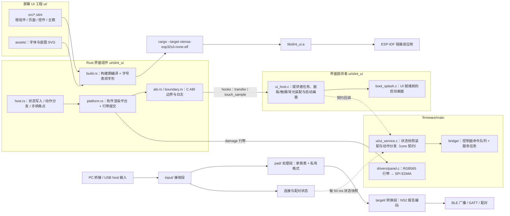
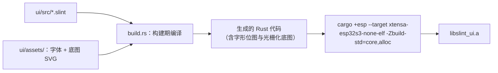
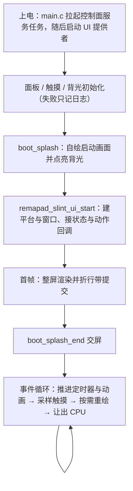
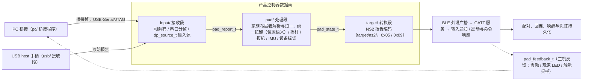
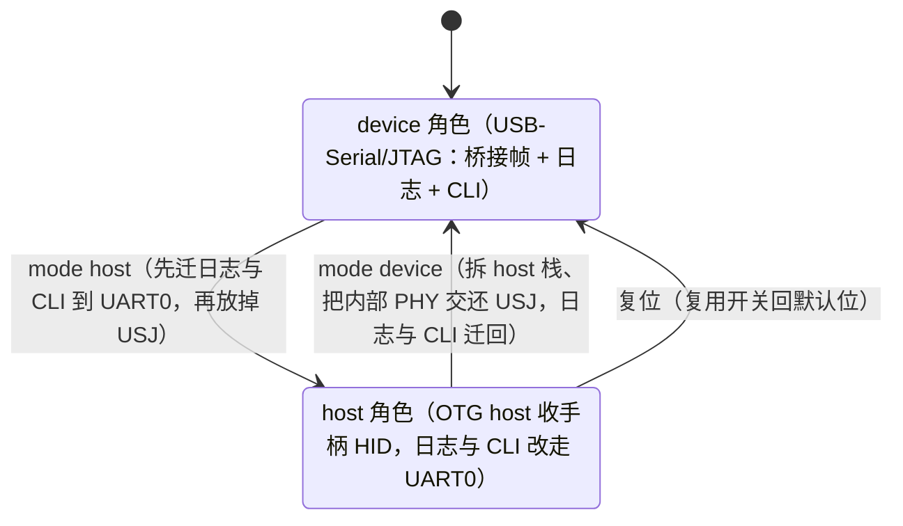
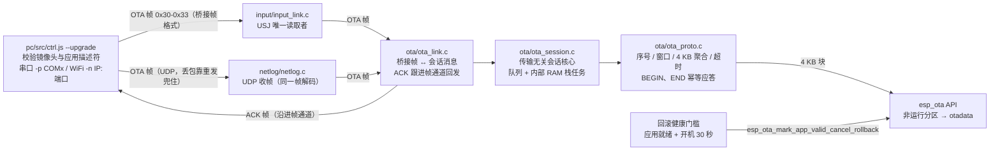
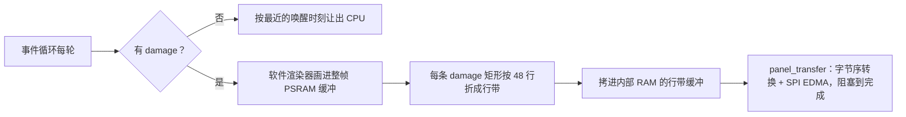
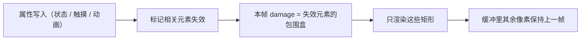

# Remapad 系统架构与技术实现

Remapad 是运行在 ESP32-S3 硬件上的 USB 到 NS2 BLE 手柄网关，包含屏幕 UI 工程（`ui/`）与固件核心（`firmware/`）。
两者通过 `ui_service.h` 契约解耦，固件核心负责数据面与外设，UI 负责状态展示与交互。

## 架构原则与不变量

1. **视口规格**：固定 240 × 280 分辨率，动画以 16 ms（60 Hz）对齐。
2. **界面状态驱动**：界面视图定义在 `ui/src/`，固件侧仅提供状态快照与动作分发回调。
3. **构建期资源烘焙**：界面字形子集位图与矢量图在构建期固化，固件运行时不解析字体与矢量图。
4. **硬件抽象边界**：UI 平台层通过 `remapad_slint_hooks_t` 接口对接硬件，不直接访问 GPIO 与外设总线。
5. **局部增量渲染**：每帧仅重新渲染 damage 区域，平台将其拆分为 48 行行带分次提交到面板。
6. **数据面与控制面分离**：高频手柄输入、协议转换与 BLE 传输独立运行，不进入低频 UI 状态轮询。
7. **核心无 UI 依赖**：固件核心不依赖特定 UI 框架头文件，支持无 UI 条件下独立编译与运行。

## 系统组成

```mermaid
flowchart LR
    subgraph Ui[屏幕 UI 工程 ui/]
        Source["src/*.slint<br/>根组件 / 页面 / 控件 / 主题"]
        Assets["assets/：字体与底图 SVG"]
    end

    subgraph Rust[Rust 界面组件 ui/slint_ui]
        BuildScript["build.rs：构建期编译 + 字号表烘字形"]
        Host["host.rs：状态写入 / 动作分发 / 手柄焦点"]
        Platform["platform.rs：软件渲染平台 + 行带提交"]
        Abi["abi.rs / boundary.rs：C ABI 边界与日志"]
        Host --> Platform
        Platform --> Abi
    end

    subgraph Firmware[firmware/main]
        UiService["ui/ui_service.c：状态快照装配与动作分发（core 契约）"]
        Bridge["bridge/：控制面命令队列 + 服务任务"]
        Panel["drivers/panel.c：RGB565 行带 → SPI EDMA"]
        UiService --> Bridge
    end
    subgraph UiHost[界面提供者 ui/slint_ui]
        FwHost["ui_host.c：提供者任务、面板/触摸/背光装配与启动画面"]
        Splash["boot_splash.c：UI 就绪前的启动画面"]
        FwHost --> Splash
        FwHost -.契约回调.-> UiService
    end

    Source --> BuildScript
    Assets --> BuildScript
    BuildScript --> Cargo["cargo --target xtensa-esp32s3-none-elf"]
    Cargo --> Lib["libslint_ui.a"]
    Lib --> Link["ESP-IDF 链接进应用"]
    Abi -->|"hooks：transfer / touch_sample"| FwHost
    Platform -->|"damage 行带"| Panel

    Input["PC 桥接 / USB host 输入"] --> Recv["input/ 接收段"]
    Recv --> Pad["pad/ 处理段：家族表 + 私有格式"]
    Pad --> Encoder["target/ 转换段：NS2 报告编码"]
    Encoder --> BLE["BLE 广播 / GATT / 配对"]
    Recv --> State["连接与配对状态"]
    State -.每 50 ms 状态快照.-> UiService
```

### 技术选型与职责

| 层次 | 官方或项目组件 | 职责 |
| :--- | :--- | :--- |
| UI | 声明式界面框架（`ui/src`） | 声明式组件、属性绑定与回调；颜色与字号收在 `theme.slint` 的语义 token 里 |
| 界面编译 | 构建脚本（口径收在 `ui/build-support`，host 与组件的 `build.rs` 共用） | 把界面源码编成 Rust 代码，按字号表烘字形位图、光栅化 SVG |
| 平台层 | `ui/slint_ui/src/platform.rs` | 软件渲染器、整帧 PSRAM 缓冲、damage 折行带并提交；单线程前提（`unsafe-single-threaded`） |
| 宿主层 | `ui/slint_ui/src/host.rs` | 把状态快照写进界面属性，把界面动作与手柄按键翻译成回调 |
| C ABI | `ui/slint_ui/include/slint_ui.h` | 状态快照、动作回调、面板与触摸 hooks、统计与截图入口 |
| UI 契约 | `firmware/main/ui/ui_service.h` | 核心侧状态快照装配、动作分发与生命周期入口 |
| 调度 | 界面提供者任务 + 控制面服务任务 | 界面事件循环与控制面服务调度 |
| 控制器数据面 | 数据面任务与驱动 | USB 输入接收、规范化、NS2 编码、BLE 广播与连接管理 |
| 升级 | `pc/src/ctrl.js --upgrade` + `main/ota/` | 固件 OTA 镜像接收与分区写入校验 |
| 硬件 | BSP 驱动层 | 屏幕面板、触摸、按键、蜂鸣器与电池驱动 |

## 工作区结构

```mermaid
flowchart TB
    Root["remapad/"]
    Root --> RootFiles["AGENTS.md / .editorconfig / .gitignore"]
    Root --> Scripts["scripts/：create_adr.py / firmware-test.py / setup-rust-toolchain.py"]
    Root --> PC["pc/：PC 侧工具 ctrl.js（node-hid 读手柄 → 桥接帧，另含命令行、截图与 OTA）与连接控制台 gui-server"]
    Root --> Docs["docs/：系统架构、协议规范、硬件参考与 ADR"]
    Root --> UI["ui/：屏幕 UI 工作区（界面源码、固件界面组件与宿主用例）"]
    Root --> Firmware["firmware/：ESP-IDF 固件核心工作区"]

    UI --> UiSrc["src/：app.slint / pages.slint / components.slint / theme.slint"]
    UI --> UiAssets["assets/：字体（正文 / 图标 / 转圈）与底图 SVG"]
    UI --> UiHost["host/：宿主用例包（测试后端 + 软件渲染器）"]
    UI --> UiFw["slint_ui/：固件界面组件（Rust 静态库、平台层、C ABI 与装配层 ui_host.c）"]
    UI --> UiPlan["render-plan/：行带计划（damage 裁剪、行带切分与逐行拷贝，平台层与宿主用例共用）"]
    UI --> UiSupport["build-support/：两份 build.rs 共用的编译口径"]
    UI --> UiPreview["preview/：浏览器 WASM 预览与 Playwright 端到端用例"]
    UI --> UiBuild["Cargo.toml：workspace 清单与唯一的 Cargo.lock"]

    Firmware --> FwRoot["CMakeLists.txt（REMAPAD_UI 开关 + EXTRA_COMPONENT_DIRS）/ partitions.csv / sdkconfig.defaults"]
    Firmware --> FwMain["main/"]
    FwMain --> MainEntry["main.c（启动装配）/ ui/（UI 契约与快照装配，无 UI 构建另有空实现）"]
    FwMain --> MainBridge["bridge/：控制面命令与事件"]
    FwMain --> MainConfig["config/：NVS 用户设置持久化"]
    FwMain --> MainConsole["console/：串口 CLI"]
    FwMain --> MainDrivers["drivers/：panel / touch / backlight / pwr_key / buzzer / battery"]
    FwMain --> MainInput["input/：接收段（桥接帧与串口接收）"]
    FwMain --> MainPad["pad/：处理段（私有格式与家族表）"]
    FwMain --> MainTarget["target/：转换段（目标编码，含 target/ns2/）"]
    FwMain --> MainBle["ble/：NimBLE 手柄外设、会话与凭证"]
    FwMain --> MainDp["dp/：数据面任务与输入源抽象"]
    FwMain --> MainOta["ota/：升级通道（传输无关会话核心 + 桥接帧适配）"]
```

`ui/` 工作区承载界面源码、字体资源与测试用例，通过构建生成静态库交由固件链接。
`firmware/` 工作区承载驱动、数据面与控制面，通过 `ui_service.h` 与界面交互。
`pc/` 工作区承载 PC 侧工具（桥接、CLI、连接控制台与 MCP 服务），以桥接帧与 CLI 和固件通信，细节见 pc/README.md。
界面各页面全部常驻，切页通过更新状态属性控制可见性。

## 构建链路

### 界面编译

```mermaid
flowchart LR
    Source["ui/src/*.slint"]
    Assets["ui/assets/：字体 + 底图 SVG"]
    SlintBuild["build.rs：构建期编译"]
    Code["生成的 Rust 代码<br/>（含字形位图与光栅化底图）"]
    Cargo["cargo +esp --target xtensa-esp32s3-none-elf -Zbuild-std=core,alloc"]
    Lib["libslint_ui.a"]

    Source --> SlintBuild
    Assets --> SlintBuild
    SlintBuild --> Code
    Code --> Cargo
    Cargo --> Lib
```

字号与样式口径收敛在 `ui/build-support`，构建期提取字符子集并烘焙字形位图。

### ESP-IDF 组件接入

`REMAPAD_UI` 开关控制是否编译界面组件（默认 ON）。
关闭时以 `ui_stub.c` 替代，屏幕关闭，控制走串口 CLI。
开启时由 `ui/slint_ui` 构建静态库并由 CMake 统一链入。

## 固件运行时生命周期

`main.c` 启动控制面服务任务，随后根据构建形态启动 UI 提供者。

```mermaid
flowchart TB
    Boot["上电：main.c 拉起控制面服务任务，随后启动 UI 提供者"] --> Drv["面板 / 触摸 / 背光初始化（失败只记日志）"]
    Drv --> Splash["boot_splash：自绘启动画面并点亮背光"]
    Splash --> Start["remapad_slint_ui_start：建平台与窗口、接状态与动作回调"]
    Start --> First["首帧：整屏渲染并折行带提交"]
    First --> Ready["boot_splash_end 交屏"]
    Ready --> Loop["事件循环：推进定时器与动画 → 采样触摸 → 按需重绘 → 让出 CPU"]
    Loop --> Loop
```

UI 任务负责外设初始化、启动画面渲染以及界面事件循环。
状态快照由定时器周期性更新，动作事件通过命令队列交由控制面任务异步执行。

## 产品控制器数据面

最终功能链路独立于屏幕 UI：

```mermaid
flowchart LR
    Bridge["PC 桥接（pc/ 桥接程序）"]
    Host["USB host 手柄（usb/ 接收段）"]

    subgraph Plane[产品控制器数据面]
        Recv["input/ 接收段<br/>帧解码 / 串口分帧 / dp_source_t 输入源"]
        Pad["pad/ 处理段<br/>家族布局表解析与归一，统一按键（位置语义）/ 摇杆 / 扳机 / IMU / 设备标识"]
        Encode["target/ 转换段<br/>NS2 报告编码（target/ns2/，0x05 / 0x09）"]
        Recv -->|pad_report_t| Pad
        Pad -->|pad_state_t| Encode
    end

    BLE["BLE 外设广播 → GATT 服务 → 输入通知 / 震动与命令响应"]
    Cred["配对、回连、唤醒与凭证持久化"]
    Feedback["pad_feedback_t（主机反馈：震动 / 玩家 LED / 触觉采样）"]

    Bridge -->|桥接帧，USB-Serial/JTAG| Recv
    Host -->|原始报告| Recv
    Encode --> BLE
    BLE --> Cred
    BLE -.-> Feedback
    Feedback -.-> Bridge
```

数据面独立处理高频输入与协议编码，屏幕仅读取低频状态快照，通过控制面分发控制指令。

### USB 角色切换

USB 角色支持运行时切换（不持久化至 NVS）：

```mermaid
stateDiagram-v2
    [*] --> Device
    Device: device 角色（USB-Serial/JTAG：桥接帧 + 日志 + CLI）
    Host: host 角色（OTG host 收手柄 HID，日志与 CLI 改走 UART0）
    Device --> Host: mode host（先迁日志与 CLI 到 UART0，再放掉 USJ）
    Host --> Device: mode device（拆 host 栈、把内部 PHY 交还 USJ，日志与 CLI 迁回）
    Host --> Device: 复位（复用开关回默认位）
```

切换至 host 模式后串口日志与 CLI 迁移至 UART0，切回 device 模式交还内部 PHY。

## OTA 升级通路

支持通过 USB 串口或局域网 UDP 升级整包固件镜像，双通道复用同一套协议帧与升级会话。

```mermaid
flowchart LR
    Tool["pc/src/ctrl.js --upgrade<br/>校验镜像头与应用描述符<br/>串口 -p COMx / WiFi -n IP:端口"]
    Link["input/input_link.c<br/>USJ 唯一读取者"]
    Net["netlog/netlog.c<br/>UDP 收帧（同一帧解码）"]
    Adapt["ota/ota_link.c<br/>桥接帧 ↔ 会话消息<br/>ACK 跟进帧通道回发"]
    Session["ota/ota_session.c<br/>传输无关会话核心<br/>队列 + 内部 RAM 栈任务"]
    Proto["ota/ota_proto.c<br/>序号 / 窗口 / 4 KB 聚合 / 超时<br/>BEGIN、END 幂等应答"]
    Flash["esp_ota API<br/>非运行分区 → otadata"]
    Health["回滚健康门槛<br/>应用就绪 + 开机 30 秒"]

    Tool -->|"OTA 帧 0x30-0x33（桥接帧格式）"| Link
    Tool -->|"OTA 帧（UDP，丢包靠重发兜住）"| Net
    Link -->|OTA 帧| Adapt
    Net -->|OTA 帧| Adapt
    Adapt --> Session
    Session --> Proto
    Proto -->|"4 KB 块"| Flash
    Adapt -->|"ACK 帧（沿进帧通道）"| Tool
    Health -->|esp_ota_mark_app_valid_cancel_rollback| Flash
```

- **协议帧**：`0x30` BEGIN（尺寸）、`0x31` DATA（序号+数据）、`0x32` END（结束）、`0x33` ACK（应答）。
- **流控与写入**：PC 端按 16 帧窗口发送并等待 ACK；固件将数据聚合为 4 KB 写入非运行分区。
- **校验与回滚**：镜像写入完成通过校验后切换启动分区；启动后通过 30 秒健康门槛方才确认镜像有效，否则触发自动回滚。

## 内存与显示策略

```mermaid
flowchart LR
    Loop["事件循环每轮"] --> Need{"有 damage？"}
    Need -->|否| Idle["按最近的唤醒时刻让出 CPU"]
    Need -->|是| Render["软件渲染器画进整帧 PSRAM 缓冲"]
    Render --> Bands["每条 damage 矩形按 48 行折成行带"]
    Bands --> Copy["拷进内部 RAM 的行带缓冲"]
    Copy --> Transfer["panel_transfer：字节序转换 + SPI EDMA，阻塞到完成"]
```

- **两级缓冲**：整帧缓冲（240 × 280 × 2 字节）位于 PSRAM，行带缓冲（240 × 48 × 2 字节）位于内部 RAM。
- **行带提交**：damage 区域按 48 行拆分为行带，经 SPI DMA 提交到 ST7789V2 面板。

### 重画范围与代价

```mermaid
flowchart LR
    Prop["属性写入（状态 / 触摸 / 动画）"] --> Invalidate["标记相关元素失效"]
    Invalidate --> Damage["本帧 damage = 失效元素的包围盒"]
    Damage --> Render["只渲染这些矩形"]
    Render --> Keep["缓冲里其余像素保持上一帧"]
```

仅失效元素的包围盒参与重新渲染，未变化区域复用上一帧像素缓冲。

## Flash 分区

16 MB Flash 分区布局：

| 分区 | 类型 | 偏移 | 大小 | 用途 |
| :--- | :--- | :--- | :--- | :--- |
| `nvs` | data/nvs | `0x9000` | 24 KB | 设置项、BLE 配对密钥 |
| `phy_init` | data/phy | `0xf000` | 4 KB | 射频校准 |
| `ota_0` | app/ota_0 | `0x10000` | 4 MB | 运行应用分区（固件与界面） |
| `ota_1` | app/ota_1 | `0x410000` | 4 MB | OTA 升级目标分区 |
| `otadata` | data/ota | `0x810000` | 8 KB | OTA 启动选择数据 |
| `storage` | data/spiffs | `0x812000` | 约 7.9 MB | 通用数据存储区（amiibo 等资源） |
