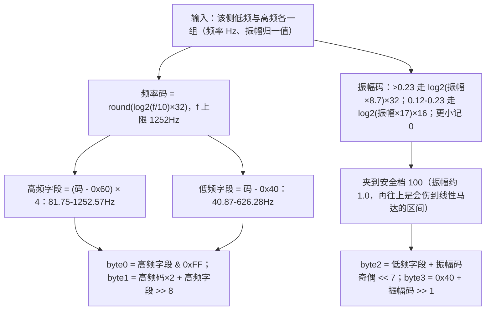
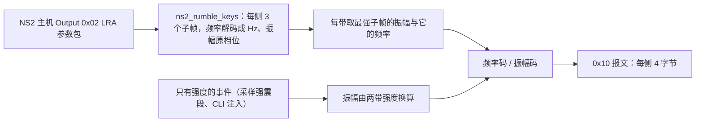

# Switch 一代手柄数据规范（Pro Controller / Joy-Con）

本规范记录 Switch 一代手柄（Pro Controller、Joy-Con L / R）的输入报告布局与输出报告（震动）数据，
作为家族布局表（[pad/layouts/ns.c](../firmware/main/pad/layouts/ns.c) 的 NS1 行）与反馈编码的数据依据；
NS2 主机协议见 [controller-switch2.md](controller-switch2.md)，Xbox 家族见 [controller-xbox.md](controller-xbox.md)，
XInput 形态见 [controller-xinput.md](controller-xinput.md)，PS 家族见 [controller-ps.md](controller-ps.md)。
字段偏移与编码规则取自公开的逆向工程资料，落地前用 `pc/remapadctl.py --dump` 抓原始报告核对，核对状态见文末。

## 型号与标识

| 型号 | VID:PID | 报文（Report ID） | 备注 |
| :--- | :--- | :--- | :--- |
| Pro Controller | `0x057E:0x2009` | `0x30` | 有线与蓝牙的报文体一致 |
| Joy-Con (L) | `0x057E:0x2006` | `0x3F` | 单手柄连接的简单报文，摇杆占左手柄那一槽 |
| Joy-Con (R) | `0x057E:0x2007` | `0x3F` | 摇杆占右手柄那一槽，首字节是面键 |

`0x21`（子命令应答）、`0x31` / `0x32` / `0x33`（高频上报）与 `0x30` 共用同一份报文体，
布局行只登记 `0x30`；伪装的第三方手柄多数报 `0x3F`，本设备登记的两个 PID 是真 Joy-Con 的。

NS1 设备自带的报告语言与 NS2 目标不同，因此不走同代透传，一律解析后重新编码；设备的运动与耳机状态按各自的偏移解析。

## 输入报告布局（标准报文 `0x30`）

偏移一律从报告首字节起算（含 Report ID）。

| 字段 | 偏移 | 长度 | 说明 |
| :--- | :--- | :--- | :--- |
| 报文体计时 | `0x01` | 1 | 逐包递增，本设备不解析 |
| 电量与连接 | `0x02` | 1 | 高四位是 0-9 档（8 即满、9 是满电后的缓升档）、bit0 充电中 |
| 按键（右半边） | `0x03` | 1 | 面键与 R / ZR |
| 按键（两侧共用） | `0x04` | 1 | Minus / Plus / 摇杆按下 / Home / Capture |
| 按键（左半边） | `0x05` | 1 | 四向键与 L / ZL |
| 左摇杆 | `0x06` | 3 | 12 位紧凑打包 |
| 右摇杆 | `0x09` | 3 | 同上 |
| 振动器状态 | `0x0C` | 1 | 决定下一段震动模式的字节，本设备不解析 |
| 6 轴样本 | `0x0D` | 36 | 3 份 × 12 字节，每份加速在前、陀螺在后 |

| 字节 | bit0 | bit1 | bit2 | bit3 | bit4 | bit5 | bit6 | bit7 |
| :--- | :--- | :--- | :--- | :--- | :--- | :--- | :--- | :--- |
| `0x03`（右） | Y | X | B | A | SR | SL | R | ZR |
| `0x04`（共用） | Minus | Plus | R3 | L3 | Home | Capture | — | 充电握把 |
| `0x05`（左） | 下 | 上 | 右 | 左 | SR | SL | L | ZL |

面键按位置语义映射：NS 的 X（上）→ `PAD_BTN_TRIANGLE`、A（右）→ `PAD_BTN_CIRCLE`、
B（下）→ `PAD_BTN_CROSS`、Y（左）→ `PAD_BTN_SQUARE`；Minus → `PAD_BTN_TOUCHPAD`（减号位）、
Plus → `PAD_BTN_OPT`（加号位）、Capture → `PAD_BTN_SHARE`（截图位）、Home → `PAD_BTN_HOME`。
滑轨键（SL / SR）与充电握把位不映射。ZL / ZR 是数字位，解析侧按满量程扳机填，目标侧照常按
50% 阈值数字化。

摇杆是 12 位紧凑打包：X = `d[0] | ((d[1] & 0x0F) << 8)`、Y = `(d[1] >> 4) | (d[2] << 4)`，
设备 Y 轴向下为正。6 轴样本每份 12 字节 = 加速 XYZ（3 个 16 位小端）+ 陀螺 XYZ，一帧三份取
最后一份（最新采样）。
6 轴样本的刻度就是本设备私有格式的统一刻度（加速 4096 计数每 g、陀螺 14247 计数每 1000 °/s 的标称值，
取自 Linux `hid-nintendo.c` 的 `JC_IMU_*` 常量），因此 NS 行不声明换算比，其余家族按自己的原始刻度换算到这套刻度。

## 输入报告布局（简单报文 `0x3F`）

| 字段 | 偏移 | 长度 | 说明 |
| :--- | :--- | :--- | :--- |
| 按键（本侧） | `0x01` | 1 | 左手柄是四向键、右手柄是面键 |
| 按键（共用） | `0x02` | 1 | Minus / Plus / 摇杆按下 / Home / Capture / L 或 R / ZL 或 ZR |
| 摇杆帽子 | `0x03` | 1 | 摇杆方向的数字表示，本设备不解析（摇杆已按轴上报） |
| 摇杆（左槽） | `0x04` | 4 | 两对 16 位小端（X 在前），中位 `0x8000` |
| 摇杆（右槽） | `0x08` | 4 | 同上；单只手柄只用属于自己的一槽，另一槽是填充值 |

| 字节 | bit0 | bit1 | bit2 | bit3 | bit4 | bit5 | bit6 | bit7 |
| :--- | :--- | :--- | :--- | :--- | :--- | :--- | :--- | :--- |
| `0x01`（左手柄） | 下 | 右 | 左 | 上 | SL | SR | — | — |
| `0x01`（右手柄） | Y | X | B | A | SR | SL | — | — |
| `0x02`（共用） | Minus | Plus | R3 | L3 | Home | Capture | L / R | ZL / ZR |

共用字节的 L / R 与 ZL / ZR 按手柄侧取含义（左手柄是 L 与 ZL、右手柄是 R 与 ZR），
因此两侧各有一份按键表。这份报文里没有电量与运动区段，两者都不解析。

## 输出报告（震动，Report ID `0x10`）

| 偏移 | 字段 |
| :--- | :--- |
| `0x00` | Report ID `0x10` |
| `0x01`-`0x04` | 左手柄震动 4 字节 |
| `0x05`-`0x08` | 右手柄震动 4 字节 |

静置形态是 `00 01 40 40`（高频 320Hz、低频 160Hz、振幅 0），每侧各一份。玩家灯与控制灯
不在本设备驱动的范围内。

### 单侧 4 字节的编码

4 字节依次是：高频频率低位、高频频率高位与振幅、低频频率与控制位、低频振幅。

| 字节 | 取值 | 说明 |
| :--- | :--- | :--- |
| `byte0` | 高频字段的低 8 位 | 静置时 `0x00` |
| `byte1` | 高频振幅码 × 2 + 高频字段的位 8 | 静置时 `0x01`（频率 320Hz、振幅 0） |
| `byte2` | 低频字段 + 振幅码奇偶的 `0x80` | 静置时 `0x40` |
| `byte3` | `0x40` + 振幅码 >> 1 | 静置时 `0x40` |

低频振幅的 `0x80` 是半档标志：振幅码的奇偶进这一位，低频字段本身是 7 位幅度，
静置形态因此正好落在 `00 01 40 40`。

### 与 NS2 主机波形的对接

主机下发的 LRA 参数包本身就是「每侧最多 3 个时序子帧、每子帧带低频与高频的频率与振幅」，
与 NS1 的震动是同一族描述，因此 NS1 的震动直接吃主机波形（不经过 ERM 的感知重映射）：

协议没给频率时按该带缺省频率补足（低频 160Hz、高频 320Hz，取自静置形态），振幅为 0 的一侧
整块回落成静置形态——手柄不会停在上一段震动上。

## 核对状态与实测记录

| 数据 | 状态 |
| :--- | :--- |
| `0x30` 的按键、12 位摇杆、电量与 6 轴偏移 | 取自公开的逆向工程资料，未实机核对 |
| 6 轴样本的刻度（4096 计数/g、14247 计数每 1000 °/s） | 标称值取自 Linux `hid-nintendo.c` 的常量，未实机核对 |
| `0x3F` 的按键分侧与摇杆槽位 | 左手柄与共用字节按资料登记；右手柄首字节按标准报文的右手柄表推断，待实机核对 |
| `0x3F` 的报文长度与尾部区段（红外 / 磁力计） | 未登记；运动与电量都不解析 |
| 震动编码（频率码、振幅码两段曲线、安全档 100） | 公式取自公开资料，落地值待实机与听感核对 |
| 缺省频率（低频 160Hz、高频 320Hz） | 取自静置形态的公开说明 |
| 玩家灯与控制灯 | 未登记 |

## 参考资料

- dekuNukem 的 Nintendo_Switch_Reverse_Engineering：`bluetooth_hid_notes.md`（`0x3F` 与
  `0x30` 报文体、OUTPUT `0x10` 的形态、静置震动值）、`rumble_data_table.md`
  （频率与振幅的编码公式、两张取值表与安全档说明）。
- Linux 内核 `drivers/hid/hid-nintendo.c`：Joy-Con 的按键位定义、频率与振幅的查表实现。
