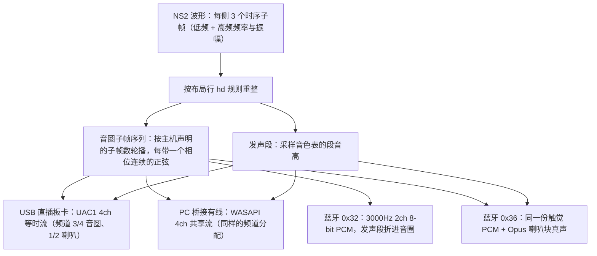
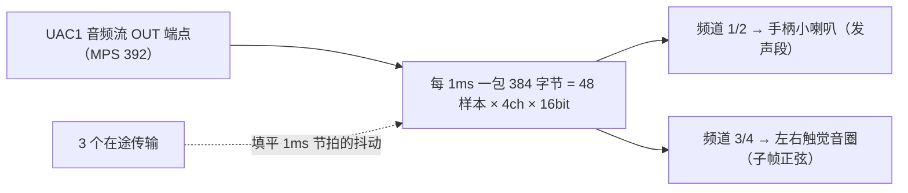
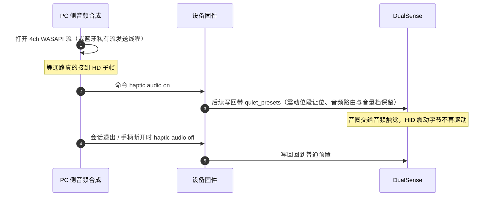
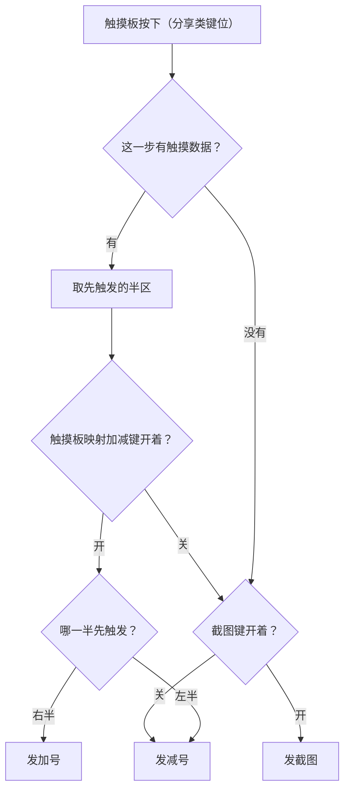

# PS 家族手柄数据规范（DualShock 3 / DualShock 4 / DualSense）

本规范记录 PS 家族手柄（DualShock 3、DualShock 4、DualSense 与 DualSense Edge）在 USB 与蓝牙下的
输入报告布局、输出报告与触觉通道数据，作为家族布局表与反馈编码的数据依据；NS2 主机协议见
[controller-switch2.md](controller-switch2.md)，数据面结构见 [ABSTRACTIONS.md](ABSTRACTIONS.md)。
字段偏移的初值多取自公开实现，落地前用 `pc/remapadctl.py --dump` 抓原始报告核对，核对状态见文末。

## 型号与标识

| 型号 | VID:PID | 有线 Report ID | 蓝牙 Report ID | 备注 |
| :--- | :--- | :--- | :--- | :--- |
| DualShock 3 | `0x054C:0x0268` | `0x01` | `0x01` | 两种连接的字段偏移一致（蓝牙多一层传输头，剥掉后与有线相同） |
| DualShock 4（初代 / Slim） | `0x054C:0x05C4`、`0x054C:0x09CC` | `0x01` | `0x11` | 蓝牙比有线多两字节前缀 |
| DualSense | `0x054C:0x0CE6` | `0x01` | `0x31` | 蓝牙比有线多三字节前缀 |
| DualSense Edge | `0x054C:0x0DF2` | `0x01` | `0x31` | 背键在按键位图第三字节高两位；左右 Fn 键是配置档修饰键，不映射 |

同一个 Report ID 下按 PID 分行：DS3、DS4 与 DualSense 有线都报 `0x01`，但字段偏移各不相同。

## 共同约定

- **按键位序**：DS4 与 DualSense 共用一套——第一字节低四位是方向键帽子开关、高四位是面键，
  第二字节是肩键、Create/Options 与摇杆按下，第三字节是 PS、触摸板按下与静音键。
  DS3 没有帽子开关，方向键与其余按键都在按键位图里，自带一份映射。
- **摇杆**：单字节，中位 `0x80`；设备 Y 轴向下为正，解析侧翻成「上为正」。
- **触摸点**：每个触点 4 字节，首字节 bit7 为 0 表示这一路有触点（低 7 位是触点 ID），
  其余三字节是 12 位 X（低 8 位 + 高 4 位）与 12 位 Y（高 4 位 + 低 8 位）；左右半区按归一后的 X 判定。
  DS4 一帧带多份触摸历史（1 字节份数 + 每份 9 字节 = 1 字节时间戳 + 2 个触点），USB 三份、蓝牙四份，取第一份；
  DualSense 只有一份。
- **电量字节**：低四位 0-10 档、bit4 表示充电中。
- **耳机状态字节**：bit0 插入、bit1 带麦；带麦档位在主机侧另需音频通路，见下「耳机状态」。
- **运动字段**：6 个 int16 小端（陀螺 XYZ + 加速 XYZ）；DS3 的字段是大端加速度加独立陀螺，与统一格式不同，不登记。

## 输入报告布局

偏移一律从报告首字节起算（含 Report ID）。

### DualShock 3（`0x01`，有线与蓝牙共用一行）

| 字段 | 偏移 | 长度 | 说明 |
| :--- | :--- | :--- | :--- |
| 按键位图 | `0x05` | 3 | 方向键在按键位图里，没有帽子开关 |
| 摇杆（四轴） | `0x01` | 4 | LX / LY / RX / RY |
| 扳机压力 | `0x0C` | 2 | L2 / R2 走同字的压力值，数字位不映射 |
| 触摸 / 运动 / 电量 / 耳机 | — | — | 不登记（运动格式不一致，电量要走特性报告查询） |

### DualShock 4

| 字段 | 有线 `0x01` | 蓝牙 `0x11` |
| :--- | :--- | :--- |
| 按键位图（3B） | `0x05` | `0x07` |
| 帽子开关 | `0x05` | `0x07` |
| 摇杆（四轴） | `0x01` | `0x03` |
| 扳机 | `0x08` / `0x09` | `0x0A` / `0x0B` |
| 运动字段 | `0x0D` | `0x0F` |
| 电量 | `0x1E` | `0x20` |
| 第一个触点 | `0x23` | `0x25` |
| 触摸量程 | 1919 × 942 | 1919 × 942 |

### DualSense

| 字段 | 有线 `0x01` | 蓝牙 `0x31` |
| :--- | :--- | :--- |
| 按键位图（3B） | `0x08` | `0x09` |
| 帽子开关 | `0x08` | `0x09` |
| 摇杆（四轴） | `0x01` | `0x02` |
| 扳机 | `0x05` / `0x06` | `0x06` / `0x07` |
| 运动字段 | `0x10` | `0x11` |
| 第一个触点 | `0x21` | `0x22` |
| 触摸量程 | 1919 × 1079 | 1919 × 1079 |
| 电量 | — | `0x36` |
| 耳机状态 | — | `0x37`（`0x38` 跟着 bit0 走） |

有线行的偏移由蓝牙值减去三字节前缀换算，核对前作初值；电量与耳机状态字节本轮不登记。

### 耳机状态（3.5mm）

DualSense 蓝牙（`0x31`）第 55 字节（`0x37`）bit0 是插入、bit1 是带麦，第 56 字节跟着 bit0 走；
DualSense Edge 上按插拔差分核对（插 → 拔 → 插得到 `0x03` → `0x00` → `0x01` → `0x03`），该行登记 `headset_off = 55` 与 `PAD_HEADSET_PS`。
DS4 与 DualSense 有线行的耳机字节未核对，保持不解析；派生值只报「插入」档的原因见
[controller-switch2.md](controller-switch2.md) 的输入报告一节，逐手柄复核步骤见 [../pc/README.md](../pc/README.md) 的「3.5mm 耳机状态」。

## 输出报告（反馈）

### DualShock 3（`0x01`，48 字节）

| 偏移 | 字段 |
| :--- | :--- |
| `0x02` | 右小马达时长 |
| `0x03` | 右小马达强度 |
| `0x04` | 左大马达时长 |
| `0x05` | 左大马达强度 |

时长写 `0xFF` 表示保持到下一条命令；偏移取自公开实现，未实机核对。LED 控制要另走 SET_REPORT 序列，本轮不映射。

### DualShock 4

| 形态 | 长度 | 布局 |
| :--- | :--- | :--- |
| 有线 `0x05` | 32 字节 | `b1` flags（`0x01` 震动、`0x02` 灯条颜色）、`b4` 右小马达、`b5` 左大马达、`b6-b8` 灯条 RGB |
| 蓝牙 `0x11` | 78 字节 | `b1` hw_control（`0xC0` = HID + CRC32）、`b2` 音频控制、`b6` 右小马达、`b7` 左大马达、`b8-b10` 灯条 RGB、末 4 字节 CRC32 |

### DualSense

| 形态 | 长度 | 布局 |
| :--- | :--- | :--- |
| 有线 `0x02` | 48 字节 | `b1`/`b2` valid flag、`b3` 右小马达、`b4` 左大马达、`b6` 喇叭音量、`b8` 音频控制、`b38` 前级增益、`b44` 玩家灯、`b45-b47` 灯条 RGB |
| 蓝牙 `0x31` | 78 字节 | `b1` 序号半字节、`b2` 固定魔数 `0x10`、公共段从 `b3` 起、`b46` 玩家灯、`b47-b49` 灯条 RGB、末 4 字节 CRC32 |

**valid flag 语义**（有线 `b1`/`b2`、蓝牙 `b3`/`b4`）：
`0x01` 兼容震动、`0x02` 音频触觉选择（HAPTICS_SELECT）、`0x20` 更新喇叭音量、`0x80` 更新音频控制、
`0x10` 玩家指示灯；震动与灯条各自的更新位不置位时对应字段被忽略。

**预置字节**（有线 `{1,0xA3}, {2,0x90}, {6,100}, {8,0x30}, {38,0x02}`；
蓝牙 `{2,0x10}, {3,0xA3}, {4,0x90}, {8,100}, {10,0x30}, {40,0x02}`）：

- 喇叭音量逐报钉在 `100`（PS5 缺省档）：手柄自己的音量档被主机或 PC 游戏压低时，发声段会轻到听不见。
- 内置喇叭要显式路由：音频控制的输出路径位段（bit4-5）置 `0b11`（= `0x30` 手柄喇叭），
  对应的更新使能位（`0x80`）置位，前级写 `0x02`（+6dB）才生效；不路由时送进去的发声段全被丢掉
  （实机表现：蓝牙私有流触觉可达而喇叭无声）。

**让位（`quiet_presets`）**：音频触觉接手音圈期间的写回（有线 `{1,0xA1}`、蓝牙 `{3,0xA1}`，其余预置照旧）。
手柄的音圈模式是粘性的——`HAPTICS_SELECT`（`0x02`）置位后停在震动仿真模式，之后送进去的触觉 PCM 被静音；
带 `COMPATIBLE_VIBRATION`（`0x01`）而不带 `HAPTICS_SELECT` 才是把音圈交还给音频触觉的那次切换。
照抄完整预置的 `0xA3` 会把音圈钉在震动仿真模式，每报重写还在两模式间来回切（蓝牙上表现为每 30ms 一次的断续）；
把 `valid_flag0` 整个留零则等于不交还——马达字节已清零、音圈停在震动仿真模式，实机表现是「没有震动、只剩玩家灯」。
让位要在通路真的接到内容之后再发：没接到内容的通路不驱动音圈，提前让位会把手柄留在静默状态。

**序号半字节**：蓝牙 `0x31` 的 `b1` 高半字节逐报递增、低半字节 tag 保持 0——恒值的报告会被手柄当重复包，
蓝牙路径的震动因此时有时无（内核 `DS_OUTPUT_SEQ_NO` 的语义，USB 形态没有该字节）。DS4 的蓝牙报告头是静态的，没有序号字节。

**玩家灯与灯条**：玩家号按固定模式落四颗白灯（掩码 `0x04` / `0x0A` / `0x15` / `0x1B` 依次对应 1P-4P），
不能直写主机掩码。灯条不驱动：写条会连帧重写玩家色并带「淡出」设置，一震就变色、平时淡回默认白（实机撤出），
颜色留给 PC 侧管理；若真要在蓝牙上写灯条，设置与颜色必须同一帧（主机的连接动画会一直盖着灯）。

## 音频触觉与 HD 触觉

DualSense 的触觉音圈由音频级 PCM 驱动，三条承载通路共用同一份按布局行 `hd` 规则重整出的子帧渲染结果：

### USB 直插板卡（板上合成）

- 音频接口是 UAC1 48kHz / 16bit / 4ch PCM：音频流接口只有一组 alt，等时 OUT 端点 MPS 392、单一采样率；
  AC 输入端子通道配置 `0x33` = FL+FR+RL+RR，后两路直连左右触觉音圈（PS5 同款用法）。
- 合成每毫秒一包 384 字节、3 个在途传输；子帧按主机声明的数量轮播，声明之外的槽位不占时间。

### PC 桥接（有线）

音频接口被操作系统持有，由 PC 侧对 4ch 端点开 WASAPI 共享流，用与板上合成同刻度的正弦驱动频道 3/4；
振幅与频率落地值随桥接 FEEDBACK 帧下发，落地规则只有一份（PC 只做哑渲染）。开流失败或端点被独占时静默回落 HID 震动。

### 蓝牙私有流（0x32 / 0x36）

| 形态 | 长度 | 组成 |
| :--- | :--- | :--- |
| `0x32` | 142 字节 | 报文头 + packet `0x11` 配置/序号 + packet `0x12` 承载 64 字节 PCM + CRC32 |
| `0x36` | 398 字节 | 配置包 + 63 字节状态块 + 64 字节触觉 PCM + 200 字节 Opus 喇叭块 + CRC32 |

- 触觉 PCM 是 3000Hz / 2 声道 / 8-bit；一报 64 样本，节拍 10.67ms（约 94 报/秒），渲染与写回耗时不计入周期。
- `0x32` 的 CRC 种子 `0xA2`、覆盖前 138 字节；首版误写 141 字节、CRC 错位加短覆盖 1 字节时蓝牙整路无输出。
- `0x36` 的喇叭块是 Opus CBR 160kbit 的 200 字节帧，48kHz 声明下帧长固定 480 样本；
  手柄按「一块对一拍」消耗 PCM（约 45kHz 在播），一帧必须装下整个节拍的实时内容——只送 10ms 的内容会每秒欠喂 6.25%（实机表现为周期性顿挫）。
- `0x36` 状态块按运行态改写：喇叭音量取 PS5 缺省档 100、输出路径位段钉在手柄喇叭、玩家灯与灯条字节清零（灯归 `0x31` 写回管）；
  配置包音频段全开但**不开麦克风采集**（bit0 是双工模式）——置位时手柄会把麦克风音频塞回输入报告，被内核与 Steam 当成摇杆满偏。
- 两条私有流都按内容门控：触觉静默超过 0.15s 整流停发，喇叭只在有内容（含收音尾 0.3s）时发送。
  蓝牙无线电是 2.4GHz 公共介质，常驻空包会与同频设备互相干扰（实机：无线鼠标卡顿、触控板幻手势弹 OSK）。
- 描述符声明的输出报告长度（`0x36` 为 397 字节数据、`0x32` 为 141 字节数据）与短写直达：Windows 接受按报告 ID
  声明长度的短写，hidapi 会把短写补齐到描述符声明长度再交驱动（返回值因此常比报告本身长，按返回值判短写会每拍重发一次）。

### 波形重整规则（布局行 `hd`）

- 主机波形每侧最多 3 个时序子帧，按时间顺序各播一个等分周期（`cycle_ms = 15`，即每段 5ms）；无效子帧静默，保住主机排的节奏。
- 频率码按 9 位 log2 刻度解出 Hz（`f = 10×2^(码/128)`），再夹进音圈有效频段 20-500Hz；码 0 回落缺省 80Hz（低频）/ 135Hz（高频）。
- 振幅线性直迁，不做 ERM 感知重映射（音圈没有偏心马达的死区）；增益取 4/1（实机 A/B 对比 1/2/4/8 倍后确认），
  在写 FEEDBACK 帧之前落地，板上合成与 PC 哑渲染吃同一份数值；主机游戏内档位很小（实抓非零档位中位 21/1023，落到 8 位刻度只有 5/255）。
- 满幅刻度：USB 4ch 的 PCM 峰值 `amp_peak = 30000`（满量程 32767 的 91%）；蓝牙 8-bit 承载取 127，增益过载时夹回。
- 采样音色：采样 ID 由主机点播，「强震」段以 `pulse_hz = 135Hz`（音圈静置频率，接近共振点）铺两侧音圈、
  「发声」段按音色表的段音高铺扬声器并折进音圈（蓝牙没有扬声器通道时音圈是发声段唯一载体）。
- 轮播长度取主机**声明的子帧数**：游戏流是 200Hz、多数包只声明 1 个子帧，固定按 3 槽轮播会把持续震动切成
  「5ms 有声 + 10ms 静默」的 66Hz 断续；按声明数轮播后同一段抓包的音圈占空比从 30% 回到主机本身的 75%。
- 包络门：起音 1ms、收音 15ms（收音锁定最后发声的子帧淡出），板上合成与 PC 渲染同一条曲线。
  子帧序列内部的静默切片不参与门控（主机排的时间轴不变），整段静默后的新震动从子帧 0 重播。

### 让位时序

桥接断开时让位自动失效（设备侧按输入源是否接入门控），不会卡在无震动状态。

## DS4 / DS5 行为设置

屏幕「DS4、DS5 设置」页与串口 `ds` 命令提供两项开关，都持久化在 NVS，只作用于 PS 家族的触摸板按下
（DS4 与 DualSense 的触摸板按下落在分享类键位）：

- **触摸板映射加减键**（默认关）：触摸板按下时按「先触发」的那一半发键，左半发减号、右半发加号，这一路原本的截图不再发。
- **截图键**（默认开）：触摸板按下发截图；关掉后这一路改发减号。

位置取不到时（该帧没有触摸数据）退回截图键开关那一档。键位在按下那一刻定一次、按住期间不变：
中途另一根手指落下或抬手不会让已经发出的键来回跳，设置改动在下次按下时生效。

## 核对状态与实测记录

| 数据 | 状态 |
| :--- | :--- |
| DualSense 蓝牙 `0x31` 的按键、摇杆、运动、耳机与电量偏移 | 已按 DualSense Edge 实测抓包核对 |
| DualSense 有线 `0x01` 各字段 | 按蓝牙行减三字节前缀换算，未核对 |
| DualSense 触摸点偏移（有线 33 / 蓝牙 34） | 按 Linux 驱动的报告结构登记为初值，未核对 |
| DS4 有线 / 蓝牙全部字段 | 取自 Linux `hid-playstation.c`，未实机核对 |
| DS3 按键极性（是否低电平有效）与蓝牙前缀长度 | 未核对，当前按高电平有效、49 字节形式登记 |
| 灯条不驱动（写条会连帧重写玩家色并带淡出设置） | 实机撤出 |
| 音圈让位语义与 `valid_flag` 组合、喇叭路由、麦克风双工位 | 实机核对 |
| 蓝牙 `0x32` / `0x36` 报文布局与短写直达 | 对齐公开实现的真机互通形态，实机确认音圈触觉可达 |
| 波形重整的增益 4 倍、包络门（起音 1ms / 收音 15ms） | 实机 A/B 确认 |
| 采样音色「强震」段铺 3 槽 | 实机（查找手柄页震动连续） |
| log2 频率刻度的基频与细分 | 证据链完整但未逐条实机核对，最终以听感为准 |

## 参考资料

- Linux 内核 `hid-playstation.c`：DS4 / DualSense 输入输出报告结构、玩家灯与音频控制位段。
- SDL 的 `SDL_hidapi_ps4.c` / `SDL_hidapi_ps5.c`：输出报告长度与蓝牙 CRC 收尾。
- DS5_Bridge 的输出策略：音圈让位的 `valid_flag` 组合。
- SAxense.c、vds 与 DS5Dongle：蓝牙 `0x32` / `0x36` 私有流与喇叭块的运行态字段。
