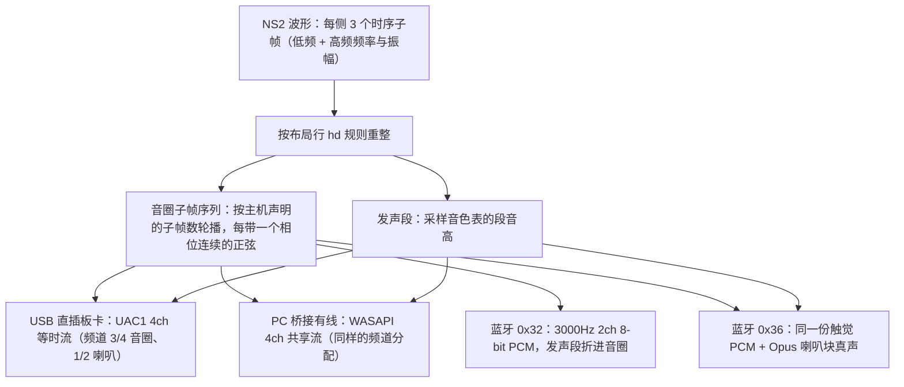
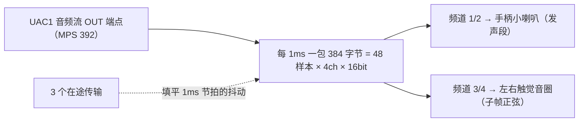
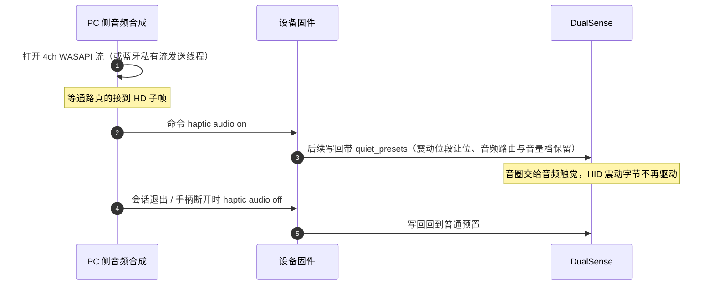
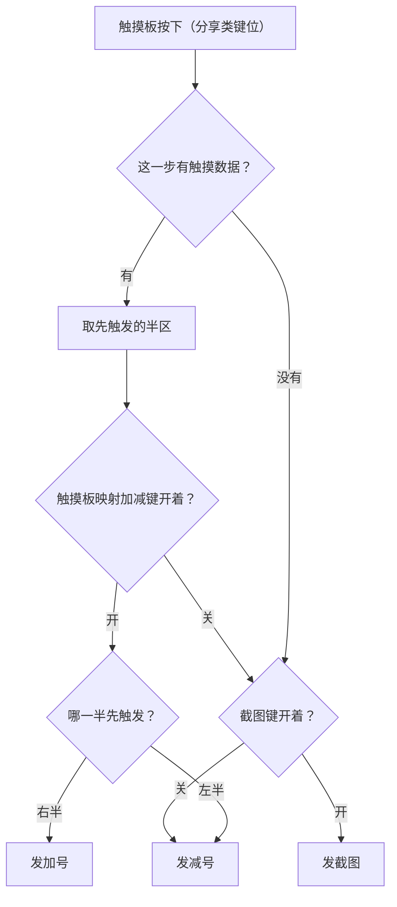

# PS 家族手柄数据规范（DualShock 3 / DualShock 4 / DualSense）

本规范记录 PS 家族手柄（DualShock 3 / 4、DualSense / Edge）在 USB 与蓝牙下的输入与输出报告布局及触觉通道规范。

## 型号与标识

| 型号 | VID:PID | 有线 Report ID | 蓝牙 Report ID | 备注 |
| :--- | :--- | :--- | :--- | :--- |
| DualShock 3 | `0x054C:0x0268` | `0x01` | `0x01` | 两种连接的字段偏移一致（蓝牙多一层传输头，剥掉后与有线相同） |
| DualShock 4（初代 / Slim） | `0x054C:0x05C4`、`0x054C:0x09CC` | `0x01` | `0x11` | 蓝牙比有线多两字节前缀 |
| DualSense | `0x054C:0x0CE6` | `0x01` | `0x31` | 蓝牙比有线多三字节前缀 |
| DualSense Edge | `0x054C:0x0DF2` | `0x01` | `0x31` | 背键在按键位图第三字节高两位；左右 Fn 键是配置档修饰键，不映射 |

同一个 Report ID 下按 PID 分行：DS3、DS4 与 DualSense 有线都报 `0x01`，但字段偏移各不相同。

## 共同约定

- **按键位序**：DS4 与 DualSense 共用一套——第一字节低四位是方向键帽子开关、高四位是面键，
  第二字节是肩键、Create/Options 与摇杆按下，第三字节是 PS、触摸板按下与静音键。
  DS3 没有帽子开关，方向键与其余按键都在按键位图里，自带一份映射。
- **摇杆**：单字节，中位 `0x80`；设备 Y 轴向下为正，解析侧翻成「上为正」。
- **触摸点**：每个触点 4 字节，首字节 bit7 为 0 表示这一路有触点（低 7 位是触点 ID），
  其余三字节是 12 位 X（低 8 位 + 高 4 位）与 12 位 Y（高 4 位 + 低 8 位）；左右半区按归一后的 X 判定。
  DS4 一帧带多份触摸历史（1 字节份数 + 每份 9 字节 = 1 字节时间戳 + 2 个触点），USB 三份、蓝牙四份，取第一份；
  DualSense 只有一份。
- **电量字节**：低四位 0-10 档、bit4 表示充电中。
- **耳机状态字节**：bit0 插入、bit1 带麦；带麦档位在主机侧另需音频通路，见下「耳机状态」。
- **运动字段**：6 个 int16 小端（陀螺 XYZ + 加速 XYZ），原始刻度为加速 8192 计数每 g、陀螺 16 计数每 °/s（标称）；
  布局行用 `accel_per_g` / `gyro_per_dps_x1000` 声明这份刻度，解析段换算到私有格式的统一刻度
  （加速 4096 计数每 g、陀螺 14247 计数每 1000 °/s），轴向按 NS 家族的约定——PS 家族的轴向与符号待实机核对。
- DS3 的字段是另一样子（大端加速加单轴陀螺），不适用这套形态。

## 输入报告布局

偏移一律从报告首字节起算（含 Report ID）。

### DualShock 3（`0x01`，有线与蓝牙共用一行）

| 字段 | 偏移 | 长度 | 说明 |
| :--- | :--- | :--- | :--- |
| 按键位图 | `0x05` | 3 | 方向键在按键位图里，没有帽子开关 |
| 摇杆（四轴） | `0x01` | 4 | LX / LY / RX / RY |
| 扳机压力 | `0x0C` | 2 | L2 / R2 走同字的压力值，数字位不映射 |
| 触摸 / 电量 / 耳机 | — | — | 不登记（报文里没有触摸区段，电量要走特性报告查询） |
| 运动字段 | `0x29` | 8 | 大端加速 3 轴 + 单轴陀螺（偏航），与本设备的统一格式不同，不登记 |

### DualShock 4

| 字段 | 有线 `0x01` | 蓝牙 `0x11` |
| :--- | :--- | :--- |
| 按键位图（3B） | `0x05` | `0x07` |
| 帽子开关 | `0x05` | `0x07` |
| 摇杆（四轴） | `0x01` | `0x03` |
| 扳机 | `0x08` / `0x09` | `0x0A` / `0x0B` |
| 运动字段 | `0x0D` | `0x0F` |
| 电量 | `0x1E` | `0x20` |
| 第一个触点 | `0x23` | `0x25` |
| 触摸量程 | 1919 × 942 | 1919 × 942 |

### DualSense

| 字段 | 有线 `0x01` | 蓝牙 `0x31` |
| :--- | :--- | :--- |
| 按键位图（3B） | `0x08` | `0x09` |
| 帽子开关 | `0x08` | `0x09` |
| 摇杆（四轴） | `0x01` | `0x02` |
| 扳机 | `0x05` / `0x06` | `0x06` / `0x07` |
| 运动字段 | `0x10` | `0x11` |
| 第一个触点 | `0x21` | `0x22` |
| 触摸量程 | 1919 × 1079 | 1919 × 1079 |
| 电量 | — | `0x36` |
| 耳机状态 | — | `0x37`（`0x38` 跟着 bit0 走） |

有线行的偏移由蓝牙值减去三字节前缀换算，核对前作初值；电量与耳机状态字节本轮不登记。

### 耳机状态（3.5mm）

DualSense 蓝牙（`0x31`）第 55 字节（`0x37`）bit0 是插入、bit1 是带麦，第 56 字节跟着 bit0 走；
DualSense Edge 上按插拔差分核对（插 → 拔 → 插得到 `0x03` → `0x00` → `0x01` → `0x03`），该行登记 `headset_off = 55` 与 `PAD_HEADSET_PS`。
DS4 与 DualSense 有线行的耳机字节未核对，保持不解析；派生值只报「插入」档的原因见
[controller-switch2.md](controller-switch2.md) 的输入报告一节，逐手柄复核步骤见 [../pc/README.md](../pc/README.md) 的「3.5mm 耳机状态」。

## 输出报告（反馈）

### DualShock 3（`0x01`，48 字节）

| 偏移 | 字段 |
| :--- | :--- |
| `0x02` | 右小马达时长 |
| `0x03` | 右小马达强度 |
| `0x04` | 左大马达时长 |
| `0x05` | 左大马达强度 |

时长写 `0xFF` 表示保持到下一条命令；偏移取自公开实现，未实机核对。LED 控制要另走 SET_REPORT 序列，本轮不映射。

### DualShock 4

| 形态 | 长度 | 布局 |
| :--- | :--- | :--- |
| 有线 `0x05` | 32 字节 | `b1` flags（`0x01` 震动、`0x02` 灯条颜色）、`b4` 右小马达、`b5` 左大马达、`b6-b8` 灯条 RGB |
| 蓝牙 `0x11` | 78 字节 | `b1` hw_control（`0xC0` = HID + CRC32）、`b2` 音频控制、`b6` 右小马达、`b7` 左大马达、`b8-b10` 灯条 RGB、末 4 字节 CRC32 |

### DualSense

| 形态 | 长度 | 布局 |
| :--- | :--- | :--- |
| 有线 `0x02` | 48 字节 | `b1`/`b2` valid flag、`b3` 右小马达、`b4` 左大马达、`b6` 喇叭音量、`b8` 音频控制、`b38` 前级增益、`b44` 玩家灯、`b45-b47` 灯条 RGB |
| 蓝牙 `0x31` | 78 字节 | `b1` 序号半字节、`b2` 固定魔数 `0x10`、公共段从 `b3` 起、`b46` 玩家灯、`b47-b49` 灯条 RGB、末 4 字节 CRC32 |

**valid flag 语义**（有线 `b1`/`b2`、蓝牙 `b3`/`b4`）：
`0x01` 兼容震动、`0x02` 音频触觉选择（HAPTICS_SELECT）、`0x20` 更新喇叭音量、`0x80` 更新音频控制、
`0x10` 玩家指示灯；震动与灯条各自的更新位不置位时对应字段被忽略。

**预置字节**（有线 `{1,0xA3}, {2,0x90}, {6,100}, {8,0x30}, {38,0x02}`；
蓝牙 `{2,0x10}, {3,0xA3}, {4,0x90}, {8,100}, {10,0x30}, {40,0x02}`）：

- 喇叭音量固定为 100（PS5 默认档位）。
- 内置喇叭需显式路由至手柄喇叭输出路径（0x30）并使能前级 +6dB 增益。

**让位（`quiet_presets`）**：音频触觉接手音圈时下发（有线 `{1,0xA1}`、蓝牙 `{3,0xA1}`），释放 `HAPTICS_SELECT` 恢复触觉 PCM 驱动。

**序号半字节**：蓝牙 `0x31` 的 `b1` 高半字节逐包递增。

**玩家指示灯**：玩家号对应四颗白灯模式（`0x04` / `0x0A` / `0x15` / `0x1B` 对应 1P-4P）。

## 音频触觉与 HD 触觉

DualSense 的触觉音圈由音频级 PCM 驱动，三条承载通路共用同一份按布局行 `hd` 规则重整出的子帧渲染结果：

```mermaid
flowchart TB
    Wave["NS2 波形：每侧 3 个时序子帧（低频 + 高频频率与振幅）"] --> Render["按布局行 hd 规则重整"]
    Render --> Coil["音圈子帧序列：按主机声明的子帧数轮播，每带一个相位连续的正弦"]
    Render --> Beep["发声段：采样音色表的段音高"]
    Coil --> Usb["USB 直插板卡：UAC1 4ch 等时流（频道 3/4 音圈、1/2 喇叭）"]
    Coil --> Bridge["PC 桥接有线：WASAPI 4ch 共享流（同样的频道分配）"]
    Beep --> Usb
    Beep --> Bridge
    Coil --> Bt32["蓝牙 0x32：3000Hz 2ch 8-bit PCM，发声段折进音圈"]
    Coil --> Bt36["蓝牙 0x36：同一份触觉 PCM + Opus 喇叭块真声"]
    Beep --> Bt36
```

### USB 直插板卡（板上合成）

- 音频接口是 UAC1 48kHz / 16bit / 4ch PCM：音频流接口只有一组 alt，等时 OUT 端点 MPS 392、单一采样率；
  AC 输入端子通道配置 `0x33` = FL+FR+RL+RR，后两路直连左右触觉音圈（PS5 同款用法）。
- 合成每毫秒一包 384 字节、3 个在途传输；子帧按主机声明的数量轮播，声明之外的槽位不占时间。

```mermaid
flowchart LR
    Iso["UAC1 音频流 OUT 端点（MPS 392）"] --> Frame["每 1ms 一包 384 字节 = 48 样本 × 4ch × 16bit"]
    Frame --> Spk["频道 1/2 → 手柄小喇叭（发声段）"]
    Frame --> Coil["频道 3/4 → 左右触觉音圈（子帧正弦）"]
    Queue["3 个在途传输"] -.->|"填平 1ms 节拍的抖动"| Frame
```

### PC 桥接（有线）

音频接口被操作系统持有，由 PC 侧对 4ch 端点开 WASAPI 共享流，用与板上合成同刻度的正弦驱动频道 3/4；
振幅与频率落地值随桥接 FEEDBACK 帧下发，落地规则只有一份（PC 只做哑渲染）。开流失败或端点被独占时静默回落 HID 震动。

### 蓝牙私有流（0x32 / 0x36）

| 形态 | 长度 | 组成 |
| :--- | :--- | :--- |
| `0x32` | 142 字节 | 报文头 + packet `0x11` 配置/序号 + packet `0x12` 承载 64 字节 PCM + CRC32 |
| `0x36` | 398 字节 | 配置包 + 63 字节状态块 + 64 字节触觉 PCM + 200 字节 Opus 喇叭块 + CRC32 |
- 触觉 PCM 为 3000Hz / 2 声道 / 8-bit；`0x32` CRC 覆盖前 138 字节（种子 `0xA2`）。
- `0x36` 包含触觉 PCM 与 200 字节 Opus 编码喇叭数据包，状态块固定手柄喇叭输出路径。

### 波形重整规则（布局行 `hd`）

- 主机波形每侧最多 3 个时序子帧（各 5ms），频率解码为 Hz 并限制在 20-500Hz 音圈有效范围。
- 振幅线性定标并施加 4 倍增益，USB 峰值刻度 30000，蓝牙 8-bit 刻度 127。
- 采样音色根据主机点播 ID 映射强震与发声频率；轮播长度遵循主机声明的有效子帧数。

### 让位时序

```mermaid
sequenceDiagram
    autonumber
    participant PC as PC 侧音频合成
    participant Dev as 设备固件
    participant Pad as DualSense

    PC->>PC: 打开 4ch WASAPI 流（或蓝牙私有流发送线程）
    Note over PC: 等通路真的接到 HD 子帧
    PC->>Dev: 命令 haptic audio on
    Dev->>Pad: 后续写回带 quiet_presets（震动位段让位、音频路由与音量档保留）
    Note over Pad: 音圈交给音频触觉，HID 震动字节不再驱动
    PC->>Dev: 会话退出 / 手柄断开时 haptic audio off
    Dev->>Pad: 写回回到普通预置
```

桥接断开时让位自动失效（设备侧按输入源是否接入门控），不会卡在无震动状态。

## DS4 / DS5 行为设置

屏幕「DS4、DS5 设置」页与串口 `ds` 命令提供两项开关，都持久化在 NVS，只作用于 PS 家族的触摸板按下
（DS4 与 DualSense 的触摸板按下落在分享类键位）：

- **触摸板映射加减键**（默认关）：触摸板按下时按「先触发」的那一半发键，左半发减号、右半发加号，这一路原本的截图不再发。
- **截图键**（默认开）：触摸板按下发截图；关掉后这一路改发减号。

位置取不到时（该帧没有触摸数据）退回截图键开关那一档。键位在按下那一刻定一次、按住期间不变：
中途另一根手指落下或抬手不会让已经发出的键来回跳，设置改动在下次按下时生效。

```mermaid
flowchart TB
    Down["触摸板按下（分享类键位）"] --> Touch{"这一步有触摸数据？"}
    Touch -->|"有"| First["取先触发的半区"]
    Touch -->|"没有"| CaptureSwitch
    First --> MapOn{"触摸板映射加减键开着？"}
    MapOn -->|"开"| Half{"哪一半先触发？"}
    Half -->|"左半"| Minus["发减号"]
    Half -->|"右半"| Plus["发加号"]
    MapOn -->|"关"| CaptureSwitch{"截图键开着？"}
    CaptureSwitch -->|"开"| Capture["发截图"]
    CaptureSwitch -->|"关"| Minus
```
