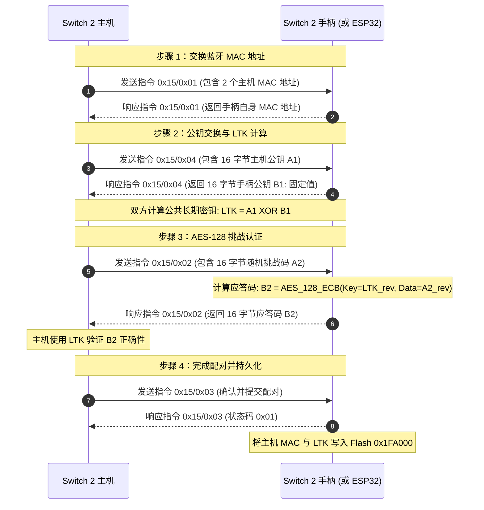
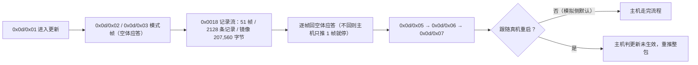
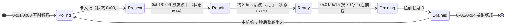
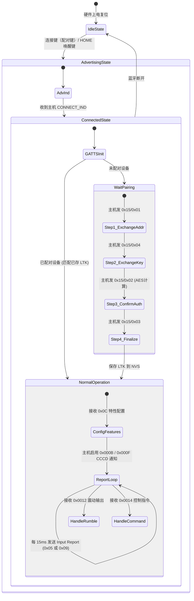
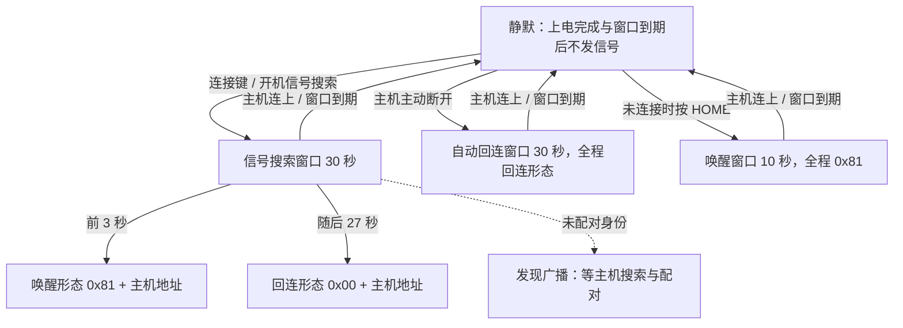
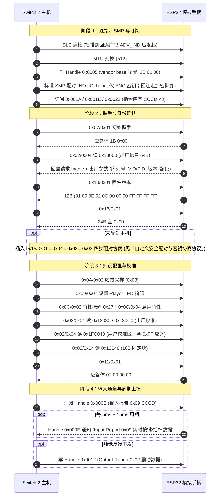

# Switch 2 手柄通信协议与数据交互技术规范

本规范整理自开源逆向工程项目与协议分析资料，记录任天堂 Switch 2 官方手柄（Joy-Con 2、Pro Controller 2 与 NSO GameCube 手柄）
在 Bluetooth LE 与 USB 模式下的广播、GATT 属性表、HID 报告、自定义配对、指令集、存储布局与 NFC 通路。
本文只记协议事实与主机侧对账结论；本工程的结构、实现与取舍见 [ARCHITECTURE.md](ARCHITECTURE.md)、
[ABSTRACTIONS.md](ABSTRACTIONS.md) 与 [ADR 索引](adr/README.md)，
PS 家族手柄的数据见 [controller-ps.md](controller-ps.md)。逆向结论必须用真实设备抓包与互操作测试验证后才能作为实现依据。

---

## 协议体系与硬件架构总览

Switch 2 手柄放弃了前代 Switch 1 使用的经典蓝牙（Bluetooth BR/EDR）协议，全面转向低功耗蓝牙（Bluetooth LE 5.x）。
在通信架构上，任天堂未采用行业标准的 HID over GATT Profile (HOGP) 或 Security Manager Protocol (SMP) 安全配对。
它改用一套运行于自定义 GATT 属性和 HID 命令帧之上的私有通信协议。

### 核心特性

- **无线传输层**：Bluetooth LE，采用 5ms 连接间隔（低于标准 BLE 规范的 7.5ms，数据刷新率可达 ~200Hz）。
- **设备识别机制**：广播中不包含标准 HID 设备标识，全部依靠广播帧中的厂商特定数据字段（AD Type `0xFF`，Vendor ID `0x057E`，Company ID `0x0553`）。
- **配对机制**：禁用标准 BLE SMP 配对；在自定义 GATT/HID 指令通道上执行带外（Pseudo-OOB）密钥交换与 AES-128 挑战认证。
- **GATT 架构**：通过私有服务与特征值收发输入报告、输出报告、触觉震动和配置指令。
- **休眠唤醒**：通过在 BLE 广播信道（37/38/39）发送特定的无连接广播帧（包含主机 MAC 地址与特定状态标志位 `0x81`）实现单向主机唤醒。

### 手柄型号与产品标识（Product ID）

| 设备类型 | 标准 USB/BLE PID | 安全模式 USB PID | 厂商标识（VID） |
| :--- | :--- | :--- | :--- |
| Joy-Con 2 (L) | `0x2067` | `0x2071` | `0x057E` (Nintendo) |
| Joy-Con 2 (R) | `0x2066` | `0x2070` | `0x057E` (Nintendo) |
| Switch 2 Pro Controller | `0x2069` | `0x2072` | `0x057E` (Nintendo) |
| NSO GameCube Controller | `0x2073` | `0x2074` | `0x057E` (Nintendo) |

---

## 物理与链路传输层规范

### Bluetooth LE 广播帧规范（Advertisements）

Switch 2 主机在底层芯片层面启用了广播过滤机制，仅接收符合格式的任天堂广播帧。广播数据总长为 31 字节，包含两部分：BLE 广播标志（Flags）与厂商自定义数据（Manufacturer Specific Data）。

广播方地址（AdvA）与间隔（实机抓包，ndeadly/switch2_controller_research）：
真实 Pro Controller 2 以 **public 地址**发送全部广播，地址前缀为 Nintendo OUI `98:E2:55`（2024 年注册的 Switch 2 手柄专用前缀，抓包 1124 个广播包均同址）；
广播事件间隔实测约 40 ms（即 0.625 ms × 0x40）。**勘误（22.5.0 实测）**：
主机并不校验广播地址 OUI——使用 Nintendo `78:81:8C` OUI（已验证同行实现所选）的模拟手柄可正常被搜索、配对与回连；OUI 伪装仅为与已验证实现对齐，非协议要求。
广播 PDU 实测为 legacy `ADV_IND`（可连接可扫描，附空 SCAN_RSP）；
扩展 PDU（legacy_pdu=0）无法同时置可连接与可扫描位，模拟实现需按 legacy PDU 配置（可另开扩展 PDU 实例并行广播以兼容不同扫描方）。

#### 手柄发往主机的广播包类型

| 广播类型 | PDU 类型 | Flags (AD Type=`0x01`) | 厂商数据长度与类型 | 厂商数据内容 (AD Type=`0xFF`, 共 26 字节) |
| :--- | :--- | :--- | :--- | :--- |
| 标准发现广播 | `ADV_IND` | `02 01 06` (General Discovery, BR/EDR Not Supported) | `1B FF` | `53 05 01 00 03 7E 05 [PID] 00 01 00 [00*6] 0F [00*7]` |
| 回连广播 | `ADV_IND` | `02 01 06` | `1B FF` | `53 05 01 00 03 7E 05 [PID] 00 01 00 [主机MAC反序] 0F [00*7]` |
| 唤醒主机广播 | `ADV_IND` / `ADV_NONCONN_IND` | `02 01 06` | `1B FF` | `53 05 01 00 03 7E 05 [PID] 00 01 81 [主机MAC反序] 0F [00*7]` |

#### 厂商自定义数据字段定义（26 字节）

| 偏移 (Offset) | 长度 (Size) | 字段名 | 字节数值 / 规则 | 说明 |
| :--- | :--- | :--- | :--- | :--- |
| `0x00` | 2 | Manufacturer ID | `53 05` (`0x0553`) | 任天堂公司标识（小端序） |
| `0x02` | 1 | Header 1 | `0x01` | 固定协议头 |
| `0x03` | 1 | Header 2 | `0x00` | 固定协议头 |
| `0x04` | 1 | Header 3 | `0x03` | 固定协议头 |
| `0x05` | 2 | Vendor ID | `7E 05` (`0x057E`) | 任天堂 USB VID（小端序） |
| `0x07` | 2 | Product ID | 如 `69 20` (`0x2069`) | 手柄型号 PID（小端序） |
| `0x09` | 1 | Sub-flag 1 | `0x00` | 固定字段 |
| `0x0A` | 1 | Sub-flag 2 | `0x01` | 固定字段 |
| `0x0B` | 1 | 状态标志位 | `0x81` 或 `0x00` | **唤醒主机的关键标志位**：唤醒时必须为 `0x81`，普通回连为 `0x00` |
| `0x0C` | 6 | 目标主机 MAC | 6 字节 MAC 地址（**反向字节序**） | 普通广播为全 `0x00`；回连与唤醒为已绑定的主机 MAC 反序 |
| `0x12` | 1 | 尾部标志 | `0x0F` | 固定字段 |
| `0x13` | 7 | 保留字段 | 7 字节全 `0x00` | 保留对齐填充 |

#### 主机发往手柄的唤醒广播（寻找手柄功能）

主机在用户执行“查找手柄”时会发送无连接广播：
- **PDU 类型**：`ADV_NONCONN_IND`
- **Flags**：`0x18` (`DualModeControllerSupport` | `DualModeHostSupport`)
- **厂商数据结构**（14 字节）：
  - 偏移 `0x00`（2字节）：`53 05`（任天堂厂商 ID）
  - 偏移 `0x02`（4字节）：`03 00 01 00`
  - 偏移 `0x06`（1字节）：`0x80`
  - 偏移 `0x07`（6字节）：目标手柄蓝牙 MAC 地址（**反向字节序**）
  - 偏移 `0x0D`（1字节）：`0x01`

#### 主机侧的广播过滤与配对记录行为（实机对账）

- **广播地址必须是 public 类型**：派生静态随机地址的广播（厂商数据逐字节符合上表）在主机「更改 Grip/顺序」界面完全不可见，也不发起连接；
  换成 public 地址后主机立即连接并完成 0x15 配对。
  主机从未见过的 public 地址、与任天堂无关的 OUI（如 `00:11:22:…`）同样被接受——过滤条件只有**地址类型**，与 OUI 无关。
- **广播 PDU 只认 legacy（可连接 + 可扫描）**：扩展 PDU 规范上不能同时置这两个位，主机全程看不到设备（PC 侧扫描可见）；发现广播一律按 legacy `ADV_IND` 配置。
- **配对记录按控制器地址存、一址一条**：同一地址先配 A 再配 B，A 的记录随即消失、旧 LTK 与新会话对不上（实测加密建立报错后断开）；
  换一个主机没见过的 public 地址即可让主机重新配对，旧地址上的残留记录只能由用户在主机上删除。
  「未配对时用随机地址」的做法在本主机上不可行。
- **回连广播的状态位恒为 `0x00`，唤醒突发才置 `0x81`**：把 `0x81` 写进回连广播，休眠中的主机会被每一条回连广播立刻唤醒（实测现象：主机一进待机就亮回锁屏）。
  带主机地址的 `0x00` 回连形态在主机停在首页、握把/顺序页、刚从待机醒来三种场景下都被采纳并自动连回——前提是设备正在发这条广播，设备静默时主机不会主动来连。
- **唤醒/回连广播里的主机地址要用「主机连接时在用的那条」**：配对交换（0x15/0x01）一次下发两条只差末字节的地址
  （配对信息区里主机 2 = 主机 1 末字节减 1，见「蓝牙配对信息区结构」），凭证里存的那条发出去主机不理；
  设备侧因此优先用最近一次会话的对端地址、凭证只作兜底（[ADR 0030](adr/0030-ns2-wake-adv-host-address.md)）。
- **同址双身份不可行**：一台控制器只有一个 public 地址，两条广播实例共用它时主机只维持一条 ACL，host 侧也无法从连接反查是哪一只；
  一对 Joy-Con 必须两块板各扮一只（[ADR 0039](adr/0039-pro-controller-only.md)）。

---

### USB 物理接口规范与描述符

Switch 2 手柄插入底座或线连时通过 USB 2.0 全速/高速通信。设备具备复合接口架构：

- **Joy-Con 2 (L/R) USB 架构**：
  - Interface 0 (Class 0x03 HID)：端点 `0x81` (IN Interrupt, 64B, 4ms), 端点 `0x01` (OUT Interrupt, 64B, 4ms)
  - Interface 1 (Class 0xFF Vendor Specific)：端点 `0x02` (OUT Bulk, 64B), 端点 `0x82` (IN Bulk, 64B)
- **Pro Controller 2 USB 架构**：
  - Interface 0 (Class 0x03 HID)：HID 按键与震动控制通道
  - Interface 1 (Class 0xFF Vendor Specific)：固件升级与原始数据通道
  - Interface 2 (Class 0x01 Audio Control)：音频控制接口
  - Interface 3 (Class 0x01 Audio Streaming - OUT)：耳机音频输出 (PCM 16-bit 48kHz Stereo, Isochronous EP `0x03`, 192B)
  - Interface 4 (Class 0x01 Audio Streaming - IN)：麦克风音频输入 (PCM 16-bit 48kHz Stereo, Isochronous EP `0x83`, 192B)

---

## 自定义安全配对与密钥协商协议

Switch 2 手柄与主机之间的密钥协商在自定义命令通道（Command 0x15）中通过 4 个步骤的挑战-应答完成。**勘误（22.5.0 实测）**：
链路层**同时运行标准 BLE SMP**，形态是 Just Works：IO 能力 `NO_IO`、bonding 置位、无 MITM、不用 LE Secure Connections、仅分发 ENC 密钥。
配对不绑定，绑定键由 0x15 协商结果注入本端 store；主机在 MTU 交换后先走 SMP 再发指令。
模拟实现若拒绝 SMP，主机在 MTU 交换后即停滞。

### 配对流程阶段分解

各步骤请求/应答体（body）字节布局（实机抓包，ndeadly/switch2_controller_research）：请求体首字节固定 `0x00`，应答体首字节固定 `0x01`。

| 步骤 | 请求体 | 应答体 |
| :--- | :--- | :--- |
| 0x15/0x01 | `00 [地址数] [地址数×6B 主机地址反序]`（主机发 2 个地址，仅末字节相差 `0x80`/`0x81`） | `01 04 01 [手柄地址反序]`（共 9 字节） |
| 0x15/0x04 | `00 [16B 主机公钥 A1 反序]` | `01 [16B 手柄公钥 B1]`（固定值，未反转） |
| 0x15/0x02 | `00 [16B 挑战码 A2 反序]` | `01 [16B 应答码 B2（AES 原始输出，不反转）]` |
| 0x15/0x03 | `00` | `01` |

### 密码学计算详细算法

- **公钥常量**：官方手柄返回的手柄公钥 B1 在目前固件中表现为固定常量：
  `5C F6 EE 79 2C DF 05 E1 BA 2B 63 25 C4 1A 5F 10`
- **长期密钥派生**（22.5.0 实测）：
  应答 B2 所用密钥 `LTK = reverse(A1) XOR reverse(B1)`（A1/B1 均为线上传输的反序字节）；
  注入本端 BLE store 供标准 SMP 链路加密的 LTK 即该值按存储序写入（NimBLE 为小端，等价于对线序异或结果再反转）。
- **认证加密计算**（22.5.0 实测）：
  应答码 B2 = 标准 AES-128 在 ECB 模式下以 `reverse(A1) XOR reverse(B1)` 为密钥、加密 `reverse(A2)` 的**原始输出**，线上不再反转：
  `B2 = AES128_ECB(Key=reverse(A1) XOR reverse(B1), Data=reverse(A2))`

---

## GATT 属性表与服务架构

建立 BLE 连接后，手柄对外暴露专有 GATT 服务与特征值。

### 核心 GATT 服务映射表

| 服务 / 特征值 UUID | 类型 | 句柄 (Handle) | 属性 (Properties) | 用途说明 | 适用设备 |
| :--- | :--- | :--- | :--- | :--- | :--- |
| `00c5af5d-1964-4e30-8f51-1956f96bd280` | Primary Service | `0x0001-0x0007` | - | 厂商基础控制服务 | 全系列 |
| `00c5af5d-1964-4e30-8f51-1956f96bd281` | Characteristic | `0x0003` | READ | 基础状态读取 | 全系列 |
| `00c5af5d-1964-4e30-8f51-1956f96bd282` | Characteristic | `0x0005` | WRITE | 基础状态配置 | 全系列 |
| `00c5af5d-1964-4e30-8f51-1956f96bd283` | Characteristic | `0x0007` | READ | 设备标识读取 | 全系列 |
| `ab7de9be-89fe-49ad-828f-118f09df7fd0` | Primary Service | `0x0008-0x002A` | - | 主手柄 HID 通信服务 | 全系列 |
| `ab7de9be-89fe-49ad-828f-118f09df7fd2` | Characteristic | `0x000A` | READ \| NOTIFY | **Input Report 0x05**（通用输入报告） | 全系列 |
| `00002902-0000-1000-8000-00805f9b34fb` | Descriptor | `0x000B` | READ \| WRITE | CCCD（写入 `0x0001` 开启通知） | 全系列 |
| `679d5510-5a24-4dee-9557-95df80486ecb` | Descriptor | `0x000C` | - | 报告率配置描述符 | 全系列 |
| `cc1bbbb5-7354-4d32-a716-a81cb241a32a` | Characteristic | `0x000E` | READ \| NOTIFY | **Input Report 0x07**（专用输入报告） | Joy-Con (L) |
| `d5a9e01e-2ffc-4cca-b20c-8b67142bf442` | Characteristic | `0x000E` | READ \| NOTIFY | **Input Report 0x08**（专用输入报告） | Joy-Con (R) |
| `7492866c-ec3e-4619-8258-32755ffcc0f8` | Characteristic | `0x000E` | READ \| NOTIFY | **Input Report 0x09**（专用输入报告） | Pro Controller |
| `8261cba1-9435-420c-84d6-f0c75a2c8e4d` | Characteristic | `0x000E` | READ \| NOTIFY | **Input Report 0x0A**（专用输入报告） | GameCube |
| `00002902-0000-1000-8000-00805f9b34fb` | Descriptor | `0x000F` | READ \| WRITE | CCCD（写入 `0x0001` 开启专用报告通知） | 全系列 |
| `289326cb-a471-485d-a8f4-240c14f18241` | Characteristic | `0x0012` | WRITE NO RSP | **Output Report 0x01**（触觉震动数据） | Joy-Con (L) |
| `fa19b0fb-cd1f-46a7-84a1-bbb09e00c149` | Characteristic | `0x0012` | WRITE NO RSP | **Output Report 0x01**（触觉震动数据） | Joy-Con (R) |
| `cc483f51-9258-427d-a939-630c31f72b05` | Characteristic | `0x0012` | WRITE NO RSP | **Output Report 0x02**（双路震动数据） | Pro Controller |
| `3f8fb670-ab25-45bf-b540-38c72834d064` | Characteristic | `0x0012` | WRITE NO RSP | **Output Report 0x03**（传统马达震动） | GameCube |
| `649d4ac9-8eb7-4e6c-af44-1ea54fe5f005` | Characteristic | `0x0014` | WRITE NO RSP | **Command 发送通道**（主机向手柄下发指令） | 全系列 |
| `ce49a830-dced-48ae-931e-c8cf88aadbea` | Characteristic | `0x0016` | WRITE NO RSP | **复合输出通道**（震动 + 指令写入） | Joy-Con (L) |
| `65a724b3-f1e7-4a61-8078-a342376b27ff` | Characteristic | `0x0016` | WRITE NO RSP | **复合输出通道**（震动 + 指令写入） | Joy-Con (R) |
| `3dacbc7e-6955-40b5-8eaf-6f9809e8b379` | Characteristic | `0x0016` | WRITE NO RSP | **复合输出通道**（震动 + 指令写入） | Pro Controller |
| `af95885e-44b3-4a24-9cf0-483cc129469a` | Characteristic | `0x0016` | WRITE NO RSP | **复合输出通道**（震动 + 指令写入） | GameCube |
| `4147423d-fdae-4df7-a4f7-d23e5df59f8d` | Characteristic | `0x0018` | WRITE NO RSP | 固件升级数据块写入 | 全系列 |
| `c765a961-d9d8-4d36-a20a-5315b111836a` | Characteristic | `0x001A` | NOTIFY | **Command 应答通道 #1**（ACK/数据返回） | 全系列 |
| `00002902-0000-1000-8000-00805f9b34fb` | Descriptor | `0x001B` | READ \| WRITE | CCCD（写入 `0x0001` 开启指令应答通知） | 全系列 |
| `506d9f7d-4278-4e95-a549-326ba77657e0` | Characteristic | `0x001E` | NOTIFY | **Command 应答通道 #2** | Pro Controller |
| `cc483f51-9258-427d-a939-630c31f72b06` | Characteristic | `0x002C` | WRITE NO RSP | 耳机音频下行流 | Pro Controller (带音频) |
| `7492866c-ec3e-4619-8258-32755ffcc0f9` | Characteristic | `0x002E` | READ \| NOTIFY | 麦克风音频上行流 | Pro Controller (带音频) |

> `0x000E` 这一个句柄上，真机按型号换特征值 UUID：Pro `7492866c…`、JoyCon (L) `cc1bbbb5…`、JoyCon (R) `d5a9e01e…`。
> 主机正是靠这条 UUID 判断「这台手柄的专用输入通道在不在」：查不到就既不写 `0x0010` 报告率描述符、也不订阅 `0x000F`，整段跳过——GATT 表里缺自家型号那一条时，主机界面里有这只手柄、却永远「待确认」。
> **模拟实现只需注册目标型号的那一条**（`0x000E`）；JoyCon 的两条 UUID 与它们在真机上的句柄位置只作协议记录。

> **指令应答实际走 `0x001E`**（Pro 的第二个应答特征值）：主机初始化时写 `0x001F`（其 CCCD）开启通知，
> 通知载荷为 14 字节 `0x00` 前缀 + 8B 帧头 + 应答体；`0x001A`/`0x001B` 通道未被主机使用。
> **`0x0010` 报告率描述符可写**：主机开启输入上报前会向它写入 2 字节配置（实测 `85 00`，约 16 ms 节奏）。
> **复合输出通道 `0x0016` 的写入 = 1 字节 `0x00` 填充 + 左右两条 16 字节 LRA 参数包 + 命令帧**（BlueRetro sw2 的 out_cmd 布局；
> ns2-search-page.capture 全程如此：参数包段静置为零，命令帧承载采样流）。
> Switch 1 的「0x00 + 2×16B 震动 + 命令」布局未被观测到，两者参数包段同构但 Switch 2 主机不用 Switch 1 的「震动 + 0x10 命令」复合形态。

---

## HID 报告数据结构规范

在 USB 模式下，报告数据首字节为 Report ID；在 BLE 模式下，数据直接通过对应的 Characteristic Handle 发送，**省略 Report ID 字节**。

### Input Report 0x05（通用全功能输入报告，63 字节）

由 Handle `0x000A` 发送，适用于所有 Switch 2 控制器。

| 偏移 (Offset) | 长度 (Size) | 字段名称 | 详细说明 |
| :--- | :--- | :--- | :--- |
| `0x00` | 4 | 报告计数器 (Counter) | 32 位无符号递增计数器（每次上报加 1，小端序） |
| `0x04` | 4 | 按键位图 (Buttons) | 4 字节按键状态位（见下方按键表） |
| `0x08` | 2 | 未知/保留 | 恒为 `0x00 0x00` |
| `0x0A` | 3 | 左模拟摇杆 (Left Stick) | 12 位紧凑打包坐标（X: 0-4095, Y: 0-4095） |
| `0x0D` | 3 | 右模拟摇杆 (Right Stick) | 12 位紧凑打包坐标（X: 0-4095, Y: 0-4095） |
| `0x10` | 8 | 鼠标绝对坐标数据 | 特性位 4 启用时有效（Joy-Con 支持）：X(2B), Y(2B), 表面质量(2B), 悬空距离(2B) |
| `0x18` | 1 | 保留 | 恒为 `0x00` |
| `0x19` | 6 | 磁力计数据 | 特性位 7 启用时有效：X (2B LE), Y (2B LE), Z (2B LE) |
| `0x1F` | 2 | 电池电压 (mV) | 16 位整数（小端序），如 `0x0EA5` = 3749 mV |
| `0x21` | 1 | 充电状态 | 连接 USB 时升至 `0x34`，充满电时为 `0x20` |
| `0x22` | 2 | 电池电流 | 特性位 5 启用时报告 |
| `0x24` | 5 | 未知/保留 | 恒为 `0x00` |
| `0x29` | 1 | 标志位 | 恒为 `0x01` |
| `0x2A` | 18 | IMU 6轴运动传感器数据 | 特性位 2 启用时有效（时间戳 4B, 温度 2B, 加速度 XYZ 各 2B, 陀螺仪 XYZ 各 2B） |
| `0x3C` | 1 | 左模拟扳机行程 | NSO GameCube 手柄专用（0-255） |
| `0x3D` | 1 | 右模拟扳机行程 | NSO GameCube 手柄专用（0-255） |
| `0x3E` | 1 | 保留字节 | `0x00` |

#### 按键位图定义 (Report 0x05 Buttons 4 字节)

| 字节偏移 | Bit 7 (`0x80`) | Bit 6 (`0x40`) | Bit 5 (`0x20`) | Bit 4 (`0x10`) | Bit 3 (`0x08`) | Bit 2 (`0x04`) | Bit 1 (`0x02`) | Bit 0 (`0x01`) |
| :--- | :--- | :--- | :--- | :--- | :--- | :--- | :--- | :--- |
| **Byte 0** | ZR | R | 右 SL | 右 SR | A | B | X | Y |
| **Byte 1** | 保留 | C 键 | 截图 (Capture) | 主页 (Home) | 左摇杆下压 (LS) | 右摇杆下压 (RS) | 加号 (+) | 减号 (-) |
| **Byte 2** | ZL | L | 左 SL | 左 SR | 方向键左 | 方向键右 | 方向键上 | 方向键下 |
| **Byte 3** | 保留 | 保留 | 保留 | 耳机插入状态 | 保留 | 保留 | GL 背键 | GR 背键 |

---

### 专用输入报告（Report 0x07, 0x08, 0x09, 0x0A）

由 Handle `0x000E` 发送。主机日常通信默认订阅此特征值。

#### Input Report 0x09（Pro Controller 2 专用输入报告）

| 偏移 (Offset) | 长度 (Size) | 字段名称 | 详细说明 |
| :--- | :--- | :--- | :--- |
| `0x00` | 1 | 8位计数器 (Counter) | 每次递增 1（0-255 循环） |
| `0x01` | 1 | 电源状态 | Bit 0: 外部供电; Bit 1: 充电中; Bits 2-5: 电量等级 (0-9); Bits 6-7: 保留 |
| `0x02` | 3 | 按键位图 (3 字节) | 见下表 |
| `0x05` | 3 | 左摇杆原始数据 | 12 位紧凑打包坐标 |
| `0x08` | 3 | 右摇杆原始数据 | 12 位紧凑打包坐标 |
| `0x0B` | 1 | 状态标志 | 特性位 5 开启时为 `0x38`，否则为 `0x30` |
| `0x0C` | 1 | NFC 状态 | `0x00` 表示空闲，`0x01-0x07` 对应工作状态 |
| `0x0D` | 1 | 耳机音频状态 | 插入带麦耳机: `0x07`/`0x0F`；纯耳机: `0x05`/`0x0D`；未插入: `0x00` |
| `0x0E` | 1 | 运动数据长度 | 紧随其后的运动数据字节数（常见值为 0, 30 或 40） |
| `0x0F` | 40 | 运动数据包 (Motion) | 特性位 2 启用时的 IMU 采样数据 |
| `0x37` | 8 | 保留 | 填 0 |

##### Pro Controller 2 专用按键位图 (3 字节)

| 字节偏移 | Bit 7 (`0x80`) | Bit 6 (`0x40`) | Bit 5 (`0x20`) | Bit 4 (`0x10`) | Bit 3 (`0x08`) | Bit 2 (`0x04`) | Bit 1 (`0x02`) | Bit 0 (`0x01`) |
| :--- | :--- | :--- | :--- | :--- | :--- | :--- | :--- | :--- |
| **Byte 0** | 右摇杆下压 | 加号 (+) | ZR | R | X | Y | A | B |
| **Byte 1** | 左摇杆下压 | 减号 (-) | ZL | L | 方向键上 | 方向键左 | 方向键右 | 方向键下 |
| **Byte 2** | 保留 | 保留 | 保留 | C 键 | GL 背键 | GR 背键 | 截图 (Capture) | 主页 (Home) |

**主机侧行为的两条实测结论**：

- **带麦档位的耳机状态会被主机拒绝**：`0x0D` 报 `0x07`/`0x0F` 后约 150 ms 主机取消 `0x000E` 订阅——主机认带麦状态要有 `0x002C` 的音频/麦克风通路。
  模拟实现按 3.5 mm 插拔状态只报 `0x00` / `0x05`，非 0 时同时置按键位图第 3 字节的插入位（bit4），
  见 [ADR 0035](adr/0035-ns2-headset-state-passthrough.md)。
- **运动数据长度必须非零**：主机开启 IMU 特性位（0x0C 掩码含 bit2）后，`0x0E` 为 0 的报文同样不被采用。
  板卡无 IMU，固定填 `0x28`（40 字节）并以全零占位；运动块内部格式公开研究未解，
  真 Switch 2 手柄接在模拟设备上时走同代透传、运动块原样到达主机（[ADR 0026](adr/0026-same-generation-input-passthrough.md)）。

以下两种报文体来自 Joy-Con 2 真机抓包，只作协议记录：

#### Input Report 0x07（Joy-Con (L) 2 专用输入报告）

按键位图只有 2 字节，因此 0x02 之后每个字段都比 0x09 靠前 1 字节。
导轨键 SL / SR 落在按键位图第二字节的 **bit7 / bit6**。

| 偏移 (Offset) | 长度 (Size) | 字段名称 | 详细说明 |
| :--- | :--- | :--- | :--- |
| `0x00` | 1 | 8 位计数器 (Counter) | 每次递增 1（0-255 循环） |
| `0x01` | 1 | 电源状态 | 同 0x09 的电源字节 |
| `0x02` | 2 | 按键位图 | 见下表 |
| `0x04` | 1 | 未知 | 真机抓包该字节恒为 `0x07`，语义未解 |
| `0x05` | 3 | 左摇杆原始数据 | 12 位紧凑打包坐标 |
| `0x08` | 1 | 未知 | - |
| `0x09` | 5 | 鼠标数据 | 特性位 4 启用 |
| `0x0E` | 1 | 运动数据长度 | 紧随其后的运动数据字节数（常见 0 / 30 / 40） |
| `0x0F` | 40 | 运动数据包 (Motion) | 特性位 2 启用 |
| `0x37` | 8 | 保留 | 填 0 |

| 字节偏移 | Bit 7 (`0x80`) | Bit 6 (`0x40`) | Bit 5 (`0x20`) | Bit 4 (`0x10`) | Bit 3 (`0x08`) | Bit 2 (`0x04`) | Bit 1 (`0x02`) | Bit 0 (`0x01`) |
| :--- | :--- | :--- | :--- | :--- | :--- | :--- | :--- | :--- |
| **Byte 0** | 左摇杆下压 | 减号 (-) | ZL | L | 方向键上 | 方向键左 | 方向键右 | 方向键下 |
| **Byte 1** | **SL** | **SR** | 保留 | 保留 | 保留 | 保留 | 保留 | 截图 (Capture) |

#### Input Report 0x08（Joy-Con (R) 2 专用输入报告）

与 0x07 同构，但在运动块之前多一个 NFC 状态字节（右手柄才有 NFC 硬件）。

| 偏移 (Offset) | 长度 (Size) | 字段名称 | 详细说明 |
| :--- | :--- | :--- | :--- |
| `0x00` | 1 | 8 位计数器 (Counter) | 每次递增 1（0-255 循环） |
| `0x01` | 1 | 电源状态 | 同 0x09 的电源字节 |
| `0x02` | 2 | 按键位图 | 见下表 |
| `0x04` | 1 | 未知 | 真机抓包该字节恒为 `0x07`，语义未解 |
| `0x05` | 3 | 右摇杆原始数据 | 12 位紧凑打包坐标 |
| `0x08` | 1 | 未知 | - |
| `0x09` | 5 | 鼠标数据 | 特性位 4 启用 |
| `0x0E` | 1 | NFC 状态 | 同 0x09 的 NFC 字段 |
| `0x0F` | 1 | 运动数据长度 | 紧随其后的运动数据字节数 |
| `0x10` | 40 | 运动数据包 (Motion) | 特性位 2 启用 |
| `0x38` | 7 | 保留 | 填 0 |

| 字节偏移 | Bit 7 (`0x80`) | Bit 6 (`0x40`) | Bit 5 (`0x20`) | Bit 4 (`0x10`) | Bit 3 (`0x08`) | Bit 2 (`0x04`) | Bit 1 (`0x02`) | Bit 0 (`0x01`) |
| :--- | :--- | :--- | :--- | :--- | :--- | :--- | :--- | :--- |
| **Byte 0** | 右摇杆下压 | 加号 (+) | ZR | R | X | Y | A | B |
| **Byte 1** | **SL** | **SR** | 保留 | C 键 | 保留 | 保留 | 保留 | 主页 (Home) |

---

### 模拟摇杆 12 位紧凑打包（Packed 12-bit）编解码算法

左右摇杆的 X、Y 轴均具有 12 位精度（数值范围 0 到 4095，中心基准值约为 2048），在传输时每两个轴（3 字节，24 位）进行交叉压缩存储。

#### 字节解包为 X, Y 轴公式
设 3 字节输入数据为 `data[0]`, `data[1]`, `data[2]`：
- `X = data[0] | ((data[1] & 0x0F) << 8)`
- `Y = (data[1] >> 4) | (data[2] << 4)`

#### X, Y 轴打包为 3 字节公式
设输入的 12 位轴坐标为 X (0 <= X <= 4095) 和 Y (0 <= Y <= 4095)：
- `data[0] = X & 0xFF`
- `data[1] = ((X >> 8) & 0x0F) | ((Y & 0x0F) << 4)`
- `data[2] = (Y >> 4) & 0xFF`

---

### 输出报告格式（Output Reports - 触觉震动与反馈）

主机通过向 Handle `0x0012` 写入数据下发震动指令。

#### Output Report 0x02（Pro Controller 2 双路 LRA 线性马达震动）

| 偏移 (Offset) | 长度 (Size) | 字段名称 | 说明 |
| :--- | :--- | :--- | :--- |
| `0x00` | 1 | 报告 ID | USB 模式下为 `0x02`；BLE 模式下为 `0x00` |
| `0x01` | 16 | 左侧 LRA 震动参数包 | 1 字节状态 + 3 个各 5 字节的时序子帧（频率 + 振幅） |
| `0x11` | 16 | 右侧 LRA 震动参数包 | 1 字节状态 + 3 个各 5 字节的时序子帧（频率 + 振幅） |
| `0x21` | 9 | 保留字段 | 填充 0 |

##### LRA 震动单元数据包结构（16 字节）

位串按 BlueRetro 的 sw2.h 解释（真机验证过的参照）：它的静止包常量与实机抓包的静止字一致，
主动子帧的使能位为 1。NS 的震动是**波形描述**而不是马达信号：状态字声明 n 个有效子帧时，
随后的 n 个子帧按时间顺序各播一个等分周期（1/3 段），主机以接近输入上报的频率刷新这些
频率/振幅档位来合成连续包络（低频给冲击、高频给纹理）。
声明之外的槽位不占时间：消费侧按**声明的子帧数**轮播自己的序列，不是固定按 3 槽轮播。
实抓的游戏流是 200Hz、每包只声明 1 个子帧（3227 条记录里 94% 声明 1、5% 声明 2），
按固定 3 槽轮播会把持续震动切成「5ms 有声 + 10ms 静默」的 66Hz 断续，音圈手感退化成
普通马达的粗糙震动；声明 3 子帧的包仍是 3 段轮播（每段 1/3 周期）。

**Byte 0 (状态字)**：

| 位 | 字段 | 说明 |
| :--- | :--- | :--- |
| bit 0-3 | TID | 事务计数器（每次递增 0-15） |
| bit 4-5 | 有效子帧数 | 随后的时序子帧个数（0-3；0 按满 3 处理） |
| bit 6 | 使能 | LRA 通路启用标志 |
| bit 7 | 保留 | - |

**Byte 1-15 (时序子帧，各 5 字节小端位串)**：

| 位 | 字段 | 说明 |
| :--- | :--- | :--- |
| bit 0-8 | LF Freq | 低频频率（9 位 log2 码） |
| bit 9 | LF 音色使能 | - |
| bit 10-19 | LF Amp | 低频振幅（10 位线性） |
| bit 20-28 | HF Freq | 高频频率（9 位 log2 码） |
| bit 29 | HF 音色使能 | - |
| bit 30 | 保留 | - |
| bit 31 | 使能 | 子帧使能标志（主动子帧为 1） |
| bit 32-39 | HF Amp | 高频振幅（8 位线性，子帧第 5 字节） |

频率码是 log2 刻度、与 Joy-Con 一代 `log2(f/10)×32` 同一条曲线、4 倍细分：
`f = 10×2^(码/128)` Hz，9 位满量程 10-159Hz（BlueRetro 的驱动常量 `0x100`/`0x180`
在这条曲线上正好是整八度 40/80Hz，SDL 缺省码 `0x112`/`0x187` 落在 44/83Hz 的经典低高对）。
SDL 的 Switch 2 驱动（`EncodeHDRumble`）把同一位串读成 10/10/10/10 对称字段，是没有
上过真机的逆向猜测，振幅刻度与使能位都对不上。
BlueRetro 的静止包常量 `0x1E100000`（= 高频频率 `0x1E1`、零振幅）钉住了高频频率的位位置；
实机抓包样例 `04 80 01 97 63` 按此解出低频 10Hz / 96、高频 73Hz / 99、子帧使能位 1。

**BLE 写入形态与主机震动流行为（实机对账）**：

- 主机向 `0x0012` 写入震动参数包，两种形态都观测过：**42 字节**（`0x00` 占位字节 + 左右两条
  16B 参数包 + 9B 保留全零，2026-09-20 游戏内采集 [ns2-gameplay-rumble.capture](../pc/tests/samples/README.md)
  全部 3227 包如此）与**不带 Report ID 的 32 字节**（左 16B + 右 16B，早期对账记录）。
  消费侧按长度自适应（≥33 字节剥 1 字节前缀）；把 42 字节判成 33 字节丢包或把 32 字节判成多一包都会错位。
- 进入游戏后主机会以接近输入上报的频率（约 66 Hz）**持续刷零幅度的保活包**——状态字使能位（bit6）为 1、三个子帧振幅全 0
  （游戏内采集中超过一半的包是保活包），实体手柄收到同样不震。状态字 bit4-5 声明有效子帧数
  （载波包为 1、游戏包多为 1-3）。
  「查找手柄」页的参数包带静止包形态（高频频率 `0x1E1`、零振幅，维持 LRA 通路；蜂鸣本体走 0x0A 采样流），
  归一强度只落在载波电平（1-2/255）上，任何马达都感知不到——「在震」判据因此是使能位**且**强度高过载波电平。
- 震动流本质是音频式包络（低频给冲击、高频给纹理）：主机以接近输入上报的频率刷新参数，逐包的低有效位与频率都在抖，
  等价判定应按编码后的报告字节做，拿原始字节当变化判据会把等价帧照发不误。
- 映射到具体手柄的落地规则（逐马达跟带、感知重映射、HD 触觉的 PCM 重整）见 [controller-ps.md](controller-ps.md)。
  NS2 手柄原样透传参数包（USB 形态 42 字节）。

---

## 控制指令系统（Commands & Subcommands）

主机通过写入 Handle `0x0014`（或 USB 端点 `0x01`）下发指令，手柄通过 Handle `0x001A`（或 USB 端点 `0x81`）回复 ACK 与应答数据。

### 通用指令帧头格式

所有指令请求与响应均以 8 字节标准头开始：

| 偏移 | 长度 | 字段 | 请求值 (Host -> Device) | 响应值 (Device -> Host) | 说明 |
| :--- | :--- | :--- | :--- | :--- | :--- |
| `0x00` | 1 | Command ID | 主命令号 (如 `0x0C`) | 主命令号 (如 `0x0C`) | 标识命令分类 |
| `0x01` | 1 | Direction | `0x91` (Request) | `0x01` (Response) | 传输方向标志 |
| `0x02` | 1 | Transport | `0x00`(USB) / `0x01`(BLE) | `0x00`(USB) / `0x01`(BLE) | 接口通道 |
| `0x03` | 1 | Subcommand ID | 子命令号 (如 `0x04`) | 子命令号 (如 `0x04`) | 具体功能 |
| `0x04` | 1 | Status / Info | `0x00` | `0x10` 或 `0x00` | 状态信息 |
| `0x05` | 1 | Length / ACK | 随后的数据体长度 | 响应状态/ACK (`0x78`/`0xF8`) | 确认标志 |
| `0x06` | 2 | Reserved | `0x00 0x00` | `0x00 0x00` | 8 字节对齐填充 |

---

### 核心指令集详解

#### Command 0x02 - SPI Flash 存储器访问

**勘误（22.5.0 实测）**：`0x04` 通用读取的应答体并非"长度+地址+数据"布局，而是**回显请求体 magic 后接数据**：
应答体 = 请求体 [8:16] 的 8 字节原样回显（仅将其中第 1 字节清零）+ `N` 字节读取数据；地址字段实测为 3 字节小端 + 1 字节保留。
对未初始化区域（如用户校准区 `0x1FC040`）必须以全 `0xFF` 数据应答——返回空应答体会令主机中止初始化（不再订阅输入通道，表现为手柄"已连接但按键无反应"）。
主机回连初始化实测会读取 `0x13000`、`0x13080`、`0x130C0`、`0x1FC040`、`0x13040` 五个地址（首次配对流程不读 `0x1FC040` 与 `0x13040`）。

| 子命令 (Subcmd) | 功能名称 | 请求数据体格式 | 响应数据体格式 |
| :--- | :--- | :--- | :--- |
| `0x01` | 读固定 64B 块 | 4B 保留(0) + 4B 读取地址 (小端) | 1B 长度(`0x40`) + 3B 保留 + 4B 地址 + 64B 原始数据 |
| `0x02` | 写固定 64B 块 | 4B 保留(0) + 4B 写入地址 (小端) + 64B 数据 | 1B 长度(`0x40`) + 3B 保留 + 4B 地址 + 64B 数据回读 |
| `0x03` | 擦除扇区 (4KB) | 4B 保留(0) + 4B 扇区对齐地址 (小端) | 4B 保留(0) |
| `0x04` | 通用内存读取 | 1B 长度 + 1B `0x7E` + 2B 保留 + 3B 地址 (小端) + 1B 保留 | 8B 请求体回显（[1] 清零） + N 字节数据 |
| `0x05` | 通用内存写入 | 1B 长度 + 1B `0x7E` + 2B 保留 + 4B 地址 + 数据 | 4B 保留 + 4B 地址 |

#### Command 0x03 - 初始化与连接建立

| 子命令 (Subcmd) | 功能名称 | 请求说明 | 响应说明 |
| :--- | :--- | :--- | :--- |
| `0x01` | 开启 BLE 唤醒广播 | 4B 参数（非 0 开启广播） | 无数据体 |
| `0x02` | 取消 BLE 广播 | 无数据体 | 无数据体 |
| `0x03` | 开启 USB HID 上报 | 1B 开启标志 + 3B 保留 | 4B 状态字 |
| `0x07` | 直接注入配对信息 | 6B 主机 MAC (反序) + 16B LTK (反序) | 无数据体 |
| `0x08` | 清除配对信息 | 无数据体 | 无数据体 |
| `0x09` | 保存已注入的配对信息 | 无数据体 (写入 Flash `0x1FA000`) | 无数据体 |
| `0x0A` | 选择输入报告格式 | 1B 目标报告 ID (`0x05` 或 `0x09`) + 3B 保留 | 无数据体 |
| `0x0D` | 初始化 USB 通道 | 1B 标志 + 1B 标志 + 6B 主机 MAC (反序) | 4B 确认字 |

#### Command 0x09 - 玩家指示灯控制（LED）

| 子命令 (Subcmd) | 功能说明 | 请求数据体 |
| :--- | :--- | :--- |
| `0x01` | 点亮 Player 1 LED | 无数据体（对应掩码 `0b0001`） |
| `0x02` | 点亮 Player 2 LED | 无数据体（对应掩码 `0b0010`） |
| `0x03` | 点亮 Player 3 LED | 无数据体（对应掩码 `0b0100`） |
| `0x04` | 点亮 Player 4 LED | 无数据体（对应掩码 `0b1000`） |
| `0x05` | 全亮所有 LED | 无数据体（对应掩码 `0b1111`） |
| `0x06` | 熄灭所有 LED | 无数据体（对应掩码 `0b0000`） |
| `0x07` | 设置自定义 LED 掩码 | 1B 掩码（Bit 0-3 对应 LED 1-4） + 7B 保留 |
| `0x08` | LED 闪烁控制 | 1B 启用标志 (1=开启闪烁) + 7B 保留 |

#### Command 0x0A - 触觉与声音采样回放

- **子命令 `0x02` (播放内置音频/触觉采样)**：
  - 采样 ID `0x00`：静音 / 停止播放
  - 采样 ID `0x01`：低频蜂鸣（约 1 秒）
  - 采样 ID `0x02`：高频蜂鸣 + 警报提示音（用于“寻找手柄”功能）
  - 采样 ID `0x03`：清脆双击震动（连接成功提示）
  - 采样 ID `0x04`：升调提示音（电量低提示）
  - 采样 ID `0x05`：强力双击震动
  - 采样 ID `0x06` / `0x07`：高频单次短促音
- **主机只发采样 ID、不带播放形态**：「搜索手柄」页长按实测 rumble 全程关、LRA 参数包只带载波电平
  （使能位置 1、低频全 0、高频振幅 1-2/255，任何马达都感知不到），采样 `0x02` 以约 18 Hz 持续重发——
  「震动、停顿、发声、停顿」的节奏来自手柄内部音色库；协议上不存在独立的「音频通道」。
  采样是事件式语义：`0x00` 收掉播放，主机忘了收时接收侧按超时自灭兜底。
- 采样是主机点播的声音（真机用 HD 马达放声）；模拟侧是否发声、如何发声按目标设备的反馈通路决定，不在本规范范围内。

#### Command 0x0C - 特性掩码与传感器使能（Feature Select）

控制输入报告中附加数据的启用状态。

##### 特性掩码位定义（Feature Flags）

| Bit | 掩码 | 功能 | 说明 |
| :--- | :--- | :--- | :--- |
| 0 | `0x01` | 按键状态 (Button State) | 基础按键上报 |
| 1 | `0x02` | 模拟摇杆 (Analog Sticks) | 摇杆坐标采集 |
| 2 | `0x04` | 6 轴 IMU | 加速度计与陀螺仪采样 |
| 3 | `0x08` | 保留 | 未使用 |
| 4 | `0x10` | 鼠标模式 (Mouse Data) | Joy-Con 光电传感器 |
| 5 | `0x20` | 触觉震动反馈 (Rumble) | 开启触觉马达响应 |
| 7 | `0x80` | 磁力计 (Magnetometer) | 地磁传感器采集 |

##### 指令流程
- `0x0C/0x02`：设置特性掩码（Set Feature Mask）
- `0x0C/0x04`：使能特性（Enable Features）
- `0x0C/0x05`：禁用特性（Disable Features）
- `0x0C/0x06`：配置采样率与传感器参数（Configure Features）

**输入报文被采用的门槛是 `0x0C/0x04`（启用特性），不是连接间隔**：主机在启用特性之前的输入通知一律不采用——
实测连接间隔已到 5 ms 但未收到 0x0C/0x04 的链路按键同样无效（握把/顺序页的「快捷回连」连接正是这个形态：跳过完整握手、反复重发 0x0C/0x02、永不启用）。
已验证实现把整个上报流押在这条命令上；设备侧对齐为「输入通知只在收到 0x0C/0x04 后发送」，已订阅却迟迟不启用的会话由休眠看门狗断开重连。

#### Command 0x10 - 固件版本信息查询

- **请求**：`10 91 01 01 00 00 00 00`
- **响应格式（12 字节数据体）**：
  - 偏移 `0x00` (3B)：手柄固件版本（主版本.次版本.修订号）
  - 偏移 `0x03` (1B)：手柄类型代码（`0x00`=JC L, `0x01`=JC R, `0x02`=Pro Controller, `0x03`=GameCube）
  - 偏移 `0x04` (3B)：蓝牙协议栈补丁版本
  - 偏移 `0x07` (1B)：填充字节
  - 偏移 `0x08` (3B)：音频 DSP 固件版本（如 Pro Controller 的音频固件版本）
  - 偏移 `0x0B` (1B)：填充字节

#### Command 0x11 - 传感器块

- `0x11/0x01`：查询，应答体 4 字节（实测 `01 00 00 00`）。
- `0x11/0x03`：初始化序列中主机下发，手柄应答 0x1C 字节传感器块（样例值见实现）；回空应答体不影响主机继续。

#### Command 0x13 / 0x18 - 语义未知，但必须回非空应答体

Joy-Con 初始化末段的 `0x13/0x01` 与初始化里的 `0x18/0x01`：回空应答体主机就不把这只手柄当可用输入源（不发 `0x0C/0x04`、也不订阅输入通道）；
`0x13/0x01` 回 4 字节 `01 00 00 00` 后主机立即补上后续步骤并开始下发震动。语义未知，但空体不行。

#### Command 0x0D - 手柄固件更新推送

四步流程全部接受空应答体：`0x0d/0x01`（进入）→ `0x0d/0x02`（体 5B，实测首字节 `02`/`04` 两种）→ `0x0d/0x03`（体 9B，同样两种首字节）→ 数据。
数据经特征值 `0x0018` 分记录推送：记录头 4 字节（类型 `0x01` 帧首 / `0x02` 续帧、序号、载荷长度小端）+ 100 字节载荷，
拼装成一条 `0x0d/0x04` 命令帧——帧头 8 字节（体长在字节 4-5，**大端**，实测 `0x1004`＝4100），
体首 4 字节是块大小 `0x1000`＝4096，后接 4096 字节数据。
一次干净推送实测 **51 帧、2128 条记录、216,684 字节**，镜像正好 **207,560 字节**（50×4096 + 2760），与收尾 `0x0d/0x06` 体里的小端长度对上；
帧间隔约 250 ms、帧内记录间隔 4-11 ms，最后一帧不足 4096 字节。没有帧应答时主机只推 1 帧（4276 字节）就停住等应答。
收尾：`0x0d/0x05`（无体）→ `0x0d/0x06`（体 13B：`04 00` + 镜像长度 + 4 字节校验值）→ `0x0d/0x07`（应用）→ `0x06/0x03`（体 `01 00 00 00`）。
帧体是高熵数据（加密或压缩，首块前 4 字节 `0d 91 01 04`），块内语义未解。

**模拟侧语义**：真机在 `0x0d/0x07` 后重启进新固件，主机真正等的是「控制器断开后带着新版本回来」；
模拟设备若跟着重启，主机会当更新没生效而重推整包，取舍见 [ADR 0032](adr/0032-ns2-fw-update-masquerade.md)。

---

## SPI Flash 存储布局与出厂校准

手柄内部集成 2MB SPI 闪存，用于固化出厂参数、校准值、固件副本及主机配对记录。所有未初始化或擦除区域的值均为 `0xFF`。

### 2MB 内存分区表

| 地址区间 | 分区大小 | 用途说明 |
| :--- | :--- | :--- |
| `0x000000 - 0x010FFF` | 68 KB (`0x11000`) | 初始出厂固件与基础引导代码 |
| `0x011000 - 0x011FFF` | 4 KB (`0x1000`) | 安全固件升级加载地址指针（4 字节小端序地址） |
| `0x012000 - 0x012FFF` | 4 KB (`0x1000`) | 升级引导 Magic 标志（写入 `0xBEEF` 启用指针） |
| `0x013000 - 0x014FFF` | 8 KB (`0x2000`) | **出厂数据区**（序列号、配色 RGB、出厂校准值） |
| `0x015000 - 0x074FFF` | 384 KB (`0x60000`) | 固件升级双分区 Bank #1 |
| `0x075000 - 0x0D4FFF` | 384 KB (`0x60000`) | 固件升级双分区 Bank #2 |
| `0x0D5000 - 0x174FFF` | 640 KB (`0xA0000`) | 扩展固件存储区 |
| `0x175000 - 0x1F9FFF` | 532 KB (`0x85000`) | 耳机音频 DSP 固件区（以 `DSPH` 标识开头） |
| `0x1FA000 - 0x1FAFFF` | 4 KB (`0x1000`) | **蓝牙配对信息存储区**（存储已配对主机 MAC 与 LTK） |
| `0x1FB000 - 0x1FBFFF` | 4 KB (`0x1000`) | 硬件特性配置区 |
| `0x1FC000 - 0x1FCFFF` | 4 KB (`0x1000`) | **用户校准数据区**（用户自定义重置的 IMU/摇杆校准） |
| `0x1FD000 - 0x1FDFFF` | 4 KB (`0x1000`) | 出厂测试/出货标志位 |

---

### 出厂数据区定义（地址 0x013000）

| 偏移 | 长度 | 示例数据 | 用途说明 |
| :--- | :--- | :--- | :--- |
| `0x13002` | 16 | `48 45 4A 37 31 30 30 31 31 32 31 32 34 37 00 00` | ASCII 序列号（如 "HEJ71001121247"） |
| `0x13012` | 2 | `7E 05` | Vendor ID (`0x057E`) |
| `0x13014` | 2 | `69 20` | Product ID (`0x2069`) |
| `0x13019` | 3 | `23 23 23` | 手柄机身 RGB 颜色值（用于主机 UI 渲染） |
| `0x1301C` | 3 | `A0 A0 A0` | 手柄按键 RGB 颜色值 |
| `0x1301F` | 3 | `E6 E6 E6` | 手柄高光/装饰部分 RGB 颜色值 |
| `0x13022` | 3 | `32 32 32` | 手柄握把部分 RGB 颜色值 |
| `0x130A8` | 9 | `B3 67 83 2E 66 5E 3A 06 5F` | **主模拟摇杆（左摇杆）9 字节出厂校准值** |
| `0x130E8` | 9 | `2C 08 84 D1 65 63 2A 26 62` | **副模拟摇杆（右摇杆）9 字节出厂校准值** |

**序列号地区编码**（switch2brew 社区考证，14 位 ASCII = 3 字母前缀 + 11 位数字）：首字母 `H` 为 Switch 2 代际；
次字母为硬件型号（`A` 主机、`B` Joy-Con 2 (L)、`C` Joy-Con 2 (R)、`E` Pro Controller 2）；
第三字母为销售地区（`J` 日本、`W` 美洲、`E` 欧洲、`C` 中国、`K` 韩国、`M` 马来西亚）；末位为校验位（前 10 位奇位和 + 偶位和 ×3 后对 10 取补）。
`HEJ` 开头即日版 Pro Controller 2，示例 `HEJ71001121247` 与 `HEJ71001123456` 校验位均自洽。
固件按此规则生成（`ns2_serial_build`，校验位 = (10 − (偶位和 + 3×奇位和) mod 10) mod 10，0 基），当前固定值：
Pro `HEJ71001123456`、左 `HBW10067012342`、右 `HCW10068012341`。

**主机实测读取的其他区块**：
`0x13040`（16 字节固定内容 `3B E0 D3 41 C6 60 6A BC 4D D7 A2 BB 71 1E DD 37`）、`0x13060`（空区，`0xFF`）、`0x13100`（24 字节，前 12 字节为 0）；
`0x1FC000`/`0x1FC040`/`0x1FC060`（运动/主副摇杆用户自定义校准区）未经用户校准即保持全 `0xFF`。

**读取方式（0x02/0x04）**：请求体里 `40 7e 00 00` 是主机在手柄 RAM 里的落点缓冲地址，紧随的 `00 30 01 00` 才是源地址；
应答体是「8B 请求体回显（[1] 清零）+ 数据」，数据部分与上表偏移一一对应（`0x13002` 序列号、`0x13012` VID、`0x13014` PID、`0x13016` 版本、`0x13019` 起四段配色）。
回连初始化依次读取 `0x13000`、`0x13080`、`0x130C0`（出厂校准）、`0x1FC040`（用户校准区，全 `0xFF` 应答）、`0x13040`、`0x13100`、`0x13060`；
首次配对流程不读 `0x1FC040` 与 `0x13040`。
任何一条读取以空应答体回应，主机就中止初始化（不再订阅输入通道，表现为手柄「已连接但按键无反应」）。

**四段配色决定主机 UI 里的手柄外观**：机身 / 按键 / 高光 / 握把四段各自独立。
Joy-Con 2 真机抓包里只有高光段是彩色（(L) `00 C3 FF`、(R) `FF 8C 5F`），机身保持深灰——把彩色写进机身段，主机会画出一只整机彩色的手柄。
四段在主机连接时从出厂块（0x13000）读出，改完配色需要主机重连一次才生效。

---

### 摇杆 9 字节校准数据解析算法

每个摇杆的出厂校准数据占用 9 字节，包含中位基准点（Neutral）、最大行程相对偏差（Rel Max）、最小行程相对偏差（Rel Min）：

- **中位基准值 (Neutral)**：
  - X 轴中位 = `data[0] | ((data[1] & 0x0F) << 8)`
  - Y 轴中位 = `(data[1] >> 4) | (data[2] << 4)`
- **最大相对偏移 (Rel Max)**：
  - X 轴最大正向行程 = `data[3] | ((data[4] & 0x0F) << 8)`
  - Y 轴最大正向行程 = `(data[4] >> 4) | (data[5] << 4)`
- **最小相对偏移 (Rel Min)**：
  - X 轴最大负向行程 = `data[6] | ((data[7] & 0x0F) << 8)`
  - Y 轴最大负向行程 = `(data[7] >> 4) | (data[8] << 4)`

---

### 蓝牙配对信息区结构（地址 0x1FA000）

配对信息区存储结构由 1 字节记录数量和若干个固定 40 字节（`0x28`）的配对记录项组成：

| 偏移 | 长度 | 示例数值 | 说明 |
| :--- | :--- | :--- | :--- |
| `0x1FA000` | 1 | `0x02` | 配对项数量（通常为主机公网地址与私有第二接口共 2 项） |
| `0x1FA008` | 6 | `98 E2 55 2E 31 4B` | 主机 1 蓝牙 MAC 地址 |
| `0x1FA01A` | 16 | `D6 2C C6 ... 2D 71` | 主机 1 配对 LTK (16 字节) |
| `0x1FA030` | 6 | `98 E2 55 2E 31 4A` | 主机 2 蓝牙 MAC 地址（最后一位减 1 的辅助通道） |
| `0x1FA042` | 16 | `D6 2C C6 ... 2D 71` | 主机 2 配对 LTK (与第一项共享) |

---

## NFC 与 Amiibo 数据交互协议规范

Switch 2 手柄（Joy-Con 2 右手柄及 Pro Controller 2）内置了 NXP PN7160 / PN7161 系列 NFC 控制器芯片。
用于读取和写入 NFC 标签（如基于 NXP NTAG215 芯片的 amiibo 手办与卡片）。Joy-Con 2 (L) 不包含 NFC 硬件。

### NFC 状态监控机制

在输入报告（如 Handle `0x000E` 上的 Report `0x08` 偏移 `0x0E`，或 Report `0x09` 偏移 `0x0C`）中，手柄实时上报 1 字节的 **NFC 状态字段（NFC State）**：

- `0x00`：空闲状态（Idle），当前无 NFC 卡片处于感应区。
- `0x01 - 0x07`：卡片感应与工作状态（检测到卡片入场、载波激活、数据交互中或读写完成）。

主机在游戏需要读取 amiibo 时，会通过后台监控该状态位，并配合 Command `0x01` 发起主动读取或写入。

---

### Command 0x01 - NFC 控制与 Amiibo 数据指令集

| 子命令 (Subcmd) | 功能名称 | 请求数据体 (Host -> Device) | 响应数据体 (Device -> Host) | 详细说明 |
| :--- | :--- | :--- | :--- | :--- |
| `0x03` | 启动 NFC 轮询 | 5B 参数 (如 `00 E8 03 2C 01`) | 无数据体 (ACK) | 激活手柄内置 PN7160 射频场，开始周期性寻卡 |
| `0x04` | 停止 NFC 轮询 | 无数据体 | 无数据体 (ACK) | 关闭射频场，将 NFC 控制器置于低功耗休眠模式 |
| `0x05` | 获取卡片状态与 UID | 无数据体 | 状态字 + 7B UID (如 `04 8A 6D 2A B7 5D 80`) + 卡片类型 | 查询感应区内标签的硬件标识（7 字节标准 UID） |
| `0x06` | 读取设备页面 | 读取配置参数 (19 字节) | 无数据体 (ACK) | 触发向 NFC 标签发起读块操作 |
| `0x08` | 写入设备页面 | 写入控制参数 | 无数据体 (ACK) | 触发向 NFC 标签写入数据 |
| `0x0C` | 查询 NFC 固件/状态 | 无数据体 | 4B 状态数据 (如 `61 12 50 0D`) | 获取 NFC 控制器底层运行状态 |
| `0x14` | 写入 NFC 数据缓冲区 | 偏移地址 + 长度 + 待写入数据块 (最大 80 字节) | 无数据体 (ACK) | 将主机准备写入 amiibo 的存档数据分块加载到手柄缓冲区 |
| `0x15` | 读取 NFC 数据缓冲区 | 2B 缓冲区读取偏移 (小端序) | 状态 + 数据长度 (u16 LE) + 缓冲数据 (最大 70 字节) | 从手柄分块提取已读取的 amiibo 镜像；`00 46 00` 的 `46 00` 是**数据长度**而非偏移回显（偏移 70 与块长 70 巧合相同，实机对账钉死：主机按长度前进指针、拉到长度 0 结束） |

---

### Amiibo 读写时序与模拟标签

主机侧的四段时序：0x01/0x03 开射频场轮询 → 卡入场后输入报告的 NFC 状态位变化、0x01/0x05 取 7B UID 与卡片类型 → 0x01/0x06 读卡、
0x01/0x15 按 70 字节分块取回 540 字节镜像 → 需要回写时 0x01/0x14 装载写缓冲、0x01/0x08 写卡 → 0x01/0x04 关射频场。

模拟实现把「标签」整个搬进软件：预置一份 NTAG215 镜像（540 字节，或 572 = 镜像 + 尾部 32B 厂商签名），
按上表逐一应答 Command 0x01，主机看到的就是一张常驻感应区的卡；镜像由 PC 侧上传并落盘，
上传命令与槽位管理见 [pc/README.md](../pc/README.md)。

- **NFC 状态字节（实机对账验证到抽块完成）**：输入报告 0x09 的状态字节与 0x05 体首字节**同源**，
  两个通道的值必须一致（主机在读卡流程里交替观察）：卡片在场 `0x09`（0x05 体的抓包原值）→ 主机 `0x06` 触发读卡后
  `0x14`（读取中，主机检查 0x05 体首字节确认）→ 读卡耗时（约 30ms）后 `0x15`（数据就绪）→ 主机连续抽块
  （期间状态保持 0x15 不变，翻转会让主机中途放弃）→ 主机拉到长度 0 探测后整份结束。
  `0x02-0x07` 实测扫值主机均不据此启动抽块；主机在读卡循环里每轮约 3 秒超时后 `0x04 → 0x03` 整轮重来。
- **读卡缓冲区布局**：`[60 字节读卡结果头][540 字节标签镜像]` 共 600 字节——抓包里偏移 70 的应答数据
  以标签第 10 字节（锁位 `0F E0`）开头，钉死标签数据从缓冲偏移 60 开始；主机在缓冲偏移 60-70 处校验 UID 块。
  头区内容按 Switch 1 MCU 时代的读卡响应重构（Poohl/joycontrol `mcu.md` read1，标签数据前恰好 60 字节）：
  `31 02 00 00 00 | 01 02 00 07 | <7B UID> | 00 00 00 00 | <32B 厂商签名> | 00 | 3B 3C 77 78 86 | 00 00`，
  其中尾串 `3B 3C 77 78 86 00 00` 与 NS2 抓包 0x06 读触发载荷（`d0 07 00*7 01 03 00 3B 3C 77 78 86 00 00`）尾部
  同串互证；32B 厂商签名即 NTAG215 READ_SIG 页——572 字节 dump 尾部自带，540 纯镜像补零。
- **已验证的传输行为与未解的收尾**：主机开轮询 → 0x05 拿到 UID → 0x06 触发 → 等 0x15 →
  按 70 字节连抽缓冲（严格跟随应答的长度字段前进指针）→ 拉到长度 0 探测结束，整份传输每轮都能干净完成；
  但主机抽完仍静默约 3 秒后整轮重来，游戏全程无提示无报错。抽块结束后把报告状态值与 0x05 体首字节
  逐值扫过 0x00-0x17、主动补发完成应答（0x05 带 `31 04` 标记、纯卡信息体、0x06 空体、0x15 空体）均不改变结局；
  公开渠道没有 NS2 虚拟手柄跑通 amiibo 的先例，收尾时序的公开资料有限、无法落实：
  现状（传输每轮干净完成、主机静默重试）即当前终点。
- **应答体布局（抓包钉住，ndeadly/switch2_controller_research）**：
  0x05 取卡信息回 63 字节体——`09 00 00 00 | 01 01 02 00 | 07 | <7B UID>` 尾部补零，UID 取镜像页 0-2 的
  UID 字段（字节 0/1/2/4/5/6/8），无镜像时全零体；0x0C 回 4 字节 `61 12 50 0D`；0x15 回 `00 + 偏移回显（u16 LE）+ ≤70B 数据`。
  应答帧头的 Status/ACK 字节按子命令取抓包值：0x05 一族（0x03/0x04/0x05/0x06/0x08/0x14）`00/F8`，0x0C/0x15 `10/78`——
  USB 抓包里 LED/电量类命令也回 `10/78`，按子命令固定的解读与两条传输层的抓包都自洽（0x0C 的蓝牙解密抓包往返印证）。
  两处仍待真机对账：0x05 一族的帧头抓包全部来自 USB，蓝牙形态是按上述解读外推的；无卡时 0x05 的应答形态没有抓包（按全零体实现）。
- **蓝牙解密抓包补证（JoyCon 2）**：0x0C 的完整往返 = 主机往 0x0016 复合写 `01 91 01 0C`（前导零 = 该手柄输出报告
  长度：JoyCon 2 17B、Pro Controller 2 33B，按手柄型号取值），手柄在 0x001A 特征上通知裸帧
  `01 01 01 0C 10 78 00 00 61 12 50 0D`；真机应答通知不带 14 字节前缀，带前缀的应答形态同样被主机接受。
- **写卡路径**：0x14 按 `偏移(u16 LE) + 长度(u16 LE) + 数据` 装载写缓冲（抓包单帧 76 字节）。抓包示例的首块
  以 17 字节操作描述符开头：`d0 07 | <7B UID> | 01 00 01 04 | ff ff ff ff`，其后直接接标签页 4
  （页 0-3 的 UID/CC 只读不写）——与 0x06 读触发载荷同构（`d0 07` + UID 槽 + 操作参数，触发帧 UID 槽为零）。
  实现按此剥掉描述符、数据从镜像偏移 16 流式落位；不带描述符的装载保持按偏移直写。首次装载把当前镜像
  整份垫底（0xFF 补齐），0x08 提交才写进镜像——提交前 0x15 读到的仍是旧数据；提交后经写回回调把镜像段
  落回选中槽位记录（签名段不动），主机写游戏存档因此跨重启保留。

---

## 安全恢复模式（Safe Mode）

Switch 2 手柄内置硬件级安全恢复模式。在 USB 连接下使用特定组合按键触发，设备会以独立的 USB PID 枚举为 `Nintendo Safe Mode Device`，暴露全双工串口用于底层诊断和固件恢复。

### 触发方式与产品标识

按住对应手柄的 3 键组合，然后**严格按照列表顺序依次松开按键**。成功进入后，手柄第 1 和第 4 个指示灯常亮。

| 手柄型号 | 组合键顺序 | 安全模式 USB PID | 正常工作 PID |
| :--- | :--- | :--- | :--- |
| Joy-Con 2 (R) | `ZR` + `PLUS` + `SYNC` | `0x2070` | `0x2066` |
| Joy-Con 2 (L) | `ZL` + `MINUS` + `SYNC` | `0x2071` | `0x2067` |
| Switch 2 Pro Controller | `ZR` + `PLUS` + `SYNC` | `0x2072` | `0x2069` |
| NSO GameCube Controller | `Z` + `START` + `SYNC` | `0x2074` | `0x2073` |

---

## ESP32 硬件模拟 Switch 2 手柄实战指南

本章提供在 ESP32 / ESP32-S3 / ESP32-C3 芯片上实现完整模拟手柄的软件架构与状态机流程。

### 手柄模拟器整体状态机

参考实现里还有「无活动超时进休眠、按键唤醒后发 2 秒 0x81 突发」的分支，模拟实现通常把它收敛成「显式广播窗口」
（本工程的取值与理由见 [ADR 0038](adr/0038-user-initiated-connection-window.md)）：

窗口内已配对身份按上表分时发唤醒与回连形态，未配对身份一律发发现广播等主机搜索；
设备不被请求时不发信号——常驻广播会让模拟手柄始终占用 1P，用户没有把它换到 2P 的余地。

**配对状态的注册判据**：主机的配对记录按控制器地址存（见「广播过滤与配对记录」），模拟设备的地址固定不变，对同一台主机按「配对 新主机」不会重走 0x15；
主机自己换了随机地址再连回来时，对端地址也对不上旧凭证——只看「连接时地址命中凭证」会把正在正常收发的链路一直判成等待态（屏幕停在「配对中…」）。
注册判据因此是三条任一：连接时地址命中凭证、配对握手走完、**主机在当前链路上启用特性（0x0C/0x04）**——只有真主机会发这条命令；
「已订阅但没启用特性」不算注册（快捷回连正是这个形态）。

**本工程只实现 Pro Controller 2 一种形态**：单身份、单连接、单广播实例，报告格式固定 `0x09`（USB 模式 `0x05`），PDU 形态默认 legacy（实机对账见「Bluetooth LE 广播帧规范」）。
JoyCon 形态在实机对账后移除，原因见下节；协议细节（专用通道 UUID、0x07 / 0x08 报文体、导轨键确认）留在「核心 GATT 服务映射表」/「专用输入报告」备查。

**实机结论（主机 23.0.0 对账）：主机只接受 public 地址的广播，两只 Joy-Con 同时在线不可行。**
广播载荷逐字节符合「Bluetooth LE 广播帧规范」时，随机地址在主机界面完全不可见，改用 public 地址后主机立即连接并跑完整初始化与 0x15 配对（见「广播过滤与配对记录」）。
单只 Joy-Con 形态随后虽已配通（`0x0C/0x02` 掩码 `0x37`、初始化末段多 `0x13/0x01`、报文体 `0x07`、导轨键在按键位图第二字节的 bit7/bit6——见「核心指令集详解」与「专用输入报告」），
但一台 Pro 形态的完整功能比半只手柄更符合本产品的目标，因此产品面收敛为 Pro，取舍见 [ADR 0039](adr/0039-pro-controller-only.md)。
顺带证实：已配对的手柄不需要停在握把页，开着连接窗口就会自己连回来（与 Pro 的回连行为一致）。

**多路输出的硬限制是地址类型**：主机只接受 public 地址的广播，而一台控制器只有一个 public 地址，
第二台「设备」无法在同一块板上各自寻址——一对 Joy-Con 必须两块板各扮一只。
- 连接由用户发起：设备开机静默，按连接键（屏幕「连接」或 PWR 长按）才广播——已配对身份发回连形态、未配对身份进配对流程，主机的配对记录在首次连接握手时完成；
  屏幕配对页用于观察状态、按连接键、配新主机与解除配对，主机的 Grip / 手柄顺序界面只用于调整顺序
  （想把设备挪到 2P 就先按「断开」，让主机在顺序页把它当新连上的手柄重新分配序号）。

---

### 通信交互与报告上报时序

22.5.0 主机实测序列（回连路径，指令均写入复合特征值 0x0016、应答经 0x001E 通知）：

实测备注：未实现指令（首次配对末段的 `0x11/0x03` 传感器块、重连期的 `0x01/0x0C` NFC）返回空应答体不影响主机继续；任何一条 SPI 读取应答为空则初始化中止。
`0x18/0x01` 与单只 JoyCon 初始化里的 `0x13/0x01` 是例外：回空体主机就不把这台手柄当可用输入源（见「Command 0x13 / 0x18」）。

**上报节奏固定 15 ms（[ADR 0034](adr/0034-ns2-report-interval-fixed-15ms.md)）**：
主机在初始化末尾用报告率描述符（`0x0010` 写 `85 00`）点的就是约 16 ms 的节奏。
实测 15 ms 下 66.7 帧/秒、发送失败计数为 0、主机全程保持订阅；
以 5 ms 间隔从任务侧灌 63B 通知会打爆 NimBLE 发送队列——四成以上通知因 mbuf 耗尽被丢、有效投递掉到 20 次/秒上下，主机侧表现为操作延迟与震动丢失。
节奏因此在实现里固定，不提供运行时档位。

---

## 常见问题排查与注意事项

- **连接间隔**：由主机下发（实测 4 单位即 5 ms，低于规范下限），固件只观测不请求——外设侧主动协商会被主机按规范拒绝。
  ESP32-S3 控制器由 `CONFIG_BT_CTRL_BLE_MIN_CONN_INTERVAL_ENABLE` 允许亚规范间隔（最低 3.75 ms，见 sdkconfig.defaults）；
  见 [ADR 0023](adr/0023-ns2-sub-spec-conn-interval-and-wake-burst.md)。
- **MAC 地址一致性**：广播地址必须与配对存储区里的主机地址对应，否则主机不采纳这条广播。
- **字节序反转**：配对数据（MAC、AES 挑战码、LTK）与广播里的主机 MAC 字段一律用**反向字节序**。
- **GATT 特征值写类型**：Output Report 与 Command 写入都采用 `WRITE_WITHOUT_RESPONSE`，不需要 ATT 应答。

---

## 资料来源与参考项目（References）

本规范基于开源社区与安全研究人员对 Switch 2 硬件及通信协议的逆向分析成果整理而成，主要参考以下项目与研究资料：

- [ndeadly/switch2_controller_research](https://github.com/ndeadly/switch2_controller_research)：
  Switch 2 手柄蓝牙接口规范、GATT 属性表、HID 报告定义、命令集架构（包括 Command 0x01 NFC 及 Command 0x15 配对）、安全模式及 2MB Flash 存储布局的权威公开资料。
- [alexvnesta/switch2controller](https://github.com/alexvnesta/switch2controller)：
  Switch 2 休眠唤醒广播包（31 字节）逆向工程、ESP32 唤醒发射端实现、广播包第 16 字节状态标志位验证及 BlueRetro 桥接研究。
- [tv/switch2-wake-up](https://github.com/tv/switch2-wake-up)：Switch 2 蓝牙低功耗（BLE）唤醒信标的首个开源 ESP32 与 Flipper Zero 实现。
- [Minkelxy/xiaoai_switch2_wake_up](https://github.com/Minkelxy/xiaoai_switch2_wake_up)：
  基于 ESP32 与巴法云实现的小爱同学语音唤醒 Switch 2 开源实现。
- [darthcloud/BlueRetro](https://github.com/darthcloud/BlueRetro)：多平台经典蓝牙与 BLE 控制器蓝牙协议栈及手柄模拟核心架构。
- [mfro/switch-controller-testing](https://github.com/mfro/switch-controller-testing)：
  任天堂 Switch 手柄 HID 仿真与 SPI Flash 固件逆向反汇编分析。
- [dekuNukem/Nintendo_Switch_Reverse_Engineering](https://github.com/dekuNukem/Nintendo_Switch_Reverse_Engineering)：
  初代 Switch 手柄 HID 协议与基础硬件接口逆向分析。
