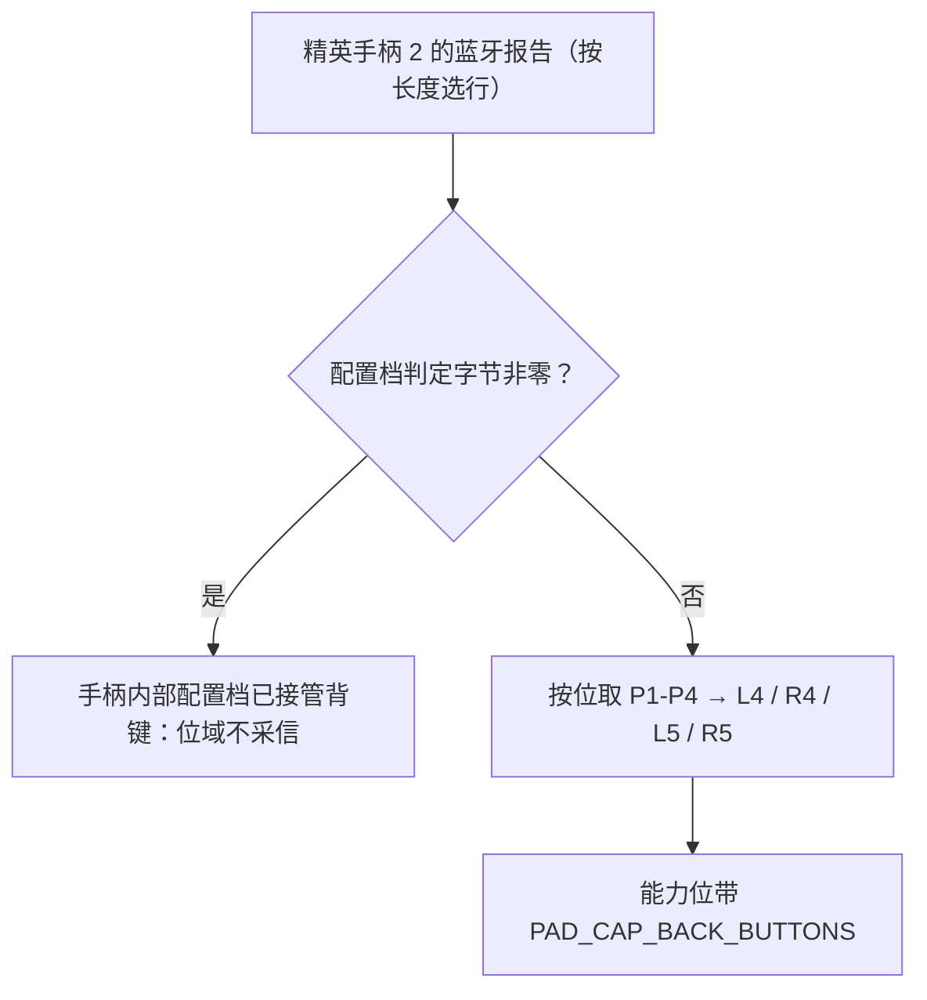

# Xbox 家族手柄数据规范（Xbox One S / Series X|S / 精英手柄 2）

本规范记录 Xbox 系列手柄蓝牙 HID 输入报告与震动输出报告规范。

## 型号与标识

| 型号 | VID:PID 举例 | 报文长度 | 备注 |
| :--- | :--- | :--- | :--- |
| Xbox One S（4.x 固件） | `0x045E:0x02E0`、`0x045E:0x02FD` | 16 字节 | 没有分享键那一字节，西瓜键走独立报文 |
| Xbox One S / Series（5.x 固件） | `0x045E:0x0B05`、`0x045E:0x0B13`、`0x045E:0x0B20` | 17 字节起 | 第三字节 bit0 是分享键 |
| 精英手柄 2（蓝牙） | `0x045E:0x0B22` | 55 / 39 / 20 字节 | 背键位与配置档判定字节的位置随报文长度变 |

家族按 Microsoft 的 VID（`0x045E`）判定；同一个 Report ID 下按报文长度与 PID 分行，
精英手柄的行带 PID 过滤，避免普通手柄的报文被当成精英手柄解析出背键。

## 输入报告布局（Report ID `0x01`）

偏移一律从报告首字节起算（含 Report ID）。

| 字段 | 偏移 | 长度 | 说明 |
| :--- | :--- | :--- | :--- |
| 左摇杆 | `0x01` | 4 | 两对无符号 16 位小端（X 在前），中位 `0x8000` |
| 右摇杆 | `0x05` | 4 | 同上 |
| 左扳机 | `0x09` | 2 | 10 位值 0-1023 |
| 右扳机 | `0x0B` | 2 | 同上 |
| 方向键帽子 | `0x0D` | 1 | 1 为上、顺时针，0 为松开（与 PS 系 0 起算的编号不同） |
| 按键（面键与肩键） | `0x0E` | 1 | A / B / X / Y 与 LB / RB |
| 按键（功能键） | `0x0F` | 1 | View / Menu / 西瓜键 / 摇杆按下 |
| 分享键 | `0x10` | 1 | bit0；16 字节报文里没有这一字节 |
| 背键（精英手柄 2） | `0x21` / `0x11` / `0x13` | 1 | 55 / 39 / 20 字节报文各自的位置 |
| 配置档判定（精英手柄 2） | `0x23` / `0x13` / `0x11` | 1 | 非零表示背键交给手柄内部配置档 |

设备 Y 轴向下为正（左摇杆推满下是 `0xFFFF` 附近的高位），解析侧翻成「上为正」。

### 按键位图

| 字节 | bit0 | bit1 | bit2 | bit3 | bit4 | bit5 | bit6 | bit7 |
| :--- | :--- | :--- | :--- | :--- | :--- | :--- | :--- | :--- |
| `0x0E` | A | B | — | X | Y | — | LB | RB |
| `0x0F` | — | — | View（Back） | Menu（Start） | 西瓜键 | L3 | R3 | — |
| `0x10` | 分享键 | — | — | — | — | — | — | — |

面键按位置语义映射：物理 A（下）→ `PAD_BTN_CROSS`、物理 B（右）→ `PAD_BTN_CIRCLE`、
物理 X（左）→ `PAD_BTN_SQUARE`、物理 Y（上）→ `PAD_BTN_TRIANGLE`。

### 精英手柄 2 的背键位

| 报文长度 | 背键位 | 配置档判定字节 | 位序 |
| :--- | :--- | :--- | :--- |
| 55 字节（初版固件） | `0x21` | `0x23` | bit0-3 依次是 P1-P4 |
| 39 字节（4.x 固件） | `0x11` | `0x13` | 同上 |
| 20 字节（5.13+ 固件） | `0x13` | `0x11` | 同上（两行的位置互换） |

背键按 P1 → L4、P2 → R4、P3 → L5、P4 → R5 落进私有格式的背键位。判定与采信规则：

```mermaid
flowchart TB
    Report["精英手柄 2 的蓝牙报告（按长度选行）"] --> Mode{"配置档判定字节非零？"}
    Mode -->|"是"| Mapped["手柄内部配置档已接管背键：位域不采信"]
    Mode -->|"否"| Bits["按位取 P1-P4 → L4 / R4 / L5 / R5"]
    Bits --> Caps["能力位带 PAD_CAP_BACK_BUTTONS"]
```

非精英手柄的行没有背键字段，即使报文长度相同也不产生背键。

未登记的字段：电量与西瓜键（4.x 固件）都是独立报文，本设备一帧一份报告的模型装不下，
不解析；分享键在 16 字节报文里不存在。

## 输出报告（震动，Report ID `0x03`）

| 偏移 | 字段 |
| :--- | :--- |
| `0x01` | 使能掩码 `0x0F`（两路主马达与两路扳机马达） |
| `0x02` / `0x03` | 左 / 右扳机马达 |
| `0x04` / `0x05` | 左主马达（低频带）/ 右主马达（高频带） |
| `0x06`-`0x08` | 时长 `0xFF`、起始延迟 `0x00`、循环数 |

循环数取 `0x01`（单次触发，由主机持续帧维持），玩家灯不走此报文。

## USB（厂商接口）形态：只作协议记录
