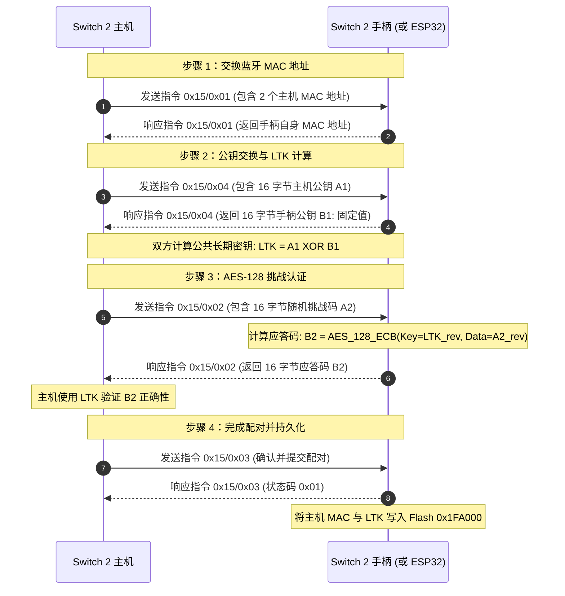
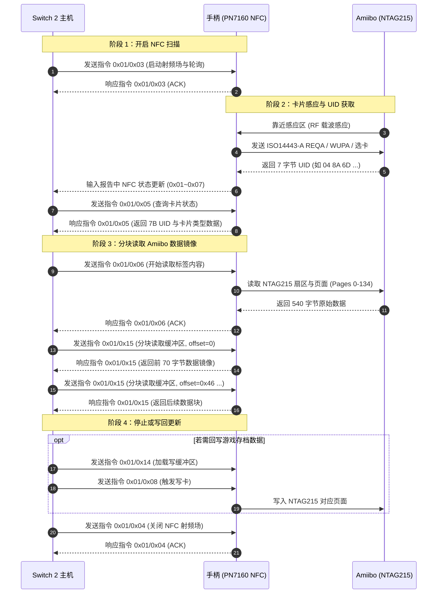
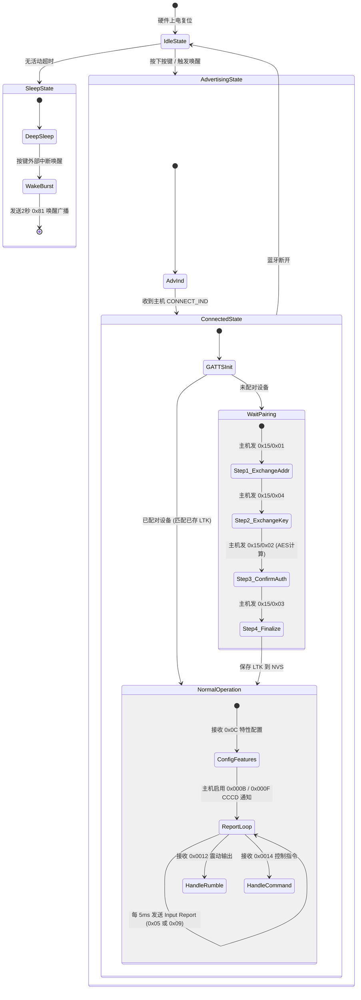
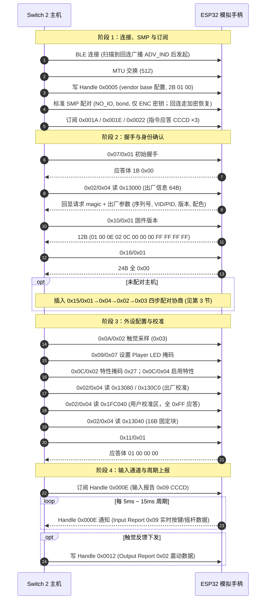

# Switch 2 手柄通信协议与数据交互技术规范

本规范整理自开源逆向工程项目与协议分析资料，详细记录任天堂 Switch 2 官方手柄（包括 Joy-Con 2、Pro Controller 2 及 NSO GameCube 手柄）在无线（Bluetooth LE）与有线（USB）模式下的信号发送、接收数据结构、自定义配对算法、GATT 属性表、HID 报告格式、指令集架构及存储布局，作为基于 ESP32-S3 的 Remapad 控制器数据面实现参考。

Remapad 的最终目标是接收 USB 输入，转换为 NS2 手柄报告，并通过 BLE 向主机提供手柄服务；广播、GATT、输入/输出报告、配对、回连和唤醒均属于固件产品数据面，不属于 PocketJS UI runtime。当前固件的 USB 接收、NS2 编码、BLE 服务和配对状态机按 [ROADMAP.md](ROADMAP.md) 里程碑逐步接入（BLE 链路先行，USB 输入殿后），进度以该文件为准；实现这些功能时必须结合真实设备抓包与互操作测试验证本文的逆向结论。系统架构见 [ARCHITECTURE.md](ARCHITECTURE.md)，PocketJS UI bridge 只承载低频状态和控制消息。

---

## 1. 协议体系与硬件架构总览

Switch 2 手柄放弃了前代 Switch 1 使用的经典蓝牙（Bluetooth BR/EDR）协议，全面转向低功耗蓝牙（Bluetooth LE 5.x）。在通信架构上，任天堂未采用行业标准的 HID over GATT Profile (HOGP) 或 Security Manager Protocol (SMP) 安全配对，而是实现了一套运行于自定义 GATT 属性和 HID 命令帧之上的私有通信协议。

### 核心特性

- **无线传输层**：Bluetooth LE，采用 5ms 连接间隔（低于标准 BLE 规范的 7.5ms，数据刷新率可达 ~200Hz）。
- **设备识别机制**：广播中不包含标准 HID 设备标识，全部依靠广播帧中的厂商特定数据字段（AD Type `0xFF`，Vendor ID `0x057E`，Company ID `0x0553`）。
- **配对机制**：禁用标准 BLE SMP 配对；在自定义 GATT/HID 指令通道上执行带外（Pseudo-OOB）密钥交换与 AES-128 挑战认证。
- **GATT 架构**：通过私有服务与特征值收发输入报告、输出报告、触觉震动和配置指令。
- **休眠唤醒**：通过在 BLE 广播信道（37/38/39）发送特定的无连接广播帧（包含主机 MAC 地址与特定状态标志位 `0x81`）实现单向主机唤醒。

### 手柄型号与产品标识（Product ID）

| 设备类型 | 标准 USB/BLE PID | 安全模式 USB PID | 厂商标识（VID） |
| :--- | :--- | :--- | :--- |
| Joy-Con 2 (L) | `0x2067` | `0x2071` | `0x057E` (Nintendo) |
| Joy-Con 2 (R) | `0x2066` | `0x2070` | `0x057E` (Nintendo) |
| Switch 2 Pro Controller | `0x2069` | `0x2072` | `0x057E` (Nintendo) |
| NSO GameCube Controller | `0x2073` | `0x2074` | `0x057E` (Nintendo) |

---

## 2. 物理与链路传输层规范

### 2.1 Bluetooth LE 广播帧规范（Advertisements）

Switch 2 主机在底层芯片层面启用了广播过滤机制，仅接收符合格式的任天堂广播帧。广播数据总长为 31 字节，包含两部分：BLE 广播标志（Flags）与厂商自定义数据（Manufacturer Specific Data）。

广播方地址（AdvA）与间隔（实机抓包，ndeadly/switch2_controller_research）：真实 Pro Controller 2 以 **public 地址**发送全部广播，地址前缀为 Nintendo OUI `98:E2:55`（2024 年注册的 Switch 2 手柄专用前缀，抓包 1124 个广播包均同址）；广播事件间隔实测约 40 ms（即 0.625 ms × 0x40）。**勘误（22.5.0 实测）**：主机并不校验广播地址 OUI——使用 Nintendo `78:81:8C` OUI（已验证同行实现所选）的模拟手柄可正常被搜索、配对与回连；OUI 伪装仅为与已验证实现对齐，非协议要求。广播 PDU 实测为 legacy `ADV_IND`（可连接可扫描，附空 SCAN_RSP）；扩展 PDU（legacy_pdu=0）无法同时置可连接与可扫描位，模拟实现需按 legacy PDU 配置（可另开扩展 PDU 实例并行广播以兼容不同扫描方）。

#### 手柄发往主机的广播包类型

| 广播类型 | PDU 类型 | Flags (AD Type=`0x01`) | 厂商数据长度与类型 | 厂商数据内容 (AD Type=`0xFF`, 共 26 字节) |
| :--- | :--- | :--- | :--- | :--- |
| 标准发现广播 | `ADV_IND` | `02 01 06` (General Discovery, BR/EDR Not Supported) | `1B FF` | `53 05 01 00 03 7E 05 [PID] 00 01 00 [00*6] 0F [00*7]` |
| 回连广播 | `ADV_IND` | `02 01 06` | `1B FF` | `53 05 01 00 03 7E 05 [PID] 00 01 00 [主机MAC反序] 0F [00*7]` |
| 唤醒主机广播 | `ADV_IND` / `ADV_NONCONN_IND` | `02 01 06` | `1B FF` | `53 05 01 00 03 7E 05 [PID] 00 01 81 [主机MAC反序] 0F [00*7]` |

#### 厂商自定义数据字段定义（26 字节）

| 偏移 (Offset) | 长度 (Size) | 字段名 | 字节数值 / 规则 | 说明 |
| :--- | :--- | :--- | :--- | :--- |
| `0x00` | 2 | Manufacturer ID | `53 05` (`0x0553`) | 任天堂公司标识（小端序） |
| `0x02` | 1 | Header 1 | `0x01` | 固定协议头 |
| `0x03` | 1 | Header 2 | `0x00` | 固定协议头 |
| `0x04` | 1 | Header 3 | `0x03` | 固定协议头 |
| `0x05` | 2 | Vendor ID | `7E 05` (`0x057E`) | 任天堂 USB VID（小端序） |
| `0x07` | 2 | Product ID | 如 `69 20` (`0x2069`) | 手柄型号 PID（小端序） |
| `0x09` | 1 | Sub-flag 1 | `0x00` | 固定字段 |
| `0x0A` | 1 | Sub-flag 2 | `0x01` | 固定字段 |
| `0x0B` | 1 | 状态标志位 | `0x81` 或 `0x00` | **唤醒主机的关键标志位**：唤醒时必须为 `0x81`，普通回连为 `0x00` |
| `0x0C` | 6 | 目标主机 MAC | 6 字节 MAC 地址（**反向字节序**） | 普通广播为全 `0x00`；回连与唤醒为已绑定的主机 MAC 反序 |
| `0x12` | 1 | 尾部标志 | `0x0F` | 固定字段 |
| `0x13` | 7 | 保留字段 | 7 字节全 `0x00` | 保留对齐填充 |

#### 主机发往手柄的唤醒广播（寻找手柄功能）

主机在用户执行“查找手柄”时会发送无连接广播：
- **PDU 类型**：`ADV_NONCONN_IND`
- **Flags**：`0x18` (`DualModeControllerSupport` | `DualModeHostSupport`)
- **厂商数据结构**（14 字节）：
  - 偏移 `0x00`（2字节）：`53 05`（任天堂厂商 ID）
  - 偏移 `0x02`（4字节）：`03 00 01 00`
  - 偏移 `0x06`（1字节）：`0x80`
  - 偏移 `0x07`（6字节）：目标手柄蓝牙 MAC 地址（**反向字节序**）
  - 偏移 `0x0D`（1字节）：`0x01`

---

### 2.2 USB 物理接口规范与描述符

Switch 2 手柄插入底座或线连时通过 USB 2.0 全速/高速通信。设备具备复合接口架构：

- **Joy-Con 2 (L/R) USB 架构**：
  - Interface 0 (Class 0x03 HID)：端点 `0x81` (IN Interrupt, 64B, 4ms), 端点 `0x01` (OUT Interrupt, 64B, 4ms)
  - Interface 1 (Class 0xFF Vendor Specific)：端点 `0x02` (OUT Bulk, 64B), 端点 `0x82` (IN Bulk, 64B)
- **Pro Controller 2 USB 架构**：
  - Interface 0 (Class 0x03 HID)：HID 按键与震动控制通道
  - Interface 1 (Class 0xFF Vendor Specific)：固件升级与原始数据通道
  - Interface 2 (Class 0x01 Audio Control)：音频控制接口
  - Interface 3 (Class 0x01 Audio Streaming - OUT)：耳机音频输出 (PCM 16-bit 48kHz Stereo, Isochronous EP `0x03`, 192B)
  - Interface 4 (Class 0x01 Audio Streaming - IN)：麦克风音频输入 (PCM 16-bit 48kHz Stereo, Isochronous EP `0x83`, 192B)

---

## 3. 自定义安全配对与密钥协商协议

Switch 2 手柄与主机之间的密钥协商在自定义命令通道（Command 0x15）中通过 4 个步骤的挑战-应答完成。**勘误（22.5.0 实测）**：链路层**同时运行标准 BLE SMP**（Just Works 形态：IO 能力 `NO_IO`、 bonding 置位、无 MITM、不用 LE Secure Connections、仅分发 ENC 密钥；配对不绑定，绑定键由 0x15 协商结果注入本端 store），主机在 MTU 交换后先走 SMP 再发指令；模拟实现若拒绝 SMP，主机在 MTU 交换后即停滞。

### 3.1 配对流程阶段分解



各步骤请求/应答体（body）字节布局（实机抓包，ndeadly/switch2_controller_research）：请求体首字节固定 `0x00`，应答体首字节固定 `0x01`。

| 步骤 | 请求体 | 应答体 |
| :--- | :--- | :--- |
| 0x15/0x01 | `00 [地址数] [地址数×6B 主机地址反序]`（主机发 2 个地址，仅末字节相差 `0x80`/`0x81`） | `01 04 01 [手柄地址反序]`（共 9 字节） |
| 0x15/0x04 | `00 [16B 主机公钥 A1 反序]` | `01 [16B 手柄公钥 B1]`（固定值，未反转） |
| 0x15/0x02 | `00 [16B 挑战码 A2 反序]` | `01 [16B 应答码 B2（AES 原始输出，不反转）]` |
| 0x15/0x03 | `00` | `01` |

### 3.2 密码学计算详细算法

- **公钥常量**：官方手柄返回的手柄公钥 B1 在目前固件中表现为固定常量：
  `5C F6 EE 79 2C DF 05 E1 BA 2B 63 25 C4 1A 5F 10`
- **长期密钥派生**（22.5.0 实测）：
  应答 B2 所用密钥 `LTK = reverse(A1) XOR reverse(B1)`（A1/B1 均为线上传输的反序字节）；注入本端 BLE store 供标准 SMP 链路加密的 LTK 即该值按存储序写入（NimBLE 为小端，等价于对线序异或结果再反转）。
- **认证加密计算**（22.5.0 实测）：
  应答码 B2 = 标准 AES-128 在 ECB 模式下以 `reverse(A1) XOR reverse(B1)` 为密钥、加密 `reverse(A2)` 的**原始输出**，线上不再反转：
  `B2 = AES128_ECB(Key=reverse(A1) XOR reverse(B1), Data=reverse(A2))`

Python 算法参考（已验证可通过主机配对确认）：
```python
from Crypto.Cipher import AES

def calculate_pairing_response(a1_wire, a2_wire):
    # 手柄固定公钥 B1（线序即常量序）
    b1 = bytes.fromhex("5cf6ee792cdf05e1ba2b6325c41a5f10")
    # 密钥：双方线上字节各自反转后异或
    key = bytes(a ^ b for a, b in zip(a1_wire[::-1], b1[::-1]))
    # 挑战码反转后加密，输出不反转
    b2 = AES.new(key, AES.MODE_ECB).encrypt(a2_wire[::-1])
    return key, b2
```

---

## 4. GATT 属性表与服务架构

建立 BLE 连接后，手柄对外暴露专有 GATT 服务与特征值。

### 4.1 核心 GATT 服务映射表

| 服务 / 特征值 UUID | 类型 | 句柄 (Handle) | 属性 (Properties) | 用途说明 | 适用设备 |
| :--- | :--- | :--- | :--- | :--- | :--- |
| `00c5af5d-1964-4e30-8f51-1956f96bd280` | Primary Service | `0x0001-0x0007` | - | 厂商基础控制服务 | 全系列 |
| `00c5af5d-1964-4e30-8f51-1956f96bd281` | Characteristic | `0x0003` | READ | 基础状态读取 | 全系列 |
| `00c5af5d-1964-4e30-8f51-1956f96bd282` | Characteristic | `0x0005` | WRITE | 基础状态配置 | 全系列 |
| `00c5af5d-1964-4e30-8f51-1956f96bd283` | Characteristic | `0x0007` | READ | 设备标识读取 | 全系列 |
| `ab7de9be-89fe-49ad-828f-118f09df7fd0` | Primary Service | `0x0008-0x002A` | - | 主手柄 HID 通信服务 | 全系列 |
| `ab7de9be-89fe-49ad-828f-118f09df7fd2` | Characteristic | `0x000A` | READ \| NOTIFY | **Input Report 0x05**（通用输入报告） | 全系列 |
| `00002902-0000-1000-8000-00805f9b34fb` | Descriptor | `0x000B` | READ \| WRITE | CCCD（写入 `0x0001` 开启通知） | 全系列 |
| `679d5510-5a24-4dee-9557-95df80486ecb` | Descriptor | `0x000C` | - | 报告率配置描述符 | 全系列 |
| `cc1bbbb5-7354-4d32-a716-a81cb241a32a` | Characteristic | `0x000E` | READ \| NOTIFY | **Input Report 0x07**（专用输入报告） | Joy-Con (L) |
| `d5a9e01e-2ffc-4cca-b20c-8b67142bf442` | Characteristic | `0x000E` | READ \| NOTIFY | **Input Report 0x08**（专用输入报告） | Joy-Con (R) |
| `7492866c-ec3e-4619-8258-32755ffcc0f8` | Characteristic | `0x000E` | READ \| NOTIFY | **Input Report 0x09**（专用输入报告） | Pro Controller |
| `8261cba1-9435-420c-84d6-f0c75a2c8e4d` | Characteristic | `0x000E` | READ \| NOTIFY | **Input Report 0x0A**（专用输入报告） | GameCube |
| `00002902-0000-1000-8000-00805f9b34fb` | Descriptor | `0x000F` | READ \| WRITE | CCCD（写入 `0x0001` 开启专用报告通知） | 全系列 |
| `289326cb-a471-485d-a8f4-240c14f18241` | Characteristic | `0x0012` | WRITE NO RSP | **Output Report 0x01**（触觉震动数据） | Joy-Con (L) |
| `fa19b0fb-cd1f-46a7-84a1-bbb09e00c149` | Characteristic | `0x0012` | WRITE NO RSP | **Output Report 0x01**（触觉震动数据） | Joy-Con (R) |
| `cc483f51-9258-427d-a939-630c31f72b05` | Characteristic | `0x0012` | WRITE NO RSP | **Output Report 0x02**（双路震动数据） | Pro Controller |
| `3f8fb670-ab25-45bf-b540-38c72834d064` | Characteristic | `0x0012` | WRITE NO RSP | **Output Report 0x03**（传统马达震动） | GameCube |
| `649d4ac9-8eb7-4e6c-af44-1ea54fe5f005` | Characteristic | `0x0014` | WRITE NO RSP | **Command 发送通道**（主机向手柄下发指令） | 全系列 |
| `ce49a830-dced-48ae-931e-c8cf88aadbea` | Characteristic | `0x0016` | WRITE NO RSP | **复合输出通道**（震动 + 指令写入） | Joy-Con (L) |
| `65a724b3-f1e7-4a61-8078-a342376b27ff` | Characteristic | `0x0016` | WRITE NO RSP | **复合输出通道**（震动 + 指令写入） | Joy-Con (R) |
| `3dacbc7e-6955-40b5-8eaf-6f9809e8b379` | Characteristic | `0x0016` | WRITE NO RSP | **复合输出通道**（震动 + 指令写入） | Pro Controller |
| `af95885e-44b3-4a24-9cf0-483cc129469a` | Characteristic | `0x0016` | WRITE NO RSP | **复合输出通道**（震动 + 指令写入） | GameCube |
| `4147423d-fdae-4df7-a4f7-d23e5df59f8d` | Characteristic | `0x0018` | WRITE NO RSP | 固件升级数据块写入 | 全系列 |
| `c765a961-d9d8-4d36-a20a-5315b111836a` | Characteristic | `0x001A` | NOTIFY | **Command 应答通道 #1**（ACK/数据返回） | 全系列 |
| `00002902-0000-1000-8000-00805f9b34fb` | Descriptor | `0x001B` | READ \| WRITE | CCCD（写入 `0x0001` 开启指令应答通知） | 全系列 |
| `506d9f7d-4278-4e95-a549-326ba77657e0` | Characteristic | `0x001E` | NOTIFY | **Command 应答通道 #2** | Pro Controller |
| `cc483f51-9258-427d-a939-630c31f72b06` | Characteristic | `0x002C` | WRITE NO RSP | 耳机音频下行流 | Pro Controller (带音频) |
| `7492866c-ec3e-4619-8258-32755ffcc0f9` | Characteristic | `0x002E` | READ \| NOTIFY | 麦克风音频上行流 | Pro Controller (带音频) |

---

## 5. HID 报告数据结构规范

在 USB 模式下，报告数据首字节为 Report ID；在 BLE 模式下，数据直接通过对应的 Characteristic Handle 发送，**省略 Report ID 字节**。

### 5.1 Input Report 0x05（通用全功能输入报告，63 字节）

由 Handle `0x000A` 发送，适用于所有 Switch 2 控制器。

| 偏移 (Offset) | 长度 (Size) | 字段名称 | 详细说明 |
| :--- | :--- | :--- | :--- |
| `0x00` | 4 | 报告计数器 (Counter) | 32 位无符号递增计数器（每次上报加 1，小端序） |
| `0x04` | 4 | 按键位图 (Buttons) | 4 字节按键状态位（见下方按键表） |
| `0x08` | 2 | 未知/保留 | 恒为 `0x00 0x00` |
| `0x0A` | 3 | 左模拟摇杆 (Left Stick) | 12 位紧凑打包坐标（X: 0-4095, Y: 0-4095） |
| `0x0D` | 3 | 右模拟摇杆 (Right Stick) | 12 位紧凑打包坐标（X: 0-4095, Y: 0-4095） |
| `0x10` | 8 | 鼠标绝对坐标数据 | 特性位 4 启用时有效（Joy-Con 支持）：X(2B), Y(2B), 表面质量(2B), 悬空距离(2B) |
| `0x18` | 1 | 保留 | 恒为 `0x00` |
| `0x19` | 6 | 磁力计数据 | 特性位 7 启用时有效：X (2B LE), Y (2B LE), Z (2B LE) |
| `0x1F` | 2 | 电池电压 (mV) | 16 位整数（小端序），如 `0x0EA5` = 3749 mV |
| `0x21` | 1 | 充电状态 | 连接 USB 时升至 `0x34`，充满电时为 `0x20` |
| `0x22` | 2 | 电池电流 | 特性位 5 启用时报告 |
| `0x24` | 5 | 未知/保留 | 恒为 `0x00` |
| `0x29` | 1 | 标志位 | 恒为 `0x01` |
| `0x2A` | 18 | IMU 6轴运动传感器数据 | 特性位 2 启用时有效（时间戳 4B, 温度 2B, 加速度 XYZ 各 2B, 陀螺仪 XYZ 各 2B） |
| `0x3C` | 1 | 左模拟扳机行程 | NSO GameCube 手柄专用（0-255） |
| `0x3D` | 1 | 右模拟扳机行程 | NSO GameCube 手柄专用（0-255） |
| `0x3E` | 1 | 保留字节 | `0x00` |

#### 按键位图定义 (Report 0x05 Buttons 4 字节)

| 字节偏移 | Bit 7 (`0x80`) | Bit 6 (`0x40`) | Bit 5 (`0x20`) | Bit 4 (`0x10`) | Bit 3 (`0x08`) | Bit 2 (`0x04`) | Bit 1 (`0x02`) | Bit 0 (`0x01`) |
| :--- | :--- | :--- | :--- | :--- | :--- | :--- | :--- | :--- |
| **Byte 0** | ZR | R | 右 SL | 右 SR | A | B | X | Y |
| **Byte 1** | 保留 | C 键 | 截图 (Capture) | 主页 (Home) | 左摇杆下压 (LS) | 右摇杆下压 (RS) | 加号 (+) | 减号 (-) |
| **Byte 2** | ZL | L | 左 SL | 左 SR | 方向键左 | 方向键右 | 方向键上 | 方向键下 |
| **Byte 3** | 保留 | 保留 | 保留 | 耳机插入状态 | 保留 | 保留 | GL 背键 | GR 背键 |

---

### 5.2 专用输入报告（Report 0x07, 0x08, 0x09, 0x0A）

由 Handle `0x000E` 发送。主机日常通信默认订阅此特征值。

#### Input Report 0x09（Pro Controller 2 专用输入报告）

| 偏移 (Offset) | 长度 (Size) | 字段名称 | 详细说明 |
| :--- | :--- | :--- | :--- |
| `0x00` | 1 | 8位计数器 (Counter) | 每次递增 1（0-255 循环） |
| `0x01` | 1 | 电源状态 | Bit 0: 外部供电; Bit 1: 充电中; Bits 2-5: 电量等级 (0-9); Bits 6-7: 保留 |
| `0x02` | 3 | 按键位图 (3 字节) | 见下表 |
| `0x05` | 3 | 左摇杆原始数据 | 12 位紧凑打包坐标 |
| `0x08` | 3 | 右摇杆原始数据 | 12 位紧凑打包坐标 |
| `0x0B` | 1 | 状态标志 | 特性位 5 开启时为 `0x38`，否则为 `0x30` |
| `0x0C` | 1 | NFC 状态 | `0x00` 表示空闲，`0x01-0x07` 对应工作状态 |
| `0x0D` | 1 | 耳机音频状态 | 插入带麦耳机: `0x07`/`0x0F`；纯耳机: `0x05`/`0x0D`；未插入: `0x00` |
| `0x0E` | 1 | 运动数据长度 | 紧随其后的运动数据字节数（常见值为 0, 30 或 40） |
| `0x0F` | 40 | 运动数据包 (Motion) | 特性位 2 启用时的 IMU 采样数据 |
| `0x37` | 8 | 保留 | 填 0 |

##### Pro Controller 2 专用按键位图 (3 字节)

| 字节偏移 | Bit 7 (`0x80`) | Bit 6 (`0x40`) | Bit 5 (`0x20`) | Bit 4 (`0x10`) | Bit 3 (`0x08`) | Bit 2 (`0x04`) | Bit 1 (`0x02`) | Bit 0 (`0x01`) |
| :--- | :--- | :--- | :--- | :--- | :--- | :--- | :--- | :--- |
| **Byte 0** | 右摇杆下压 | 加号 (+) | ZR | R | X | Y | A | B |
| **Byte 1** | 左摇杆下压 | 减号 (-) | ZL | L | 方向键上 | 方向键左 | 方向键右 | 方向键下 |
| **Byte 2** | 保留 | 保留 | 保留 | C 键 | GL 背键 | GR 背键 | 截图 (Capture) | 主页 (Home) |

---

### 5.3 模拟摇杆 12 位紧凑打包（Packed 12-bit）编解码算法

左右摇杆的 X、Y 轴均具有 12 位精度（数值范围 0 到 4095，中心基准值约为 2048），在传输时每两个轴（3 字节，24 位）进行交叉压缩存储。

#### 3 字节解包为 X, Y 轴公式
设 3 字节输入数据为 `data[0]`, `data[1]`, `data[2]`：
- `X = data[0] | ((data[1] & 0x0F) << 8)`
- `Y = (data[1] >> 4) | (data[2] << 4)`

#### X, Y 轴打包为 3 字节公式
设输入的 12 位轴坐标为 X (0 <= X <= 4095) 和 Y (0 <= Y <= 4095)：
- `data[0] = X & 0xFF`
- `data[1] = ((X >> 8) & 0x0F) | ((Y & 0x0F) << 4)`
- `data[2] = (Y >> 4) & 0xFF`

C 语言实现示例：
```c
void pack_stick(uint16_t x, uint16_t y, uint8_t *out) {
    out[0] = (uint8_t)(x & 0xFF);
    out[1] = (uint8_t)(((x >> 8) & 0x0F) | ((y & 0x0F) << 4));
    out[2] = (uint8_t)((y >> 4) & 0xFF);
}

void unpack_stick(const uint8_t *in, uint16_t *x, uint16_t *y) {
    *x = (uint16_t)(in[0] | ((in[1] & 0x0F) << 8));
    *y = (uint16_t)((in[1] >> 4) | (in[2] << 4));
}
```

---

### 5.4 输出报告格式（Output Reports - 触觉震动与反馈）

主机通过向 Handle `0x0012` 写入数据下发震动指令。

#### Output Report 0x02（Pro Controller 2 双路 LRA 线性马达震动）

| 偏移 (Offset) | 长度 (Size) | 字段名称 | 说明 |
| :--- | :--- | :--- | :--- |
| `0x00` | 1 | 报告 ID | USB 模式下为 `0x02`；BLE 模式下为 `0x00` |
| `0x01` | 16 | 左侧 LRA 震动参数包 | 包含 1 字节状态与 3 组各 5 字节的音调/振幅指令 |
| `0x11` | 16 | 右侧 LRA 震动参数包 | 包含 1 字节状态与 3 组各 5 字节的音调/振幅指令 |
| `0x21` | 9 | 保留字段 | 填充 0 |

##### LRA 震动单元数据包结构（16 字节）
- **Byte 0 (状态字)**：低 4 位为事务计数器 TID（每次递增 0-15），Bit 4-5 为操作数计数，Bit 6 为启用标志。
- **Byte 1-15 (3 组操作数据)**：每组 5 字节，定义低频频率（LF Freq，9 位）、低频振幅（LF Amp，10 位）、高频频率（HF Freq，9 位）、高频振幅（HF Amp，8 位）及音频使能。

---

## 6. 控制指令系统（Commands & Subcommands）

主机通过写入 Handle `0x0014`（或 USB 端点 `0x01`）下发指令，手柄通过 Handle `0x001A`（或 USB 端点 `0x81`）回复 ACK 与应答数据。

### 6.1 通用指令帧头格式

所有指令请求与响应均以 8 字节标准头开始：

| 偏移 | 长度 | 字段 | 请求值 (Host -> Device) | 响应值 (Device -> Host) | 说明 |
| :--- | :--- | :--- | :--- | :--- | :--- |
| `0x00` | 1 | Command ID | 主命令号 (如 `0x0C`) | 主命令号 (如 `0x0C`) | 标识命令分类 |
| `0x01` | 1 | Direction | `0x91` (Request) | `0x01` (Response) | 传输方向标志 |
| `0x02` | 1 | Transport | `0x00`(USB) / `0x01`(BLE) | `0x00`(USB) / `0x01`(BLE) | 接口通道 |
| `0x03` | 1 | Subcommand ID | 子命令号 (如 `0x04`) | 子命令号 (如 `0x04`) | 具体功能 |
| `0x04` | 1 | Status / Info | `0x00` | `0x10` 或 `0x00` | 状态信息 |
| `0x05` | 1 | Length / ACK | 随后的数据体长度 | 响应状态/ACK (`0x78`/`0xF8`) | 确认标志 |
| `0x06` | 2 | Reserved | `0x00 0x00` | `0x00 0x00` | 8 字节对齐填充 |

---

### 6.2 核心指令集详解

#### Command 0x02 - SPI Flash 存储器访问

**勘误（22.5.0 实测）**：`0x04` 通用读取的应答体并非"长度+地址+数据"布局，而是**回显请求体 magic 后接数据**：应答体 = 请求体 [8:16] 的 8 字节原样回显（仅将其中第 1 字节清零）+ `N` 字节读取数据；地址字段实测为 3 字节小端 + 1 字节保留。对未初始化区域（如用户校准区 `0x1FC040`）必须以全 `0xFF` 数据应答——返回空应答体会令主机中止初始化（不再订阅输入通道，表现为手柄"已连接但按键无反应"）。主机回连初始化实测会读取 `0x13000`、`0x13080`、`0x130C0`、`0x1FC040`、`0x13040` 五个地址（首次配对流程不读 `0x1FC040` 与 `0x13040`）。

| 子命令 (Subcmd) | 功能名称 | 请求数据体格式 | 响应数据体格式 |
| :--- | :--- | :--- | :--- |
| `0x01` | 读固定 64B 块 | 4B 保留(0) + 4B 读取地址 (小端) | 1B 长度(`0x40`) + 3B 保留 + 4B 地址 + 64B 原始数据 |
| `0x02` | 写固定 64B 块 | 4B 保留(0) + 4B 写入地址 (小端) + 64B 数据 | 1B 长度(`0x40`) + 3B 保留 + 4B 地址 + 64B 数据回读 |
| `0x03` | 擦除扇区 (4KB) | 4B 保留(0) + 4B 扇区对齐地址 (小端) | 4B 保留(0) |
| `0x04` | 通用内存读取 | 1B 长度 + 1B `0x7E` + 2B 保留 + 3B 地址 (小端) + 1B 保留 | 8B 请求体回显（[1] 清零） + N 字节数据 |
| `0x05` | 通用内存写入 | 1B 长度 + 1B `0x7E` + 2B 保留 + 4B 地址 + 数据 | 4B 保留 + 4B 地址 |

#### Command 0x03 - 初始化与连接建立

| 子命令 (Subcmd) | 功能名称 | 请求说明 | 响应说明 |
| :--- | :--- | :--- | :--- |
| `0x01` | 开启 BLE 唤醒广播 | 4B 参数（非 0 开启广播） | 无数据体 |
| `0x02` | 取消 BLE 广播 | 无数据体 | 无数据体 |
| `0x03` | 开启 USB HID 上报 | 1B 开启标志 + 3B 保留 | 4B 状态字 |
| `0x07` | 直接注入配对信息 | 6B 主机 MAC (反序) + 16B LTK (反序) | 无数据体 |
| `0x08` | 清除配对信息 | 无数据体 | 无数据体 |
| `0x09` | 保存已注入的配对信息 | 无数据体 (写入 Flash `0x1FA000`) | 无数据体 |
| `0x0A` | 选择输入报告格式 | 1B 目标报告 ID (`0x05` 或 `0x09`) + 3B 保留 | 无数据体 |
| `0x0D` | 初始化 USB 通道 | 1B 标志 + 1B 标志 + 6B 主机 MAC (反序) | 4B 确认字 |

#### Command 0x09 - 玩家指示灯控制（LED）

| 子命令 (Subcmd) | 功能说明 | 请求数据体 |
| :--- | :--- | :--- |
| `0x01` | 点亮 Player 1 LED | 无数据体（对应掩码 `0b0001`） |
| `0x02` | 点亮 Player 2 LED | 无数据体（对应掩码 `0b0010`） |
| `0x03` | 点亮 Player 3 LED | 无数据体（对应掩码 `0b0100`） |
| `0x04` | 点亮 Player 4 LED | 无数据体（对应掩码 `0b1000`） |
| `0x05` | 全亮所有 LED | 无数据体（对应掩码 `0b1111`） |
| `0x06` | 熄灭所有 LED | 无数据体（对应掩码 `0b0000`） |
| `0x07` | 设置自定义 LED 掩码 | 1B 掩码（Bit 0-3 对应 LED 1-4） + 7B 保留 |
| `0x08` | LED 闪烁控制 | 1B 启用标志 (1=开启闪烁) + 7B 保留 |

#### Command 0x0A - 触觉与声音采样回放

- **子命令 `0x02` (播放内置音频/触觉采样)**：
  - 采样 ID `0x00`：静音 / 停止播放
  - 采样 ID `0x01`：低频蜂鸣（约 1 秒）
  - 采样 ID `0x02`：高频蜂鸣 + 警报提示音（用于“寻找手柄”功能）
  - 采样 ID `0x03`：清脆双击震动（连接成功提示）
  - 采样 ID `0x04`：升调提示音（电量低提示）
  - 采样 ID `0x05`：强力双击震动
  - 采样 ID `0x06` / `0x07`：高频单次短促音

#### Command 0x0C - 特性掩码与传感器使能（Feature Select）

控制输入报告中附加数据的启用状态。

##### 特性掩码位定义（Feature Flags）

| Bit | 掩码 | 功能 | 说明 |
| :--- | :--- | :--- | :--- |
| 0 | `0x01` | 按键状态 (Button State) | 基础按键上报 |
| 1 | `0x02` | 模拟摇杆 (Analog Sticks) | 摇杆坐标采集 |
| 2 | `0x04` | 6 轴 IMU | 加速度计与陀螺仪采样 |
| 3 | `0x08` | 保留 | 未使用 |
| 4 | `0x10` | 鼠标模式 (Mouse Data) | Joy-Con 光电传感器 |
| 5 | `0x20` | 触觉震动反馈 (Rumble) | 开启触觉马达响应 |
| 7 | `0x80` | 磁力计 (Magnetometer) | 地磁传感器采集 |

##### 指令流程
- `0x0C/0x02`：设置特性掩码（Set Feature Mask）
- `0x0C/0x04`：使能特性（Enable Features）
- `0x0C/0x05`：禁用特性（Disable Features）
- `0x0C/0x06`：配置采样率与传感器参数（Configure Features）

#### Command 0x10 - 固件版本信息查询

- **请求**：`10 91 01 01 00 00 00 00`
- **响应格式（12 字节数据体）**：
  - 偏移 `0x00` (3B)：手柄固件版本（主版本.次版本.修订号）
  - 偏移 `0x03` (1B)：手柄类型代码（`0x00`=JC L, `0x01`=JC R, `0x02`=Pro Controller, `0x03`=GameCube）
  - 偏移 `0x04` (3B)：蓝牙协议栈补丁版本
  - 偏移 `0x07` (1B)：填充字节
  - 偏移 `0x08` (3B)：音频 DSP 固件版本（如 Pro Controller 的音频固件版本）
  - 偏移 `0x0B` (1B)：填充字节

---

## 7. SPI Flash 存储布局与出厂校准

手柄内部集成 2MB SPI 闪存，用于固化出厂参数、校准值、固件副本及主机配对记录。所有未初始化或擦除区域的值均为 `0xFF`。

### 7.1 2MB 内存分区表

| 地址区间 | 分区大小 | 用途说明 |
| :--- | :--- | :--- |
| `0x000000 - 0x010FFF` | 68 KB (`0x11000`) | 初始出厂固件与基础引导代码 |
| `0x011000 - 0x011FFF` | 4 KB (`0x1000`) | 安全固件升级加载地址指针（4 字节小端序地址） |
| `0x012000 - 0x012FFF` | 4 KB (`0x1000`) | 升级引导 Magic 标志（写入 `0xBEEF` 启用指针） |
| `0x013000 - 0x014FFF` | 8 KB (`0x2000`) | **出厂数据区**（序列号、配色 RGB、出厂校准值） |
| `0x015000 - 0x074FFF` | 384 KB (`0x60000`) | 固件升级双分区 Bank #1 |
| `0x075000 - 0x0D4FFF` | 384 KB (`0x60000`) | 固件升级双分区 Bank #2 |
| `0x0D5000 - 0x174FFF` | 640 KB (`0xA0000`) | 扩展固件存储区 |
| `0x175000 - 0x1F9FFF` | 532 KB (`0x85000`) | 耳机音频 DSP 固件区（以 `DSPH` 标识开头） |
| `0x1FA000 - 0x1FAFFF` | 4 KB (`0x1000`) | **蓝牙配对信息存储区**（存储已配对主机 MAC 与 LTK） |
| `0x1FB000 - 0x1FBFFF` | 4 KB (`0x1000`) | 硬件特性配置区 |
| `0x1FC000 - 0x1FCFFF` | 4 KB (`0x1000`) | **用户校准数据区**（用户自定义重置的 IMU/摇杆校准） |
| `0x1FD000 - 0x1FDFFF` | 4 KB (`0x1000`) | 出厂测试/出货标志位 |

---

### 7.2 出厂数据区定义（地址 0x013000）

| 偏移 | 长度 | 示例数据 | 用途说明 |
| :--- | :--- | :--- | :--- |
| `0x13002` | 16 | `48 45 4A 37 31 30 30 31 31 32 31 32 34 37 00 00` | ASCII 序列号（如 "HEJ71001121247"） |
| `0x13012` | 2 | `7E 05` | Vendor ID (`0x057E`) |
| `0x13014` | 2 | `69 20` | Product ID (`0x2069`) |
| `0x13019` | 3 | `23 23 23` | 手柄机身 RGB 颜色值（用于主机 UI 渲染） |
| `0x1301C` | 3 | `A0 A0 A0` | 手柄按键 RGB 颜色值 |
| `0x1301F` | 3 | `E6 E6 E6` | 手柄高光/装饰部分 RGB 颜色值 |
| `0x13022` | 3 | `32 32 32` | 手柄握把部分 RGB 颜色值 |
| `0x130A8` | 9 | `B3 67 83 2E 66 5E 3A 06 5F` | **主模拟摇杆（左摇杆）9 字节出厂校准值** |
| `0x130E8` | 9 | `2C 08 84 D1 65 63 2A 26 62` | **副模拟摇杆（右摇杆）9 字节出厂校准值** |

**序列号地区编码**（switch2brew 社区考证，14 位 ASCII = 3 字母前缀 + 11 位数字）：首字母 `H` 为 Switch 2 代际；次字母为硬件型号（`A` 主机、`B` Joy-Con 2 (L)、`C` Joy-Con 2 (R)、`E` Pro Controller 2）；第三字母为销售地区（`J` 日本、`W` 美洲、`E` 欧洲、`C` 中国、`K` 韩国、`M` 马来西亚）；末位为校验位（前 10 位奇位和 + 偶位和 ×3 后对 10 取补）。`HEJ` 开头即日版 Pro Controller 2，示例 `HEJ71001121247` 与 `HEJ71001123456` 校验位均自洽。固件按此规则生成（`ns2_serial_build`，校验位 = (10 − (偶位和 + 3×奇位和) mod 10) mod 10，0 基），当前固定值：Pro `HEJ71001123456`、左 `HBW10067012342`、右 `HCW10068012341`。

**主机实测读取的其他区块**：`0x13040`（16 字节固定内容 `3B E0 D3 41 C6 60 6A BC 4D D7 A2 BB 71 1E DD 37`）、`0x13060`（空区，`0xFF`）、`0x13100`（24 字节，前 12 字节为 0）；`0x1FC000`/`0x1FC040`/`0x1FC060`（运动/主副摇杆用户自定义校准区）未经用户校准即保持全 `0xFF`。

---

### 7.3 摇杆 9 字节校准数据解析算法

每个摇杆的出厂校准数据占用 9 字节，包含中位基准点（Neutral）、最大行程相对偏差（Rel Max）、最小行程相对偏差（Rel Min）：

- **中位基准值 (Neutral)**：
  - X 轴中位 = `data[0] | ((data[1] & 0x0F) << 8)`
  - Y 轴中位 = `(data[1] >> 4) | (data[2] << 4)`
- **最大相对偏移 (Rel Max)**：
  - X 轴最大正向行程 = `data[3] | ((data[4] & 0x0F) << 8)`
  - Y 轴最大正向行程 = `(data[4] >> 4) | (data[5] << 4)`
- **最小相对偏移 (Rel Min)**：
  - X 轴最大负向行程 = `data[6] | ((data[7] & 0x0F) << 8)`
  - Y 轴最大负向行程 = `(data[7] >> 4) | (data[8] << 4)`

---

### 7.4 蓝牙配对信息区结构（地址 0x1FA000）

配对信息区存储结构由 1 字节记录数量和若干个固定 40 字节（`0x28`）的配对记录项组成：

| 偏移 | 长度 | 示例数值 | 说明 |
| :--- | :--- | :--- | :--- |
| `0x1FA000` | 1 | `0x02` | 配对项数量（通常为主机公网地址与私有第二接口共 2 项） |
| `0x1FA008` | 6 | `98 E2 55 2E 31 4B` | 主机 1 蓝牙 MAC 地址 |
| `0x1FA01A` | 16 | `D6 2C C6 ... 2D 71` | 主机 1 配对 LTK (16 字节) |
| `0x1FA030` | 6 | `98 E2 55 2E 31 4A` | 主机 2 蓝牙 MAC 地址（最后一位减 1 的辅助通道） |
| `0x1FA042` | 16 | `D6 2C C6 ... 2D 71` | 主机 2 配对 LTK (与第一项共享) |

---

## 8. NFC 与 Amiibo 数据交互协议规范

Switch 2 手柄（Joy-Con 2 右手柄及 Pro Controller 2）内置了 NXP PN7160 / PN7161 系列 NFC 控制器芯片，用于读取和写入 NFC 标签（如基于 NXP NTAG215 芯片的 amiibo 手办与卡片）。Joy-Con 2 (L) 不包含 NFC 硬件。

### 8.1 NFC 状态监控机制

在输入报告（如 Handle `0x000E` 上的 Report `0x08` 偏移 `0x0E`，或 Report `0x09` 偏移 `0x0C`）中，手柄实时上报 1 字节的 **NFC 状态字段（NFC State）**：

- `0x00`：空闲状态（Idle），当前无 NFC 卡片处于感应区。
- `0x01 - 0x07`：卡片感应与工作状态（检测到卡片入场、载波激活、数据交互中或读写完成）。

主机在游戏需要读取 amiibo 时，会通过后台监控该状态位，并配合 Command `0x01` 发起主动读取或写入。

---

### 8.2 Command 0x01 - NFC 控制与 Amiibo 数据指令集

| 子命令 (Subcmd) | 功能名称 | 请求数据体 (Host -> Device) | 响应数据体 (Device -> Host) | 详细说明 |
| :--- | :--- | :--- | :--- | :--- |
| `0x03` | 启动 NFC 轮询 | 5B 参数 (如 `00 E8 03 2C 01`) | 无数据体 (ACK) | 激活手柄内置 PN7160 射频场，开始周期性寻卡 |
| `0x04` | 停止 NFC 轮询 | 无数据体 | 无数据体 (ACK) | 关闭射频场，将 NFC 控制器置于低功耗休眠模式 |
| `0x05` | 获取卡片状态与 UID | 无数据体 | 状态字 + 7B UID (如 `04 8A 6D 2A B7 5D 80`) + 卡片类型 | 查询感应区内标签的硬件标识（7 字节标准 UID） |
| `0x06` | 读取设备页面 | 读取配置参数 (19 字节) | 无数据体 (ACK) | 触发向 NFC 标签发起读块操作 |
| `0x08` | 写入设备页面 | 写入控制参数 | 无数据体 (ACK) | 触发向 NFC 标签写入数据 |
| `0x0C` | 查询 NFC 固件/状态 | 无数据体 | 4B 状态数据 (如 `61 12 50 0D`) | 获取 NFC 控制器底层运行状态 |
| `0x14` | 写入 NFC 数据缓冲区 | 偏移地址 + 长度 + 待写入数据块 (最大 80 字节) | 无数据体 (ACK) | 将主机准备写入 amiibo 的存档数据分块加载到手柄缓冲区 |
| `0x15` | 读取 NFC 数据缓冲区 | 2B 缓冲区读取偏移 (小端序) | 读取长度 + 状态 + amiibo 内存镜像数据 (最大 70 字节) | 从手柄分块提取已读取的 amiibo 540 字节 NTAG215 完整镜像 |

---

### 8.3 Amiibo 读写完整交互时序



---

## 9. 安全恢复模式（Safe Mode）

Switch 2 手柄内置硬件级安全恢复模式。在 USB 连接下使用特定组合按键触发，设备会以独立的 USB PID 枚举为 `Nintendo Safe Mode Device`，暴露全双工串口用于底层诊断和固件恢复。

### 触发方式与产品标识

按住对应手柄的 3 键组合，然后**严格按照列表顺序依次松开按键**。成功进入后，手柄第 1 和第 4 个指示灯常亮。

| 手柄型号 | 组合键顺序 | 安全模式 USB PID | 正常工作 PID |
| :--- | :--- | :--- | :--- |
| Joy-Con 2 (R) | `ZR` + `PLUS` + `SYNC` | `0x2070` | `0x2066` |
| Joy-Con 2 (L) | `ZL` + `MINUS` + `SYNC` | `0x2071` | `0x2067` |
| Switch 2 Pro Controller | `ZR` + `PLUS` + `SYNC` | `0x2072` | `0x2069` |
| NSO GameCube Controller | `Z` + `START` + `SYNC` | `0x2074` | `0x2073` |

---

## 10. ESP32 硬件模拟 Switch 2 手柄实战指南

本章提供在 ESP32 / ESP32-S3 / ESP32-C3 芯片上实现完整模拟手柄的软件架构与状态机流程。

### 10.1 手柄模拟器整体状态机



**JoyCon 组合双连接形态（本工程实现）**：手柄类型选 JoyCon 组合时，设备以左右两只身份同时在线——两个广播实例各携带独立静态随机 AdvA，各自的序列号（HBW/HCW 前缀）、PID（0x2067/0x2066）与出厂块按连接身份提供，配对凭证按身份分槽持久化；输入报告按身份切分（左：L/ZL/减号/截屏/十字键/左摇杆，右：A/B/X/Y/C/R/ZR/Home/右摇杆，NFC 状态只在右手柄保留），配对页「按下 LR」触发双身份广播并注入 L+R 按键。Pro 模式保持单连接双 PDU（扩展 + legacy）广播。

**两路同时输出的可行边界**：同时模拟一只 Pro 或一对 JoyCon 在 ESP32-S3 上成立，约束有三条——连接数 `CONFIG_BT_NIMBLE_MAX_CONNECTIONS=2`（左右各一条 ACL）；广播实例上限等于 `CONFIG_BT_NIMBLE_MAX_EXT_ADV_INSTANCES + 1`（当前配置 1，即实例 0/1 可用，JoyCon 各占一个，无须改配置）；控制器活动预算 `CONFIG_BT_CTRL_BLE_MAX_ACT=6`，本场景 2 广播 + 2 连接共占 4。**唯一硬限制是地址类型**：NimBLE 每个广播实例的地址只接受 RANDOM（`ble_gap_ext_adv_set_addr` 要求 `addr->type == BLE_ADDR_RANDOM`），真机手柄用的是 public 地址，因此两只 JoyCon 的 AdvA 由本机公共伪装地址派生：先按身份用各自的固定盐做 32 位扩散（Pro 与两只 JoyCon 的地址互不共用字节序列——只翻最高位、或左右只差最低位这类近似地址会让主机把同一台设备的不同形态认成同一台，或把两只认成一只），再置成静态随机形态：最高字节 bit7/bit6 置一，最低位右置一、左清零（芯片地址最低位奇偶不定，必须显式清零）。派生规则见 `firmware/main/ns2/ns2_identity.c`，同一芯片上结果稳定可重复。主机能否接受这种地址形态、以及两条连接是否都能用各自的 LTK 完成加密，属实机验证项。
- 配对流程对用户是自动的：设备开机即按有无凭证选择回连或发现广播，主机的配对记录在首次连接握手时完成，屏幕上无需任何操作；屏幕配对页用于观察状态、手动进出配对模式与解除配对，主机的 Grip / 手柄顺序界面只用于调整顺序与确认 JoyCon 已配对。JoyCon 组合保持左右两条独立连接、两条独立凭证，不合并为单个设备。

---

### 10.2 通信交互与报告上报时序

22.5.0 主机实测序列（回连路径，指令均写入复合特征值 0x0016、应答经 0x001E 通知）：



实测备注：未实现指令（首次配对末段的 `0x11/0x03` 传感器块、重连期的 `0x01/0x0C` NFC、`0x18/0x01`）返回空应答体不影响主机继续；任何一条 SPI 读取应答为空则初始化中止。

---

### 10.3 核心实现关键代码片段（基于 ESP-IDF 与 NimBLE）

#### 1. 唤醒广播数据构造
```c
#include <stdint.h>
#include <string.h>

void build_switch2_wake_payload(
    uint16_t pid,
    const uint8_t target_switch_mac[6],
    uint8_t out_payload[31]
) {
    const uint8_t template_payload[] = {
        0x02, 0x01, 0x06,                                   // BLE Flags
        0x1B, 0xFF,                                         // 厂商数据头 (27 字节)
        0x53, 0x05,                                         // 任天堂 Company ID
        0x01, 0x00, 0x03,                                   // 协议头
        0x7E, 0x05,                                         // 任天堂 VID (0x057E)
        0x00, 0x00,                                         // PID 占位
        0x00, 0x01, 0x81,                                   // 状态标志 (0x81 表示休眠唤醒)
        0x00, 0x00, 0x00, 0x00, 0x00, 0x00,                 // 主机 MAC 占位 (反向)
        0x0F, 0x00, 0x00, 0x00, 0x00, 0x00, 0x00, 0x00      // 尾部对齐
    };

    memcpy(out_payload, template_payload, sizeof(template_payload));

    // 填入手柄 PID (小端序)
    out_payload[12] = (uint8_t)(pid & 0xFF);
    out_payload[13] = (uint8_t)((pid >> 8) & 0xFF);

    // 填入目标主机 MAC (反向字节序)
    for (int i = 0; i < 6; i++) {
        out_payload[17 + i] = target_switch_mac[5 - i];
    }
}
```

#### 2. 指令解析与应答分发器框架
```c
void handle_incoming_command(uint8_t *cmd_data, size_t len, uint8_t *resp_data, size_t *resp_len) {
    if (len < 8) return;

    uint8_t cmd = cmd_data[0];
    uint8_t subcmd = cmd_data[3];

    // 构造响应标准头
    resp_data[0] = cmd;
    resp_data[1] = 0x01; // 响应方向
    resp_data[2] = cmd_data[2]; // 保持 Transport
    resp_data[3] = subcmd;
    resp_data[4] = 0x10;
    resp_data[5] = 0x78; // 成功 ACK
    resp_data[6] = 0x00;
    resp_data[7] = 0x00;

    switch (cmd) {
        case 0x07: // 初始握手
            resp_data[8] = 0x00;
            *resp_len = 9;
            break;

        case 0x10: // 固件版本
            if (subcmd == 0x01) {
                resp_data[8] = 0x01; resp_data[9] = 0x00; resp_data[10] = 0x0E; // 固件 1.0.14
                resp_data[11] = 0x02; // Pro Controller
                resp_data[12] = 0x0C; resp_data[13] = 0x00; resp_data[14] = 0x00; // BT 补丁
                resp_data[15] = 0x00;
                resp_data[16] = 0xFF; resp_data[17] = 0xFF; resp_data[18] = 0xFF; resp_data[19] = 0xFF;
                *resp_len = 20;
            }
            break;

        case 0x15: // 配对指令
            handle_pairing_command(subcmd, &cmd_data[8], len - 8, &resp_data[8], resp_len);
            *resp_len += 8;
            break;

        case 0x0C: // 特性配置
            memset(&resp_data[8], 0, 4);
            *resp_len = 12;
            break;

        default:
            *resp_len = 8;
            break;
    }
}
```

---

## 11. 常见问题排查与注意事项

- **BLE 连接间隔要求**：必须在 BLE 连接建立后通过 HCI 命令将 Connection Interval 协商至 5ms ~ 10ms，否则高延迟会导致输入卡顿或主机主动断开连接。
- **MAC 地址一致性**：广播发送方的自身蓝牙 MAC 地址必须与配对存储区中记录的 MAC 地址完全一致。
- **字节序反转**：在配对数据（MAC 地址、AES 挑战码、LTK）以及广播中的主机 MAC 字段，任天堂协议均要求采用**反向字节序**。
- **GATT 特征值写类型**：所有 Output Report 与 Command 写入均采用 `WRITE_WITHOUT_RESPONSE`（Write Command），无需返回 ATT Write Response。

---

---

## 12. 实机抓包勘误（Errata）

以下条目来自对真实 Pro Controller 2 的空中抓包解析（ndeadly captures/nrf52840），与前文基于早期资料整理的描述存在出入，**以本节为准**：

- **出厂块读取地址**：主机初始化时经 0x02/0x04 读取的是 **0x7E00 区**（首个块基址 0x7E40，含 6B 头 + 14B 序列号 + 2B 保留 + 4B VID/PID + 3B 版本 + 12B 机身配色），而非 §7.2 描述的 0x13000；0x7E00–0x7E3F 的用途未验证。
- **指令应答通道**：应答从 **0x001E（第二个应答特征值）** Notify 发出，主机在初始化时写 **0x001F**（其 CCCD）开启通知；0x001A/0x001B 通道未被主机使用。
- **复合输出填充**：Switch 2 主机经 0x0016 下发的命令帧带 **33 字节 0x00 前缀**（帧体紧随其后）；Switch 1 的「0x00 + 2×16B 震动 + 命令」布局未被观测到。
- **应答载荷填充**：0x001E 的通知载荷 = **14 字节 0x00 前缀** + 8B 帧头 + 应答体。
- **0x02 读取应答体**：**4B 小端地址 + 数据**，无长度前缀字段（§6.2 描述的「1B 长度 + 3B 保留」不适用）。
- **报告率描述符可写**：主机开启输入上报前会向 0x0010（0x000E 的描述符）写入 2 字节配置，描述符须接受写入。
- **广播时机语义**：与真实手柄一致——未配对设备**上电不广播**，仅配对触发（Joy-Con 2 的 L+R / Pro 2 的 Sync 键，对应本设备的 UI「开始」）后发送标准发现广播；已配对设备上电发送回连广播等待主机；退出配对模式或断开后按凭证状态恢复（未配对即静默）。
- **0x11 命令**：初始化序列中主机发送 0x11/0x03，手柄应答 0x1C 字节传感器块（样例值见实现）；此前文档未记录该命令。
- **0x7E40 块已提供**：本设备按上述布局提供 0x7E40 块（6B 头内容未验证，取 `01 00` 前缀填零）；版本字段与 0x13000 块、0x10 版本查询统一来自持久化配置（默认 1.6.1）。早期固件未提供该块，主机读不到版本可能正是持续弹出固件更新的诱因。
- **固件更新伪装**：主机的手柄固件更新推送无公开协议文档（系统更新 21.0.0 附带过手柄固件），本设备按「接受并假装升级」处理——0x0018（固件升级数据块）写入被计数接收、不回错；写入静默 10 秒视为传输完成，上报版本递增（修订位进位）并持久化，主机随后的版本查询即视为已升级。若主机在传输中期待特定应答，伪装会失效，需抓包后对齐流程。

## 13. 资料来源与参考项目（References）

本规范基于开源社区与安全研究人员对 Switch 2 硬件及通信协议的逆向分析成果整理而成，主要参考以下项目与研究资料：

- [ndeadly/switch2_controller_research](https://github.com/ndeadly/switch2_controller_research)：Switch 2 手柄蓝牙接口规范、GATT 属性表、HID 报告定义、命令集架构（包括 Command 0x01 NFC 及 Command 0x15 配对）、安全模式及 2MB Flash 存储布局的权威公开资料。
- [alexvnesta/switch2controller](https://github.com/alexvnesta/switch2controller)：Switch 2 休眠唤醒广播包（31 字节）逆向工程、ESP32 唤醒发射端实现、广播包第 16 字节状态标志位验证及 BlueRetro 桥接研究。
- [tv/switch2-wake-up](https://github.com/tv/switch2-wake-up)：Switch 2 蓝牙低功耗（BLE）唤醒信标的首个开源 ESP32 与 Flipper Zero 实现。
- [Minkelxy/xiaoai_switch2_wake_up](https://github.com/Minkelxy/xiaoai_switch2_wake_up)：基于 ESP32 与巴法云实现的小爱同学语音唤醒 Switch 2 开源实现。
- [darthcloud/BlueRetro](https://github.com/darthcloud/BlueRetro)：多平台经典蓝牙与 BLE 控制器蓝牙协议栈及手柄模拟核心架构。
- [mfro/switch-controller-testing](https://github.com/mfro/switch-controller-testing)：任天堂 Switch 手柄 HID 仿真与 SPI Flash 固件逆向反汇编分析。
- [dekuNukem/Nintendo_Switch_Reverse_Engineering](https://github.com/dekuNukem/Nintendo_Switch_Reverse_Engineering)：初代 Switch 手柄 HID 协议与基础硬件接口逆向分析。
