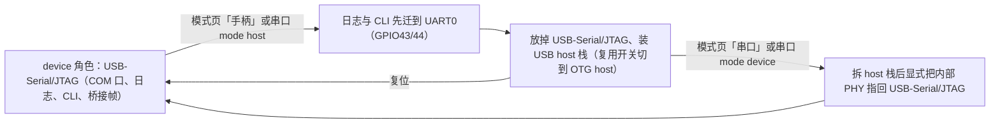

# Remapad 目标硬件参考

本文档记录 Remapad 目标板卡的硬件事实：SoC 与存储、屏幕、触摸、其他板载外设、GPIO 分配，以及实机验证过的启动事实。
面板、触摸与背光 BSP 已接入固件（见 [ADR 0007](adr/0007-esp-lcd-panel-touch-bsp.md)）；
BLE 手柄链路、蜂鸣器（GPIO42 LEDC tone）、电池电压采样、SYS_EN 电源保持与 PWR 按键已接入；
USB host 直插按运行时角色切换接入（见下文「USB 控制器复用」，实机核对待做）。

板卡为微雪 (Waveshare) **ESP32-S3-Touch-LCD-1.69**，SKU 27350；
本文档的规格、引脚与地址来自微雪官方文档 <https://docs.waveshare.net/ESP32-S3-Touch-LCD-1.69>。

## SoC 与存储

| 项目 | 事实 | 来源 |
| :--- | :--- | :--- |
| 模组 | ESP32-S3R8，Xtensa LX7 双核，最高 240 MHz | 微雪文档 / 实机 |
| 片内 SRAM | 512 KB | 微雪文档 |
| PSRAM | 8 MB Octal，叠封在 SoC 内（AP Memory） | 微雪文档 / 实机 |
| Flash | 16 MB，W25Q128JVSIQ | 微雪文档 / 实机 |
| 无线 | 2.4 GHz Wi-Fi (802.11 b/g/n)、Bluetooth 5 (LE) | 微雪文档 |
| 天线 | 板载贴片天线 | 微雪文档 |

本仓库早期文档把硬件写成“ESP32-S3-WROOM-1 N16R8”模组。实际板卡使用 **ESP32-S3R8**，8 MB PSRAM 叠封在 SoC 内，不是模组外挂。
内存结论（16 MB Flash + 8 MB Octal PSRAM）不变，`firmware/sdkconfig.defaults` 的 Flash/PSRAM 预设因此仍然正确。

实机启动日志（ESP-IDF v6.1）确认：

```text
Chip type:          ESP32-S3 (QFN56) (revision v0.2)
Features:           Wi-Fi, BT 5 (LE), Dual Core + LP Core, 240MHz, Embedded PSRAM 8MB (AP_3v3)
Crystal frequency:  40MHz
USB mode:           USB-Serial/JTAG
MAC:                28:84:85:55:41:e0
octal_psram: vendor id    : 0x0d (AP)
esp_psram: Found 8MB PSRAM device
spi_flash: detected chip: generic
```

`Embedded PSRAM` 与 `vendor id 0x0d (AP)` 说明 PSRAM 是叠封件。`CONFIG_SPIRAM_MODE_OCT` 必须保持开启：
这块板在 Quad 模式下 PSRAM 无法初始化，官方示例默认的 Quad 预设不能直接照搬。

CPU 频率默认值是 160 MHz，SoC 支持 240 MHz。当前固件显式配置为 240 MHz，理由见 [ARCHITECTURE.md](ARCHITECTURE.md) 的性能预算说明。

## 屏幕与触摸

| 模块 | 器件 | 接口 | 关键参数 | GPIO |
| :--- | :--- | :--- | :--- | :--- |
| LCD | ST7789V2 | 4-wire SPI | 240 × 280，RGB565 | DC=GPIO4, CS=GPIO5, CLK=GPIO6, DIN=GPIO7, RST=GPIO8, BL=GPIO15 |
| 触摸 | CST816T | I2C | 7-bit 地址 `0x15` | SCL=GPIO10, SDA=GPIO11, RST=GPIO13, INT=GPIO14 |

显示视口与 `firmware/pocket.host.json` 的 `240 × 280` 逻辑/物理视口一致，也和 9 位触摸坐标契约（每轴 512 像素以内）兼容。

面板接线要点：

- **LCD 只有写入数据线**：`DIN=GPIO7` 连接面板数据输入，`LCD_DOUT` 未引出，因此不需要 MISO。面板驱动按只写 SPI 实现。
- **背光独立控制**：`BL=GPIO15` 不是自动点亮；面板 BSP 必须显式驱动该脚，否则即使成功提交帧也看不到画面。
- **触摸与 IMU、RTC 共享同一条 I2C**（GPIO10/GPIO11），三者挂在一个总线上，靠地址区分。

## 其他板载外设

| 模块 | 器件 / 功能 | 接口 | 地址 / 参数 | GPIO |
| :--- | :--- | :--- | :--- | :--- |
| IMU | QMI8658C 六轴（3 轴陀螺仪 + 3 轴加速度计） | I2C | 7-bit 地址 `0x6B` | SCL=GPIO10, SDA=GPIO11, INT=GPIO38 |
| RTC | PCF85063ATL | I2C | 7-bit 地址 `0x51`，32.768 kHz 晶振 | SCL=GPIO10, SDA=GPIO11, INT=GPIO39 |
| 蜂鸣器 | 板载蜂鸣器 | GPIO / PWM | tone / PWM 输出 | GPIO42 |
| 电池采样 | B+ 分压到 ADC | ADC | R3 上拉 200K、R7 下拉 100K；`VBAT = VADC × 3`，引脚即 ADC1_CH0 | GPIO1 / BAT_ADC |
| 电源控制 | SYS_OUT / SYS_EN | GPIO | PWR / Key2 电源功能电路 | SYS_OUT=GPIO40, SYS_EN=GPIO41 |
| 充电管理 | ETA6098 | 电源 | 单节锂电池充放电 | 电池接口 MX1.25 2P |
| 3.3 V LDO | ME6217C33M5G | 电源 | 系统 3.3 V | VCC3V3 |
| USB Type-C | ESP32-S3 原生 USB | USB | 烧录与日志 | USB_N=GPIO19, USB_P=GPIO20 |
| UART0 | 默认串口 | UART | 调试 / 扩展焊盘 | U0TXD=GPIO43, U0RXD=GPIO44 |

IMU 中断脚在微雪文档内部存在一处不一致：外设速查表写 `INT1=GPIO38`，GPIO 分配表写 `GPIO38 = QMI_INT2`（`INT2`）。两条记录指向同一个 GPIO，但中断编号不同。
接入 IMU 中断前应以原理图或实机读寄存器确认，不要直接照抄。

## GPIO 分配

| GPIO | 信号名 | 连接到 | 备注 |
| :--- | :--- | :--- | :--- |
| GPIO0 | BOOT / Key1 | BOOT 按键 | Strapping pin，长按上电再松开进入下载模式 |
| GPIO1 | BAT_ADC | 电池电压分压采样 | `VBAT = VADC × 3` |
| GPIO2 | GPIO2 | 预留焊盘 / 排针 | 扩展口 |
| GPIO3 | GPIO3 | 预留焊盘 / 排针 | 扩展口 |
| GPIO4 | LCD_DC | ST7789V2 数据/命令 | - |
| GPIO5 | LCD_CS | ST7789V2 片选 | - |
| GPIO6 | LCD_CLK | ST7789V2 SPI 时钟 | - |
| GPIO7 | LCD_DIN | ST7789V2 SPI 数据 | 仅写入方向，LCD_DOUT 未使用 |
| GPIO8 | LCD_RST | ST7789V2 复位 | - |
| GPIO10 | ESP32_SCL | 触摸 + IMU + RTC 共享 I2C SCL | 接出到扩展口 |
| GPIO11 | ESP32_SDA | 触摸 + IMU + RTC 共享 I2C SDA | 接出到扩展口 |
| GPIO13 | TP_RST | CST816T 触摸复位 | - |
| GPIO14 | TP_INT | CST816T 触摸中断 | - |
| GPIO15 | LCD_BL | LCD 背光控制 | 需要显式驱动 |
| GPIO17 | GPIO17 | 预留焊盘 / 排针 | 扩展口 |
| GPIO18 | GPIO18 | 预留焊盘 / 排针 | 扩展口 |
| GPIO19 | USB_N | USB Type-C D- | ESP32-S3 原生 USB |
| GPIO20 | USB_P | USB Type-C D+ | ESP32-S3 原生 USB |
| GPIO38 | QMI_INT2 | QMI8658C 中断 | 编号与外设速查表不一致，见上节 |
| GPIO39 | RTC_INT | PCF85063 中断 | - |
| GPIO40 | SYS_OUT | 系统电源控制网络 | PWR / Key2 电路 |
| GPIO41 | SYS_EN | 系统电源控制网络 | PWR / Key2 电路；固件开机即拉高锁存 |
| GPIO42 | Buzz | 板载蜂鸣器驱动 | PWM / tone |
| GPIO43 | U0TXD | UART TX | 扩展口 |
| GPIO44 | U0RXD | UART RX | 扩展口 |

对外焊盘按 V2.1 原理图核对分两处：

- **H1 排针（20 针）**：`3V3`（3 / 4 / 17 脚）、`GND`（1 / 5 / 6 / 12 / 18 / 19 / 20 脚）、I2C（13 脚 `GPIO10` SCL / 14 脚 `GPIO11` SDA）、LCD 控制线（2 脚 LEDK，7–11 脚 `GPIO4`–`GPIO8`）与触摸复位 / 中断（15 / 16 脚 `GPIO13` / `GPIO14`）。排针上没有 5V、UART 与 `GPIO2` / `GPIO3` / `GPIO17` / `GPIO18`。
- **TP1–TP11 测试点**：TP1=`VBUS`（5V）、TP2=`GND`、TP3=`3V3`、TP4 / TP5=UART0（`GPIO44` / `GPIO43`）、TP6 / TP7=I2C、TP8–TP11=`GPIO2` / `GPIO3` / `GPIO17` / `GPIO18`。

`5V` 即 TP1 上的 VBUS 网络，是 host 模式给手柄供电的注入点，见「USB 控制器复用」。

## 板级注意事项

- **I2C 地址冲突**：板内已占用 `0x15`（触摸）、`0x6B`（IMU）、`0x51`（RTC）。外接 I2C 设备必须避开这三个地址。
- **USB 口只有一个**：Type-C 直接连在 ESP32-S3 原生 USB（GPIO19/20）上，烧录、日志与 USB 输入共用同一个物理口，复位后默认以 `USB-Serial/JTAG` 模式枚举。
  固件已实现运行时角色切换（`usb/usb_role.c`）：选「手柄」后该口交给 OTG host，PC 上的 COM 口消失，host 期间日志与 CLI 走 UART0；
  选回「串口」时固件把内部 PHY 交还 USB-Serial/JTAG，COM 口随之回来（交还不成功时界面提示重启，复位是保底路径）。
  复用开关与切换机制见下文「USB 控制器复用」，取舍见 [ADR 0027](adr/0027-runtime-usb-role-switch.md)。
- **`GPIO19` / `GPIO20`** 已接 Type-C，不要当普通 GPIO 使用。
- **`GPIO0` 是 BOOT**、`CHIP_PU` 是复位信号，都不适合作为普通用户输入。
- **按键资源**：`BOOT`(GPIO0)、`RST`(CHIP_PU)、`PWR`(SYS_OUT=GPIO40 / SYS_EN=GPIO41)。
  PWR 键支持上电检测、单击、双击、多击和长按，属于电源功能电路，接入前要确认它不会切断系统供电。电池供电时 SYS_EN 必须由固件锁存（见「产品 BSP 接入状态」），否则松开 PWR 键即断电。

## USB 控制器复用



ESP32-S3 片内有两个 USB 控制器，共用 GPIO19/20 上唯一的内部 FSLS PHY（模拟收发前端），中间隔着一片片内复用开关，同一时刻只有一个控制器能接到物理口：

| 控制器 | 角色 | 用途 |
| :--- | :--- | :--- |
| USB-Serial/JTAG | 固定 device | 烧录与串口日志，当前实机枚举出的 COM 口就是它 |
| USB OTG 1.1 | device / host，全速 12 Mbps | 产品数据面接收 USB 手柄用它 |

复用开关由 `RTC_CNTL_USB_CONF` 寄存器控制（来源：IDF v6.1 `components/soc/esp32s3/register/soc/rtc_cntl_reg.h`）：

| 寄存器位 | 复位默认 | 含义 |
| :--- | :--- | :--- |
| `SW_HW_USB_PHY_SEL`（bit 20） | 0 | 是否启用软件控制复用开关 |
| `SW_USB_PHY_SEL`（bit 19） | 0 | 0 = PHY 接 USB-Serial/JTAG；1 = PHY 接 USB OTG |

关键结论（来源：IDF v6.1 的两处驱动代码，路径见下）：
`components/esp_hal_usb/esp32s3/include/hal/usb_wrap_ll.h` 的 `usb_wrap_ll_phy_enable_external()` 注释、
`components/esp_hw_support/include/esp_private/usb_phy.h`。

- **复位默认永远接 USB-Serial/JTAG**。无论固件运行时把开关切到哪，每次上电/复位后 COM 口与 ROM 下载模式都恢复可用，烧录链路天然保留。
- **运行时切换是纯软件操作**。
  ESP-IDF usb_phy 驱动封装为 `usb_new_phy()`，指定 `controller = USB_PHY_CTRL_OTG`、`otg_mode = USB_OTG_MODE_HOST` 即完成切换；
  `usb_host` 协议栈安装时内部会调用，应用不需要直接写寄存器。切换后 PC 上的 COM 口消失。
- **切回串口**：复位即回默认位；不重启切回要重新初始化 PHY 并指定 `USB_PHY_CTRL_SERIAL_JTAG`——`usb_del_phy()` 只清理上拉与焊盘，不会把选择位翻回 USB-Serial/JTAG。
  固件按这条路实现（`usb/usb_role.c` 在切回时 `usb_new_phy(USB_PHY_CTRL_SERIAL_JTAG)` 并持有句柄，进 host 前再放掉）；
  这一步失败时 COM 口要复位才回来，界面在切回后询问是否立刻重启，见 [ADR 0053](adr/0053-usb-serial-phy-handback-on-role-switch.md)。

对开发流程的影响：

- host 固件运行期间把板子插到 PC 上不会出现 COM 口——此时板子是 host 身份，PC 侧什么都枚举不出来。
- 烧录不受影响：按住 BOOT 复位进下载模式，ROM 以复位默认 mux 接 USB-Serial/JTAG，COM 口出现，`idf.py flash` 照常工作；固件也可以实现"重启进下载模式"的软命令。
- host 运行期间的日志通道改为 UART0（GPIO43/44 扩展焊盘 + USB-UART 适配器）——这就是「与串口调试通道互斥」的确切含义；
  固件在切 host 之前先把日志与 CLI 出口迁到 UART0（`console/console_out.c`），切回串口再迁回来。
- host 模式需向插入手柄提供 VBUS 5V。V2.1 原理图已确认供电路径：板上没有电池→5V 的升压级（ETA6098 只是把 VBUS 降压充进电池的开关充电器），
  电池正极经电源开关 Q5 直接搭在 VBUS 网络上（约 3.5–4.1V，低于手柄枚举门限，这就是纯电池点不亮手柄的原因）；
  VBUS 的 5V 只能从外部注入，板上注入点是 TP1（TP2 接 GND），注入同时经 ETA6098 给电池充电，手柄实际枚举仍待实机验证。

以上为芯片与 IDF v6.1 源码事实；固件已按这套机制接入 USB host（枚举、HID 收发与角色切换）。

## 产品 BSP 接入状态

面板、触摸与背光已接入固件：
`firmware/main/drivers/` 中的 `panel.c` 承担面板初始化与 strip 提交。
驱动是 esp_lcd 内置 ST7789，SPI2 取上限 80 MHz，理由见 [ARCHITECTURE.md](ARCHITECTURE.md) 的显示通路预算。
面板初始化在 IDF 内置序列（SLPOUT/MADCTL/COLMOD/RAMCTRL）之外补发厂商的电源、VCOM 与 gamma 表，
取自微雪为同一块板自带的 Arduino 库调优值，见 `firmware/main/drivers/panel.c` 的 `s_panel_vendor_tuning`。
`touch.c` 负责触点采样（Registry 组件 `esp_lcd_touch_cst816s`，I2C `0x15`），`backlight.c` 负责背光驱动（GPIO15 LEDC PWM）；
选型与取舍见 [ADR 0007](adr/0007-esp-lcd-panel-touch-bsp.md)。
此外 `pwr_key.c` 负责 PWR 按键（GPIO40 采样，短按息屏 / 长按是连接键），并在 `app_main` 入口把 SYS_EN（GPIO41）拉高锁存电池供电，USB 供电下该锁存被旁路。
软件关机走系统页「关机」按钮：电池供电下释放锁存即断电；USB 供电下锁存被旁路、系统仍在运行，固件会重新锁存并回报，界面提示关不掉。
`buzzer.c` 负责蜂鸣器（GPIO42 LEDC tone，长按 3 秒提示音）。
BLE 手柄链路（`ble/`，广播 / GATT / 配对 / 回连，见 [controller-switch2.md](controller-switch2.md)「ESP32 硬件模拟 Switch 2 手柄实战指南」）也已接入；
`battery.c` 走 BAT_ADC（GPIO1 / ADC1_CH0），按「12 dB 衰减 + 曲线拟合校准 + 过采样平均 + 分压还原」采样出 VBAT。
百分比由 `battery_curve.c` 的静置电压—容量表折算，实测工作范围为 2.87V - 4.07V（插电时抬升至 4.15V），
选型与限制见 [ADR 0020](adr/0020-battery-adc-sampling-and-charge-inference.md)。

尚未收尾的硬件事项：

- USB host 输入的实机验收（代码已落地；VBUS 供电路径已按 V2.1 原理图确认为 TP1 外部注入，现用外置 5V 升压板从 TP1 注入，mux 切换、角色切回与手柄枚举待实测）；
- 充电状态与外部供电的测量：核对原理图后确认 ETA6098 的 STAT 引脚（9 脚）空置、没有引出任何网络，板上也没有 VBUS 检测网络；
  固件的充电标志是按采样电压趋势推断的，不是实测值（见 [ADR 0020](adr/0020-battery-adc-sampling-and-charge-inference.md)）。要拿到实测值，得另加测量：
  在 VBUS / PMID 网络上取分压接空闲 GPIO（外部供电），或在电池回路串采样电阻、并一颗电量计（电量与充放电方向）；

屏幕事实已写入 `firmware/pocket.host.json`：`input.touch` 随触摸采样接入一并声明。
