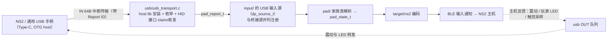

# USB 输入接收方案预案

状态：**两条输入路径的代码都已落地**（桥接：PC 输入 → NS2；USB host 直插：手柄插板卡 → NS2），实机核对待做——USB mux 切换与 VBUS 供电路径两项硬件确认仍未完成。
结论回填 [hardware.md](hardware.md) 与 [ROADMAP.md](ROADMAP.md) M5。
模块边界依据 [ADR 0021](adr/0021-input-path-three-stage-layering.md)。
它部分取代 [ADR 0011](adr/0011-controller-dataplane-module-boundary.md) 的目录划分。
USB 复用开关事实见 [hardware.md](hardware.md)「USB 控制器复用」，角色切换取舍见 [ADR 0027](adr/0027-runtime-usb-role-switch.md)；
桥接路径的设备侧实现在 `firmware/main/input/`，USB host 侧在 `firmware/main/usb/`，PC 侧见 [pc/README.md](../pc/README.md)。

## 现状与硬约束

- 板卡只有一个 Type-C，直连 ESP32-S3 唯一的 FSLS PHY；
  USB-Serial/JTAG（烧录/日志/串口 CLI）与 USB OTG（host/device）通过片内复用开关二选一，**复位默认永远回到 Serial/JTAG**，运行时切换是纯软件操作（`usb_new_phy()`）。
- 桥接（PC 输入 → NS2）不切 OTG：它复用现有的 USB-Serial/JTAG（COM 口）承载桥接帧，与固件日志、CLI 文本共用一条字节流，PC 上的 COM 口不会消失，也完全不触碰 USB mux。
  真正需要 mux 实验的是「手柄插在板卡上」的 host 形态。
- 切到 OTG 后 PC 上的 COM 口消失：无人值守时无法烧录。**桥接（otg）模式因此禁切**（UI 与串口都到不了这一档，bridge 直接跳过），只有数据面接入、且能给出安全的恢复路径后才解锁。
- VBUS 5V 供电路径未确认（host 模式要给插入的手柄供电），是 M5 的门禁项。
- 桥接路径的 PC 侧配套程序已落地（[pc/README.md](../pc/README.md)），手柄插板卡这条路径的固件实现也已完成；剩下的门禁是 VBUS 供电（见上一条）与 mux 切换的实机核对。
- USB-Serial/JTAG 的 DTR/RTS 由片内状态机解释成复位控制线：RTS 拉高即复位设备，DTR 与 RTS 同时拉高会让设备停在不再运行应用的状态（需复位脉冲恢复）。
  PC 侧工具打开这个口时必须把两条线固定为低电平，[pc/link.py](../pc/link.py) 的 `SerialLink` 是已验证的实现（`remapadctl.py` 的转发、命令行、截图与 OTA 共用）。

## 目标数据流（M5：USB host 手柄 → NS2）

接入方式：实现一个 `dp_source_t`（如 `{"name":"usb", .sample=usb_source_sample}`）在 `dp_plane_start` 里注册。
把原始报告按 `pad_report_t` 交给 `pad/` 的家族布局表（`pad_layout_find()`）——与桥接路径共用同一份解析与映射，USB 侧不再自己解析 0x05 / 0x09。
`ns2_output` 的反馈监听者已把主机反馈归一到 `pad_feedback_t`，USB 路径接入时在这里补一层 OUT 投递。编码、发送与 UI 都不需要改动——这正是三段划分与 `dp_source_t` 解耦的目的。

## 目标数据流（桥接：PC 输入 → NS2，需 PC 配套程序）

PC 程序职责：枚举本机手柄、采样原始报告、按约定格式打包（原始报告 + 设备标识，解析与映射只在固件做一份）、维持连接；设备侧只做接收、解析与转发。
串口打开沿用 [pc/link.py](../pc/link.py) 的免复位做法（DTR/RTS 全程低电平）。低频控制（配对、亮度、模式）继续走现有 bridge 命令与串口 CLI，屏幕 UI 无感。

这条路径已落地（设备侧三段改造 + `pc/` 桥接程序，实机验收与家族表抓包核对见 [ROADMAP.md](ROADMAP.md) M5）。USB host 直插同样已按上文数据流实现：
`usb/usb_transport.c`（装栈、枚举、按报告描述符挑手柄用途的 HID 接口、IN/OUT 传输）、
`usb/usb_input.c`（`dp_source_t` 输入源与设备标识）与 `usb/usb_role.c`（运行时角色切换，见 [ADR 0027](adr/0027-runtime-usb-role-switch.md)）；
反馈经 `ns2_output` 的反馈监听者归一到 `pad_feedback_t`，由 `pad/feedback.c` 按布局行编码后写 OUT 端点。剩下的都是实机核对项。

## 推进门槛与风险

1. **USB mux 实机核对**：切 host 后 COM 口消失、UART0（GPIO43/44）能看日志与 CLI、切回串口或复位后 COM 口回来；
   复用开关机制见 [hardware.md](hardware.md)，取舍见 [ADR 0027](adr/0027-runtime-usb-role-switch.md)，结论回填本节与 hardware.md。
2. **VBUS 供电确认**：host 模式给手柄供 5V 的路径（原理图/实测），决定 host 模式可行性；未确认前手柄能否枚举只能在实机验证。
3. **桥接已用不切 mux 的形态落地**：走 USB-Serial/JTAG 的桥接帧不需要 mux 实验，也没有失联风险。
   若将来要把桥接改到 OTG device 形态（例如为了更高的带宽），仍受上面两条门槛约束，且需要「确认后重启回 COM」的保底恢复路径（复位即回 Serial/JTAG，天然成立）；在那之前 UI 与串口两条入口都保持禁切。
4. **电池**：上报主机的电量优先取输入设备自报值（家族表置 `PAD_CAP_BATTERY`，经 `target_apply_pad_battery` 覆盖事实表）；
   板载 `drivers/battery.c`（GPIO1，`VBAT = VADC × 3`）只在设备没报电量时兜底，经 `ns2_output_set_battery` 上报，Report 0x05 / 0x09 电池字段随报告自动携带。
5. **amiibo**：`ns2_output_amiibo_stage / _read` 已预留（PSRAM 内缓存 NTAG215 镜像，Report 0x09 的 NFC 状态字节随预置汇报 0x01）；
   传输方式未定（bridge 分块 / storage 分区文件 / USB 通道均可），NFC 命令通路（Command 0x01）在会话层实现时消费该镜像，届时不再改动输出封装。
