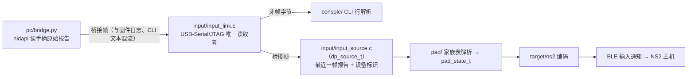

# USB 输入接收方案预案

状态：**USB host 直插为预案（未实施），桥接（PC 输入 → NS2）已落地**。本文是 [ROADMAP.md](ROADMAP.md) M5 中 USB host 直插那部分的架构预留设计，记录当前已知的硬件事实、模块边界与推进门槛；实施前需先完成两项硬件确认（USB mux 实验、VBUS 供电路径），并按实测结论修订。模块边界依据 [ADR 0021](adr/0021-input-path-three-stage-layering.md)（部分取代 [ADR 0011](adr/0011-controller-dataplane-module-boundary.md) 的目录划分），USB 复用开关事实见 [hardware.md](hardware.md)「USB 控制器复用」；桥接路径的设备侧实现在 `firmware/main/input/`，PC 侧见 [pc/README.md](../pc/README.md)。

## 现状与硬约束

- 板卡只有一个 Type-C，直连 ESP32-S3 唯一的 FSLS PHY；USB-Serial/JTAG（烧录/日志/串口 CLI）与 USB OTG（host/device）通过片内复用开关二选一，**复位默认永远回到 Serial/JTAG**，运行时切换是纯软件操作（`usb_new_phy()`）。
- 桥接（PC 输入 → NS2）不切 OTG：它复用现有的 USB-Serial/JTAG（COM 口）承载桥接帧，与固件日志、CLI 文本共用一条字节流，PC 上的 COM 口不会消失，也完全不触碰 USB mux。真正需要 mux 实验的是「手柄插在板卡上」的 host 形态。
- 切到 OTG 后 PC 上的 COM 口消失：无人值守时无法烧录。**桥接（otg）模式因此双端禁切**（UI 与 PWR 长按路径均被 bridge 拒绝），只有数据面接入、且能给出安全的恢复路径后才解锁。
- VBUS 5V 供电路径未确认（host 模式要给插入的手柄供电），是 M5 的门禁项。
- 桥接模式需要 PC 侧配套程序（目前没有）；用板卡给 NS2 手柄转发输入的 host 模式则要求手柄自带电池——当前 ESP32 侧也没有锂电池，两块硬件都不具备，因此本文只做架构预留。
- USB-Serial/JTAG 的 DTR/RTS 由片内状态机解释成复位控制线：RTS 拉高即复位设备，DTR 与 RTS 同时拉高会让设备停在不再运行应用的状态（需复位脉冲恢复）。PC 侧工具打开这个口时必须把两条线固定为低电平，[scripts/uartctl.py](../scripts/uartctl.py) 的 `SerialPort` 是已验证的实现。

## 目标数据流（M5：USB host 手柄 → NS2）

接入方式：实现一个 `dp_source_t`（如 `{"name":"usb", .sample=usb_source_sample}`）在 `dp_plane_start` 里注册，把原始报告按 `pad_report_t` 交给 `pad/pad_device.c` 的家族表——与桥接路径共用同一份解析与映射，USB 侧不再自己解析 0x05 / 0x09。`ns2_output` 的反馈监听者已把主机反馈归一到 `pad_feedback_t`，USB 路径接入时在这里补一层 OUT 投递。编码、发送与 UI 都不需要改动——这正是三段划分与 `dp_source_t` 解耦的目的。

## 目标数据流（桥接：PC 输入 → NS2，需 PC 配套程序）

PC 程序职责：枚举本机手柄、采样原始报告、按约定格式打包（原始报告 + 设备标识，解析与映射只在固件做一份）、维持连接；设备侧只做接收、解析与转发。串口打开沿用 [scripts/uartctl.py](../scripts/uartctl.py) 的免复位做法（DTR/RTS 全程低电平）。低频控制（配对、亮度、模式）继续走现有 bridge 命令与串口 CLI，屏幕 UI 无感。

这条路径已落地（设备侧三段改造 + `pc/` 桥接程序，实机验收与家族表抓包核对见 [ROADMAP.md](ROADMAP.md) M5）；下面两节是 USB host 直插仍未实施的部分。

## 推进门槛与风险

1. **USB mux 实验定案**：`usb_new_phy()`（OTG + HOST/DEVICE）切换、UART0（GPIO43/44）日志验证、复位回 COM 确认；结论回填 hardware.md 并出 ADR。
2. **VBUS 供电确认**：host 模式给手柄供 5V 的路径（原理图/实测），决定 host 模式可行性。
3. **桥接已用不切 mux 的形态落地**：走 USB-Serial/JTAG 的桥接帧不需要 mux 实验，也没有失联风险。若将来要把桥接改到 OTG device 形态（例如为了更高的带宽），仍受上面两条门槛约束，且需要「确认后重启回 COM」的保底恢复路径（复位即回 Serial/JTAG，天然成立）；在那之前 UI 与 PWR 长按保持双端禁切。
4. **电池**：`drivers/battery.c` 是电池数据获取唯一入口（当前占位值）；真实 ADC（GPIO1，`VBAT = VADC × 3`）随 M5 接入，输入源经 `ns2_output_set_battery` 上报，Report 0x05 / 0x09 电池字段随报告自动携带。
5. **amiibo**：`ns2_output_amiibo_stage / _read` 已预留（PSRAM 内缓存 NTAG215 镜像，Report 0x09 的 NFC 状态字节随预置汇报 0x01）；传输方式未定（bridge 分块 / storage 分区文件 / USB 通道均可），NFC 命令通路（Command 0x01）在会话层实现时消费该镜像，届时不再改动输出封装。
