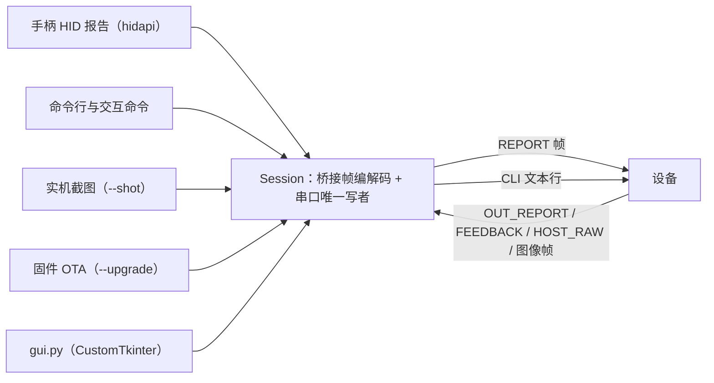
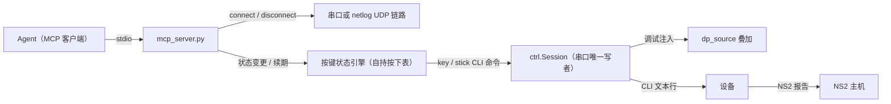

# Remapad PC 侧工具（ctrl）

`ctrl.py` 负责将 PC 手柄输入转发给设备、提供串口 CLI、捕获截图与推送固件 OTA。



核心模块：

- `link.py`：桥接帧编解码、会话管理与免复位 Win32 串口驱动。
- `ctrl.py`：输入转发、串口 CLI、截图、OTA 与工具命令。
- `gui.py`：图形界面（基于 CustomTkinter）。

## 依赖

```powershell
uv sync
```

PC 工具依赖 Windows 环境与 uv 工具链。

## 用法

以下命令在仓库根执行（`uv run` 用根目录 `.venv`；在 `pc/` 目录里去掉路径前缀同样能跑）：

```powershell
uv run python pc/ctrl.py --list                    # 列出候选的手柄接口
uv run python pc/ctrl.py --dump --seconds 10       # 采集 10 秒原始报告（核对布局用）
uv run python pc/ctrl.py -p COM3                   # 桥接 + 交互命令行
uv run python pc/ctrl.py -p COM3 --no-pad          # 只当串口命令行用，不转发手柄
uv run python pc/ctrl.py -p COM3 status            # 执行一条设备命令后退出
uv run python pc/ctrl.py -p COM3 --all             # 拉取设备全部观测数据后退出
uv run python pc/ctrl.py -p COM3 --shot            # 实机截图存成 PNG
uv run python pc/ctrl.py -p COM3 --log --seconds 20
uv run python pc/ctrl.py -p COM3 --log --reset --seconds 25
uv run python pc/ctrl.py -p COM3 --capture host-raw.log --seconds 30
                                             # 抓 30 秒主机原始输出（布局转换前）后退出
uv run python pc/ctrl.py -p COM3 --upgrade --wait
uv run python pc/ctrl.py -n 192.168.1.5 --upgrade
                                             # 走 WiFi 的 netlog 通道推 OTA（会话开着才行；截图不能走网络）
uv run python pc/ctrl.py -p COM3 --amiibo Alm.bin   # 上传 amiibo 镜像后退出
uv run python pc/ctrl.py -p COM3 --vid 0x054C --pid 0x0CE6 --max-rate 250 --no-rumble
uv run python pc/ctrl.py -p COM3 --logs            # 桥接的同时打印设备日志
```

`--all` 依次拉取全部观测命令回读。

## 图形界面（gui.py）

启动图形控制台：

```powershell
uv run python pc/gui.py
```

功能分区：
- **工具条**：串口/网络选择、连接控制与状态显示（同一串口不可与 CLI 同时打开）。
- **会话**：输入转发开关、手柄选择与链路控制按键。
- **设置**：屏幕亮度、手柄配色、DS4/DS5 按键映射与 WiFi 凭据配置。
- **命令 / 升级 / 日志**：串口 CLI 命令交互、OTA 升级推送与实时日志监控。

### 网络连接（WiFi UDP 调试通道）

通过设备 UDP 调试端口（默认 9999）进行网络通信。支持手柄转发、CLI 与 OTA，不支持截图。

## 按键注入 MCP 服务（mcp_server.py）

把「PC → 设备 → NS2 主机」的按键注入包成 stdio MCP 服务供 agent 调用：

```powershell
uv run python pc/mcp_server.py                 # 启动后不碰设备，连接由 remapad_connect 完成
uv run python pc/mcp_server.py -p COM3         # -p / -n 只是 remapad_connect 无参时的默认目标
```

调用模型是显式连接：先 `remapad_connect`（串口或 WiFi 二选一）建链，之后按键工具才可用，
结束 `remapad_disconnect` 断链（key release 全松、释放串口）。



按键编排落在 PC 侧按键状态引擎（[ADR 0063](../docs/adr/0063-mcp-cli-key-injection-engine.md)）：
注入走固件调试 CLI，无周期心跳流量，与实体手柄转发可并存（按键按位叠加）。tap 在无按住键时直发一条 `key`（固件到点自动松开）；
按住键由引擎维护按下表并以滚动期限看门狗续期；固件没有单键松开，子集松开是
「key release 全松 + 重发存活键」，存活键在边界上有至多一个 dp 拍（5ms）的瞬断，
时值精度按 ±10ms 量级理解。UDP 通道空闲时服务发 PING 保活 2 秒桥接窗口。工具面：

| 工具 | 语义 |
| :--- | :--- |
| `remapad_connect` | 连接设备：`port`（串口号）或 `net`（IP[:端口]，WiFi netlog）二选一，无参用启动默认 |
| `remapad_disconnect` | 断开设备链路：key release 全松、回中并释放串口/网络 |
| `remapad_status` | 链路状态与引擎按键状态；已连接时附设备回执（status/pad/link 原始行） |
| `remapad_pair` / `remapad_drop` | 连接键动作（开连接窗口）/ 断开与主机的 BLE 连接 |
| `remapad_tap` | 单键/组合键，hold_ms 后松开（同起同落，阻塞到松开） |
| `remapad_hold` | 按住/松开不限时长，可长按期间做别的调用 |
| `remapad_stick` / `remapad_stick_reset` | 摇杆电平 0-4095（2048 中位，y 向上为正）/ 回中 |
| `remapad_script` | 时间线脚本：t + down/up/tap/stick 任选、loop 循环，结束自动全松回中 |
| `remapad_release_all` | 全部松开并回中（逃生口） |
| `remapad_screenshot` | 实机截图（仅串口会话） |

键名即固件调试注入的按键位名（`pad_state.h` 内部值，PS 位置语义）：
`triangle circle cross square l1 r1 l4 r4 l3 r3 up down left right opt touchpad home share mute`；
主机侧语义由固件布局映射（circle/cross/triangle/square→A/B/X/Y、opt→+、touchpad→-、
home→HOME、share→capture、mute→C、l4/r4→GL/GR 背键、l1/l3/r1/r3→L/LS/R/RS）。
模拟扳机（ZL/ZR 的模拟量）不在 CLI 注入面里，需要真手柄转发。
注意：服务独占链路，与 ctrl.py / gui.py 不能同开一个串口。

## 串口命令面（完整控制手柄）

交互模式里不是 `:` 开头的行按固件 CLI 原样发送，手柄功能的完整控制面都在固件 CLI 里
（设备侧敲 `help` 有全表）：

```text
key circle 200   注入按键（键名即内部值：circle cross triangle square opt touchpad home share mute
                 l1 r1 l4 r4 l3 r3 up down left right ui），key release 全部松开
stick l 2048 2048  设摇杆电平 0-4095（stick reset 回中）
ctrl             手柄配色（ctrl 0x232323 0xa0a0a0 0xe6e6e6 0x323232，四段依次是
                 机身 按键 高光 握把，0xRRGGBB，持久化；无参回读）
connect          连接键：开连接窗口等主机连上来（未配对身份进配对流程）
pairing start    配新主机：断链 + 发现广播；pairing stop 停止广播并断链
wake             打开唤醒窗口；adv auto|wake|reconnect 钉窗口内形态
drop             断开当前主机
motion 3         0x09 运动块内容（0 全零 / 1 抓包占位 / 2 不带 / 3 真实样本）
headset 0x05     耳机状态字节（auto 回到按输入设备派生）
fwver 9.9.9      上报给主机的手柄固件版本；fwpost / fwack / fwapply 配套假升级
ltk 1            LTK 存储形态；relay 1 同代透传开关
rumble 200 0     手动震动（0-255 双侧，rumble off 停）；lamp 0xF 玩家灯；
                 haptic 0x10 触觉采样（输入设备有线接入时由板载蜂鸣器发声）——
                 与主机反馈走同一条编码投递路径
ui on            手柄操控屏幕模式（ui off 退出）
backlight 60     背光（持久化）；screen off 息屏；beep 蜂鸣
mode host        端口交给手柄（COM 口消失，日志与 CLI 改走 UART0，排查通道见
                 [../docs/GETTING-STARTED.md](../docs/GETTING-STARTED.md) 的「USB 手柄直插（host 模式）」）；
                 mode device 切回串口（屏幕会问是否立刻重启，复位是保底恢复路径）
ds touchpad on   DS4/DS5 手柄行为：触摸板映射加减键（左半减号 / 右半加号）；
                 ds capture off 让触摸板按下改发减号（默认开：发截图），两项都持久化
capture on       主机输出原始采集（off 关；开启后主机写进输出特征值的原始字节
                 经 0x12 帧回传 PC，PC 侧用 --capture / :capture 接住落盘）
amiibo list      amiibo 槽位列表（名称 + UID，当前选中带 *）；amiibo select 0 选用、
                 select off 取消、del 0 删除、poll on|off 手动开关射频场（无主机验证）
```

无参敲这些命令即回读当前值（`backlight`、`ctrl`、`motion`、`relay`、`rumble`…），
`--all` 拉的就是这批回读。`mem` 的应答在下一帧打出：PSRAM 与内部堆的空闲、最大块与
历史最低，观察内存趋势不用等 60 秒一条的周期日志。

交互模式里 `:` 开头的是本工具命令：

```text
:help              显示工具命令清单
:all               拉取设备全部观测数据（同 --all）
:shot [路径]       抓实机截图并存成 PNG
:log [秒|off]      透传设备日志（0 表示持续到 :log off）
:capture [路径|off] 抓主机原始输出到文件（震动/玩家灯/指令，布局转换前；off 停止）
:ota [镜像路径]    推固件镜像（默认 ../firmware/build/remapad_firmware.bin）
:amiibo <bin 路径> 上传 amiibo 镜像到设备（540 纯镜像或 572 = 镜像 + 厂商签名，槽位名取文件名主干）
:quit              退出
```

## 会话与设备共用一根 Type-C

USB-Serial/JTAG 既跑桥接帧也跑串口 CLI。打开端口时必须固定 DTR/RTS 为低电平，避免触发硬件复位。

## 实机截图（--shot / :shot）

截取当前设备屏幕内容并保存为 PNG 图片（默认路径 `pc/shots/`）。

## 3.5mm 耳机状态

支持通过 `headset <值>` 覆盖上报主机的耳机状态，或通过 `headset auto` 自动派生。

## 桥接帧格式

```text
A5 5A | ver | type | slot | seq | len | payload[len] | crc16(LE)
```

CRC-16/CCITT-FALSE 校验除末尾 2 字节外的整帧。常见帧类型：
- `ATTACH` (0x01) / `DETACH` (0x02)：设备插入/拔出事件。
- `REPORT` (0x10)：输入设备原始报告。
- `OUT_REPORT` (0x11) / `FEEDBACK` (0x20)：主机反馈手柄输出报告与归一化状态。
- `HOST_RAW` (0x12)：主机原始输出捕获。
- `IMAGE_INFO` / `IMAGE_DATA` / `IMAGE_END` (0x21-0x23)：截图数据分块。
- `OTA_BEGIN` / `OTA_DATA` / `OTA_END` / `OTA_ACK` (0x30-0x33)：固件 OTA 传输。
- `AMIIBO_BEGIN` / `AMIIBO_DATA` / `AMIIBO_END` / `AMIIBO_ACK` (0x40-0x43)：amiibo 镜像上传。

## 主机原始输出采集（--capture / :capture）

捕获主机向手柄下发的原始报文（震动、LED、指令等），文本格式记录：

```powershell
uv run python pc/ctrl.py -p COM3 --capture host-raw.log --seconds 30 --pad
```

```text
+0.500s rumble[0x12] seq=000  32B 7c 04 80 01 97 63 ...
+1.250s cmd[0x14] seq=001   9B 09 91 01 07 00 01 00 00 01
```

## DS5 音频触觉（桥接路径，--no-audio-haptics 关闭）

- **USB 直插 PC**：WASAPI 4ch 音频流驱动触觉与喇叭。
- **蓝牙连接 PC**：优先 0x36（触觉 PCM + Opus 编码喇叭），缺失 libopus 时回落 0x32。

## 固件 OTA（--upgrade）

```powershell
uv run python pc/ctrl.py --dry-run                     # 只校验镜像，不接设备
uv run python pc/ctrl.py -p COM3 --upgrade             # 升级默认镜像 firmware/build/remapad_firmware.bin
uv run python pc/ctrl.py -p COM3 --upgrade --wait      # 等设备重启回来并打印版本
uv run python pc/ctrl.py -p COM3 --upgrade --verbose   # 同时透传设备日志
```

## 主机端用例

运行 PC 侧纯逻辑测试：

```powershell
uv run python -m unittest discover -s pc/tests -t pc -v
```

## 已知限制

- 仅转发原始报告，不改写按键语义；退出时发送 `DETACH` 帧避免留存卡键。
- L1+R1+L3+R3 长按 300ms 进入屏幕操控模式，再次长按或长按 ✕ 键退出。
